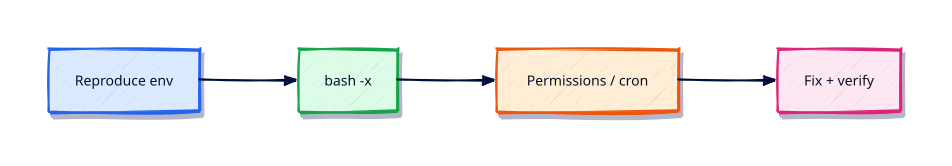

# Troubleshooting Shell Scripts

## Overview

When a script works locally and fails in CI or cron, method beats guessing. This tutorial is your incident checklist.

This is **Tutorial 18** in **Module 18: Troubleshooting** of the REBASH Academy **Shell Scripting for DevOps Engineers** series — written for Linux administrators, DevOps engineers, SREs, and platform engineers who automate production hosts with Bash.

## Prerequisites

- Production Shell Scripting
- Bash 4.2+ on Linux (WSL2/VM/cloud)

## Learning Objectives

By the end of this tutorial, you will be able to:

- [ ] Apply the core ideas of “Troubleshooting Shell Scripts” in a real ops script
- [ ] Use `set -euo pipefail` as the production default
- [ ] Use quoted expansions and clear stderr diagnostics
- [ ] Produce meaningful exit codes for automation consumers
- [ ] Debug behaviour with `bash -x` when something fails
- [ ] Relate this topic to day-to-day Linux admin and DevOps work

## Architecture

Ops scripts sit between humans/automation and system tools. This topic’s control points are shown below.



## Theory

### Debugging Bash

Reproduce with the same interpreter and env: `env -i PATH=... bash -x ./script.sh`. Bisect with `set -x` regions. Confirm shebang and line endings (`file`, `sed -n l`).

### Common Errors

| Symptom | Cause |
|---------|--------|
| `command not found` | PATH / typo / missing package |
| `unbound variable` | `set -u` + missing default |
| `unexpected token` | Windows CRLF or bad quoting |
| `Permission denied` | Mode, mount `noexec`, or directory bits |

### Permission Problems

Check execute bit, directory `x`, SELinux/AppArmor denials, and whether the scheduler user differs from yours.

### Cron Issues

Minimal `PATH`, different cwd, missing tty, and mailed stderr you never read. Log to a file; set `PATH`; use absolute paths.

### Variable Expansion Problems

Unquoted `$var`, wrong `${var:-}` vs `${var-}` , and accidental globbing. Print `declare -p var` while debugging.

### Performance Optimisation

Avoid spawning needless pipelines in tight loops; batch with `xargs`; prefer Bash builtins for simple string work; move heavy JSON transforms to one `jq` invocation. Profile with `time` and reduce process count.

## Hands-on Lab

Create a workspace for this tutorial.

```bash
mkdir -p ~/rebash-shell/lab18 && cd ~/rebash-shell/lab18
```

**Focus:** reproduce cron env; fix quoting bug; bash -x; time a hot loop

### Step 1 – Skeleton

```bash
cat > lab.sh << 'EOF'
#!/usr/bin/env bash
set -euo pipefail
echo "lab18 troubleshooting-shell-scripts on $(hostname -s)"
EOF
chmod +x lab.sh
./lab.sh
```

### Step 2 – Troubleshoot checklist

```bash
cat > broken.sh << 'EOF'
#!/usr/bin/env bash
set -euo pipefail
# Intentionally awkward — fix in place:
target='my file'
touch "$target"
ls -l -- "$target"
EOF
chmod +x broken.sh
# Minimal env like cron:
env -i PATH=/usr/bin:/bin HOME="$HOME" bash -x ./broken.sh 2>&1 | tee trace.txt
cat > checklist.md << 'EOF'
- [ ] Same shebang / bash version
- [ ] PATH and cwd
- [ ] Permissions / noexec
- [ ] Quoting
- [ ] Cron user vs your user
EOF
time bash -c 'n=0; while (( n < 1000 )); do n=$((n+1)); done'
```

### Final step – Trace and cleanup note

```bash
bash -x ./lab.sh 2>&1 | tail -n 20 || true
# keep ~/rebash-shell for later labs
```

## Validation

- [ ] Lab commands run under `~/rebash-shell/lab18/`
- [ ] You can explain each Theory heading in your own words
- [ ] Failure path exits non-zero and prints diagnostics to stderr (where applicable)
- [ ] You can relate this topic to a real DevOps or Linux admin task

## Code Walkthrough

Production Bash for **Troubleshooting Shell Scripts** always combines:

1. A clear shebang (`#!/usr/bin/env bash`)
2. Strict mode near the top (`set -euo pipefail`) from Module 2 onward
3. Quoted expansions and explicit tests
4. Functions with `local` for reusable behaviour
5. Documented exit codes and stderr logging

Keep scripts short enough to review in a single merge request. When logic grows (complex JSON APIs, heavy state), hand off to Python and keep Bash as the launcher.

## Security Considerations

- Treat all external input (args, files, env) as untrusted until validated
- Never log secrets; prefer masked CI variables and secret stores
- Prefer least privilege — do not require root for file-local tasks
- Avoid `eval` and unquoted expansions in destructive commands
- Validate paths stay under an allow-listed root before `rm` or overwrite

## Common Mistakes

!!! warning "Skipping strict mode"
    Cron and CI hide failures that an interactive terminal would show. **Fix:** start with `set -euo pipefail` from Module 2 onward.

!!! warning "Unquoted path expansions"
    Spaces and globs rewrite your command line. **Fix:** always `"$path"` / `"$@"`.

!!! warning "Assuming interactive PATH"
    Aliases and fancy PATH entries disappear under schedulers. **Fix:** set `PATH` or use absolute paths.

## Best Practices

- One purpose per script; compose with functions or small binaries
- Log to stderr; reserve stdout for data or RESULT lines
- Idempotent behaviour where scheduling may overlap
- Pair every new script with a failing-path test you actually run
- Run ShellCheck in CI before merging automation

## Troubleshooting

| Symptom | Likely cause | Fix |
|---------|--------------|-----|
| Works in terminal, fails in cron | PATH / cwd / env | Fingerprint env; set PATH |
| `unbound variable` | `set -u` | Provide defaults or export vars |
| Pipeline “succeeds” incorrectly | Missing `pipefail` | `set -o pipefail` |
| `[[` unexpected operator | Running under `sh`/dash | Fix shebang to Bash |

## Summary

**Troubleshooting Shell Scripts** is a core skill for Linux admins and DevOps engineers automating real hosts and pipelines. Practise the lab until the failure path is as familiar as the happy path, then continue the track.

## Interview Questions

1. How does this topic show up in production Linux administration or CI?
2. What failure mode appears if you ignore quoting or strict mode here?
3. How would you test this behaviour under a minimal cron-like environment?
4. When would you move this logic out of Bash into Python or another tool?
5. What exit code contract would you document for teammates?

!!! tip "Sample answer — question 2"
    Unquoted expansions and missing `pipefail` create silent or partial failures — especially under cron — that look healthy in monitoring until data is wrong.

## Related Tutorials

- [Shell Scripting for DevOps Engineers – Category Overview](index.md)
- [Production Shell Scripting](production-shell-scripting.md) *(previous)*
- [Learning Paths](../learning-paths/index.md)

## References

- [GNU Bash manual](https://www.gnu.org/software/bash/manual/)
- [POSIX shell command language](https://pubs.opengroup.org/onlinepubs/9699919799/utilities/V3_chap02.html)
- [ShellCheck](https://www.shellcheck.net/)
- Track index: [Shell Scripting for DevOps Engineers](index.md)
