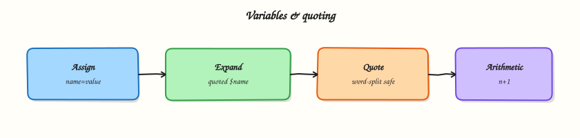

# Variables, Quoting, and Arithmetic

## Overview

Unquoted expansions destroy filenames with spaces and break cron jobs. Master variables and quoting before control flow.

This is **Tutorial 3** in **Module 3: Variables** of the REBASH Academy **Shell Scripting for DevOps Engineers** series — written for Linux administrators, DevOps engineers, SREs, and platform engineers who automate production hosts with Bash.

## Prerequisites

- Writing Your First Script
- Bash 4.2+ on Linux (WSL2/VM/cloud)

## Learning Objectives

By the end of this tutorial, you will be able to:

- [ ] Apply the core ideas of “Variables, Quoting, and Arithmetic” in a real ops script
- [ ] Use `set -euo pipefail` as the production default
- [ ] Use quoted expansions and clear stderr diagnostics
- [ ] Produce meaningful exit codes for automation consumers
- [ ] Debug behaviour with `bash -x` when something fails
- [ ] Relate this topic to day-to-day Linux admin and DevOps work

## Architecture

Ops scripts sit between humans/automation and system tools. This topic’s control points are shown below.



## Theory

### What it is

Bash **variables** hold strings (and, with care, integers) that you assign once and expand later. Related ideas include read-only **constants**, **environment variables** exported to child processes, **command substitution** that captures another command’s stdout, integer **arithmetic**, and **quoting** rules that decide whether an expansion stays one word or is split and globbed. Mastering this layer prevents the classic ops disaster: a filename with a space that quietly becomes three arguments and deletes the wrong path.

### Why it matters

Unquoted expansions break cron jobs, backup scripts, and Continuous Integration (CI) steps more often than exotic Bash features do. Schedulers pass paths, hostnames, and secrets through variables; one missing quote turns a safe `rm` into a catastrophe or a silent no-op. Clear naming and defaults also make scripts configurable without editing source — essential when the same job runs in lab, staging, and production with different values.

### How it works

Assign without spaces around `=`: `name=value`. Expand with `"$name"` or `"${name}"`. Prefer lowercase for script-local names and uppercase for exported environment contracts that other processes must see.

```bash
host=$(hostname -s)
echo "host=${host}"
```

Bash has no true constants; use `readonly MAX_RETRIES=3` or `declare -r MAX_RETRIES=3` after validation. Publish to children with `export VAR=value`. For ops inputs, prefer defaults and required checks: `"${VAR:-default}"` and `"${VAR:?must set VAR}"`.

Command substitution uses `$(command)` (prefer this over backticks). Quote when the result is one path or token: `"$(date -Iseconds)"`. Integer maths uses arithmetic expansion or the `(( ))` compound command:

```bash
n=0
n=$((n + 1))
(( n > 0 )) && echo positive
```

For floating-point work, call `bc` or move the logic to Python.

### Key concepts

| Form | Effect |
|------|--------|
| `"$var"` | Expand; keep as one word |
| `'$var'` | Literal characters — no expansion |
| `$var` | Word-split and glob — usually wrong in scripts |
| `"$@"` | Safe forwarding of all positional parameters |
| `"${VAR:-default}"` | Use default when unset or empty |
| `"${VAR:?msg}"` | Fail with message when unset or empty |

Always quote paths and user input. Prefer `"$1"` over `$1`.

### Common pitfalls

- Writing `name = value` (spaces) and getting a “command not found” error
- Leaving `$path` unquoted so spaces and globs rewrite the command line
- Using backticks instead of `$(...)` in nested substitutions
- Treating Bash arithmetic as floating-point maths
- Exporting secrets into the environment and then logging `printenv` in CI

## Hands-on Lab

Create a workspace for this tutorial.

```bash
mkdir -p ~/rebash-shell/lab03 && cd ~/rebash-shell/lab03
```

**Focus:** break/fix spaced names; defaults; arithmetic counters; quote drills

### Step 1 – Quoting and arithmetic

```bash
cat > quoting-demo.sh << 'EOF'
#!/usr/bin/env bash
set -euo pipefail
name='my file.txt'
touch "$name"
# Broken on purpose if unquoted — keep quoted:
ls -l -- "$name"
n=${COUNT:-0}
n=$((n + 1))
readonly MAX=3
echo "n=$n MAX=$MAX"
echo "subst=$(date -Iseconds)"
EOF
chmod +x quoting-demo.sh
./quoting-demo.sh
```

### Final step – Cleanup note

```bash
# Keep ~/rebash-shell/ for later tutorials; destroy disposable cloud resources from this lab
```

## Validation

- [ ] Lab commands run under `~/rebash-shell/lab03/`
- [ ] You can explain each Theory heading in your own words
- [ ] Failure path exits non-zero and prints diagnostics to stderr (where applicable)
- [ ] You can relate this topic to a real DevOps or Linux admin task

## Code Walkthrough

Production Bash for **Variables, Quoting, and Arithmetic** always combines:

1. A clear shebang (`#!/usr/bin/env bash`)
2. Strict mode near the top (`set -euo pipefail`) from Module 2 onward
3. Quoted expansions and explicit tests
4. Functions with `local` for reusable behaviour
5. Documented exit codes and stderr logging

Keep scripts short enough to review in a single merge request. When logic grows (complex JSON APIs, heavy state), hand off to Python and keep Bash as the launcher.

## Security Considerations

- Treat all external input (args, files, env) as untrusted until validated
- Never log secrets; prefer masked CI variables and secret stores
- Prefer least privilege — do not require root for file-local tasks
- Avoid `eval` and unquoted expansions in destructive commands
- Validate paths stay under an allow-listed root before `rm` or overwrite

## Common Mistakes

!!! warning "Skipping strict mode"
    Cron and CI hide failures that an interactive terminal would show. **Fix:** start with `set -euo pipefail` from Module 2 onward.

!!! warning "Unquoted path expansions"
    Spaces and globs rewrite your command line. **Fix:** always `"$path"` / `"$@"`.

!!! warning "Assuming interactive PATH"
    Aliases and fancy PATH entries disappear under schedulers. **Fix:** set `PATH` or use absolute paths.

## Best Practices

- One purpose per script; compose with functions or small binaries
- Log to stderr; reserve stdout for data or RESULT lines
- Idempotent behaviour where scheduling may overlap
- Pair every new script with a failing-path test you actually run
- Run ShellCheck in CI before merging automation

## Troubleshooting

| Symptom | Likely cause | Fix |
|---------|--------------|-----|
| Works in terminal, fails in cron | PATH / cwd / env | Fingerprint env; set PATH |
| `unbound variable` | `set -u` | Provide defaults or export vars |
| Pipeline “succeeds” incorrectly | Missing `pipefail` | `set -o pipefail` |
| `[[` unexpected operator | Running under `sh`/dash | Fix shebang to Bash |

## Summary

**Variables, Quoting, and Arithmetic** is a core skill for Linux admins and DevOps engineers automating real hosts and pipelines. Practise the lab until the failure path is as familiar as the happy path, then continue the track.

## Interview Questions

1. How does this topic show up in production Linux administration or CI?
2. What failure mode appears if you ignore quoting or strict mode here?
3. How would you test this behaviour under a minimal cron-like environment?
4. When would you move this logic out of Bash into Python or another tool?
5. What exit code contract would you document for teammates?

!!! tip "Sample answer — question 2"
    Unquoted expansions and missing `pipefail` create silent or partial failures — especially under cron — that look healthy in monitoring until data is wrong.

## Related Tutorials

- [Shell Scripting for DevOps Engineers – Category Overview](index.md)
- [Writing Your First Script](writing-your-first-script.md) *(previous)*
- [Input, Output, Redirection, and Pipes](input-output-redirection-and-pipes.md) *(next)*
- [Learning Paths](../learning-paths/index.md)

## References

- [GNU Bash manual](https://www.gnu.org/software/bash/manual/)
- [POSIX shell command language](https://pubs.opengroup.org/onlinepubs/9699919799/utilities/V3_chap02.html)
- [ShellCheck](https://www.shellcheck.net/)
- Track index: [Shell Scripting for DevOps Engineers](index.md)
