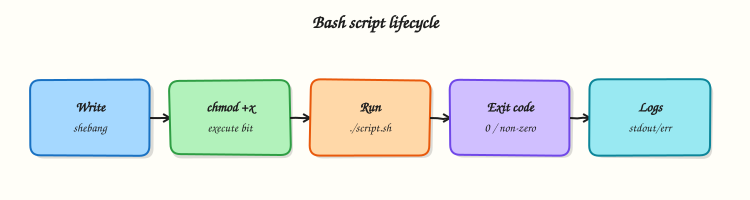

# Writing Your First Script

## Overview

A command you type once in a terminal is not automation. A **shell script** is a text file that names an interpreter, runs a clear sequence of commands, accepts inputs, and returns an **exit code** so Continuous Integration (CI), `cron`, and monitoring know whether the job succeeded.

The first line is the **shebang** (for example `#!/usr/bin/env bash`). It tells the kernel which program should read the file when you run `./script.sh`. You also need the **execute permission** (`chmod +x`). Without it, Linux returns `Permission denied` even if the script text is correct. You can still run `bash script.sh` without the execute bit — useful in debugging — but production jobs usually call an executable path with a shebang.

Every process ends with an integer exit status from 0 to 255. By convention **0 means success** and any other value means failure. Callers such as GitHub Actions, systemd, and Ansible check that number. From this module onward, production scripts enable **strict mode**: `set -euo pipefail`. `-e` stops on failed commands, `-u` treats unset variables as errors, and `pipefail` fails a pipeline if any stage fails. Together they turn silent mistakes into loud, early failures.

This is **Tutorial 2** in **Module 2: Writing Your First Script** of the REBASH Academy **Shell Scripting for DevOps Engineers** series. It is written for Linux administrators, DevOps engineers, Site Reliability Engineering (SRE), and platform engineers. By the end you will ship a small script with arguments, usage text, and a documented exit-code contract.

## Prerequisites

- [Shell Fundamentals — Bash vs sh and Execution](shell-fundamentals-bash-vs-sh-and-execution.md)
- A practice Ubuntu 22.04/24.04 environment with Bash
- Comfort creating files and running commands from Module 1

## Learning Objectives

By the end of this tutorial, you will be able to:

- [ ] Write a script with a Bash shebang and make it executable with `chmod +x`
- [ ] Run a script as `./script.sh` and with `bash script.sh`, and explain the difference from `source`
- [ ] Read positional arguments (`$1`, `$#`) and print a usage message when input is missing
- [ ] Return meaningful exit codes for success, usage errors, and runtime failures
- [ ] Enable `set -euo pipefail` and prove that a failed command stops the script

## Architecture

A script file is a contract between humans, schedulers, and tools. The shebang selects Bash; permissions allow execution; arguments and exit codes form the interface other automation consumes.



## Theory

### What it is

A shell script is a plain text file that:

1. Starts with a shebang naming the interpreter  
2. Contains commands, comments, and (later) functions  
3. Ends with an exit status that callers can check  

``` {.bash .ra-terminal title="Terminal"}
#!/usr/bin/env bash
set -euo pipefail

echo "hello from a script"
```

`env` finds `bash` on `PATH`. On fixed images, `#!/bin/bash` is also fine. Comments start with `#` and should explain **why**, not repeat what the next line already shows.

### Why it matters

Ad-hoc history lines have no review trail, no stable exit status, and no safe place for teammates to improve the steps. CI needs a file in Git. Schedulers need a predictable interpreter. Strict mode prevents the common outage pattern: a command fails in the middle, the script continues, and a later step “succeeds” on bad data. A small, structured script is the unit of delivery for Linux admin glue work.

### How it works

**Make it runnable**

``` {.bash .ra-terminal title="Terminal"}
chmod +x greet.sh
./greet.sh          # needs execute bit + shebang
bash greet.sh       # execute bit optional
```

**Arguments** — `$0` is the script name, `$1` is the first argument, `$#` is the count, `"$@"` is all arguments as separate words (quote it).

**Exit codes** — document a small set for teammates:

| Code | Meaning (example contract) |
|------|----------------------------|
| 0 | Success |
| 2 | Usage / bad arguments |
| 3 | Missing dependency or file |
| 4 | Runtime failure |

**Strict mode** (from this module onward):

``` {.bash .ra-terminal title="Terminal"}
set -euo pipefail
```

- `-e` — exit when a command fails (with a few careful exceptions around `if` tests)  
- `-u` — error on unset variables  
- `-o pipefail` — pipeline status is the first failed stage, not only the last command  

### Key concepts and comparisons

| Invocation | Effect |
|------------|--------|
| `./script.sh` | New process; needs `+x` and a shebang |
| `bash script.sh` | Explicit Bash; `+x` optional |
| `source script.sh` | Runs in current shell — can mutate it |

| Without strict mode | With `set -euo pipefail` |
|---------------------|--------------------------|
| Failed commands may be ignored | Script stops on failure |
| Typos in variable names expand empty | Unset variables abort the run |
| `false \| true` can look successful | Pipeline fails if `false` failed |

### Common pitfalls

- Omitting the shebang and relying on whoever typed `bash` this time.  
- Forgetting `chmod +x` and blaming the wrong cause for `Permission denied`.  
- Using `source` for scheduled jobs so `exit` damages the caller.  
- Returning only `0`/`1` with no documented meaning for CI.  
- Enabling `-e` but testing failure only on the happy path.

## Hands-on Lab

### Objective

Build a small ops script under `~/rebash-shell/lab02` with shebang, execute bit, argument handling, exit codes, and a separate demo that proves strict mode stops on failure.

### Prerequisites

- Ubuntu 22.04/24.04 with Bash  
- Completed Module 1 lab folder ideas (no dependency on its files)  
- No root required  

### Lab environment

Workspace: `~/rebash-shell/lab02`

``` {.bash .ra-terminal title="Terminal"}
mkdir -p ~/rebash-shell/lab02 && cd ~/rebash-shell/lab02
set -euo pipefail
whoami | tee lab-user.txt
command -v bash | tee bash-path.txt
```

!!! example "Expected output"
    `lab-user.txt` and `bash-path.txt` exist; shell is using `set -euo pipefail` for the lab session.


### Real-world scenario

Your team needs a tiny host check script for CI: it must accept a hostname argument, refuse to run without it, print a clear usage message on stderr, and exit `2` for bad usage and `0` on success. You also need a demo that proves `set -e` actually stops a broken job.

### Step-by-step tasks

#### Task 1 – Shebang, chmod, and a first successful run

Create `hello.sh`:

```bash title="hello.sh"
#!/usr/bin/env bash
set -euo pipefail

printf 'hello from %s\n' "$(hostname -s)" | tee hello.out
```

Run:

``` {.bash .ra-terminal title="Terminal"}
cd ~/rebash-shell/lab02
set -euo pipefail

chmod +x hello.sh
./hello.sh
test -s hello.out
head -n1 hello.sh | tee shebang.txt
grep -q 'env bash' shebang.txt
ls -l hello.sh | tee hello-perms.txt
grep -q 'x' <<< "$(stat -c '%A' hello.sh)"
```


!!! example "Expected output"
    `hello.out` has a greeting; `shebang.txt` shows `#!/usr/bin/env bash`; `hello.sh` is executable.


#### Task 2 – Arguments, usage message, and exit codes

Create `hostcheck.sh`:

```bash title="hostcheck.sh"
#!/usr/bin/env bash
set -euo pipefail

usage() {
  printf 'Usage: %s <hostname>\n' "$0" >&2
  exit 2
}

if [[ $# -lt 1 ]]; then
  usage
fi

target="$1"
printf 'checking host=%s\n' "$target"
printf 'ok host=%s\n' "$target" | tee "check-${target}.txt"
exit 0
```

Run:

``` {.bash .ra-terminal title="Terminal"}
cd ~/rebash-shell/lab02
set -euo pipefail

chmod +x hostcheck.sh

# Success path
./hostcheck.sh labhost
test -s check-labhost.txt
grep -q 'ok host=labhost' check-labhost.txt

# Missing argument must exit 2 and print usage to stderr
set +e
./hostcheck.sh >usage.stdout 2>usage.stderr
rc=$?
set -e
echo "usage_exit=$rc" | tee usage-exit.txt
test "$rc" -eq 2
grep -q 'Usage:' usage.stderr
test ! -s usage.stdout
```


!!! example "Expected output"
    `check-labhost.txt` exists; `usage_exit=2`; `usage.stderr` contains `Usage:`.


#### Task 3 – Prove strict mode stops on failure

Create `strict-demo.sh`:

```bash title="strict-demo.sh"
#!/usr/bin/env bash
set -euo pipefail

echo "step=1" | tee strict-steps.txt
false
echo "step=2-should-not-run" | tee -a strict-steps.txt
```

Create `loose-demo.sh`:

```bash title="loose-demo.sh"
#!/bin/bash
echo "loose-step=1" | tee loose-steps.txt
false
echo "loose-step=2" | tee -a loose-steps.txt
```

Run:

``` {.bash .ra-terminal title="Terminal"}
cd ~/rebash-shell/lab02
set -euo pipefail

chmod +x strict-demo.sh

set +e
./strict-demo.sh >strict.stdout 2>strict.stderr
rc=$?
set -e
echo "strict_exit=$rc" | tee strict-exit.txt
test "$rc" -ne 0
grep -q 'step=1' strict-steps.txt
grep -q 'step=2-should-not-run' strict-steps.txt && exit 1 || true

# Contrast: without -e the second echo would run
chmod +x loose-demo.sh
set +e
./loose-demo.sh >/dev/null
set -e
grep -q 'loose-step=2' loose-steps.txt

tar -czf first-script-evidence.tgz \
  lab-user.txt bash-path.txt shebang.txt hello-perms.txt hello.out \
  check-labhost.txt usage-exit.txt usage.stderr \
  strict-exit.txt strict-steps.txt loose-steps.txt
ls -l first-script-evidence.tgz | tee evidence-ls.txt
```


!!! example "Expected output"
    `strict_exit` is non-zero; `strict-steps.txt` has step 1 only; `loose-steps.txt` includes step 2; evidence archive exists.


### Validation steps

- [ ] `hello.sh` runs via `./hello.sh` and has a Bash shebang  
- [ ] `hostcheck.sh` exits `0` with an argument and `2` without one  
- [ ] Usage text goes to stderr, not stdout  
- [ ] Strict demo stops before the second step  
- [ ] `first-script-evidence.tgz` exists under `~/rebash-shell/lab02`  

### Common errors and fixes

| Error | Cause | Fix |
|-------|-------|-----|
| `Permission denied` | No execute bit | `chmod +x script.sh` |
| `unbound variable` | `set -u` and missing `$1` | Check `$#` before reading `$1` |
| Usage exits `0` | Forgot `exit 2` | Return a non-zero code after printing usage |
| Strict demo still prints step 2 | Shebang not Bash / no `set -e` | Confirm file content and re-run |

### Challenge exercise

Extend `hostcheck.sh` into `hostcheck-v2.sh` that requires **two** arguments (`hostname` and `env`), validates that `env` is one of `lab`, `staging`, or `prod`, writes `result.txt` with `host=...` and `env=...`, exits `2` on bad usage, and exits `3` if `env` is invalid. Keep `set -euo pipefail`.

### Learning outcomes

- Shipped an executable Bash script with a correct shebang  
- Validated arguments and exit codes for CI-style callers  
- Proved strict mode fail-fast behaviour with evidence  

### Cleanup

``` {.bash .ra-terminal title="Terminal"}
cd ~/rebash-shell/lab02
rm -f loose-demo.sh strict.stdout strict.stderr usage.stdout
# Keep hostcheck.sh and the evidence archive for review, or:
# rm -rf ~/rebash-shell/lab02
```

## Validation

- [ ] Lab finished under `~/rebash-shell/lab02/` with evidence files  
- [ ] You can explain shebang, `chmod +x`, and exit-code contracts  
- [ ] You can explain each flag in `set -euo pipefail`  
- [ ] You know when to use `./script.sh` versus `source`  

## Code Walkthrough

A production-oriented first script usually follows this shape:

1. **Shebang** — `#!/usr/bin/env bash`  
2. **Strict mode** — `set -euo pipefail` immediately after  
3. **Usage / constants** — fail closed on bad arguments  
4. **Main work** — small, linear steps with clear stderr messages  
5. **Exit** — explicit `exit 0` or a documented non-zero code  

Keep scripts short enough to review in one merge request. Later modules add quoting, streams, and functions; the skeleton stays the same.

## Security Considerations

- Treat arguments and environment variables as untrusted until validated  
- Never log secrets (tokens, passwords) in usage or debug output  
- Prefer least privilege — do not require root for file-local checks  
- Avoid `eval` on user input  
- Store scripts in Git with code review; do not copy unknown scripts from chat into production hosts  

## Common Mistakes

!!! warning "Skipping `chmod +x` and the shebang"
    `Permission denied` or the wrong interpreter appears. **Fix:** set line 1 correctly and run `chmod +x`.

!!! warning "Checking arguments after expanding `$1` under `set -u`"
    The script dies with `unbound variable` before usage text. **Fix:** test `$#` first, then assign `target="$1"`.

!!! warning "Printing errors on stdout"
    CI parsers and pipes consume usage text as data. **Fix:** send diagnostics to stderr with `>&2`.

!!! warning "Omitting strict mode “until later”"
    Silent failures reach production first. **Fix:** enable `set -euo pipefail` from the first ops script.

## Best Practices

- One purpose per script; compose later with functions  
- Document exit codes in a short header comment  
- Log progress to stderr; keep stdout for data when piping  
- Pair every new script with one deliberate failure-path test  
- Run ShellCheck in CI before merging automation  

## Troubleshooting

| Symptom | Likely cause | Fix |
|---------|--------------|-----|
| `Permission denied` on `./script.sh` | Not executable or no shebang exec | `chmod +x`; fix shebang; check mount `noexec` |
| `command not found` on first line | Windows CRLF / bad shebang | Rewrite with Unix line endings |
| Script continues after failure | Missing `set -e` | Add strict mode; re-test with `false` |
| `unbound variable` | `set -u` + missing arg/env | Validate inputs; provide defaults where safe |
| CI ignores failure | Always `exit 0` or wrong step `continue` | Return non-zero; check CI `set -e` behaviour |

## Summary

A real script needs a shebang, execute permission, clear arguments, and honest exit codes. Strict mode makes failures visible early. Practise the lab until the usage path and the strict-mode failure path feel as familiar as the happy path, then continue to [Variables, Quoting, and Arithmetic](variables-quoting-and-arithmetic.md).

## Interview Questions

**1. What does the shebang do, and what happens if it is missing when you run `./script.sh`?**

??? success "Reveal answer"
    The shebang is the first line (`#!...`) that tells the kernel which interpreter should execute the file. If it is missing or wrong, `./script.sh` may fail or run under an unexpected interpreter. You can still run `bash script.sh` explicitly. Production jobs should include a correct shebang so schedulers do not depend on how a human typed the command.

**2. Why do ops scripts use `set -euo pipefail`, and what does each part do?**

??? success "Reveal answer"
    **`-e`** exits when a command fails, **`-u`** errors on unset variables, and **`pipefail`** makes a pipeline fail if any stage fails (not only the last command). Together they prevent silent continuation after errors — a common cause of bad deploys and false-green CI. Interviewers want this explanation plus an example of testing the failure path.

**3. How should a script report bad usage, and which exit code would you choose?**

??? success "Reveal answer"
    Print a short **Usage** line to **stderr**, then exit with a dedicated code such as **`2`** (common convention for misuse). Do not print usage on stdout if callers pipe the script. Document the code in a header comment so CI and teammates share the same contract.

**4. What is the difference between `./script.sh`, `bash script.sh`, and `source script.sh`?**

??? success "Reveal answer"
    `./script.sh` starts a **new process** and needs execute permission plus a shebang. `bash script.sh` also starts a new Bash process but does not need `+x`. `source script.sh` runs in the **current** shell, so `cd`, `exit`, and variable changes affect the caller. Use `source` for libraries; use a child process for jobs.

**5. A junior engineer’s script always exits 0 even when `grep` finds nothing. What might be wrong?**

??? success "Reveal answer"
    They may ignore `grep`’s exit status, run with `set +e`, or end with an unconditional `exit 0`. Under strict mode, a failing `grep` should abort unless it is intentionally handled (`if grep ...; then`). Fix the contract: success means the check passed, not merely that the script file finished.

**6. How do you prove in a ticket that strict mode works?**

??? success "Reveal answer"
    Show a minimal script that prints step 1, runs `false`, and would print step 2 — then attach output proving step 2 never ran and the exit code is non-zero. Optionally contrast with a script that lacks `-e` where step 2 does run. That evidence is clearer than claiming “we enabled best practices”.

**7. Why send diagnostics to stderr instead of stdout?**

??? success "Reveal answer"
    **stdout** is often parsed by the next pipe stage or captured as data. **stderr** is for humans, logs, and CI error views. Usage messages and progress belong on stderr so they do not corrupt JSON, CSV, or host lists on stdout.

## Related Tutorials

- [Shell Scripting for DevOps Engineers – Overview](index.md)
- [Shell Fundamentals — Bash vs sh and Execution](shell-fundamentals-bash-vs-sh-and-execution.md) *(previous)*
- [Variables, Quoting, and Arithmetic](variables-quoting-and-arithmetic.md) *(next)*

## References

- [GNU Bash manual — Invoking Bash](https://www.gnu.org/software/bash/manual/html_node/Invoking-Bash.html)  
- [GNU Bash manual — The Set Builtin](https://www.gnu.org/software/bash/manual/html_node/The-Set-Builtin.html)  
- [`chmod(1)`](https://manpages.ubuntu.com/manpages/jammy/en/man1/chmod.1.html) — Ubuntu man-pages  
- [ShellCheck](https://www.shellcheck.net/)  
- Track index: [Shell Scripting for DevOps Engineers](index.md)
