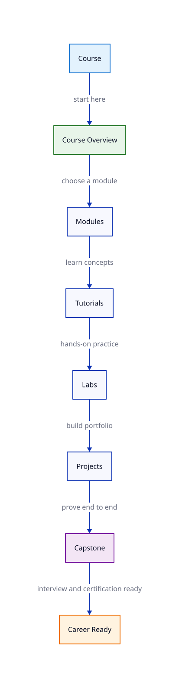

# Site Reliability Engineering — Learning Roadmap

Follow the course in order:

1. **Course overview** — understand scope, prerequisites, and outcomes
2. **Modules** — work through tutorials module by module
3. **Labs** — hands-on practice after core lessons
4. **Quizzes** — check understanding before projects
5. **Projects** — portfolio builds that connect multiple skills
6. **Capstone** — end-to-end proof of production readiness
7. **Interview preparation** — role-specific questions and scenarios
8. **Certifications** — map lessons to industry exams

## Modules

