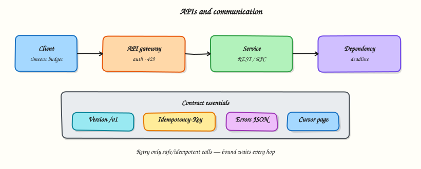

# APIs and communication

## Overview

Services talk through **contracts**. A vague API becomes coupling, outages, and angry mobile clients. In System Design you must choose style (REST/RPC/events), shape resources, and define failure behaviour — timeouts, retries, and idempotency — as carefully as happy-path JSON.



## Prerequisites

- [Messaging and async](messaging-and-async.md)
- HTTP methods and status codes

## Learning Objectives

By the end of this tutorial, you will be able to:

- [ ] Choose REST-ish resources vs RPC-style operations for a use case  
- [ ] Version and evolve an API without breaking clients overnight  
- [ ] Specify pagination, filtering, and error shapes  
- [ ] Set timeout/retry rules that do not amplify outages  
- [ ] Implement a tiny in-process API with idempotent create  

## Theory

### Sync API styles

| Style | Shape | Good for |
|-------|-------|----------|
| **REST-ish HTTP** | Resources + verbs (`GET /links/{code}`) | Public/partner APIs, CRUD |
| **RPC over HTTP** | Actions (`POST /CreateLink`) | Internal services, clear operations |
| **gRPC** | Typed stubs, often HTTP/2 | Low-latency internal meshes |
| **GraphQL** | Client-shaped queries | Many clients, varied read shapes (careful with abuse) |

Pick for **clients and change rate**, not fashion. Public ecosystems often stay HTTP+JSON; internal meshes may add gRPC.

### Resource design basics

For a shortener:

| Endpoint | Intent |
|----------|--------|
| `POST /v1/links` | Create (auth) |
| `GET /v1/links/{code}` | Metadata for owner |
| `GET /{code}` | Redirect (hot path; may live on another host) |

Keep the **redirect path** minimal — fewer headers, fewer dependencies.

### Versioning

Common options:

- URL prefix: `/v1/...` (explicit, cache-friendly)  
- Header version (flexible, harder to discover)  

Rules of evolution:

- Additive changes are safest (new optional fields)  
- Never reuse field meanings  
- Deprecate with dates; run dual versions during migration  

### Pagination and lists

Prefer **cursor** pagination over `OFFSET` for large lists (stable under inserts). Return:

```json
{ "items": [...], "next_cursor": "..." }
```

Document max page size. Unbounded list endpoints become accidental DoS.

### Errors

Return machine-readable errors:

```json
{ "error": { "code": "invalid_url", "message": "URL must be https" } }
```

Map to HTTP status honestly: `400` validation, `401/403` authz, `404` missing, `409` conflict, `429` rate limit, `5xx` your fault.

### Timeouts, retries, deadlines

Every sync call needs:

- **Client timeout** (fail fast)  
- **Server deadline** (stop useless work)  
- **Retry policy** only for safe/idempotent operations  

Retrying non-idempotent `POST` without an idempotency key causes duplicates. Prefer:

- Idempotency-Key header on creates  
- Retries on `502/503/408` with exponential backoff + jitter  
- No retry storms from every pod at once  

### Synchronous vs asynchronous APIs

| Need | Pattern |
|------|---------|
| User waits for result | Sync request/response |
| Long work | `202 Accepted` + job resource / webhook / poll |
| Fan-out side effects | Events (Module 7) after commit |

### Contracts and compatibility

Treat OpenAPI/proto as product surface:

- Review breaking changes like migrations  
- Contract tests between producer and consumer  
- Avoid sharing databases as an “API” between teams  

## Architecture

```text
Client → API Gateway (auth, rate limit) → Link Service → DB
                                      ↘ enqueue analytics
```

Public contract stays stable; internals can evolve behind the gateway.

## Hands-on Lab

### Objective

Implement a tiny link API in-process: create with idempotency key, get by code, and reject unsafe retries that would double-create without keys.

### Lab environment

Local Python 3.10+.

### Real-world scenario

Mobile clients retry creates on flaky networks. Without idempotency keys you get duplicate short links. You prove the contract in a unit-sized service.

### Step-by-step tasks

#### 1. Workspace

``` {.bash .ra-terminal title="Terminal"}
mkdir -p ~/rebash-system-design/module-08-apis
cd ~/rebash-system-design/module-08-apis
```

#### 2. Tiny API

```python title="api_lab.py"
#!/usr/bin/env python3
"""Minimal link API: idempotent create + get."""

from __future__ import annotations

import hashlib
from dataclasses import dataclass


@dataclass
class Link:
    code: str
    url: str


class LinkAPI:
    def __init__(self) -> None:
        self.links: dict[str, Link] = {}
        self.idem: dict[str, str] = {}  # key -> code

    def create(self, url: str, idempotency_key: str | None = None) -> tuple[int, dict]:
        if not url.startswith("https://"):
            return 400, {"error": {"code": "invalid_url", "message": "URL must be https"}}

        if idempotency_key:
            existing = self.idem.get(idempotency_key)
            if existing:
                link = self.links[existing]
                return 200, {"code": link.code, "url": link.url, "idempotent_replay": True}

        code = hashlib.sha256(url.encode()).hexdigest()[:8]
        # if same URL already exists, return it (natural idempotency)
        for link in self.links.values():
            if link.url == url:
                if idempotency_key:
                    self.idem[idempotency_key] = link.code
                return 200, {"code": link.code, "url": link.url, "idempotent_replay": True}

        # ensure unique code collision handling for demo
        while code in self.links:
            code = hashlib.sha256((code + url).encode()).hexdigest()[:8]

        self.links[code] = Link(code=code, url=url)
        if idempotency_key:
            self.idem[idempotency_key] = code
        return 201, {"code": code, "url": url, "idempotent_replay": False}

    def get(self, code: str) -> tuple[int, dict]:
        link = self.links.get(code)
        if not link:
            return 404, {"error": {"code": "not_found", "message": "unknown code"}}
        return 200, {"code": link.code, "url": link.url}


def main() -> None:
    api = LinkAPI()
    s1, b1 = api.create("https://example.com/a", idempotency_key="k1")
    s2, b2 = api.create("https://example.com/a", idempotency_key="k1")
    s3, b3 = api.create("http://insecure.example", idempotency_key="k2")
    sg, bg = api.get(b1["code"])

    lines = [
        f"create_status={s1}",
        f"replay_status={s2}",
        f"same_code={'yes' if b1['code'] == b2['code'] else 'no'}",
        f"replay_flag={b2.get('idempotent_replay')}",
        f"invalid_status={s3}",
        f"get_status={sg}",
        f"get_url={bg.get('url')}",
        f"links_stored={len(api.links)}",
    ]
    report = "\n".join(lines) + "\n"
    print(report, end="")
    open("api-report.txt", "w", encoding="utf-8").write(report)


if __name__ == "__main__":
    main()
```

#### 3. Run and verify

``` {.bash .ra-terminal title="Terminal"}
cd ~/rebash-system-design/module-08-apis
python3 api_lab.py | tee api-run.txt
grep -E 'same_code|links_stored|invalid_status' api-report.txt
```

!!! example "Expected output"
    `same_code=yes`, `links_stored=1`, `invalid_status=400`.

### Validation steps

- [ ] Idempotent replay returns the same code  
- [ ] Invalid URL yields 400  
- [ ] Get returns the stored URL  

### Common errors and fixes

| Error | Cause | Fix |
|-------|-------|-----|
| Two links stored | Idempotency key ignored | Check `idem` before insert |
| 201 on replay | Wrong status mapping | Return 200 on replay |

### Challenge exercise

Add `429` when more than 5 creates occur per second from a fake `client_id` rate limiter.

### Learning outcomes

- Idempotency keys make client retries safe  
- Error codes are part of the contract  
- Hot paths deserve smaller APIs  

### Cleanup

``` {.bash .ra-terminal title="Terminal"}
cd ~/rebash-system-design/module-08-apis
rm -f api-run.txt api-report.txt 2>/dev/null || true
```

## Validation

- [ ] You can sketch public vs internal API choices  
- [ ] You can explain timeout + retry + idempotency together  
- [ ] You know when to return `202` instead of blocking  

## Interview Questions

**1. REST vs RPC — how do you choose for an internal service?**

??? success "Reveal answer"
    Prefer resource-oriented HTTP when the model is naturally CRUD and shared with many clients. Prefer RPC/gRPC when operations are actions, payloads are typed, and you control both ends. Consistency of team conventions matters as much as theory.

**2. Why use idempotency keys on POST?**

??? success "Reveal answer"
    Clients retry when networks fail. Without a key, retries create duplicates. The server stores the key → result mapping and returns the original result on replay.

**3. Why prefer cursor pagination over OFFSET?**

??? success "Reveal answer"
    OFFSET becomes slow and unstable as tables grow and rows insert/delete. Cursors (keyset) stay efficient and give more stable pages under concurrency.

**4. What should clients retry?**

??? success "Reveal answer"
    Transient failures on idempotent or explicitly safe requests (GET, or POST with idempotency key), with backoff and jitter. Do not blindly retry non-idempotent writes or 400-level validation errors.

**5. How do you version a breaking change?**

??? success "Reveal answer"
    Ship `/v2` (or a new proto package), migrate clients, keep `/v1` until traffic drains, then sunset with a published date. Avoid silently changing field meanings in place.

## Common Mistakes

!!! warning "Chatty APIs"
    Many small sync calls between services multiply latency and failure modes. Batch or redesign the boundary.

!!! warning "Infinite timeouts"
    A hung dependency holds threads and cascades. Always bound waits.

!!! warning "Using the database as the team API"
    Schema coupling freezes evolution. Publish an explicit service contract instead.

## Best Practices

- Document status codes and error bodies  
- Put budgets on timeouts end-to-end  
- Make creates idempotent for mobile/flaky clients  
- Keep redirect/hot paths minimal  
- Contract-test breaking changes  

## Summary

APIs are product surfaces. Clear resources, honest errors, versioning, and disciplined timeouts/retries keep distributed systems operable — not just “connected.”

## What's Next

[Observability and resilience](observability-and-resilience.md) — see failures early and survive them with timeouts, bulkheads, and load shedding.
