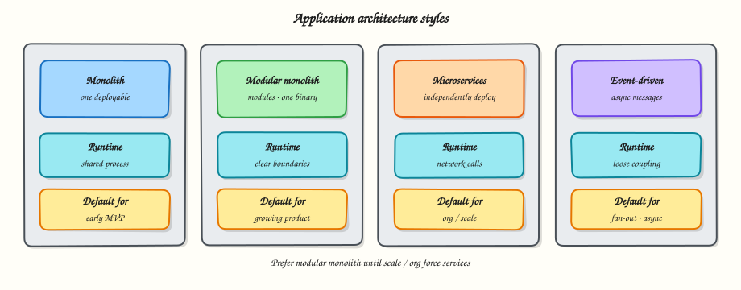

# Application architecture styles

## Overview

The same product can be shaped many ways. **Architecture style** is the large-scale shape: how you package code, deploy it, and let pieces talk.

This tutorial compares four styles you will meet constantly:

1. **Monolith**  
2. **Modular monolith**  
3. **Microservices**  
4. **Event-driven** collaboration  



You will build a tiny **modular monolith in Python** so the idea is concrete — not slides-only.

## Prerequisites

- [Quality attributes and trade-offs](quality-attributes-and-trade-offs.md)
- Comfortable with functions/modules in Python

## Learning Objectives

By the end of this tutorial, you will be able to:

- [ ] Describe each style and its deploy/runtime shape  
- [ ] List strengths and failure modes for each  
- [ ] Choose a default style for an MVP with reasons  
- [ ] Implement module boundaries inside one Python process  
- [ ] Explain when *not* to start with microservices  

## Theory

### Monolith

**What:** One deployable unit. UI (sometimes), API, domain logic, and data access ship together.

**Why teams choose it:** Fast local development, simple transactions, easy refactor across features, one pipeline.

**How it fails:** Codebase becomes a ball of mud; one bug can take down everything; scaling requires scaling the whole app; ownership fights appear as the team grows.

**When it fits:** Early product, small team, unclear domain boundaries.

### Modular monolith

**What:** Still **one deployable**, but code is organised into **modules** with clear boundaries (packages, ownership, allowed imports). Modules talk through well-defined interfaces — ideally not by reaching into each other’s databases freely.

**Why:** Keeps monolith simplicity while preparing for future extraction. Many successful companies stay here longer than Twitter threads suggest.

**Rules that make it real:**

- Module A must not import Module B’s private internals  
- Shared kernel stays small  
- Database tables owned by one module when possible  
- Cross-module calls go through a public API (function/service interface)

**When it fits:** Default recommendation for most new products.

### Microservices

**What:** Multiple independently deployable services, each owning a **bounded context** and usually its own data store. Collaborate over network (HTTP/gRPC/events).

**Why:** Independent scaling, independent release cadence, team autonomy, technology flexibility per service.

**Cost you must pay:**

- Network latency and partial failure  
- Distributed transactions become sagas/outbox patterns  
- Observability and local setup get harder  
- Need mature platform (CI/CD, service discovery, auth, standards)

**When it fits:** Clear domain boundaries, multiple teams, proven scale pain that modular monolith cannot fix cheaply.

**Anti-pattern:** “Nano-services” — every function is a service. That is distributed monolith pain without benefits.

### Event-driven style

**What:** Components communicate by **emitting and reacting to events** (order.placed, payment.captured) via a broker (queue/bus), instead of only synchronous request/response.

**Why:** Decouple producers from consumers; smooth traffic spikes; enable multiple subscribers (analytics, email, inventory) without changing the producer.

**Challenges:** Eventual consistency, ordering, idempotency, poison messages, replay.

**Often combined with:** Microservices *or* a modular monolith that publishes events outbound.

### Choosing without fashion

| Situation | Sensible default |
|-----------|------------------|
| 2–8 engineers, finding product-market fit | Modular monolith |
| One hot read path needs different scaling | Modular monolith + extract that path later |
| Multiple teams blocking on one release train | Consider services along team boundaries |
| Heavy fan-out workflows | Add events even inside a monolith |

### Evolution path (common)

```
Monolith → Modular monolith → Extract 1–2 services → More services + events
```

Skipping steps is allowed only with clear organisational and operational readiness.

### Key concepts

| Concept | Meaning |
|---------|---------|
| Bounded context | A model and language valid inside one domain area |
| Deployable unit | What you build, ship, and roll back together |
| Sync vs async | Call/wait vs emit/react later |
| Data ownership | Who may write which data |

## Hands-on Lab

### Objective

Implement a **modular monolith** for a tiny shop: `catalog` and `orders` modules in one process, with a rule that orders only talks to catalog through a public function.

### Real-world scenario

A startup wants checkout quickly. You refuse a five-service mesh on day one, but you still want clean boundaries for later extraction.

### Step-by-step tasks

#### 1. Workspace layout

``` {.bash .ra-terminal title="Terminal"}
mkdir -p ~/rebash-system-design/module-03-styles/shop/{catalog,orders}
cd ~/rebash-system-design/module-03-styles
```

#### 2. Catalog module

```python title="shop/catalog/service.py"
from __future__ import annotations

_PRODUCTS = {
    "sku-1": {"name": "Notebook", "price_cents": 499},
    "sku-2": {"name": "Pen", "price_cents": 99},
}


def get_product(sku: str) -> dict | None:
    """Public catalog API — other modules may call this."""
    product = _PRODUCTS.get(sku)
    return None if product is None else dict(product)
```

```python title="shop/catalog/__init__.py"
from .service import get_product

__all__ = ["get_product"]
```

#### 3. Orders module

```python title="shop/orders/service.py"
from __future__ import annotations

from shop.catalog import get_product

_ORDERS: list[dict] = []


def place_order(sku: str, qty: int) -> dict:
    if qty < 1:
        raise ValueError("qty must be >= 1")
    product = get_product(sku)
    if product is None:
        raise KeyError(f"unknown sku: {sku}")
    total = product["price_cents"] * qty
    order = {"sku": sku, "qty": qty, "total_cents": total, "product_name": product["name"]}
    _ORDERS.append(order)
    return order


def list_orders() -> list[dict]:
    return list(_ORDERS)
```

```python title="shop/orders/__init__.py"
from .service import list_orders, place_order

__all__ = ["place_order", "list_orders"]
```

#### 4. App entrypoint

```python title="shop/__init__.py"
# Modular monolith package root
```

```python title="app.py"
#!/usr/bin/env python3
from __future__ import annotations

from shop.orders import list_orders, place_order


def main() -> None:
    o1 = place_order("sku-1", 2)
    o2 = place_order("sku-2", 5)
    lines = [
        f"order1_total_cents={o1['total_cents']}",
        f"order2_total_cents={o2['total_cents']}",
        f"order_count={len(list_orders())}",
    ]
    report = "\n".join(lines) + "\n"
    print(report, end="")
    open("orders-report.txt", "w", encoding="utf-8").write(report)


if __name__ == "__main__":
    main()
```

#### 5. Run from the module root

``` {.bash .ra-terminal title="Terminal"}
cd ~/rebash-system-design/module-03-styles
PYTHONPATH=. python3 app.py | tee orders-run.txt
grep order_count orders-report.txt
```

!!! example "Expected output"
    Totals `998` and `495`, `order_count=2`.

#### 6. Document the boundary

Create `boundaries.md` describing: one deployable, two modules, catalog owns product data, orders calls `get_product` only.

### Validation steps

- [ ] Orders imports catalog’s **public** API, not a private dict  
- [ ] Report file proves two orders were placed  
- [ ] You can explain how `orders` could become a separate service later (network call replacing `get_product`)  

### Challenge exercise

Add a third module `payments` that only accepts an `order_id` / total from orders via a public function — still in-process.

### Common errors and fixes

| Error | Cause | Fix |
|-------|-------|-----|
| `ModuleNotFoundError: shop` | Wrong `PYTHONPATH` | Run with `PYTHONPATH=.` from module root |
| Orders reads `_PRODUCTS` directly | Broken boundary | Only call `get_product` |

## Interview Questions

**1. Why might a modular monolith be better than microservices for an MVP?**

??? success "Reveal answer"
    One deploy, simple transactions, faster iteration, lower ops cost — while still enforcing boundaries for later extraction.

**2. What problem do microservices solve that a monolith cannot?**

??? success "Reveal answer"
    Independent deploy/scale and team autonomy at organisational scale — not “cleaner code” by magic.

**3. What is a distributed monolith?**

??? success "Reveal answer"
    Many services that must be released together and share databases/tight sync calls — paying microservice cost without the benefit.

## Summary

Style is a strategic choice. Prefer a **modular monolith** until boundaries and organisational scale demand services. Use **events** when fan-out and decoupling matter. Always connect the choice to quality attributes from Module 2.

## What's Next

[Client, edge, and service path](client-edge-and-service-path.md) — follow one HTTPS request through the internet to your code.
