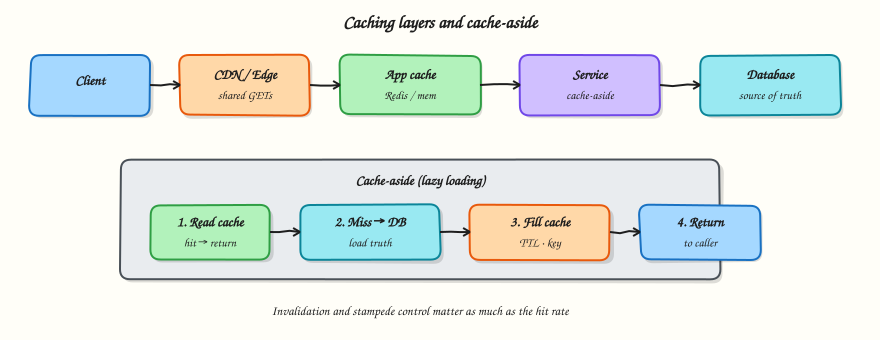

# Caching

## Overview

A **cache** stores a copy of data so later reads are cheaper. Used well, it cuts latency and shields databases. Used poorly, it serves stale or wrong data and creates outage amplifiers (thundering herds).

This tutorial covers cache layers, common patterns (especially **cache-aside**), TTL and invalidation, and failure modes you must name in a design review.



## Prerequisites

- [Data storage](data-storage.md)
- Comfortable with dictionaries and timing in Python

## Learning Objectives

By the end of this tutorial, you will be able to:

- [ ] Place CDN, application, and database buffer caches in a request path  
- [ ] Implement and explain cache-aside vs write-through at a high level  
- [ ] Choose TTL vs explicit invalidation for a feature  
- [ ] Describe cache stampede and one mitigation (single-flight / locking)  
- [ ] Build a tiny TTL cache in Python and measure hit rate  

## Theory

### Why cache at all?

Caches help when:

- The same keys are read often (**temporal locality**)  
- Computing or fetching the value is expensive  
- Slightly stale data is acceptable for that path  

Caches hurt when:

- Every key is unique (no reuse)  
- Strong read-after-write consistency is required and you ignore it  
- Invalidation is wrong → security or money bugs  

### Layers (outside → inside)

| Layer | Typical contents | Notes |
|-------|------------------|-------|
| Browser / client | Static assets, some API GETs | Controlled by HTTP cache headers |
| CDN / edge | Shared public responses, media | Great for anonymous GETs |
| Application cache (Redis/Memcached) | Hot entities, sessions, computed views | Most interview diagrams focus here |
| DB buffer pool | Pages/blocks | Automatic; still not a substitute for app cache design |

Do not draw five cache boxes if one Redis + CDN is enough. Name **what** is cached and **who** invalidates it.

### Cache-aside (lazy loading)

Most common application pattern:

1. Read cache by key  
2. On miss → read database  
3. Fill cache → return  

Writes usually go to the database, then **invalidate** (delete) or **update** the cache key.

Pros: simple; cache only holds useful data.  
Cons: first request after expire is slow; concurrent misses can stampede the DB.

### Write-through and write-behind

- **Write-through**: write DB and cache together (or cache then DB in a managed path). Reads often hit. Write latency higher.  
- **Write-behind (write-back)**: write cache first, flush to DB asynchronously. Fast writes; risk of loss if cache dies before flush — rare for user-facing money paths.

Prefer cache-aside + invalidation unless you have a strong reason.

### Keys, TTL, and invalidation

**Key design** must include everything that changes the value (tenant, locale, auth variant). Wrong keys leak data between users.

**TTL** (time to live): automatic expiry. Simple, but staleness window equals TTL.

**Explicit invalidation**: delete/update keys on write. Fresher, but you must find every affected key (and derived views).

Hybrid: short TTL **and** invalidate on write for critical entities.

### Stampede / thundering herd

When a hot key expires, thousands of requests miss together and hammer the database.

Mitigations:

- **Single-flight**: only one filler loads the DB; others wait  
- Soft TTL / early refresh on one request  
- Probabilistic early expiration  
- Never let the cache be the only copy of critical config without rate limits  

### Negative caching

Caching “not found” briefly prevents repeated DB lookups for missing keys (and some abuse). Keep negative TTLs short.

### Consistency language for designs

Say explicitly:

> Profile reads may be stale up to 30 seconds. After profile update, we invalidate `user:{id}` so the next read refills.

Never claim “Redis makes us strongly consistent” without defining the write path.

### When not to cache

- Write-heavy keys with almost no reuse  
- Values larger than they are worth (huge documents)  
- Correctness-critical balances without a careful consistency design  

## Architecture

Typical read path:

```text
Client → CDN? → Service → Redis (hit?) → DB (miss) → fill Redis → response
```

On write:

```text
Client → Service → DB commit → DELETE cache key (invalidate)
```

## Hands-on Lab

### Objective

Implement cache-aside with TTL and a simple single-flight lock so concurrent misses do not all hit the “database.”

### Lab environment

Local Python 3.10+.

### Real-world scenario

Your redirect path caches `code → url`. At expiry for a viral code, many workers miss at once. You need a tiny model of single-flight fill before you enable Redis in production.

### Step-by-step tasks

#### 1. Workspace

``` {.bash .ra-terminal title="Terminal"}
mkdir -p ~/rebash-system-design/module-06-caching
cd ~/rebash-system-design/module-06-caching
```

#### 2. Cache-aside with single-flight

```python title="cache_lab.py"
#!/usr/bin/env python3
"""Cache-aside with TTL and single-flight fill."""

from __future__ import annotations

import threading
import time
from dataclasses import dataclass


@dataclass
class Entry:
    value: str
    expires_at: float


class FakeDB:
    def __init__(self) -> None:
        self.hits = 0
        self._data = {f"c{i:03d}": f"https://example.com/{i}" for i in range(100)}

    def get(self, key: str) -> str | None:
        self.hits += 1
        time.sleep(0.002)  # pretend slow I/O
        return self._data.get(key)


class CacheAside:
    def __init__(self, db: FakeDB, ttl_seconds: float = 0.05) -> None:
        self.db = db
        self.ttl = ttl_seconds
        self.store: dict[str, Entry] = {}
        self.locks: dict[str, threading.Lock] = {}
        self.meta_lock = threading.Lock()
        self.hits = 0
        self.misses = 0

    def _lock_for(self, key: str) -> threading.Lock:
        with self.meta_lock:
            if key not in self.locks:
                self.locks[key] = threading.Lock()
            return self.locks[key]

    def get(self, key: str) -> str | None:
        now = time.time()
        entry = self.store.get(key)
        if entry and entry.expires_at > now:
            self.hits += 1
            return entry.value

        lock = self._lock_for(key)
        with lock:
            # re-check after waiting (another thread may have filled)
            entry = self.store.get(key)
            now = time.time()
            if entry and entry.expires_at > now:
                self.hits += 1
                return entry.value

            self.misses += 1
            value = self.db.get(key)
            if value is not None:
                self.store[key] = Entry(value=value, expires_at=time.time() + self.ttl)
            return value


def stampede(cache: CacheAside, key: str, workers: int = 20) -> None:
    threads = [threading.Thread(target=cache.get, args=(key,)) for _ in range(workers)]
    for t in threads:
        t.start()
    for t in threads:
        t.join()


def main() -> None:
    db = FakeDB()
    cache = CacheAside(db, ttl_seconds=0.2)

    # warm + hits
    assert cache.get("c001") is not None
    for _ in range(50):
        cache.get("c001")

    # expire and stampede
    time.sleep(0.25)
    before = db.hits
    stampede(cache, "c001", workers=25)
    after = db.hits

    lines = [
        f"cache_hits={cache.hits}",
        f"cache_misses={cache.misses}",
        f"db_hits_total={db.hits}",
        f"db_hits_during_stampede={after - before}",
        f"stampede_controlled={'yes' if (after - before) <= 2 else 'no'}",
    ]
    report = "\n".join(lines) + "\n"
    print(report, end="")
    open("cache-report.txt", "w", encoding="utf-8").write(report)


if __name__ == "__main__":
    main()
```

#### 3. Run and verify

``` {.bash .ra-terminal title="Terminal"}
cd ~/rebash-system-design/module-06-caching
python3 cache_lab.py | tee cache-run.txt
grep stampede_controlled cache-report.txt
```

!!! example "Expected output"
    `stampede_controlled=yes` and `db_hits_during_stampede` should be `1` (occasionally `2` under scheduling noise — still far below 25).

#### 4. Break it on purpose (optional)

Comment out the re-check inside the lock or remove the lock, re-run, and watch `db_hits_during_stampede` climb toward the worker count.

### Validation steps

- [ ] Report shows many `cache_hits` after warm-up  
- [ ] Stampede path keeps DB hits near 1  
- [ ] You can explain cache-aside in two sentences  

### Common errors and fixes

| Error | Cause | Fix |
|-------|-------|-----|
| `stampede_controlled=no` | Lock missing / TTL still valid | Sleep past TTL; keep single-flight lock |
| Flaky assertion | Scheduler timing | Allow `db_hits_during_stampede <= 2` |

### Challenge exercise

Add `invalidate(key)` and a write path that updates the FakeDB then invalidates. Show a read-after-write without waiting for TTL.

### Learning outcomes

- Cache-aside is read-path optimisation with an explicit miss path  
- TTL alone does not prevent stampedes  
- Single-flight protects the database on hot key expiry  

### Cleanup

``` {.bash .ra-terminal title="Terminal"}
cd ~/rebash-system-design/module-06-caching
rm -f cache-run.txt cache-report.txt 2>/dev/null || true
```

## Validation

- [ ] You can place at least three cache layers on a diagram  
- [ ] You can state staleness for a cached read  
- [ ] You can name one stampede mitigation  

## Interview Questions

**1. What is cache-aside?**

??? success "Reveal answer"
    The application reads the cache first; on miss it loads the database, populates the cache, and returns the value. Writes typically update the database and invalidate or refresh the cache key.

**2. TTL vs invalidation — when do you use each?**

??? success "Reveal answer"
    TTL is simple and bounds staleness automatically; good for tolerant data. Invalidation on write keeps data fresher when you know which keys changed. Critical paths often combine short TTL with invalidation.

**3. What is a cache stampede?**

??? success "Reveal answer"
    Many concurrent requests miss the same expired hot key and overload the origin/database. Mitigate with single-flight locks, early refresh, or staggered expiry.

**4. Why can caching create a security bug?**

??? success "Reveal answer"
    If the cache key omits tenant or user identity, one user’s response can be served to another. Cache keys are part of your authorisation boundary.

**5. Should every microservice have Redis?**

??? success "Reveal answer"
    No. Add a cache when measurements show expensive repeated reads and acceptable staleness. A cache is another failure domain, memory cost, and consistency story to operate.

## Common Mistakes

!!! warning "Caching without an invalidation story"
    “We’ll set TTL to one day” on profile or permissions data invites support tickets and security issues.

!!! warning "Treating cache hit rate as the only KPI"
    High hit rate with wrong keys still serves wrong data. Measure correctness and latency together.

!!! warning "Caching personalised responses at the CDN with a shared key"
    Edge caches must vary by the right headers/cookies or bypass auth content.

## Best Practices

- Document max staleness per cached resource  
- Include tenant/user in keys when needed  
- Prefer invalidation + modest TTL for mutable entities  
- Protect hot keys from stampede  
- Observe hit rate, miss latency, and error rate  

## Summary

Caching is a deliberate consistency and performance trade-off. Place the right layer, use cache-aside with clear invalidation, bound staleness with TTL, and design for stampedes before Black Friday traffic teaches you the hard way.

## What's Next

[Messaging and async](messaging-and-async.md) — queues, pub/sub, idempotency, and backpressure.
