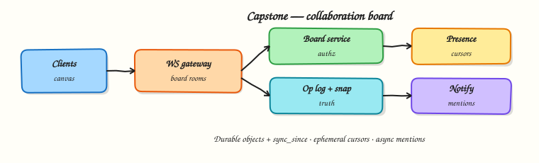

# Capstone — realtime collaboration board

## Overview

Build the design (and a miniature implementation) of a **realtime collaboration board**: multiple users place sticky notes and shapes, see each other’s cursors, and catch up after reconnect. This capstone stitches Parts A–D into one product surface.



## Prerequisites

- [Collaborative and streaming patterns](collaborative-streaming.md)
- [Realtime chat](realtime-chat.md)
- [Notifications and presence](notifications-and-presence.md)

## Learning Objectives

By the end of this capstone, you will be able to:

- [ ] Write a full design brief for a realtime board  
- [ ] Draw gateway, op log, snapshot, and presence paths  
- [ ] Choose merge strategy for board objects vs cursors  
- [ ] List failure modes and resilience controls  
- [ ] Run a multi-user in-process board lab with reconnect sync  

## Product brief

**Goal:** Teams brainstorm on a shared infinite canvas during meetings.

### Functional requirements

| ID | Requirement |
|----|-------------|
| F1 | Create/move/delete sticky notes and boxes |
| F2 | Live updates to all users in the board room |
| F3 | Live cursors with display names |
| F4 | Reconnect sync since last op |
| F5 | Board history snapshot for late joiners |
| F6 | Optional @mention notification if mentioned user is offline |

### Non-functional

- Interactive op latency p95 &lt; 150 ms in-region for online peers  
- Cursor updates may drop under load  
- Durable objects never rely on LWW alone for concurrent creates  
- AuthZ: only board members can write  

### Out of scope (v1)

CRDT text editing inside stickies, video chat, offline-first mobile CRDT sync across days.

## Architecture

```text
Clients ⇄ WS Gateway ⇄ Board service
                          ├─ Op log (durable)
                          ├─ Snapshot store
                          ├─ Presence / cursors (ephemeral)
                          └─ Notify service (mentions)
                 ↕ pub/sub board:{id}
```

### Object model

```text
board(board_id, …)
object(object_id, board_id, type, x, y, text, version, deleted)
op(op_id, board_id, actor, type, payload, ts)
```

### Op types

- `object.upsert` — create/move/edit (idempotent by `object_id` + `version` or merge fields)  
- `object.delete` — tombstone  
- `cursor.move` — ephemeral, not in op log  

### Sync protocol

1. Connect + auth  
2. Receive snapshot (`objects` map) + `last_op_id`  
3. Apply live ops with `op_id > last_op_id`  
4. On reconnect: `GET /ops?since=last_op_id` then resume WS  

### Trade-offs to state

| Decision | Choice | Accept |
|----------|--------|--------|
| Cursors | Ephemeral, throttled | Occasional jumps |
| Object moves | Versioned upsert / merge by field | Rare conflicts on same field |
| Fan-out | Pub/sub per board | Hot boards need sharding later |
| Mentions | Async notify | Seconds of lag OK |

## Hands-on Lab

### Objective

Implement a miniature board server: upsert objects, broadcast to online members, ignore durable storage for cursors, and sync ops after reconnect.

### Lab environment

Local Python 3.10+.

### Real-world scenario

Two users edit one board; one disconnects briefly and must catch up without losing the other’s creates.

### Step-by-step tasks

#### 1. Workspace

``` {.bash .ra-terminal title="Terminal"}
mkdir -p ~/rebash-system-design/module-17-capstone
cd ~/rebash-system-design/module-17-capstone
```

#### 2. Board runtime

```python title="board_lab.py"
#!/usr/bin/env python3
"""Miniature collaboration board with op log sync."""

from __future__ import annotations

from dataclasses import dataclass, field


@dataclass
class Op:
    op_id: int
    actor: str
    kind: str
    payload: dict


@dataclass
class Board:
    objects: dict[str, dict] = field(default_factory=dict)
    ops: list[Op] = field(default_factory=list)
    online: set[str] = field(default_factory=set)
    cursors: dict[str, tuple[int, int]] = field(default_factory=dict)
    _seq: int = 0

    def connect(self, user: str) -> tuple[dict[str, dict], int]:
        """Return snapshot objects and current last_op_id."""
        self.online.add(user)
        last = self.ops[-1].op_id if self.ops else 0
        return dict(self.objects), last

    def disconnect(self, user: str) -> None:
        self.online.discard(user)
        self.cursors.pop(user, None)

    def _apply(self, op: Op) -> None:
        if op.kind == "upsert":
            self.objects[op.payload["id"]] = {
                "id": op.payload["id"],
                "type": op.payload["type"],
                "x": op.payload["x"],
                "y": op.payload["y"],
                "text": op.payload.get("text", ""),
            }
        elif op.kind == "delete":
            self.objects.pop(op.payload["id"], None)

    def upsert(self, actor: str, obj_id: str, typ: str, x: int, y: int, text: str = "") -> Op:
        self._seq += 1
        op = Op(self._seq, actor, "upsert", {"id": obj_id, "type": typ, "x": x, "y": y, "text": text})
        self.ops.append(op)
        self._apply(op)
        return op

    def cursor(self, user: str, x: int, y: int) -> None:
        if user in self.online:
            self.cursors[user] = (x, y)

    def sync_since(self, last_op_id: int) -> list[Op]:
        return [op for op in self.ops if op.op_id > last_op_id]


def main() -> None:
    board = Board()
    board.connect("alice")
    board.connect("bob")
    op1 = board.upsert("alice", "n1", "sticky", 10, 20, "Idea A")
    board.cursor("alice", 11, 21)
    bob_last = op1.op_id  # bob saw op1 live, then dropped
    board.disconnect("bob")
    board.upsert("alice", "n2", "sticky", 40, 50, "Idea B")
    objs, _last = board.connect("bob")
    caught_up = board.sync_since(bob_last)

    lines = [
        f"objects={len(objs)}",
        f"object_ids={','.join(sorted(objs))}",
        f"ops_total={len(board.ops)}",
        f"sync_since_bob_last={len(caught_up)}",
        f"missed_op_kind={caught_up[0].kind if caught_up else None}",
        f"cursor_alice={board.cursors.get('alice')}",
        f"bob_online={'yes' if 'bob' in board.online else 'no'}",
        f"capstone_ok={'yes' if len(objs) == 2 and len(caught_up) == 1 else 'no'}",
    ]
    report = "\n".join(lines) + "\n"
    print(report, end="")
    open("board-report.txt", "w", encoding="utf-8").write(report)


if __name__ == "__main__":
    main()
```

#### 3. Run and verify

``` {.bash .ra-terminal title="Terminal"}
cd ~/rebash-system-design/module-17-capstone
python3 board_lab.py | tee board-run.txt
grep capstone_ok board-report.txt
```

!!! example "Expected output"
    `capstone_ok=yes`, two objects, sync returns the missed op(s).

#### 4. Design deliverable (written)

Create `board-design-brief.md` in the same folder covering:

1. Requirements (copy/adapt table above)  
2. Capacity sketch (e.g. 50 users/board, 10 boards/sec ops peak)  
3. Component diagram (gateway, op log, snapshot, presence)  
4. Three failure modes + mitigations  
5. What you would build in week 1 vs later  

``` {.bash .ra-terminal title="Terminal"}
cd ~/rebash-system-design/module-17-capstone
cat > board-design-brief.md <<'EOF'
# Collaboration board — design brief

## Requirements
- F1–F6 as in the tutorial
- p95 op fan-out < 150 ms in-region

## Capacity (assumptions)
- 20k MAU, 500 concurrent boards, 50 users hot board
- 10 ops/sec average hot board, 100 ops/sec peak
- Cursor events 5/sec/user (lossy)

## Components
- WS gateway + pub/sub board channels
- Op log + periodic snapshots
- Ephemeral presence/cursors
- Notification hook for mentions

## Failure modes
1. Gateway crash → clients reconnect + sync_since
2. Hot board fan-out → shard channel / sample cursors
3. Poison op → schema validate + DLQ

## Phased delivery
- Week 1: durable upsert/delete + sync + single region
- Later: CRDT text, multi-region, audit export
EOF
test -f board-design-brief.md && echo brief_ok=yes
```

### Validation steps

- [ ] Lab report `capstone_ok=yes`  
- [ ] Design brief file exists with failure modes  
- [ ] You can narrate the architecture without notes  

### Challenge exercise

Add `object.delete` tombstones and ensure sync replays deletes after reconnect.

### Cleanup

``` {.bash .ra-terminal title="Terminal"}
cd ~/rebash-system-design/module-17-capstone
rm -f board-run.txt board-report.txt 2>/dev/null || true
# keep board-design-brief.md if you want it for your portfolio
```

## Interview Questions

**1. Walk through a sticky-note create end-to-end.**

??? success "Reveal answer"
    Client sends upsert op over WS → gateway authenticates → board service appends op log and updates materialised objects → pub/sub to board channel → other gateways push to online members → offline members catch up via sync/inbox. Cursors are not written to the op log.

**2. How do late joiners initialise state?**

??? success "Reveal answer"
    Load the latest snapshot of objects, then apply ops with IDs greater than the snapshot’s `last_op_id`. This bounds replay cost versus replaying the entire history.

**3. What do you drop first under load?**

??? success "Reveal answer"
    Ephemeral cursor/presence traffic, then aggregate notifications. Durable object ops stay highest priority with backpressure and load shedding at the edges.

**4. How is this different from chat?**

??? success "Reveal answer"
    Chat is mostly an append-only message stream. A board needs addressable objects, moves/deletes, snapshots, and merge/version rules for concurrent edits — plus a much hotter ephemeral cursor channel.

## Common Mistakes

!!! warning "Treating the board as only in-memory WS broadcast"
    Without an op log, refresh and reconnect lose truth.

!!! warning "Same pipeline for cursors and durable ops"
    Cursor storms will starve real edits.

## Summary

You have completed the System Design course arc: foundations → building blocks → classic systems → realtime. The collaboration board is the integration exam — durable ops, ephemeral presence, sync, and honest trade-offs.

## What's Next

- Revisit the [roadmap](roadmap.md) and tighten any weak modules  
- Practise timed designs: shortener, feed, and this board  
- Explore Academy projects and interview hubs as they grow  
- Optional: add Docker/Redis to the chat and board labs for a portfolio demo  
