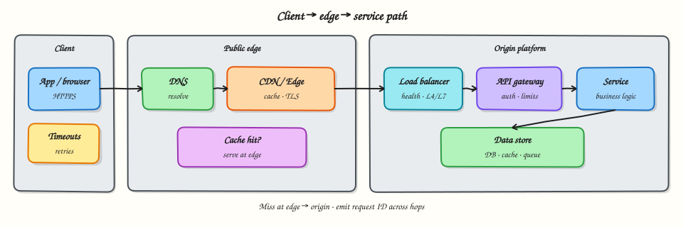

# Client, edge, and service path

## Overview

When a user taps a button, their phone does not “call your laptop.” The request usually travels through several hops. If you cannot name those hops, you cannot debug latency, TLS errors, or outages.

This tutorial follows one path:

**Client → DNS → CDN/Edge → Load balancer → API gateway → Service → Data store**



You will simulate the hops in **Python** so each stage’s job becomes obvious.

## Prerequisites

- [Application architecture styles](application-architecture-styles.md)
- Basic HTTP (method, host header, status codes)
- Helpful: [Networking](../networking/index.md) course overview

## Learning Objectives

By the end of this tutorial, you will be able to:

- [ ] Explain what DNS, CDN, load balancer, and API gateway each contribute  
- [ ] Distinguish edge caching from origin traffic  
- [ ] Trace where TLS usually terminates  
- [ ] Spot which hop is a likely bottleneck for a given symptom  
- [ ] Implement a layered request pipeline in Python  

## Theory

### Client

The **client** is the initiator: browser, mobile app, CLI, or another service.

It chooses:

- URL (scheme, host, path, query)  
- Method and headers (auth, content-type, cache directives)  
- Timeouts and retries (badly chosen retries can amplify outages)

### DNS — finding an address

**DNS** maps a name (`api.example.com`) to addresses (often via CNAME chains to a load balancer or CDN).

Why it matters in System Design:

- GeoDNS can send users to nearby regions  
- Low TTLs allow faster failover but increase lookup volume  
- Misconfigured DNS looks like “the whole internet is down” for your brand  

DNS does **not** send HTTP bodies. It only answers “where should I connect?”

### CDN / Edge

A **CDN** (Content Delivery Network) caches static (and sometimes dynamic) content close to users: images, JS, CSS, and sometimes API GET responses.

Benefits:

- Lower latency for cacheable content  
- Absorbs large read traffic  
- Shields origin from bots and spikes (when configured)

Limits:

- Uncached or personalised requests still hit origin  
- Cache invalidation is a classic hard problem  
- Wrong cache keys can leak data between users  

### Load balancer

A **load balancer** distributes connections across healthy backends.

Types (conceptual):

| Layer | Examples of job |
|-------|-----------------|
| L4 | TCP/UDP forwarding; fast; less HTTP-aware |
| L7 | HTTP routing by path/host; sticky sessions; WAF features |

Health checks remove bad instances. Without a LB (or platform equivalent), you have a single point of failure and painful deploys.

### API gateway

An **API gateway** is an HTTP-aware front door for APIs:

- Authentication / JWT validation  
- Rate limiting  
- Request routing to services  
- Sometimes aggregation or protocol translation  

It is not magic: a gateway can become a bottleneck or a single point of failure if overloaded. Some teams use ingress controllers or service meshes for parts of this job — the *role* matters more than the product name.

### Service (origin)

Your **service** runs business logic. It should assume:

- Clients are hostile or buggy  
- Retries will happen  
- Partial dependency failure is normal  

Idempotency keys, timeouts to downstreams, and clear status codes live here.

### Data store

After logic, many requests read or write a **database or cache**. This hop often dominates latency. Design the request path so the hottest reads can be satisfied earlier (CDN/cache) when safe.

### Putting latency in order

Rough intuition (not laws):

1. Memory cache in-region: sub-ms to low ms  
2. Same-region DB: single-digit to tens of ms  
3. Cross-region: tens to hundreds of ms  
4. Cold origin through many hops + TLS: stacks up  

When users say “the app is slow,” ask **which hop** — browser, DNS, edge, LB, app, or DB.

### TLS termination

Typically TLS ends at the CDN or load balancer; traffic inside the private network may be plain HTTP or mTLS. Know your trust boundary: encrypting only the public hop is common, but regulated systems may require encryption further in.

### Failure modes by hop

| Symptom | Suspect |
|---------|---------|
| Only some regions fail | DNS/geo or regional origin |
| Static assets fail, API works | CDN config |
| Random 502s during deploy | LB health checks / draining |
| 401/429 storms | Gateway auth or rate limits |
| Slow only on write endpoints | Service or DB |

## Hands-on Lab

### Objective

Build a Python **request pipeline** that passes a fake HTTP request through DNS → edge → LB → gateway → service stages, recording what each stage decides.

### Real-world scenario

A junior engineer asks why “calling the pod IP” behaves differently from calling the public URL. You show the missing hops with a runnable model.

### Step-by-step tasks

#### 1. Workspace

``` {.bash .ra-terminal title="Terminal"}
mkdir -p ~/rebash-system-design/module-04-path
cd ~/rebash-system-design/module-04-path
```

#### 2. Pipeline simulator

```python title="request_path.py"
#!/usr/bin/env python3
from __future__ import annotations

from dataclasses import dataclass, field


@dataclass
class Request:
    host: str
    path: str
    method: str = "GET"
    headers: dict[str, str] = field(default_factory=dict)
    trace: list[str] = field(default_factory=list)


@dataclass
class Response:
    status: int
    body: str
    trace: list[str]


def stage_dns(req: Request) -> Request:
    # Toy: resolve api.shop.test → lb.shop.internal
    resolved = {"api.shop.test": "lb.shop.internal"}.get(req.host)
    if not resolved:
        raise ValueError(f"DNS NXDOMAIN for {req.host}")
    req.trace.append(f"dns:{req.host}->{resolved}")
    req.headers["X-Resolved-Target"] = resolved
    return req


def stage_edge(req: Request) -> Request | Response:
    # Cache only GET /static/*
    if req.method == "GET" and req.path.startswith("/static/"):
        req.trace.append("edge:CACHE_HIT")
        return Response(200, "cached-asset", req.trace + ["edge:served"])
    req.trace.append("edge:CACHE_MISS")
    return req


def stage_lb(req: Request) -> Request:
    backends = ["svc-a:8080", "svc-b:8080"]
    backend = backends[len(req.path) % len(backends)]
    req.trace.append(f"lb:chose:{backend}")
    return req


def stage_gateway(req: Request) -> Request:
    token = req.headers.get("Authorization", "")
    if req.path.startswith("/api/") and not token.startswith("Bearer "):
        raise PermissionError("gateway:401 missing bearer token")
    req.trace.append("gateway:auth_ok")
    req.headers["X-Request-Id"] = "req-lab-1"
    return req


def stage_service(req: Request) -> Response:
    if req.path == "/api/health":
        body = "ok"
    elif req.path.startswith("/api/"):
        body = f"hello-from-service path={req.path}"
    else:
        return Response(404, "not-found", req.trace + ["service:404"])
    req.trace.append("service:handled")
    return Response(200, body, req.trace)


def handle(host: str, path: str, method: str = "GET", token: str | None = None) -> Response:
    req = Request(host=host, path=path, method=method)
    if token:
        req.headers["Authorization"] = f"Bearer {token}"
    req = stage_dns(req)
    edged = stage_edge(req)
    if isinstance(edged, Response):
        return edged
    req = stage_lb(edged)
    req = stage_gateway(req)
    return stage_service(req)


def main() -> None:
    lines: list[str] = []

    r1 = handle("api.shop.test", "/static/app.js")
    lines += [
        f"case1_status={r1.status}",
        f"case1_body={r1.body}",
        f"case1_trace={'>'.join(r1.trace)}",
    ]

    r2 = handle("api.shop.test", "/api/health", token="lab")
    lines += [
        f"case2_status={r2.status}",
        f"case2_body={r2.body}",
        f"case2_trace={'>'.join(r2.trace)}",
    ]

    try:
        handle("api.shop.test", "/api/orders")
        lines.append("case3_error=missing")
    except PermissionError as exc:
        lines.append(f"case3_error={exc}")

    report = "\n".join(lines) + "\n"
    print(report, end="")
    open("path-report.txt", "w", encoding="utf-8").write(report)


if __name__ == "__main__":
    main()
```

#### 3. Run the simulation

``` {.bash .ra-terminal title="Terminal"}
cd ~/rebash-system-design/module-04-path
python3 request_path.py | tee path-run.txt
grep -E 'case1_body|case2_status|case3_error' path-report.txt
```

!!! example "Expected output"
    Case 1 body `cached-asset` (edge hit). Case 2 status `200` with a service trace. Case 3 error mentions missing bearer token at the gateway.

#### 4. Sketch the real path

Create `path_notes.md` listing, for your workplace or a public site you use, what you *think* sits at DNS, edge, LB, and origin. Mark unknowns with `?`.

### Validation steps

- [ ] Static path never reaches `service:handled`  
- [ ] API path without token fails at gateway  
- [ ] Trace strings show dns → edge → lb → gateway → service order for API  

### Challenge exercise

Add a `stage_datastore` that adds 25 ms of simulated delay (`time.sleep`) only for `/api/` paths and record `service+db` in the trace.

### Common errors and fixes

| Error | Cause | Fix |
|-------|-------|-----|
| Static request hits service | Edge stage order wrong | Return `Response` on cache hit before LB |
| Auth never runs | Path not under `/api/` | Align gateway rules with API prefix |

## Interview Questions

**1. Why might the public hostname not be your service hostname?**

??? success "Reveal answer"
    DNS often points at a CDN or load balancer hostname. Clients should not need to know pod or VM addresses.

**2. When should an API response be cached at the CDN?**

??? success "Reveal answer"
    When it is safe to share (or correctly varied by cache key), relatively stable, and high-read. Personalised authenticated data needs careful keys or should bypass cache.

**3. Load balancer vs API gateway — how do you distinguish them?**

??? success "Reveal answer"
    LB focuses on distributing traffic to healthy instances. Gateway focuses on API concerns (auth, rate limits, routing by API shape). Products overlap; design by responsibility.

## Common Mistakes

!!! warning "Debugging only the service logs when DNS/CDN is broken"
    Start from the outside: resolve DNS, check edge status, then origin.

!!! warning "Putting all business logic in the gateway"
    Gateways should stay thin. Fat gateways become another monolith.

## Best Practices

- Emit a request ID at the edge/gateway and propagate it  
- Set client and server timeouts deliberately  
- Drain LBs during deploys  
- Treat cache keys as security-sensitive  

## Summary

Part A closes with the **request path** mental model. You can now narrate where a call goes, why each hop exists, and which failures belong where. The Python lab made cache hits, load balancing, and gateway auth visible as stages — the same stages you will draw in later system designs.

## What's Next

[Data storage](data-storage.md) — choose databases and object stores from access patterns (Part B begins).
