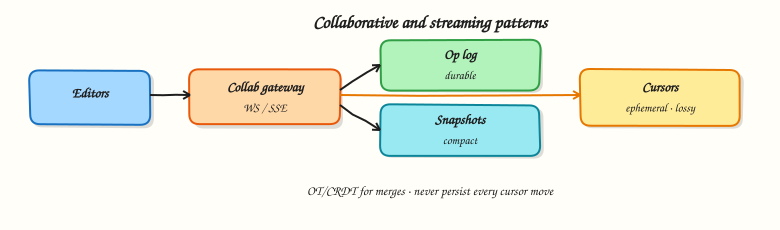

# Collaborative and streaming patterns

## Overview

Docs, whiteboards, and multiplayer cursors need **concurrent edits** without silent data loss. Live dashboards and feeds need **server→client streams**. This module gives the System Design vocabulary: operation logs, OT vs CRDT intuition, and fan-out patterns — without claiming you will invent Google Docs in one afternoon.



## Prerequisites

- [Notifications and presence](notifications-and-presence.md)

## Learning Objectives

By the end of this tutorial, you will be able to:

- [ ] Contrast last-write-wins with mergeable structures  
- [ ] Explain OT vs CRDT at interview depth  
- [ ] Sketch an operation log + snapshot store  
- [ ] Place live cursor/presence updates on a cheap path  
- [ ] Implement a tiny G-Counter and concurrent list merge in Python  

## Theory

### The concurrency problem

Two users edit at once:

- **Last-write-wins (LWW)** — simple, loses work  
- **Pessimistic locks** — safe, poor UX for docs  
- **Mergeable ops** — OT or CRDT so both edits survive  

### Operational transformation (OT)

Clients send operations; a server transforms ops against concurrent ops so everyone converges. Classic in Google Docs–style systems. Requires a careful central ordering/transform function.

### CRDTs (Conflict-free Replicated Data Types)

Data types that merge commutative/associative/idempotent updates so replicas converge without a single transform bottleneck. Examples: G-Counter, OR-Set, RGA for text.

Interview stance:

> For many collaboration features we prefer CRDT libraries or OT services rather than inventing transforms. We still design **op log, snapshots, authz, and fan-out**.

### Operation log + snapshots

```text
Client → apply locally → send op → server appends op log → broadcast
Periodically: compact log into snapshot; new joiners load snapshot + recent ops
```

- Ops are idempotent with `op_id`  
- Snapshots bound replay cost  
- AuthZ every op (who can edit which object)  

### Live cursors and selections

High-frequency, ephemeral, lossy-OK. Separate channel from durable ops. Sample/throttle. Do not write cursors to OLTP.

### Streaming patterns (server → client)

| Pattern | Use |
|---------|-----|
| WebSocket | Interactive bi-directional |
| SSE | One-way event streams (dashboards) |
| Chunked HTTP | File/stream download |
| Kafka → gateway | Internal fan-out to sockets |

Backpressure: slow clients get dropped cursors before durable ops; bound buffers.

### Consistency for users

Show “synced / pending / conflict” states. Prefer merge over mysterious overwrites. For binary blobs, use version checks (If-Match) instead of CRDTs.

## Architecture

```text
Editors ⇄ Collab gateway ⇄ Op service ⇄ Op log + snapshots
                 ↕
            Pub/sub room channel (ops + ephemeral cursors)
```

## Hands-on Lab

### Objective

Implement a grow-only counter CRDT merge and a toy concurrent “add item” set that converges after partition.

### Lab environment

Local Python 3.10+.

### Real-world scenario

You must explain convergence without slides-only hand-waving. A G-Counter and OR-ish set make the idea tangible.

### Step-by-step tasks

#### 1. Workspace

``` {.bash .ra-terminal title="Terminal"}
mkdir -p ~/rebash-system-design/module-16-collab
cd ~/rebash-system-design/module-16-collab
```

#### 2. CRDT toys

```python title="collab_lab.py"
#!/usr/bin/env python3
"""G-Counter and concurrent add-set merge."""

from __future__ import annotations

from dataclasses import dataclass, field


@dataclass
class GCounter:
    """Grow-only counter: each replica increments its own slot."""

    counts: dict[str, int] = field(default_factory=dict)

    def inc(self, replica: str, n: int = 1) -> None:
        self.counts[replica] = self.counts.get(replica, 0) + n

    def value(self) -> int:
        return sum(self.counts.values())

    def merge(self, other: "GCounter") -> "GCounter":
        keys = set(self.counts) | set(other.counts)
        return GCounter({k: max(self.counts.get(k, 0), other.counts.get(k, 0)) for k in keys})


@dataclass
class AddSet:
    """Add-only set with unique element ids (simplified OR-Set add)."""

    elements: dict[str, str] = field(default_factory=dict)  # elem_id -> value

    def add(self, elem_id: str, value: str) -> None:
        self.elements[elem_id] = value

    def merge(self, other: "AddSet") -> "AddSet":
        merged = dict(self.elements)
        merged.update(other.elements)
        return AddSet(merged)

    def values(self) -> set[str]:
        return set(self.elements.values())


def main() -> None:
    a, b = GCounter(), GCounter()
    a.inc("alice", 3)
    b.inc("bob", 2)
    c = a.merge(b)

    s1, s2 = AddSet(), AddSet()
    s1.add("e1", "sticky-note")
    s2.add("e2", "box")
    s2.add("e1", "sticky-note")  # same id concurrent
    s = s1.merge(s2)

    lines = [
        f"counter_value={c.value()}",
        f"counter_ok={'yes' if c.value() == 5 else 'no'}",
        f"set_values={','.join(sorted(s.values()))}",
        f"set_ok={'yes' if s.values() == {'sticky-note', 'box'} else 'no'}",
        f"collab_ok={'yes' if c.value() == 5 and s.values() == {'sticky-note', 'box'} else 'no'}",
    ]
    report = "\n".join(lines) + "\n"
    print(report, end="")
    open("collab-report.txt", "w", encoding="utf-8").write(report)


if __name__ == "__main__":
    main()
```

#### 3. Run and verify

``` {.bash .ra-terminal title="Terminal"}
cd ~/rebash-system-design/module-16-collab
python3 collab_lab.py | tee collab-run.txt
grep collab_ok collab-report.txt
```

!!! example "Expected output"
    `collab_ok=yes` with counter value `5`.

### Validation steps

- [ ] Merged counter sums both replicas  
- [ ] Merged set contains both adds  
- [ ] You can explain why LWW would risk losing an add  

### Challenge exercise

Add a version vector map `replica → seq` and reject stale snapshots.

### Cleanup

``` {.bash .ra-terminal title="Terminal"}
cd ~/rebash-system-design/module-16-collab
rm -f collab-run.txt collab-report.txt 2>/dev/null || true
```

## Interview Questions

**1. OT vs CRDT — how do you talk about them in an interview?**

??? success "Reveal answer"
    OT transforms concurrent operations via a (usually central) algorithm; CRDTs are mergeable types that converge by design. For System Design, emphasise op logs, snapshots, fan-out, and using proven libraries rather than inventing transforms live.

**2. Why keep an operation log?**

??? success "Reveal answer"
    It supports replay for new joiners, audit, conflict debugging, and compaction into snapshots. Clients can catch up after disconnect without transferring the entire document every time.

**3. How are live cursors different from document ops?**

??? success "Reveal answer"
    Cursors are ephemeral, high-frequency, and lossy-OK. They should not use the durable op log path; throttle and drop under load before failing durable edits.

**4. When is last-write-wins acceptable?**

??? success "Reveal answer"
    For low-contention fields where losing an edit is rare and UX tolerates it (e.g. last theme colour). Not acceptable for collaborative text or shared board objects users carefully placed.

## Common Mistakes

!!! warning "Persisting every cursor move"
    You will invent a very expensive analytics system by accident.

!!! warning "Promising perfect conflict-free text without a real library"
    Interviewers prefer honest architecture over fake CRDT maths.

## Summary

Collaboration needs **mergeable updates**, an **op log with snapshots**, and a **cheap ephemeral channel** for presence/cursors. Streaming fan-out reuses the gateway patterns from chat.

## What's Next

[Capstone — realtime collaboration board](capstone-collaboration-board.md) — assemble chat-grade fan-out, presence, and mergeable board objects into one design + lab.
