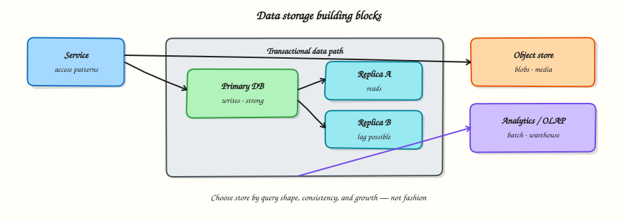

# Data storage

## Overview

Every serious system eventually becomes a **data** problem. Wrong storage choices show up as slow APIs, painful migrations, and “we need to rewrite the schema” projects.

This tutorial teaches how to pick and sketch storage in System Design: start from **access patterns**, then choose engines, consistency, replication, and growth strategy.



## Prerequisites

- [Client, edge, and service path](client-edge-and-service-path.md)
- Basic SQL ideas (tables, primary keys, indexes)
- Comfortable reading small Python scripts

## Learning Objectives

By the end of this tutorial, you will be able to:

- [ ] Derive storage choices from read/write patterns, not product fashion  
- [ ] Contrast OLTP, document/KV, and object storage roles  
- [ ] Explain primary/replica lag and when it hurts  
- [ ] Sketch sharding or partitioning for a hot key risk  
- [ ] Implement a tiny indexed store in Python and measure lookup vs scan  

## Theory

### Access patterns first

Before naming Postgres or DynamoDB, answer:

| Question | Why it matters |
|----------|----------------|
| What is looked up by ID? | Primary key / partition key design |
| What is listed or searched? | Secondary indexes or search engine |
| Read:write ratio? | Cache, replicas, write path cost |
| How large is a record / blob? | Row store vs object store |
| Must two updates be atomic? | Transactions / single-partition writes |
| How fresh must a read be? | Replica lag, CQRS, eventual consistency |

If you cannot describe the top five queries, you are guessing.

### Relational (SQL) OLTP

**OLTP** (Online Transaction Processing) databases (PostgreSQL, MySQL, etc.) shine when you need:

- Multi-row transactions and joins  
- Flexible ad-hoc queries with indexes  
- Strong consistency on a primary  
- Mature tooling and ops knowledge  

Cost:

- Vertical scale has limits; sharding is operationally hard  
- Hot rows and poorly indexed queries still hurt  

Use SQL as the default for **business entities** with relationships (users, orders, billing) until patterns force otherwise.

### Document and key-value stores

**Document** stores (MongoDB-style) and **key-value** stores (DynamoDB, Redis-as-DB) favour:

- Known access by key or partition  
- Flexible or denormalised documents  
- Horizontal scale when partition keys are well chosen  

Cost:

- Cross-entity transactions are weaker or absent  
- “Query everything” often needs secondary indexes or a search system  
- Bad partition keys create hot partitions  

Rule of thumb: if almost every request is `get(id)` or `query(partition, range)`, a KV/document design can be excellent. If you constantly invent new join-like queries, prefer SQL or add a search/analytics path.

### Object / blob storage

Images, videos, exports, and large files belong in **object storage** (S3-compatible). Keep **metadata** (owner, content-type, URL, size) in your OLTP/KV store; keep **bytes** in object storage.

Anti-pattern: stuffing multi-megabyte blobs into row stores as “simpler.”

### Replication — scale reads, not magic HA

A common pattern:

1. **Primary** accepts writes  
2. **Replicas** serve reads  
3. Replication is usually **asynchronous** → **replica lag**

Implications:

- “Read your writes” after an update may fail on a lagging replica  
- Failover to a replica can lose unreplicated writes unless you use sync/quorum designs  
- Replicas help **read throughput** and reporting; they do not remove the need for backups and durability design  

### Partitioning and sharding

When a single primary cannot hold the working set or write rate:

- **Partition** by a key (user_id, tenant_id, hash of short_code)  
- Keep related writes in one partition when you need atomicity  
- Avoid hot partitions (all traffic on one celebrity user or one date bucket)

Sharding moves complexity into routing, resharding, and cross-shard queries. Prefer vertical scale + replicas until numbers demand it.

### Secondary indexes and hot paths

Indexes speed lookups; they slow writes and consume memory.

Design questions:

- Which filters appear on the critical path?  
- Can you denormalise a read model instead of a heavy index?  
- Will an index create write amplification at your peak QPS?  

### Polyglot persistence (practical)

Real systems often combine:

| Store | Holds |
|-------|--------|
| SQL / primary KV | Source of truth for entities |
| Cache | Hot reads (Module 6) |
| Object store | Large binaries |
| Search (e.g. OpenSearch) | Full-text / autocomplete |
| Warehouse | Analytics, not user-facing latency |

Polyglot is a **tool**, not a trophy. Each store is a failure domain and an ops cost.

### Durability and backups (design talk)

In interviews and design reviews, say:

- What is the RPO/RTO story?  
- Are writes fsynced / replicated before ACK?  
- Are backups tested with restore drills?  

“We have replicas” ≠ “we can recover from accidental `DELETE`.”

## Architecture

For a typical user-facing API:

```text
Client → Service → Primary DB (writes)
                 ↘ Read replicas (eventually consistent reads)
                 ↘ Object store (media)
```

Draw the **query next to the box**: `GET /orders/{id}`, `LIST /orders?user=`, `PUT object`. Storage follows the arrows of data, not the org chart.

## Hands-on Lab

### Objective

Build a tiny in-process store that supports primary-key get, secondary-index lookup, and a full scan — then measure why indexes exist.

### Lab environment

Local Python 3.10+. No external database required.

### Real-world scenario

Your short-link service stores `code → url` and must also look up “all codes for owner X.” Product wants both paths fast. You prototype the access patterns before picking a managed database SKU.

### Step-by-step tasks

#### 1. Workspace

``` {.bash .ra-terminal title="Terminal"}
mkdir -p ~/rebash-system-design/module-05-storage
cd ~/rebash-system-design/module-05-storage
```

#### 2. Indexed store

```python title="storage_lab.py"
#!/usr/bin/env python3
"""Tiny store: primary key + secondary index vs full scan."""

from __future__ import annotations

import time
from dataclasses import dataclass


@dataclass
class Link:
    code: str
    url: str
    owner: str


class LinkStore:
    def __init__(self) -> None:
        self.by_code: dict[str, Link] = {}
        self.by_owner: dict[str, set[str]] = {}

    def put(self, link: Link) -> None:
        old = self.by_code.get(link.code)
        if old is not None:
            self.by_owner.get(old.owner, set()).discard(old.code)
        self.by_code[link.code] = link
        self.by_owner.setdefault(link.owner, set()).add(link.code)

    def get(self, code: str) -> Link | None:
        return self.by_code.get(code)

    def list_by_owner_indexed(self, owner: str) -> list[Link]:
        codes = self.by_owner.get(owner, set())
        return [self.by_code[c] for c in codes if c in self.by_code]

    def list_by_owner_scan(self, owner: str) -> list[Link]:
        return [link for link in self.by_code.values() if link.owner == owner]


def timed(fn, *args, loops: int = 200) -> float:
    start = time.perf_counter()
    for _ in range(loops):
        fn(*args)
    return (time.perf_counter() - start) * 1000 / loops


def main() -> None:
    store = LinkStore()
    owners = [f"user-{i % 50}" for i in range(5_000)]
    for i, owner in enumerate(owners):
        store.put(Link(code=f"c{i:05d}", url=f"https://example.com/{i}", owner=owner))

    target = "user-7"
    indexed_ms = timed(store.list_by_owner_indexed, target)
    scan_ms = timed(store.list_by_owner_scan, target)
    sample = store.get("c00007")

    lines = [
        f"records={len(store.by_code)}",
        f"get_code={sample.code if sample else None}",
        f"owner_indexed_avg_ms={indexed_ms:.4f}",
        f"owner_scan_avg_ms={scan_ms:.4f}",
        f"indexed_faster_x={scan_ms / indexed_ms:.1f}" if indexed_ms else "n/a",
    ]
    report = "\n".join(lines) + "\n"
    print(report, end="")
    open("storage-report.txt", "w", encoding="utf-8").write(report)


if __name__ == "__main__":
    main()
```

#### 3. Run and verify

``` {.bash .ra-terminal title="Terminal"}
cd ~/rebash-system-design/module-05-storage
python3 storage_lab.py | tee storage-run.txt
grep indexed_faster storage-report.txt
```

!!! example "Expected output"
    `indexed_faster_x` should be clearly greater than `1` (often tens of times on this data size). Exact numbers vary by machine.

#### 4. Optional — replica lag thought experiment

Add to your notes (no code required): if redirects read from a replica that lags 2 seconds, a user who just created a short link might get 404 on redirect. Mitigation options: read-your-writes on primary for N seconds, sticky sessions, or sync replication for that path.

### Validation steps

- [ ] `storage-report.txt` exists with `records=5000`  
- [ ] Indexed path is faster than scan  
- [ ] You can explain why `by_owner` is a secondary index  

### Common errors and fixes

| Error | Cause | Fix |
|-------|-------|-----|
| Indexed and scan similar | Dataset too small / noisy timer | Increase records or `loops` |
| `KeyError` on list | Stale owner index | Keep index updates inside `put` |

### Challenge exercise

Add a third access pattern: “most recently updated links for an owner” using a sorted structure or timestamp index. Note the write cost.

### Learning outcomes

- Access patterns drive indexes  
- Scans do not scale with table size the way keyed lookups do  
- Secondary indexes are a deliberate write/read trade-off  

### Cleanup

``` {.bash .ra-terminal title="Terminal"}
cd ~/rebash-system-design/module-05-storage
rm -f storage-run.txt storage-report.txt 2>/dev/null || true
```

## Validation

- [ ] You can justify SQL vs KV for a given query set  
- [ ] You can draw primary + replicas and name replica lag risk  
- [ ] You know when object storage belongs in the design  

## Interview Questions

**1. How do you choose between a relational database and a key-value store?**

??? success "Reveal answer"
    Start from access patterns and transaction needs. Prefer relational when you need joins, flexible queries, and multi-row ACID. Prefer KV/document when traffic is key-based, partitions are clear, and you need horizontal scale with simpler query shapes.

**2. What problem do read replicas solve, and what problem do they create?**

??? success "Reveal answer"
    They increase read capacity and isolate analytical load. They introduce replica lag, so fresh reads after writes may be stale or missing unless you pin those reads to the primary or use stronger replication.

**3. Why keep media in object storage instead of the primary database?**

??? success "Reveal answer"
    Blobs bloat backups, hurt cache locality, and inflate row I/O. Object stores are built for large immutable objects; databases keep metadata and pointers.

**4. What is a hot partition?**

??? success "Reveal answer"
    A shard or partition that receives disproportionate traffic (e.g. one celebrity key), becoming the bottleneck while other partitions are idle. Fix with better keys, salting, or special casing hot entities.

**5. Does having replicas mean you do not need backups?**

??? success "Reveal answer"
    No. Replicas copy logical mistakes and deletions. Backups (and tested restores) protect against human error, corruption, and regional loss scenarios replicas alone may not cover.

## Common Mistakes

!!! warning "Picking MongoDB or DynamoDB because it sounds scalable"
    Scale follows access patterns and ops maturity. A well-indexed Postgres often beats a poorly keyed NoSQL cluster.

!!! warning "Designing the schema only for writes"
    Most products are read-heavy. Design the read path first, then make writes maintain those shapes.

!!! warning "Ignoring restore drills"
    Untested backups are fiction.

## Best Practices

- Write the top queries before the ER diagram  
- Separate metadata from blobs  
- Name consistency expectations per read path  
- Plan indexes like product features — they have cost  
- Measure before you shard  

## Summary

Storage design is **query design**. Match the engine to access patterns, use replication for read scale with eyes open about lag, push blobs to object storage, and treat indexes and partitions as first-class trade-offs.

## What's Next

[Caching](caching.md) — put a fast layer in front of storage without lying to yourself about consistency.
