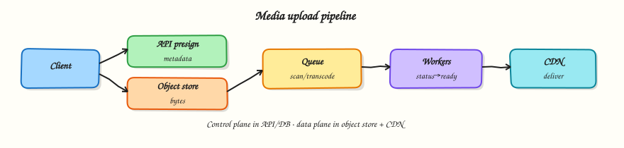

# File / media upload

## Overview

Uploading photos and videos through your API servers wastes bandwidth and couples you to file size limits. Modern designs use **direct uploads to object storage**, metadata in your database, and **async pipelines** for scan/transcode, then CDN delivery.



## Prerequisites

- [News feed / timeline](news-feed.md)
- [Data storage](data-storage.md)

## Learning Objectives

By the end of this tutorial, you will be able to:

- [ ] Explain why bytes bypass the app tier  
- [ ] Design presigned/direct upload + metadata records  
- [ ] Sketch virus scan / transcode as async stages  
- [ ] Serve media via CDN with correct cache headers  
- [ ] Implement a toy presign → upload → process pipeline in Python  

## Requirements sketch

### Functional (v1)

| ID | Requirement |
|----|-------------|
| F1 | User requests upload permission for a content type/size |
| F2 | Client uploads bytes to object storage |
| F3 | System confirms upload and stores metadata |
| F4 | Async processing: validate/scan; optional thumbnails |
| F5 | Client reads media via CDN URL when ready |

### Non-functional

- Support multi-100 MB videos without exhausting API RAM  
- Processing may take minutes — UI polls or gets a webhook/event  
- Private objects by default; signed or CDN-auth URLs for read  

## Theory

### Anti-pattern: `POST /upload` through app servers

Problems:

- Double bandwidth (client→app→storage)  
- Sticky timeouts and memory pressure  
- Hard to scale horizontally for large bodies  

### Direct-to-object-store flow

1. Client → API: “I want to upload `image/jpeg`, 3 MB”  
2. API checks auth/quota; creates `media` row (`pending`); returns **presigned URL** (or upload session)  
3. Client `PUT`s bytes to object storage  
4. Client (or storage event) notifies API: upload complete  
5. API verifies object exists/size/etag; enqueues processing  
6. Workers scan/transcode; mark `ready`; write CDN path  

### Metadata model

```text
media(id, owner_id, status, content_type, size, object_key,
      cdn_url?, created_at, error?)
status: pending | uploaded | processing | ready | rejected
```

Never treat object storage as your only source of truth for ownership and status.

### Multipart and resumable uploads

Large files use multipart upload or resumable protocols so flaky mobile networks can retry parts. The API issues part URLs or a session id; completion assembles the object.

### Processing pipeline

| Stage | Purpose |
|-------|---------|
| Validate | Content-type sniffing, size limits |
| AV scan | Malware |
| Transcode / thumbs | Derivatives for feed/player |
| Promote | Move to public/CDN prefix or attach signed read |

Use a queue (Module 7). Idempotent workers keyed by `media_id`.

### Delivery

- CDN in front of the bucket (or origin shield)  
- Cache-Control for immutable object versions  
- Separate **processing bucket** vs **public bucket** when possible  

### Security

- Short-lived presigned URLs  
- Content-type and max size enforced in the signature policy  
- Do not trust client-declared MIME alone  
- AuthZ on metadata before issuing read URLs for private media  

## Architecture

```text
Client → API (presign + metadata) → DB
Client → Object store (bytes)
Object store / API → Queue → Workers (scan/transcode) → DB status=ready
Client → CDN → Object store (read)
```

## Hands-on Lab

### Objective

Model presign, “upload”, and async processing with status transitions — without real S3.

### Lab environment

Local Python 3.10+.

### Real-world scenario

Product wants avatar uploads. You prove the state machine before wiring cloud SDKs.

### Step-by-step tasks

#### 1. Workspace

``` {.bash .ra-terminal title="Terminal"}
mkdir -p ~/rebash-system-design/module-12-upload
cd ~/rebash-system-design/module-12-upload
```

#### 2. Upload pipeline

```python title="upload_lab.py"
#!/usr/bin/env python3
"""Direct-upload style media pipeline (in-memory toy)."""

from __future__ import annotations

import hashlib
import queue
import threading
import time
import uuid
from dataclasses import dataclass


@dataclass
class Media:
    media_id: str
    owner: str
    content_type: str
    size: int
    status: str = "pending"
    object_key: str = ""
    cdn_url: str = ""
    error: str = ""


class MediaService:
    def __init__(self) -> None:
        self.media: dict[str, Media] = {}
        self.blob_store: dict[str, bytes] = {}
        self.q: queue.Queue[str] = queue.Queue()
        self._stop = threading.Event()
        self.worker = threading.Thread(target=self._process, daemon=True)
        self.worker.start()

    def presign(self, owner: str, content_type: str, size: int) -> dict:
        if size > 5_000_000:
            raise ValueError("too large")
        if content_type not in {"image/jpeg", "image/png"}:
            raise ValueError("unsupported type")
        mid = uuid.uuid4().hex[:12]
        key = f"uploads/{owner}/{mid}"
        m = Media(media_id=mid, owner=owner, content_type=content_type, size=size, object_key=key)
        self.media[mid] = m
        # toy "presigned" token
        token = hashlib.sha256(f"{mid}:{key}".encode()).hexdigest()[:16]
        return {"media_id": mid, "upload_token": token, "object_key": key}

    def client_upload(self, media_id: str, token: str, data: bytes) -> None:
        m = self.media[media_id]
        expect = hashlib.sha256(f"{media_id}:{m.object_key}".encode()).hexdigest()[:16]
        if token != expect:
            raise PermissionError("bad token")
        if len(data) != m.size:
            raise ValueError("size mismatch")
        self.blob_store[m.object_key] = data
        m.status = "uploaded"
        self.q.put(media_id)

    def _process(self) -> None:
        while not self._stop.is_set():
            try:
                mid = self.q.get(timeout=0.05)
            except queue.Empty:
                continue
            m = self.media[mid]
            m.status = "processing"
            raw = self.blob_store.get(m.object_key, b"")
            # reject "malware" marker
            if raw.startswith(b"MALWARE"):
                m.status = "rejected"
                m.error = "failed_scan"
            else:
                m.cdn_url = f"https://cdn.example/{m.object_key}"
                m.status = "ready"
            self.q.task_done()

    def wait_ready(self, media_id: str, timeout: float = 1.0) -> Media:
        deadline = time.time() + timeout
        while time.time() < deadline:
            m = self.media[media_id]
            if m.status in {"ready", "rejected"}:
                return m
            time.sleep(0.01)
        raise TimeoutError("processing slow")

    def close(self) -> None:
        self.q.join()
        self._stop.set()
        self.worker.join(timeout=1)


def main() -> None:
    svc = MediaService()
    meta = svc.presign("user1", "image/jpeg", 4)
    svc.client_upload(meta["media_id"], meta["upload_token"], b"\xff\xd8\xff\x00")
    ready = svc.wait_ready(meta["media_id"])

    bad = svc.presign("user1", "image/png", 10)
    svc.client_upload(bad["media_id"], bad["upload_token"], b"MALWAREXYZ")
    rejected = svc.wait_ready(bad["media_id"])
    svc.close()

    lines = [
        f"ready_status={ready.status}",
        f"cdn_url_set={'yes' if ready.cdn_url else 'no'}",
        f"rejected_status={rejected.status}",
        f"rejected_error={rejected.error}",
        f"objects_stored={len(svc.blob_store)}",
        f"pipeline_ok={'yes' if ready.status == 'ready' and rejected.status == 'rejected' else 'no'}",
    ]
    report = "\n".join(lines) + "\n"
    print(report, end="")
    open("upload-report.txt", "w", encoding="utf-8").write(report)


if __name__ == "__main__":
    main()
```

#### 3. Run and verify

``` {.bash .ra-terminal title="Terminal"}
cd ~/rebash-system-design/module-12-upload
python3 upload_lab.py | tee upload-run.txt
grep pipeline_ok upload-report.txt
```

!!! example "Expected output"
    `pipeline_ok=yes`, one `ready` and one `rejected`.

### Validation steps

- [ ] Presign creates `pending` media  
- [ ] Upload moves to processing then ready/rejected  
- [ ] Bad content does not get a usable “ready” happy path  

### Challenge exercise

Add multipart: accept two parts, concatenate in the blob store, then enqueue process once.

### Cleanup

``` {.bash .ra-terminal title="Terminal"}
cd ~/rebash-system-design/module-12-upload
rm -f upload-run.txt upload-report.txt 2>/dev/null || true
```

## Interview Questions

**1. Why upload directly to object storage?**

??? success "Reveal answer"
    Large bodies should not transit API servers — it doubles bandwidth, creates timeouts, and couples scale to file size. Presigned URLs let clients write to the store while the API retains authz and metadata control.

**2. What belongs in the database vs the bucket?**

??? success "Reveal answer"
    Database: ownership, status, content-type, keys, audit. Bucket: opaque bytes and derivatives. Status in DB drives the product UI; the bucket alone cannot express “processing” or “rejected” well.

**3. How do you handle virus scanning?**

??? success "Reveal answer"
    Keep objects private until scanned. Async workers pull new objects, scan, then mark ready or quarantine/reject. Never serve `pending`/`uploaded` as public CDN content.

**4. How does the client know processing finished?**

??? success "Reveal answer"
    Poll `GET /media/{id}`, subscribe to a websocket/event, or receive a webhook. Use timeouts and clear terminal states (`ready` / `rejected`).

## Common Mistakes

!!! warning "Serving unscanned uploads from a public bucket"
    Attackers will host malware on your domain.

!!! warning "Trusting `Content-Type` from the client alone"
    Sniff and validate; bound size in the presign policy.

## Summary

Media systems separate **control plane** (API + metadata) from **data plane** (object store + CDN) and push heavy work to **async pipelines**.

## What's Next

[Search / autocomplete](search-and-autocomplete.md) — indexing, inverted indexes, and prefix suggest under latency budgets.
