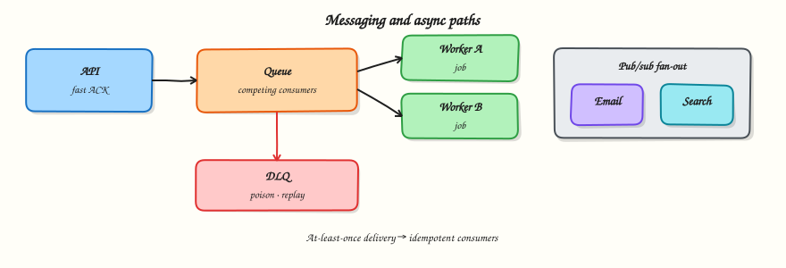

# Messaging and async

## Overview

Not every action should finish inside one HTTP request. Email, click analytics, image processing, and fan-out notifications belong on an **async** path: accept work quickly, process it reliably elsewhere.

This tutorial covers queues vs pub/sub, delivery guarantees, idempotency, retries, and backpressure — the vocabulary you need before naming Kafka in an interview.



## Prerequisites

- [Caching](caching.md)
- Comfortable with threads or the idea of background workers in Python

## Learning Objectives

By the end of this tutorial, you will be able to:

- [ ] Decide sync vs async for a feature with an explicit latency trade-off  
- [ ] Contrast queue (competing consumers) and pub/sub (fan-out)  
- [ ] Explain at-least-once delivery and why consumers must be idempotent  
- [ ] Sketch retry, dead-letter, and backpressure behaviour  
- [ ] Implement a tiny in-process queue + worker with duplicate-safe handling  

## Theory

### When to go async

Prefer async when:

- Work is slow or spiky (video, PDF, ML inference)  
- The user does not need the result in the same response  
- Multiple downstream systems must react (email + analytics + search index)  
- You need to absorb bursts without failing the API  

Keep sync when:

- The user is blocked on the result (checkout confirmation identity)  
- Strong immediate consistency is required and lag is unacceptable  
- Failure must be visible to the caller immediately  

Template:

> We enqueue **X** after commit because **user latency** matters. We accept **eventual side effects** and mitigate with **retries + idempotency keys**.

### Queue vs pub/sub

| Pattern | Semantics | Typical use |
|---------|-----------|-------------|
| **Queue** | Each message consumed by **one** worker | Jobs, retries, work distribution |
| **Pub/sub** | Each message delivered to **many** subscribers | Fan-out events (“order.placed”) |

Many brokers offer both shapes. Design by **who must see the message**, not by brand name.

### Delivery guarantees (practical)

| Guarantee | Meaning | Design cost |
|-----------|---------|-------------|
| At-most-once | May lose messages | Rarely acceptable for money/email |
| At-least-once | May duplicate | **Default** — consumers must be idempotent |
| Exactly-once | Effectively once | Hard; often “at-least-once + idempotent write” |

In interviews, saying “exactly-once Kafka” without describing the consumer side is incomplete. Focus on **exactly-once effect** in your datastore.

### Idempotency

An **idempotent** handler can process the same message twice without corrupting state.

Techniques:

- Idempotency key stored before side effect (`processed_events` table)  
- Natural keys (`INSERT … ON CONFLICT DO NOTHING`)  
- Upserts with version checks  

Without this, retries become double charges and double emails.

### Retries, backoff, dead letters

Failed processing should:

1. Retry with **backoff** (and jitter)  
2. Stop after N attempts  
3. Land in a **dead-letter queue (DLQ)** for humans/tools  

Poison messages (permanently bad payloads) must not block the whole queue.

### Ordering and partitions

Global total order is expensive. Prefer:

- Order **per key** (user_id, order_id) via partitions  
- Designs that tolerate reordering where possible  

### Backpressure

When consumers are slower than producers:

- Bound queue depth  
- Slow or reject producers (HTTP 429 / load shed)  
- Scale consumers  
- Drop or sample only if the business allows (metrics, not payments)

Unbounded queues turn outages into multi-hour catch-up disasters.

### Outbox pattern (brief)

If you write DB state and publish an event, do it safely:

1. Write business row + outbox row in **one transaction**  
2. A publisher drains the outbox to the broker  

Avoid “commit DB then publish” without a recovery story — the process can die between steps.

## Architecture

Click analytics example:

```text
Redirect API → enqueue click event → ACK redirect to user
                      ↓
                 workers update counters / warehouse
```

The user path stays thin; analytics lag is acceptable.

## Hands-on Lab

### Objective

Build an in-process queue where workers process jobs at-least-once style, and duplicates are ignored via an idempotency set.

### Lab environment

Local Python 3.10+.

### Real-world scenario

Your shortener must record clicks without slowing redirects. You prototype a worker that can safely handle redelivered messages.

### Step-by-step tasks

#### 1. Workspace

``` {.bash .ra-terminal title="Terminal"}
mkdir -p ~/rebash-system-design/module-07-messaging
cd ~/rebash-system-design/module-07-messaging
```

#### 2. Queue + idempotent worker

```python title="messaging_lab.py"
#!/usr/bin/env python3
"""In-process queue with at-least-once redelivery and idempotent consumers."""

from __future__ import annotations

import queue
import threading
import time
from dataclasses import dataclass


@dataclass
class Message:
    id: str
    code: str


class ClickCounter:
    def __init__(self) -> None:
        self.counts: dict[str, int] = {}
        self.processed: set[str] = set()
        self.lock = threading.Lock()

    def handle(self, msg: Message) -> None:
        with self.lock:
            if msg.id in self.processed:
                return  # duplicate delivery
            self.counts[msg.code] = self.counts.get(msg.code, 0) + 1
            self.processed.add(msg.id)


def worker(q: queue.Queue, counter: ClickCounter, stop: threading.Event) -> None:
    while not stop.is_set() or not q.empty():
        try:
            msg = q.get(timeout=0.05)
        except queue.Empty:
            continue
        try:
            counter.handle(msg)
        finally:
            q.task_done()


def main() -> None:
    q: queue.Queue = queue.Queue()
    counter = ClickCounter()
    stop = threading.Event()
    threads = [threading.Thread(target=worker, args=(q, counter, stop)) for _ in range(3)]
    for t in threads:
        t.start()

    # enqueue unique clicks
    for i in range(100):
        q.put(Message(id=f"evt-{i}", code="abc"))

    # simulate at-least-once redelivery of 10 messages
    for i in range(10):
        q.put(Message(id=f"evt-{i}", code="abc"))

    q.join()
    stop.set()
    for t in threads:
        t.join()

    lines = [
        f"unique_events_intended=100",
        f"messages_enqueued=110",
        f"click_count_abc={counter.counts.get('abc', 0)}",
        f"idempotent={'yes' if counter.counts.get('abc') == 100 else 'no'}",
        f"processed_ids={len(counter.processed)}",
    ]
    report = "\n".join(lines) + "\n"
    print(report, end="")
    open("messaging-report.txt", "w", encoding="utf-8").write(report)


if __name__ == "__main__":
    main()
```

#### 3. Run and verify

``` {.bash .ra-terminal title="Terminal"}
cd ~/rebash-system-design/module-07-messaging
python3 messaging_lab.py | tee messaging-run.txt
grep idempotent messaging-report.txt
```

!!! example "Expected output"
    `click_count_abc=100` and `idempotent=yes` even though 110 messages were enqueued.

### Validation steps

- [ ] Report shows idempotent handling of redeliveries  
- [ ] You can explain why `processed` must be durable in production  

### Common errors and fixes

| Error | Cause | Fix |
|-------|-------|-----|
| Count 110 | Missing idempotency check | Gate on `msg.id` before increment |
| Hang on `q.join` | Worker not calling `task_done` | Always `task_done` in `finally` |

### Challenge exercise

Add a failing handler for one message ID that retries three times then records it in a `dlq` list.

### Learning outcomes

- At-least-once needs idempotent consumers  
- Queues decouple user latency from slow work  
- Redelivery is normal, not exceptional  

### Cleanup

``` {.bash .ra-terminal title="Terminal"}
cd ~/rebash-system-design/module-07-messaging
rm -f messaging-run.txt messaging-report.txt 2>/dev/null || true
```

## Validation

- [ ] You can justify async for a named feature  
- [ ] You can draw queue vs pub/sub correctly  
- [ ] You mention DLQ and idempotency in the design  

## Interview Questions

**1. Queue vs pub/sub — how do you choose?**

??? success "Reveal answer"
    Use a queue when one worker should process each job. Use pub/sub when multiple independent consumers must react to the same event. Many systems combine both (event bus + per-team queues).

**2. Why is at-least-once the common default?**

??? success "Reveal answer"
    Brokers and clients retry to avoid silent loss. Duplicates are easier to handle with idempotency than silent data loss is to detect. Exactly-once end-to-end is expensive and still needs careful consumer design.

**3. What is a dead-letter queue for?**

??? success "Reveal answer"
    Messages that repeatedly fail (bad payload, bug, dependency outage) are moved aside so they stop blocking the main queue and can be inspected or replayed later.

**4. How does the outbox pattern help?**

??? success "Reveal answer"
    It records the intent to publish in the same database transaction as the business write, then a publisher drains those rows. That avoids “DB committed but event never sent” gaps.

**5. What is backpressure?**

??? success "Reveal answer"
    A way for a slow consumer path to signal upstream to slow down, bound buffers, or shed load — preventing unbounded queues and cascading memory/latency failure.

## Common Mistakes

!!! warning "Calling Kafka a database"
    Logs/streams are not your system of record unless you deliberately design for that. Persist business state in a store you can query and back up.

!!! warning "Retrying forever without backoff"
    Tight retry loops amplify outages and melt dependencies.

!!! warning "Ignoring poison messages"
    One bad message can stall a partition if you lack DLQ/skip policies.

## Best Practices

- Make async boundaries explicit in the API contract  
- Require idempotency keys for side-effecting consumers  
- Bound retries; use DLQs  
- Monitor lag, age, and error rate — not only throughput  
- Prefer per-key ordering over global ordering  

## Summary

Messaging lets you trade immediate consistency for latency, scale, and fan-out. Design delivery, idempotency, retries, and backpressure before you pick a broker logo.

## What's Next

[APIs and communication](apis-and-communication.md) — synchronous contracts, versioning, and timeouts that keep services civil.
