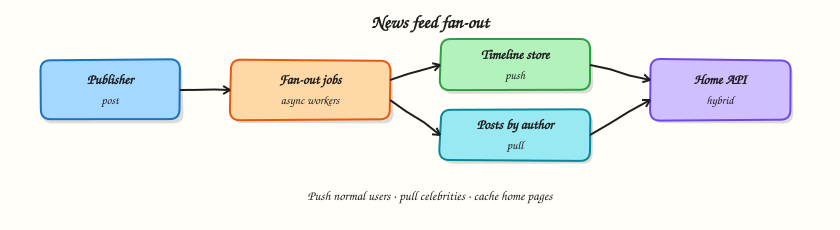

# News feed / timeline

## Overview

A **news feed** shows posts from people you follow, roughly newest-first (or ranked). The classic tension is **fan-out**: when someone posts, do you push that post into every follower’s timeline, or pull from followees when they open the app?



## Prerequisites

- [URL shortener](url-shortener.md)
- [Messaging and async](messaging-and-async.md)

## Learning Objectives

By the end of this tutorial, you will be able to:

- [ ] State feed requirements and the celebrity/hot-key problem  
- [ ] Compare fan-out on write, fan-out on read, and hybrid  
- [ ] Sketch storage for posts, graphs, and timelines  
- [ ] Place cache and async ranking workers  
- [ ] Implement push vs pull timeline generation in Python  

## Requirements sketch

### Functional (v1)

| ID | Requirement |
|----|-------------|
| F1 | Publish a post |
| F2 | Follow / unfollow a user |
| F3 | Home timeline: posts from followees |
| F4 | Pagination (cursor) |

### Non-functional

- Home timeline p95 under a few hundred ms  
- Publish should not wait for millions of fan-outs synchronously  
- Eventual consistency of “see post within N seconds” is OK  

## Theory

### Entities

- `users`  
- `follows(follower_id, followee_id)`  
- `posts(post_id, author_id, body, created_at)`  
- optional `timeline(user_id, post_id, created_at)` for push model  

### Fan-out on write (push)

On publish:

1. Persist post  
2. For each follower, insert into their timeline store (or enqueue fan-out jobs)  

**Pros:** Home read is a fast range query.  
**Cons:** Celebrities with 10M followers create write storms; slow publish path if sync.

### Fan-out on read (pull)

On home open:

1. Load followee IDs  
2. Fetch recent posts per followee (or merge from a posts index)  
3. Merge-sort by time / rank  

**Pros:** Publish is cheap.  
**Cons:** Home read is heavier; cache aggressively.

### Hybrid (common in interviews)

- Push for normal users  
- Pull for celebrities / high-follower accounts  
- Or: push to online users’ caches; pull for cold users  

### Ranking

v1: chronological. Later: ranking service with signals (affinity, recency, media). Keep ranking **async** and cached; do not block publish on ML.

### Caching

- Cache home timeline pages per user (short TTL + invalidate on publish for that user if push)  
- Cache “recent posts by author” for pull merges  

### Celebrity problem

Never fan-out synchronously to millions. Use:

- Worker pools + rate limits  
- Skip push for mega-users; mark them pull-only  
- Shard timeline partitions by user_id  

## Architecture

```text
Publish → Post API → DB
                └─ enqueue fan-out → workers → timeline store (normal users)

Home → Feed API → timeline store (push)  OR  merge followee posts (pull/hybrid)
```

## Hands-on Lab

### Objective

Compare push vs pull: measure publish cost vs home-read cost on a tiny social graph.

### Lab environment

Local Python 3.10+.

### Real-world scenario

A designer asks why “just insert into every follower’s feed” is hard. You show numbers on a toy graph with one celebrity.

### Step-by-step tasks

#### 1. Workspace

``` {.bash .ra-terminal title="Terminal"}
mkdir -p ~/rebash-system-design/module-11-feed
cd ~/rebash-system-design/module-11-feed
```

#### 2. Push vs pull

```python title="feed_lab.py"
#!/usr/bin/env python3
"""Fan-out on write vs fan-out on read (toy model)."""

from __future__ import annotations

import time
from dataclasses import dataclass, field


@dataclass
class Post:
    post_id: int
    author: str
    body: str
    created_at: float


@dataclass
class SocialGraph:
    follows: dict[str, set[str]] = field(default_factory=dict)  # follower -> followees
    followers: dict[str, set[str]] = field(default_factory=dict)  # followee -> followers

    def follow(self, follower: str, followee: str) -> None:
        self.follows.setdefault(follower, set()).add(followee)
        self.followers.setdefault(followee, set()).add(follower)


class PushFeed:
    def __init__(self) -> None:
        self.posts: dict[int, Post] = {}
        self.timelines: dict[str, list[int]] = {}
        self.fanout_writes = 0

    def publish(self, post: Post, followers: set[str]) -> None:
        self.posts[post.post_id] = post
        for uid in followers:
            self.timelines.setdefault(uid, []).insert(0, post.post_id)
            self.fanout_writes += 1

    def home(self, user: str, limit: int = 20) -> list[Post]:
        ids = self.timelines.get(user, [])[:limit]
        return [self.posts[i] for i in ids]


class PullFeed:
    def __init__(self) -> None:
        self.by_author: dict[str, list[Post]] = {}
        self.merge_reads = 0

    def publish(self, post: Post) -> None:
        self.by_author.setdefault(post.author, []).insert(0, post)

    def home(self, user: str, followees: set[str], limit: int = 20) -> list[Post]:
        merged: list[Post] = []
        for a in followees:
            posts = self.by_author.get(a, [])[:limit]
            self.merge_reads += 1
            merged.extend(posts)
        merged.sort(key=lambda p: p.created_at, reverse=True)
        return merged[:limit]


def main() -> None:
    g = SocialGraph()
    # 200 normal followers of alice; bob is celebrity with 5000 followers
    for i in range(200):
        g.follow(f"u{i}", "alice")
    for i in range(5000):
        g.follow(f"c{i}", "bob")

    push = PushFeed()
    pull = PullFeed()
    now = time.time()

    t0 = time.perf_counter()
    push.publish(Post(1, "alice", "hi", now), g.followers["alice"])
    alice_push_ms = (time.perf_counter() - t0) * 1000

    t0 = time.perf_counter()
    push.publish(Post(2, "bob", "hola", now + 1), g.followers["bob"])
    bob_push_ms = (time.perf_counter() - t0) * 1000

    t0 = time.perf_counter()
    pull.publish(Post(1, "alice", "hi", now))
    pull.publish(Post(2, "bob", "hola", now + 1))
    pull_publish_ms = (time.perf_counter() - t0) * 1000

    t0 = time.perf_counter()
    home_push = push.home("u0")
    push_home_ms = (time.perf_counter() - t0) * 1000

    t0 = time.perf_counter()
    home_pull = pull.home("c0", g.follows["c0"])
    pull_home_ms = (time.perf_counter() - t0) * 1000

    lines = [
        f"alice_followers={len(g.followers['alice'])}",
        f"bob_followers={len(g.followers['bob'])}",
        f"alice_push_ms={alice_push_ms:.3f}",
        f"bob_push_ms={bob_push_ms:.3f}",
        f"pull_publish_ms={pull_publish_ms:.3f}",
        f"push_home_ms={push_home_ms:.3f}",
        f"pull_home_ms={pull_home_ms:.3f}",
        f"push_fanout_writes={push.fanout_writes}",
        f"home_push_items={len(home_push)}",
        f"home_pull_items={len(home_pull)}",
        f"celebrity_push_costly={'yes' if bob_push_ms > alice_push_ms * 5 else 'no'}",
    ]
    report = "\n".join(lines) + "\n"
    print(report, end="")
    open("feed-report.txt", "w", encoding="utf-8").write(report)


if __name__ == "__main__":
    main()
```

#### 3. Run and verify

``` {.bash .ra-terminal title="Terminal"}
cd ~/rebash-system-design/module-11-feed
python3 feed_lab.py | tee feed-run.txt
grep celebrity_push_costly feed-report.txt
```

!!! example "Expected output"
    `celebrity_push_costly=yes` and `bob_push_ms` much larger than `alice_push_ms`.

### Validation steps

- [ ] Celebrity push does far more fan-out writes  
- [ ] Pull publish stays cheap  
- [ ] Home returns items in both models  

### Challenge exercise

Implement hybrid: skip push when `len(followers) > 1000`; those readers use pull.

### Cleanup

``` {.bash .ra-terminal title="Terminal"}
cd ~/rebash-system-design/module-11-feed
rm -f feed-run.txt feed-report.txt 2>/dev/null || true
```

## Interview Questions

**1. Fan-out on write vs read — when do you pick each?**

??? success "Reveal answer"
    Push (write) makes home reads fast and suits normal follower counts. Pull (read) makes publish cheap and suits celebrities or sparse reading. Hybrids are common: push for normal users, pull for mega-followees.

**2. What is the celebrity problem?**

??? success "Reveal answer"
    A user with millions of followers turns one publish into millions of timeline writes, creating latency and hot partitions. Mitigate with async workers, pull-only for celebrities, and sharding.

**3. How do you paginate a feed?**

??? success "Reveal answer"
    Cursor on `(created_at, post_id)` (or rank score + id). Avoid large OFFSETs. Cursors must remain stable enough under new inserts — document behaviour.

**4. Where does ranking fit?**

??? success "Reveal answer"
    Usually after candidate retrieval: fetch candidates (timeline or merge), score async or in a ranker, cache ranked pages. Do not block publish on model inference.

## Common Mistakes

!!! warning "Synchronous fan-out to all followers in the publish API"
    Publish p99 becomes hostage to the largest follower set.

!!! warning "No hybrid plan for celebrities"
    Interviewers expect you to name the problem and a mitigation.

## Summary

Feeds are a **fan-out and caching** problem. Choose push, pull, or hybrid from follower distributions and read/write ratios — then protect publish from celebrities.

## What's Next

[File / media upload](media-upload.md) — direct-to-object-store uploads, processing pipelines, and CDN delivery.
