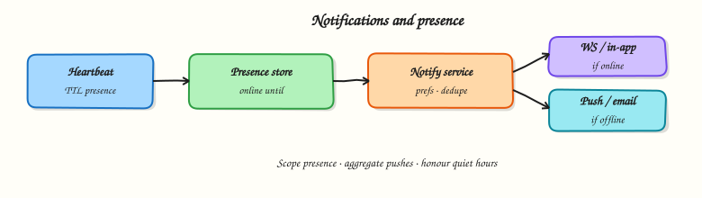

# Notifications and presence

## Overview

**Presence** answers “who is online / typing?” **Notifications** answer “what should we tell the user?” across in-app, push, email, or SMS. Both are high-fan-out and easy to get wrong on cost, privacy, and spam.



## Prerequisites

- [Realtime chat](realtime-chat.md)

## Learning Objectives

By the end of this tutorial, you will be able to:

- [ ] Design presence with heartbeats and TTLs  
- [ ] Route notifications by channel preference and online state  
- [ ] Avoid notification storms with aggregation and rate limits  
- [ ] Separate urgent vs deferrable delivery  
- [ ] Implement presence + notify routing in Python  

## Requirements sketch

| ID | Requirement |
|----|-------------|
| P1 | Show online/away/offline with short lag |
| P2 | Optional typing indicator in a room |
| N1 | In-app notification when online |
| N2 | Mobile push when offline (if enabled) |
| N3 | User preferences / quiet hours |

## Theory

### Presence model

Store `user_id → {status, last_seen, device_ids}`.

- Client sends **heartbeats** on the WS every N seconds  
- Server sets a **TTL**; missing heartbeats → offline  
- Broadcast presence changes on a pub/sub channel to interested watchers (friends, room members) — not the whole world  

### Typing indicators

Ephemeral events with short TTL; do not persist. Rate-limit per user/room. Drop under load before dropping chat messages.

### Notification pipeline

```text
Event (mention, DM, like)
  → Notification service (prefs, dedupe, aggregate)
  → Channel routers: in-app WS / push / email
  → Delivery logs + unread counters
```

### Online-aware routing

| State | Typical routing |
|-------|-----------------|
| Online in-app | WS / in-app inbox only |
| Background mobile | Push (APNs/FCM) |
| Quiet hours | Suppress or silent |
| Unsubscribed channel | Skip |

### Aggregation

“Alice and 12 others liked your post” beats 13 pushes. Aggregate windows (e.g. 2 minutes) cut cost and annoyance.

### Idempotency and dedupe

Use `notification_id` / event key so retries do not double-push. Collapse identical unread items in the inbox.

### Scale and privacy

- Presence subscriptions are graph-scoped  
- Do not leak “last seen” if the product promises privacy modes  
- Push payloads should minimise sensitive body text  

## Architecture

```text
WS Gateway → Presence service (heartbeat TTL store)
Events → Notification service → WS (online)
                              → Push provider (offline)
                              → Email worker (digest)
```

## Hands-on Lab

### Objective

Model presence with TTL expiry and a notifier that chooses `ws` vs `push` based on online state and preferences.

### Lab environment

Local Python 3.10+.

### Real-world scenario

Product wants “push only if they’re not looking at the app.” You prototype the decision table.

### Step-by-step tasks

#### 1. Workspace

``` {.bash .ra-terminal title="Terminal"}
mkdir -p ~/rebash-system-design/module-15-presence
cd ~/rebash-system-design/module-15-presence
```

#### 2. Presence + notify

```python title="presence_lab.py"
#!/usr/bin/env python3
"""Presence TTL + notification channel routing."""

from __future__ import annotations

import time
from dataclasses import dataclass, field


@dataclass
class Presence:
    online_until: dict[str, float] = field(default_factory=dict)

    def heartbeat(self, user: str, ttl: float = 0.2, now: float | None = None) -> None:
        now = time.time() if now is None else now
        self.online_until[user] = now + ttl

    def is_online(self, user: str, now: float | None = None) -> bool:
        now = time.time() if now is None else now
        return self.online_until.get(user, 0) > now


@dataclass
class Notifier:
    presence: Presence
    prefs: dict[str, dict]
    sent: list[tuple[str, str, str]] = field(default_factory=list)

    def notify(self, user: str, kind: str, body: str, now: float | None = None) -> str:
        pref = self.prefs.get(user, {"push": True, "quiet": False})
        if pref.get("quiet"):
            channel = "suppressed"
        elif self.presence.is_online(user, now=now):
            channel = "ws"
        elif pref.get("push", True):
            channel = "push"
        else:
            channel = "inbox_only"
        self.sent.append((user, channel, kind))
        return channel


def main() -> None:
    presence = Presence()
    prefs = {
        "alice": {"push": True, "quiet": False},
        "bob": {"push": True, "quiet": False},
        "cara": {"push": False, "quiet": False},
        "dan": {"push": True, "quiet": True},
    }
    n = Notifier(presence, prefs)
    t0 = time.time()
    presence.heartbeat("alice", ttl=1.0, now=t0)
    # bob no heartbeat → offline

    c_alice = n.notify("alice", "dm", "hi", now=t0)
    c_bob = n.notify("bob", "dm", "hi", now=t0)
    c_cara = n.notify("cara", "dm", "hi", now=t0)
    c_dan = n.notify("dan", "dm", "hi", now=t0)
    # alice TTL expired
    c_alice_later = n.notify("alice", "dm", "again", now=t0 + 2.0)

    lines = [
        f"alice_online_channel={c_alice}",
        f"bob_offline_channel={c_bob}",
        f"cara_no_push_channel={c_cara}",
        f"dan_quiet_channel={c_dan}",
        f"alice_expired_channel={c_alice_later}",
        f"routing_ok={'yes' if (c_alice, c_bob, c_cara, c_dan, c_alice_later) == ('ws', 'push', 'inbox_only', 'suppressed', 'push') else 'no'}",
    ]
    report = "\n".join(lines) + "\n"
    print(report, end="")
    open("presence-report.txt", "w", encoding="utf-8").write(report)


if __name__ == "__main__":
    main()
```

#### 3. Run and verify

``` {.bash .ra-terminal title="Terminal"}
cd ~/rebash-system-design/module-15-presence
python3 presence_lab.py | tee presence-run.txt
grep routing_ok presence-report.txt
```

!!! example "Expected output"
    `routing_ok=yes`

### Validation steps

- [ ] Online → `ws`  
- [ ] Offline + push enabled → `push`  
- [ ] Quiet hours → `suppressed`  

### Challenge exercise

Aggregate multiple `like` events for the same target within 2 seconds into one notification.

### Cleanup

``` {.bash .ra-terminal title="Terminal"}
cd ~/rebash-system-design/module-15-presence
rm -f presence-run.txt presence-report.txt 2>/dev/null || true
```

## Interview Questions

**1. How do you implement presence efficiently?**

??? success "Reveal answer"
    Heartbeats update a TTL key in a fast store; expiry implies offline. Broadcast changes only to relevant subscribers. Avoid writing every heartbeat to durable OLTP.

**2. When do you send push vs in-app only?**

??? success "Reveal answer"
    Prefer in-app/WS when a live session exists. Use push when the user is offline/background and has opted in. Honour quiet hours and per-channel preferences.

**3. How do you prevent notification spam?**

??? success "Reveal answer"
    Aggregate similar events, rate-limit per user/topic, dedupe by event key, and offer preference controls. Drop ephemeral noise (typing) before durable alerts.

**4. What is the difference between delivery and read?**

??? success "Reveal answer"
    Delivery means the device/inbox received it; read means the user opened it. Track separately for badges and receipts; both need idempotent updates.

## Common Mistakes

!!! warning "Broadcasting every presence change globally"
    Presence traffic can exceed chat traffic. Scope subscriptions.

!!! warning "Pushing every like immediately"
    Aggregate or users disable notifications — and blame your product.

## Summary

Presence is a **TTL heartbeat** problem; notifications are a **preference-aware routing** problem. Keep ephemeral signals cheap and durable alerts respectful.

## What's Next

[Collaborative and streaming patterns](collaborative-streaming.md) — OT/CRDT intuition, live cursors, and stream fan-out.
