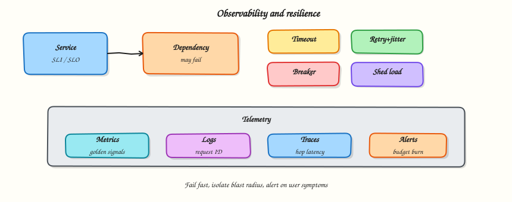

# Observability and resilience

## Overview

Production systems fail in pieces: slow dependencies, bad deploys, traffic spikes. **Observability** tells you what is broken; **resilience** patterns keep the blast radius small while you fix it.

This tutorial closes Part B by connecting SLIs/SLOs to golden signals, traces, and practical resilience tools: timeouts, retries, circuit breakers, bulkheads, and load shedding.



## Prerequisites

- [APIs and communication](apis-and-communication.md)
- [Quality attributes and trade-offs](quality-attributes-and-trade-offs.md)

## Learning Objectives

By the end of this tutorial, you will be able to:

- [ ] Name golden signals and map them to SLIs  
- [ ] Explain metrics vs logs vs traces and when each helps  
- [ ] Apply timeout, retry, and circuit-breaker rules safely  
- [ ] Describe bulkheads and load shedding in a design  
- [ ] Implement exponential backoff + a tiny circuit breaker in Python  

## Theory

### Observability pillars

| Signal | Answers | Watch-outs |
|--------|---------|------------|
| **Metrics** | Is it healthy? How bad? | Cardinality explosions |
| **Logs** | What happened on this request? | Cost, PII, noise |
| **Traces** | Where did time go across services? | Sampling bias |

You need all three eventually; start with **RED/USE or golden signals** on the user path.

### Golden signals (SRE)

For a user-facing service:

1. **Latency** — how long  
2. **Traffic** — how much  
3. **Errors** — how often failing  
4. **Saturation** — how full (CPU, queue depth, connection pools)

Tie at least latency + errors to **SLOs** from Module 2.

### Correlation

Propagate a **request ID / trace ID** from edge → service → workers. Without it, multi-service incidents become archaeology.

### Alerting that humans can survive

Alert on **symptoms** users feel (SLO burn, error rate), not every disk tick. Prefer:

- Multi-window error budget burn rates  
- Runbooks linked from alerts  
- Pages only when human action helps  

### Resilience building blocks

| Pattern | Idea |
|---------|------|
| **Timeout** | Bound waiting; fail fast |
| **Retry + backoff** | Survive blips; add jitter |
| **Circuit breaker** | Stop calling a sick dependency; fail open/closed deliberately |
| **Bulkhead** | Isolate pools so one dependency cannot take all threads |
| **Load shedding** | Reject low-priority work to save critical paths |
| **Graceful degradation** | Serve stale/cached/partial results |

### Circuit breaker states

1. **Closed** — calls flow; failures counted  
2. **Open** — calls fail fast for a cool-down  
3. **Half-open** — trial requests; success closes, failure re-opens  

Use on **downstream** calls (DB, HTTP, gRPC), not as a substitute for fixing the root cause.

### Retries done safely

Retry only when:

- The operation is idempotent or has an idempotency key  
- The error looks transient  
- You still have deadline budget  

Otherwise retries turn one overloaded service into a **retry storm**.

### Chaos and game days (design talk)

Resilience is unverified hope until you practise failure: kill a replica, add latency, expire certs in staging. Mention **failure injection** as part of mature designs.

## Architecture

```text
Client → Service A → (timeouts/breaker) → Service B
                ↘ metrics / traces / logs → observability backend
```

Draw **budgets**: e.g. client 2s, A→B 500ms, leaving room for A’s own work.

## Hands-on Lab

### Objective

Simulate a flaky dependency with exponential backoff retries, then wrap it in a circuit breaker that opens after repeated failures.

### Lab environment

Local Python 3.10+.

### Real-world scenario

Your redirect service calls a metadata API that occasionally times out. Blind retries made an outage worse. You prototype backoff + breaker behaviour before changing production config.

### Step-by-step tasks

#### 1. Workspace

``` {.bash .ra-terminal title="Terminal"}
mkdir -p ~/rebash-system-design/module-09-resilience
cd ~/rebash-system-design/module-09-resilience
```

#### 2. Backoff and circuit breaker

```python title="resilience_lab.py"
#!/usr/bin/env python3
"""Exponential backoff + simple circuit breaker."""

from __future__ import annotations

import random
import time
from dataclasses import dataclass


class FlakyDependency:
    def __init__(self, fail_times: int = 5) -> None:
        self.fail_times = fail_times
        self.calls = 0

    def call(self) -> str:
        self.calls += 1
        if self.calls <= self.fail_times:
            raise TimeoutError("dependency timeout")
        return "ok"


def retry_with_backoff(fn, attempts: int = 6, base: float = 0.01) -> tuple[str | None, int]:
    tries = 0
    for i in range(attempts):
        tries += 1
        try:
            return fn(), tries
        except TimeoutError:
            sleep = base * (2**i) + random.uniform(0, base)
            time.sleep(sleep)
    return None, tries


@dataclass
class CircuitBreaker:
    failure_threshold: int = 3
    cool_down: float = 0.05
    failures: int = 0
    opened_at: float | None = None
    state: str = "closed"
    rejected: int = 0

    def call(self, fn):
        now = time.time()
        if self.state == "open":
            if self.opened_at is not None and now - self.opened_at >= self.cool_down:
                self.state = "half_open"
            else:
                self.rejected += 1
                raise RuntimeError("circuit_open")

        try:
            result = fn()
        except Exception:
            self.failures += 1
            if self.failures >= self.failure_threshold:
                self.state = "open"
                self.opened_at = time.time()
            raise

        self.failures = 0
        self.state = "closed"
        self.opened_at = None
        return result


def main() -> None:
    dep = FlakyDependency(fail_times=4)
    result, tries = retry_with_backoff(dep.call)
    backoff_ok = result == "ok"

    dep2 = FlakyDependency(fail_times=100)
    breaker = CircuitBreaker(failure_threshold=3, cool_down=0.05)
    open_seen = False
    for _ in range(6):
        try:
            breaker.call(dep2.call)
        except TimeoutError:
            continue
        except RuntimeError as exc:
            if "circuit_open" in str(exc):
                open_seen = True

    # after cool-down, half-open allows a trial — force success path
    time.sleep(0.06)
    dep3 = FlakyDependency(fail_times=0)
    breaker.failures = 0
    recovered = breaker.call(dep3.call) == "ok"

    lines = [
        f"backoff_success={'yes' if backoff_ok else 'no'}",
        f"backoff_tries={tries}",
        f"circuit_opened={'yes' if open_seen else 'no'}",
        f"rejected_while_open={breaker.rejected}",
        f"recovered_after_cooldown={'yes' if recovered else 'no'}",
        f"final_state={breaker.state}",
    ]
    report = "\n".join(lines) + "\n"
    print(report, end="")
    open("resilience-report.txt", "w", encoding="utf-8").write(report)


if __name__ == "__main__":
    main()
```

#### 3. Run and verify

``` {.bash .ra-terminal title="Terminal"}
cd ~/rebash-system-design/module-09-resilience
python3 resilience_lab.py | tee resilience-run.txt
grep -E 'backoff_success|circuit_opened|recovered' resilience-report.txt
```

!!! example "Expected output"
    `backoff_success=yes`, `circuit_opened=yes`, `recovered_after_cooldown=yes`.

### Validation steps

- [ ] Backoff eventually succeeds against temporary failures  
- [ ] Breaker rejects calls while open  
- [ ] Cool-down allows recovery  

### Common errors and fixes

| Error | Cause | Fix |
|-------|-------|-----|
| `circuit_opened=no` | Threshold too high / too few calls | Lower threshold or add iterations |
| No recovery | Cool-down not elapsed | `sleep` ≥ `cool_down` |

### Challenge exercise

Add a bulkhead: two thread pools (critical vs best-effort) and show best-effort exhaustion does not block critical calls.

### Learning outcomes

- Retries need backoff and budgets  
- Circuit breakers protect callers from sick dependencies  
- Resilience patterns are measurable behaviours, not slogans  

### Cleanup

``` {.bash .ra-terminal title="Terminal"}
cd ~/rebash-system-design/module-09-resilience
rm -f resilience-run.txt resilience-report.txt 2>/dev/null || true
```

## Validation

- [ ] You can list golden signals for your service  
- [ ] You can place timeouts on a sequence diagram  
- [ ] You can explain when *not* to retry  

## Interview Questions

**1. Metrics vs logs vs traces — when do you use each?**

??? success "Reveal answer"
    Metrics for health and SLOs over time; logs for detailed event context on a request; traces to see latency across service hops. Use them together with a shared request/trace ID.

**2. What is a circuit breaker?**

??? success "Reveal answer"
    A wrapper that stops calling a failing dependency after a threshold, fails fast for a cool-down, then probes with half-open calls. It protects thread pools and reduces cascading load.

**3. Why is retry without backoff dangerous?**

??? success "Reveal answer"
    Synchronised clients retry immediately and amplify load on an already sick service (retry storm). Backoff, jitter, and idempotency limits are required.

**4. What is load shedding?**

??? success "Reveal answer"
    Deliberately rejecting or degrading lower-priority work (or excess traffic) so critical paths stay within SLO when the system is saturated.

**5. How do SLOs connect to resilience design?**

??? success "Reveal answer"
    SLOs define what “good” means; resilience patterns (timeouts, shedding, degradation) are how you stay inside the error budget when dependencies fail. Alerts should track budget burn, not vanity metrics alone.

## Common Mistakes

!!! warning "Paging on every 5xx spike without a runbook"
    Alerts without action create fatigue. Symptom + owner + doc.

!!! warning "Infinite retries across the mesh"
    Each hop retries → combinatorial explosion. Prefer bounded retries at the edge or a single responsible layer.

!!! warning "Observability without request IDs"
    You will not stitch user pain to a root cause under pressure.

## Best Practices

- Propagate trace/request IDs everywhere  
- Budget timeouts end-to-end  
- Retry only idempotent/transient paths  
- Isolate pools (bulkheads) per dependency  
- Practise failure in staging  

## Summary

Part B ends where production begins: measure what users feel, and design for partial failure. Observability without resilience is sightseeing; resilience without observability is superstition.

## What's Next

[URL shortener](url-shortener.md) — first Part C case study: create, redirect, cache, and async analytics.
