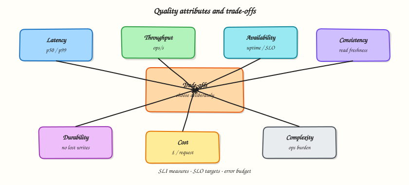

# Quality attributes and trade-offs

## Overview

Every architecture is a set of **compromises**. If someone promises low latency, strong consistency, huge scale, tiny cost, and simple operations — all at once — they are selling fiction.

This tutorial teaches the main **quality attributes** (also called non-functional qualities) and how to talk about **trade-offs** like an engineer: pick what matters, measure it, and say what you are willing to sacrifice.



## Prerequisites

- [How to design a system](how-to-design-a-system.md)

## Learning Objectives

By the end of this tutorial, you will be able to:

- [ ] Define latency, throughput, availability, consistency, durability, and cost in plain language  
- [ ] Convert vague goals into SLI/SLO-style targets  
- [ ] Explain CAP/PACELC without memorising slogans wrongly  
- [ ] Write a trade-off table for a real feature decision  
- [ ] Compute simple availability and percentile examples in Python  

## Theory

### What is a quality attribute?

A **quality attribute** describes *how* the system behaves, not *which button* it has.

| Attribute | Question it answers |
|-----------|---------------------|
| Latency | How long does one operation take? |
| Throughput | How much work per second/minute? |
| Availability | How often can users succeed when they try? |
| Consistency | Do different readers agree on the data? |
| Durability | Once we say “saved,” can it vanish? |
| Scalability | How does behaviour change as load grows? |
| Security | Who can do what; what is protected? |
| Operability | Can humans run, debug, and change it safely? |
| Cost | What do we pay in money and complexity? |

Functional features without quality targets produce systems that “work in the demo” and fail in production.

### Latency — time for one request

**Latency** is the time from request start to useful response.

- **p50 (median):** half of requests are faster  
- **p95 / p99:** the slow tail users still feel  
- **Average:** easy to compute, easy to lie with (one slow call warms the average)

Example: checkout p95 of 2 seconds means **5% of checkouts** are worse than 2 seconds — enough to hurt conversion.

Sources of latency: network hops, locks, cold caches, garbage collection, disk, retries.

Design habit: state **which percentile** and **which endpoint**.

### Throughput — work over time

**Throughput** is completed operations per unit time (requests/s, messages/s, jobs/hour).

High throughput with terrible latency can still feel broken (huge queues). Low latency at tiny throughput may not pay the bills.

Sizing needs both: “230 redirects/s peak” (throughput) and “p95 &lt; 100 ms” (latency).

### Availability — usable when needed

**Availability** ≈ successful time / total time (roughly).

Common targets:

| Target | Downtime / month (approx.) |
|--------|----------------------------|
| 99% | ~7 hours |
| 99.9% | ~43 minutes |
| 99.99% | ~4 minutes |

Availability is not only “servers up.” A site that returns HTTP 500 is **unavailable** to the user even if the process is running.

**Dependencies multiply risk.** If three critical services each have 99.9% availability and a request needs all three, naive combination is worse than 99.9%. Design for partial degradation (cached read-only mode) when you can.

### Consistency — agreement about data

**Consistency** means different readers (or the same reader later) see a coherent view.

Examples:

- After you update a profile photo, do all pages show the new one immediately?  
- After you transfer money, can another read still see the old balance?

Strong consistency is simpler to reason about and often slower or harder to scale. Eventual consistency is faster/cheaper at scale but needs careful product UX (“your photo may take a few seconds”).

### CAP and PACELC (without myth)

**CAP** (informal engineering use): under a **network partition**, you may not have both perfect **consistency** and perfect **availability**. You must choose which to protect for that operation.

People misuse CAP by saying “we picked AP, so we never need consistency.” Real systems choose **per operation**:

- Inventory decrement: prefer consistent  
- Like counter: often eventual  

**PACELC** adds: *else* (no partition), you still trade **latency** vs **consistency**.

Use these as **conversation tools**, not religion.

### Durability

**Durability:** after the system acknowledges a write, that write should survive crashes (within the durability model you promised).

Disk flush, replication, backups, and “ack after quorum” are durability mechanisms. Acking before data is safe is a classic outage pattern.

### Cost and complexity

Every box has:

- **Money cost** (compute, storage, egress, licences)  
- **Human cost** (on-call, cognitive load, deploy risk)

The cheapest architecture that meets NFRs usually wins. Complexity is a quality attribute with interest payments.

### Trade-offs — the core skill

A **trade-off** is an explicit choice: more of A, less of B, for a reason.

Template:

> For **[decision]**, we choose **[option]** because **[primary NFR]**. We accept **[downside]** and mitigate with **[control]**.

Example:

> For redirect analytics, we choose **async click events** because **redirect latency** matters most. We accept **briefly stale counts** and mitigate with **at-least-once delivery + idempotent aggregation**.

### SLI, SLO, SLA (practical view)

| Term | Meaning |
|------|---------|
| **SLI** | Metric you measure (e.g. % of redirects &lt; 100 ms) |
| **SLO** | Target for the SLI (e.g. 99.5% of redirects meet that) |
| **SLA** | Contractual promise (legal/business); usually looser than internal SLO |

Design talks should use SLIs/SLOs even if you never sign an SLA.

## Hands-on Lab

### Objective

Build a tiny Python toolkit that turns quality targets into numbers you can discuss in a design review.

### Lab environment

Local Python 3.10+.

### Real-world scenario

Your team argues: “We need five nines.” Leadership asks what that costs in downtime budget and whether checkout latency SLOs are defined. You bring numbers.

### Step-by-step tasks

#### 1. Workspace

``` {.bash .ra-terminal title="Terminal"}
mkdir -p ~/rebash-system-design/module-02-quality
cd ~/rebash-system-design/module-02-quality
```

#### 2. Availability and percentile helpers

```python title="quality_maths.py"
#!/usr/bin/env python3
from __future__ import annotations

MINUTES_PER_MONTH = 30 * 24 * 60  # approximate month


def downtime_minutes(availability: float, minutes: float = MINUTES_PER_MONTH) -> float:
    """Return allowed downtime minutes for an availability fraction (e.g. 0.999)."""
    if not 0 < availability <= 1:
        raise ValueError("availability must be in (0, 1]")
    return minutes * (1 - availability)


def percentile(sorted_samples: list[float], p: float) -> float:
    """Nearest-rank percentile for a pre-sorted list. p in [0, 100]."""
    if not sorted_samples:
        raise ValueError("empty samples")
    if not 0 <= p <= 100:
        raise ValueError("p must be in [0, 100]")
    k = max(1, int(round(p / 100 * len(sorted_samples))))
    return sorted_samples[k - 1]


def main() -> None:
    lines: list[str] = []
    for label, avail in [("99%", 0.99), ("99.9%", 0.999), ("99.99%", 0.9999)]:
        lines.append(f"{label}_downtime_minutes_per_month={downtime_minutes(avail):.1f}")

    latencies = sorted([12, 15, 18, 20, 22, 25, 30, 40, 80, 200])  # ms samples
    lines.append(f"sample_p50_ms={percentile(latencies, 50):.0f}")
    lines.append(f"sample_p95_ms={percentile(latencies, 95):.0f}")
    lines.append(f"sample_p99_ms={percentile(latencies, 99):.0f}")
    lines.append(f"sample_avg_ms={sum(latencies)/len(latencies):.1f}")

    report = "\n".join(lines) + "\n"
    print(report, end="")
    open("quality-report.txt", "w", encoding="utf-8").write(report)


if __name__ == "__main__":
    main()
```

#### 3. Run it

``` {.bash .ra-terminal title="Terminal"}
cd ~/rebash-system-design/module-02-quality
python3 quality_maths.py | tee quality-run.txt
grep downtime quality-report.txt
```

!!! example "Expected output"
    Downtime lines for 99% / 99.9% / 99.99%, plus p50/p95/p99 and average for the sample latencies. Notice p99 can be much worse than the average.

#### 4. Trade-off card

Create `tradeoff_card.md`:

```markdown title="tradeoff_card.md"
# Trade-off card — profile photo visibility

## Decision
After upload, when should other users see the new photo?

## Option A — Strong consistency
Wait until all caches/DB replicas agree before returning success.
- Pros: no stale photos
- Cons: higher upload latency; harder multi-region

## Option B — Eventual consistency (chosen)
Return success after primary write; propagate to CDN/cache async.
- Pros: faster uploads; simpler scale-out
- Cons: brief stale reads

## Primary NFR
Upload latency and availability for creators

## Accepted downside
Followers may see old photo for a short TTL window

## Mitigation
Cache TTL + purge on write; UI copy “updating…”
```

### Validation steps

- [ ] `quality-report.txt` shows downtime budgets and percentiles  
- [ ] You can explain why average latency hid the 200 ms outlier  
- [ ] `tradeoff_card.md` states decision, downside, mitigation  

### Challenge exercise

Extend `quality_maths.py` to compute **serial availability** of three dependencies each at 99.9% (`0.999 ** 3`) and append it to the report.

### Learning outcomes

- Translated “five nines” talk into downtime minutes  
- Saw why percentiles beat averages  
- Documented a real product trade-off  

### Cleanup

``` {.bash .ra-terminal title="Terminal"}
cd ~/rebash-system-design/module-02-quality
rm -f quality-run.txt 2>/dev/null || true
```

## Interview Questions

**1. Why is p99 often more important than average latency?**

??? success "Reveal answer"
    Users feel the slow tail. Averages hide rare but painful delays that still affect many absolute users at scale.

**2. What do you give up for higher availability?**

??? success "Reveal answer"
    Often consistency (serve stale), cost (more replicas), or complexity (failover automation). Name the sacrifice.

**3. Give a PACELC-style statement for a likes counter.**

??? success "Reveal answer"
    Prefer low latency over strong consistency when healthy; under partition, prefer availability with eventual counts.

## Common Mistakes

!!! warning "Copying SLO numbers from another company"
    Targets must match your product and budget. Wrong SLOs create either panic or apathy.

!!! warning "Optimising only the happy path"
    Retries, timeouts, and degraded modes are part of the quality story.

## Summary

Quality attributes turn taste into engineering. Latency, availability, consistency, durability, and cost pull in different directions — your job is to **choose deliberately**, measure with SLIs/SLOs, and write trade-offs others can review.

## What's Next

[Application architecture styles](application-architecture-styles.md) — monolith, modular monolith, microservices, and events.
