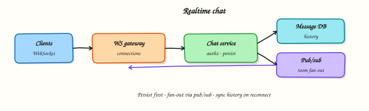

# Realtime chat

## Overview

**Chat** needs low-latency delivery, durable history, and correct behaviour when users disconnect. Long polling works for demos; production usually uses **WebSockets** (or similar) plus a pub/sub backbone so any server can reach any online user.



## Prerequisites

- [Search / autocomplete](search-and-autocomplete.md) (Part C complete)
- [Messaging and async](messaging-and-async.md)

## Learning Objectives

By the end of this tutorial, you will be able to:

- [ ] Compare polling, long polling, and WebSockets for chat  
- [ ] Design connection gateway + pub/sub + message store  
- [ ] Reason about ordering, acknowledgements, and retries  
- [ ] Handle offline users with inbox / push fallback  
- [ ] Implement a toy multi-room chat hub in Python  

## Requirements sketch

| ID | Requirement |
|----|-------------|
| F1 | 1:1 and group rooms |
| F2 | Send/receive messages in near realtime when online |
| F3 | Persist history with cursor pagination |
| F4 | Deliver later when recipient reconnects |
| F5 | Basic read receipts (optional v1) |

NFRs (example): p95 online delivery &lt; 200 ms in-region; at-least-once to clients with idempotent message IDs.

## Theory

### Transport choices

| Approach | Pros | Cons |
|----------|------|------|
| Short polling | Simple | Wasteful, high latency |
| Long polling | Better latency | Connection churn |
| WebSocket / SSE | Persistent, bi/uni-directional | Sticky state, scale complexity |

Chat almost always wants a persistent duplex channel (WebSocket). SSE can work for server→client if clients send via HTTP.

### High-level components

1. **Client** — WS connection, local buffer, ack  
2. **Gateway / connection service** — terminates sockets; maps `user_id → connection`  
3. **Chat service** — authz, persist message, publish event  
4. **Pub/sub** (Redis, NATS, Kafka) — fan-out to gateways holding recipients  
5. **Message store** — history by `room_id + created_at`  
6. **Push provider** — offline mobile notifications (Module 15)  

### Send path

```text
Client A → Gateway → Chat API → DB commit → Pub/sub(room)
                              → Gateway(s) → Client B…
```

Persist **before** (or atomically with) fan-out intent (outbox) so crashes do not invent ghost messages or lose them silently.

### Ordering

- Order **per room** (or per pair) is enough; global order is unnecessary  
- Clients may see gaps on reconnect — heal via history sync since `last_seen_id`  
- Use monotonic `message_id` / snowflake per room stream  

### Acknowledgements

- Server persists → returns `message_id` to sender  
- Recipients ack delivery/read separately  
- At-least-once WS frames + client de-dupe by `message_id`  

### Scaling connections

- Horizontal gateways behind L4 LB with idle timeouts tuned for WS  
- Sticky sessions help but pub/sub makes any gateway able to push  
- Shard pub/sub channels by `room_id`  

### Group fan-out

Large rooms: do not loop every member inside one request thread — publish once to `room:{id}` and let subscribed gateways deliver to local connections.

## Architecture

```text
Clients ⇄ WS Gateway cluster ⇄ Chat service ⇄ Message DB
                 ↕ pub/sub
         (user/room channel routing)
```

## Hands-on Lab

### Objective

Build an in-process chat hub: join rooms, broadcast to online members, and queue messages for offline users until they reconnect.

### Lab environment

Local Python 3.10+.

### Real-world scenario

You need a teaching model of “online push + offline backlog” before introducing Redis and socket frameworks.

### Step-by-step tasks

#### 1. Workspace

``` {.bash .ra-terminal title="Terminal"}
mkdir -p ~/rebash-system-design/module-14-chat
cd ~/rebash-system-design/module-14-chat
```

#### 2. Chat hub

```python title="chat_lab.py"
#!/usr/bin/env python3
"""Toy chat hub: rooms, online delivery, offline backlog."""

from __future__ import annotations

from dataclasses import dataclass, field


@dataclass
class Message:
    message_id: int
    room: str
    sender: str
    body: str


@dataclass
class Hub:
    rooms: dict[str, set[str]] = field(default_factory=dict)
    online: set[str] = field(default_factory=set)
    inboxes: dict[str, list[Message]] = field(default_factory=dict)
    history: dict[str, list[Message]] = field(default_factory=dict)
    delivered: dict[str, list[int]] = field(default_factory=dict)
    _seq: int = 0

    def connect(self, user: str) -> list[Message]:
        self.online.add(user)
        pending = self.inboxes.pop(user, [])
        for msg in pending:
            self.delivered.setdefault(user, []).append(msg.message_id)
        return pending

    def disconnect(self, user: str) -> None:
        self.online.discard(user)

    def join(self, user: str, room: str) -> None:
        self.rooms.setdefault(room, set()).add(user)

    def send(self, room: str, sender: str, body: str) -> Message:
        self._seq += 1
        msg = Message(self._seq, room, sender, body)
        self.history.setdefault(room, []).append(msg)
        for user in self.rooms.get(room, set()):
            if user == sender:
                continue
            if user in self.online:
                self.delivered.setdefault(user, []).append(msg.message_id)
            else:
                self.inboxes.setdefault(user, []).append(msg)
        return msg


def main() -> None:
    hub = Hub()
    hub.join("alice", "r1")
    hub.join("bob", "r1")
    hub.join("cara", "r1")
    hub.connect("alice")
    hub.connect("bob")
    # cara offline
    m1 = hub.send("r1", "alice", "hello")
    hub.disconnect("bob")
    m2 = hub.send("r1", "alice", "bob left")
    pending = hub.connect("cara")
    bob_pending = hub.connect("bob")

    lines = [
        f"m1_id={m1.message_id}",
        f"bob_got_m1={'yes' if m1.message_id in hub.delivered.get('bob', []) else 'no'}",
        f"cara_inbox_on_connect={len(pending)}",
        f"cara_got_both={'yes' if {m1.message_id, m2.message_id} <= set(hub.delivered.get('cara', [])) else 'no'}",
        f"bob_backlog={len(bob_pending)}",
        f"history_len={len(hub.history['r1'])}",
        f"chat_ok={'yes' if len(pending) == 2 and len(bob_pending) == 1 else 'no'}",
    ]
    report = "\n".join(lines) + "\n"
    print(report, end="")
    open("chat-report.txt", "w", encoding="utf-8").write(report)


if __name__ == "__main__":
    main()
```

#### 3. Run and verify

``` {.bash .ra-terminal title="Terminal"}
cd ~/rebash-system-design/module-14-chat
python3 chat_lab.py | tee chat-run.txt
grep chat_ok chat-report.txt
```

!!! example "Expected output"
    `chat_ok=yes` — Cara receives two backlog messages; Bob receives one missed while offline.

### Validation steps

- [ ] Online members get immediate delivery IDs  
- [ ] Offline members receive backlog on connect  
- [ ] Room history retains both messages  

### Challenge exercise

Add per-message client acks and redeliver unacked messages on a timer.

### Cleanup

``` {.bash .ra-terminal title="Terminal"}
cd ~/rebash-system-design/module-14-chat
rm -f chat-run.txt chat-report.txt 2>/dev/null || true
```

## Interview Questions

**1. Why not store WebSocket connections in one monolithic process forever?**

??? success "Reveal answer"
    Connection count and CPU/memory force horizontal gateways. A pub/sub layer routes messages to whichever gateway holds the recipient’s socket.

**2. How do you avoid losing messages on crash?**

??? success "Reveal answer"
    Persist to the message store (and/or outbox) before relying on in-memory fan-out. On reconnect, clients sync history since their last message ID.

**3. How do you order messages in a group chat?**

??? success "Reveal answer"
    Provide a total order per room via a single writer partition or monotonic IDs for that room stream. Do not promise a global order across all rooms.

**4. WebSocket vs MQTT vs gRPC streaming?**

??? success "Reveal answer"
    WebSockets are the common web/mobile choice. MQTT shines for IoT/presence at huge device counts. gRPC streaming fits internal services more than browsers. Choose for client ecosystem and ops skill.

## Common Mistakes

!!! warning "Fan-out inside the HTTP request with no pub/sub"
    One slow recipient or large room blocks everyone.

!!! warning "No history sync protocol"
    Flaky networks need catch-up, not only live frames.

## Summary

Chat is **durable messaging + online fan-out**. Persist first, route via pub/sub to connection gateways, and heal gaps with history sync.

## What's Next

[Notifications and presence](notifications-and-presence.md) — online status, typing indicators, and multi-channel notify.
