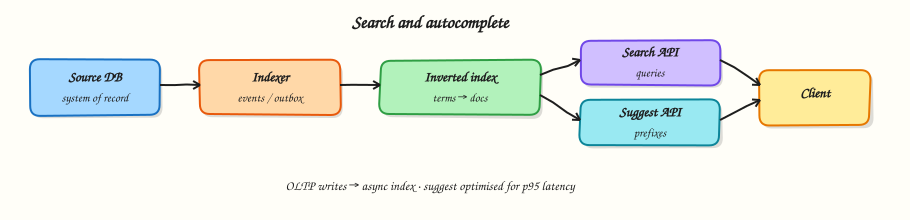

# Search / autocomplete

## Overview

**Search** finds documents by keywords; **autocomplete** suggests queries or entities as the user types. Both need secondary indexes — your primary OLTP database is rarely enough at scale.

This module closes Part C: indexing pipelines, inverted indexes, freshness vs cost, and prefix structures for suggest.



## Prerequisites

- [File / media upload](media-upload.md)
- [Data storage](data-storage.md)

## Learning Objectives

By the end of this tutorial, you will be able to:

- [ ] Explain why search is not `SELECT … LIKE '%term%'` at scale  
- [ ] Describe an inverted index and an indexing pipeline  
- [ ] Trade off freshness, relevance, and p95 suggest latency  
- [ ] Sketch autocomplete with prefix indexes / tries  
- [ ] Implement a tiny inverted index + prefix autocomplete in Python  

## Requirements sketch

### Search (v1)

| ID | Requirement |
|----|-------------|
| F1 | Index posts/docs with title + body  
| F2 | Keyword query returns top-N by simple relevance  
| F3 | Index updates within tens of seconds of publish (eventual)  

### Autocomplete (v1)

| ID | Requirement |
|----|-------------|
| A1 | Prefix suggestions as user types (≥2 chars)  
| A2 | p95 suggest &lt; 100 ms  
| A3 | Rank by popularity / recency  

## Theory

### Why not SQL `LIKE`?

- Leading-wildcard `%term%` cannot use normal B-trees efficiently  
- Ranking, stemming, typo-tolerance need specialised structures  
- Read load would crush OLTP  

Use a **search engine** or inverted index service (OpenSearch/Elasticsearch, Typesense, meilisearch, etc.) fed from your system of record.

### Inverted index (core idea)

For each term → list of document IDs (postings), often with positions/TF.

Query `"system design"`:

1. Tokenise / normalise  
2. Fetch postings for `system` and `design`  
3. Intersect / score  
4. Return top-N docs  

### Indexing pipeline

```text
Publish → OLTP commit → outbox/event → indexer workers → search index
```

- **Sync index in API** couples publish latency to search cluster health — usually avoid  
- **Near-real-time** refresh intervals trade freshness for bulk efficiency  
- Deletes/updates must be idempotent (index by `doc_id`)  

### Relevance (interview depth)

Start simple: TF-IDF / BM25-style scoring. Later: field boosts (title > body), freshness, personalisation. Separate **candidate retrieval** from **re-ranking**.

### Autocomplete structures

| Approach | Notes |
|----------|-------|
| Prefix trie / ternary search tree | Fast prefix walk in memory |
| Edge n-grams in search engine | `sys`, `syst`, `system` as terms |
| Sorted set in Redis (`ZRANGEBYLEX`) | Popular for query suggest |

Cache hot prefixes at the edge carefully (personalised suggests often bypass shared CDN).

### Query hygiene

- Rate limit and bound result sizes  
- Escape/analyse user input  
- Protect against expensive wildcard queries  
- Observe suggest QPS separately from search QPS  

### Consistency language

> Search may lag publish by up to 30 seconds. Autocomplete popularity updates every few minutes.

## Architecture

```text
Client → Search API → Query service → Index replicas
Client → Suggest API → Prefix store / trie cache

Indexer ← events ← Post/Media services
Indexer → primary index → replicate to query nodes
```

## Hands-on Lab

### Objective

Build a minimal inverted index for documents and a prefix map for autocomplete suggestions.

### Lab environment

Local Python 3.10+.

### Real-world scenario

You need to explain inverted indexes without hand-waving. A 20-line indexer makes the idea concrete.

### Step-by-step tasks

#### 1. Workspace

``` {.bash .ra-terminal title="Terminal"}
mkdir -p ~/rebash-system-design/module-13-search
cd ~/rebash-system-design/module-13-search
```

#### 2. Index + suggest

```python title="search_lab.py"
#!/usr/bin/env python3
"""Tiny inverted index + prefix autocomplete."""

from __future__ import annotations

import re
from collections import defaultdict


TOKEN = re.compile(r"[a-z0-9]+")


def tokenize(text: str) -> list[str]:
    return TOKEN.findall(text.lower())


class InvertedIndex:
    def __init__(self) -> None:
        self.postings: dict[str, set[str]] = defaultdict(set)
        self.docs: dict[str, str] = {}

    def add(self, doc_id: str, text: str) -> None:
        self.docs[doc_id] = text
        for term in set(tokenize(text)):
            self.postings[term].add(doc_id)

    def search(self, query: str) -> list[str]:
        terms = tokenize(query)
        if not terms:
            return []
        result = set(self.postings.get(terms[0], set()))
        for t in terms[1:]:
            result &= self.postings.get(t, set())
        # naive rank: more term occurrences in text wins
        def score(doc_id: str) -> int:
            text = self.docs[doc_id].lower()
            return sum(text.count(t) for t in terms)

        return sorted(result, key=score, reverse=True)


class Autocomplete:
    def __init__(self) -> None:
        self.prefix: dict[str, dict[str, int]] = defaultdict(lambda: defaultdict(int))

    def add_query(self, query: str, weight: int = 1) -> None:
        q = query.lower().strip()
        if len(q) < 2:
            return
        for i in range(2, len(q) + 1):
            self.prefix[q[:i]][q] += weight

    def suggest(self, typed: str, limit: int = 5) -> list[str]:
        key = typed.lower().strip()
        items = self.prefix.get(key, {})
        return [q for q, _ in sorted(items.items(), key=lambda kv: (-kv[1], kv[0]))[:limit]]


def main() -> None:
    idx = InvertedIndex()
    idx.add("d1", "System design interviews need practice")
    idx.add("d2", "Design caches and indexes carefully")
    idx.add("d3", "Gardening tips for spring")
    hits = idx.search("design system")

    ac = Autocomplete()
    for q, w in [("system design", 50), ("systemctl", 10), ("systemd", 20), ("design patterns", 15)]:
        ac.add_query(q, w)
    suggestions = ac.suggest("sys")

    lines = [
        f"search_hits={','.join(hits)}",
        f"top_hit={hits[0] if hits else None}",
        f"suggest={','.join(suggestions)}",
        f"suggest_top={suggestions[0] if suggestions else None}",
        f"search_ok={'yes' if hits and hits[0] == 'd1' else 'no'}",
        f"suggest_ok={'yes' if suggestions and suggestions[0] == 'system design' else 'no'}",
    ]
    report = "\n".join(lines) + "\n"
    print(report, end="")
    open("search-report.txt", "w", encoding="utf-8").write(report)


if __name__ == "__main__":
    main()
```

#### 3. Run and verify

``` {.bash .ra-terminal title="Terminal"}
cd ~/rebash-system-design/module-13-search
python3 search_lab.py | tee search-run.txt
grep -E 'search_ok|suggest_ok' search-report.txt
```

!!! example "Expected output"
    `search_ok=yes` and `suggest_ok=yes`.

### Validation steps

- [ ] AND query returns the doc containing both terms  
- [ ] Prefix `sys` ranks `system design` first by weight  
- [ ] Unrelated gardening doc is excluded  

### Challenge exercise

Add phrase search using term positions, or fuzzy suggest with edit-distance ≤ 1 for typos.

### Cleanup

``` {.bash .ra-terminal title="Terminal"}
cd ~/rebash-system-design/module-13-search
rm -f search-run.txt search-report.txt 2>/dev/null || true
```

## Interview Questions

**1. What is an inverted index?**

??? success "Reveal answer"
    A map from term → postings (document IDs, often with frequencies/positions). Queries intersect or score those lists instead of scanning every document.

**2. How do you keep the index up to date?**

??? success "Reveal answer"
    Publish events from the source of truth (outbox), and run indexer workers that upsert/delete by document ID. Accept near-real-time lag; avoid coupling the user write path to search cluster latency unless required.

**3. How is autocomplete different from full-text search?**

??? success "Reveal answer"
    Autocomplete optimises prefix matching and ultra-low latency, often with tries, edge n-grams, or sorted sets. Full-text search optimises recall/relevance over complete queries and richer analysis.

**4. What do you cache for search?**

??? success "Reveal answer"
    Hot query results and hot prefix suggestion lists, with short TTLs and careful personalisation keys. Do not cache rare unique queries aggressively — little reuse.

## Common Mistakes

!!! warning "Using the primary DB as the search engine forever"
    It works for demos and fails for product search quality and load.

!!! warning "Promising zero lag between write and search"
    Indexing is eventually consistent unless you pay for synchronous, brittle designs.

## Summary

Search systems are **derived indexes** fed by pipelines. Autocomplete is a specialised low-latency prefix problem. Part C ends here — you can now assemble classic product surfaces from Part B building blocks.

## What's Next

[Realtime chat](realtime-chat.md) — WebSockets, durable messages, and online fan-out (Part D begins).
