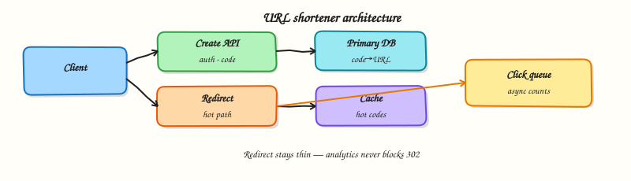

# URL shortener

## Overview

A **URL shortener** maps a long URL to a short code and redirects quickly. It looks simple; the hard parts are uniqueness, read-heavy scale, and not slowing the redirect for analytics.

This is the first Part C case study: apply the design process, storage, cache, messaging, and APIs you already learned.



## Prerequisites

- [Observability and resilience](observability-and-resilience.md) (Part B complete)
- [How to design a system](how-to-design-a-system.md)

## Learning Objectives

By the end of this tutorial, you will be able to:

- [ ] Write scoped requirements and capacity numbers for a shortener  
- [ ] Compare hash, counter, and random code generation  
- [ ] Design a redirect path that stays fast under read load  
- [ ] Place cache and async analytics correctly  
- [ ] Implement create + redirect with collision handling in Python  

## Requirements sketch

### Business goal

Let marketers and apps share short, trackable links.

### Functional (v1)

| ID | Requirement |
|----|-------------|
| F1 | Authenticated create: long HTTPS URL → short code |
| F2 | Redirect `GET /{code}` → 302/301 to long URL |
| F3 | Optional basic click count for owner |
| F4 | Codes unique; reject malformed URLs |

### Out of scope (v1)

Custom domains, A/B tests, QR, SSO, link editing UI polish.

### Non-functional targets (example)

- p95 redirect &lt; 100 ms in-region  
- 99.9% availability on redirect  
- Read:write ≈ 100:1  
- Year-one: 10M redirects/day  

### Capacity sketch

- Avg RPS ≈ 10M / 86 400 ≈ 116; peak ≈ 2× → ~230 RPS  
- Storage: if 100k new links/day × 500 B × 5 years ≈ tens of GB — one primary is fine early  

## Theory

### Code generation options

| Approach | Pros | Cons |
|----------|------|------|
| Hash(URL) truncate | Deterministic | Collisions; same URL → same code (sometimes wanted) |
| Global counter → Base62 | Compact, unique | Counter becomes a hotspot; needs allocation ranges |
| Random Base62 | Simple, shard-friendly | Must check uniqueness; slightly longer for low collision |

Production tip: pre-allocate **counter ranges** per instance, or use random + insert-if-absent.

### Data model (minimal)

```text
links(code PK, url, owner_id, created_at, click_count?)
```

Indexes: `owner_id` for listing. Clicks may live in a separate counter/store updated async.

### Redirect path (hot)

```text
Client → CDN? → LB → Redirect service → Cache → DB → 302
```

- Prefer **cache-aside** on `code → url`  
- Do **not** wait on analytics  
- Enqueue click event after (or alongside) issuing redirect  

### Create path

```text
Client → API → validate → generate code → insert → (optional) warm cache → 201
```

Idempotency-Key prevents duplicate creates on mobile retries (Module 8).

### Consistency choices

- Redirect may use replica/cache → accept rare stale 404 after create for seconds, or read-your-writes on primary for N seconds after create  
- Click counts: eventual via workers is usually fine  

### Scaling story

1. Vertical scale + replicas + Redis  
2. Shard `links` by hash(code) if needed  
3. Separate redirect service from management API  

## Architecture

```text
  create   → Link API      → Primary DB
  redirect → Redirect svc  → Cache → DB
                 └─ async click queue → counters
```

## Hands-on Lab

### Objective

Implement an in-memory shortener with Base62-ish codes, collision retry, redirect, and async-style click counting via a queue.

### Lab environment

Local Python 3.10+.

### Real-world scenario

You must demo a correct create/redirect loop and show that click recording does not block the redirect response.

### Step-by-step tasks

#### 1. Workspace

``` {.bash .ra-terminal title="Terminal"}
mkdir -p ~/rebash-system-design/module-10-shortener
cd ~/rebash-system-design/module-10-shortener
```

#### 2. Shortener service

```python title="shortener_lab.py"
#!/usr/bin/env python3
"""URL shortener: create, redirect, async click counts."""

from __future__ import annotations

import queue
import threading
import time
import secrets


ALPHABET = "0123456789abcdefghijklmnopqrstuvwxyzABCDEFGHIJKLMNOPQRSTUVWXYZ"


def encode_random(n_bytes: int = 5) -> str:
    raw = secrets.token_bytes(n_bytes)
    num = int.from_bytes(raw, "big")
    chars = []
    while num:
        num, rem = divmod(num, 62)
        chars.append(ALPHABET[rem])
    return "".join(reversed(chars)) or "0"


class Shortener:
    def __init__(self) -> None:
        self.links: dict[str, str] = {}
        self.clicks: dict[str, int] = {}
        self.click_q: queue.Queue[str] = queue.Queue()
        self._stop = threading.Event()
        self.worker = threading.Thread(target=self._consume, daemon=True)
        self.worker.start()

    def _consume(self) -> None:
        while not self._stop.is_set():
            try:
                code = self.click_q.get(timeout=0.05)
            except queue.Empty:
                continue
            self.clicks[code] = self.clicks.get(code, 0) + 1
            self.click_q.task_done()

    def create(self, url: str) -> str:
        if not url.startswith("https://"):
            raise ValueError("https only")
        for _ in range(8):
            code = encode_random()
            if code not in self.links:
                self.links[code] = url
                return code
        raise RuntimeError("collision storm")

    def redirect(self, code: str) -> str | None:
        url = self.links.get(code)
        if url is None:
            return None
        self.click_q.put(code)  # async — do not wait for counter
        return url

    def close(self) -> None:
        self.click_q.join()
        self._stop.set()
        self.worker.join(timeout=1)


def main() -> None:
    s = Shortener()
    code = s.create("https://example.com/docs")
    url = s.redirect(code)
    url2 = s.redirect(code)
    missing = s.redirect("nope")
    time.sleep(0.05)
    s.close()

    lines = [
        f"code={code}",
        f"redirect_url={url}",
        f"second_redirect_ok={'yes' if url2 == url else 'no'}",
        f"missing_is_none={'yes' if missing is None else 'no'}",
        f"click_count={s.clicks.get(code, 0)}",
        f"async_clicks_ok={'yes' if s.clicks.get(code) == 2 else 'no'}",
    ]
    report = "\n".join(lines) + "\n"
    print(report, end="")
    open("shortener-report.txt", "w", encoding="utf-8").write(report)


if __name__ == "__main__":
    main()
```

#### 3. Run and verify

``` {.bash .ra-terminal title="Terminal"}
cd ~/rebash-system-design/module-10-shortener
python3 shortener_lab.py | tee shortener-run.txt
grep async_clicks_ok shortener-report.txt
```

!!! example "Expected output"
    `async_clicks_ok=yes` and `click_count=2`.

### Validation steps

- [ ] Create returns a code; redirect returns the URL  
- [ ] Two redirects increment clicks without blocking the return path conceptually  
- [ ] Unknown code returns `None`  

### Challenge exercise

Add a cache dict with TTL in front of `links` and count cache hits on redirect.

### Cleanup

``` {.bash .ra-terminal title="Terminal"}
cd ~/rebash-system-design/module-10-shortener
rm -f shortener-run.txt shortener-report.txt 2>/dev/null || true
```

## Interview Questions

**1. How do you generate unique short codes at scale?**

??? success "Reveal answer"
    Common options: range-allocated counters encoded in Base62, or secure random codes with insert-if-absent and rare retry. Avoid a single hot global counter without ranges. Hash truncation needs a collision strategy.

**2. Why is the redirect path separated from create?**

??? success "Reveal answer"
    Redirects dominate traffic and need minimal dependencies (cache + datastore). Create needs auth, validation, and writes. Separating them lets you scale and deploy independently and keep p95 redirect low.

**3. Where do click analytics go?**

??? success "Reveal answer"
    Off the critical path: enqueue an event after (or while) issuing the redirect, then aggregate asynchronously. Sync counter updates on every redirect add latency and write load.

**4. Cache redirect mappings — what do you invalidate?**

??? success "Reveal answer"
    On update/disable of a link, delete `code → url` from cache. For immutable links, TTL alone may suffice. Beware caching 404s forever for codes that are created moments later.

## Common Mistakes

!!! warning "Blocking redirect on analytics writes"
    Users feel every millisecond; marketers can wait seconds for counts.

!!! warning "Predictable sequential codes"
    Enables enumeration and abuse. Prefer unguessable codes or rate limits + auth on create.

## Summary

A shortener is a **read-optimised** key-value problem with careful uniqueness and an async side path for analytics. Get the redirect path ruthlessly simple.

## What's Next

[News feed / timeline](news-feed.md) — fan-out on write vs read for social timelines.
