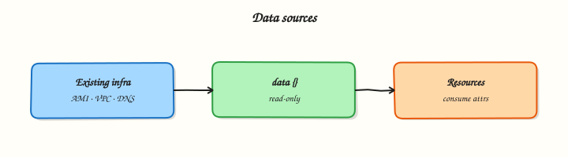

# Data Sources and Existing Infrastructure

## Overview

Not everything belongs in Terraform state on day one. **Data sources** read existing infrastructure, files, HTTP endpoints, or other stacks **without managing lifecycle** — ideal for looking up VPC IDs, AMI filters, certificate ARNs, or values maintained by another team.

This tutorial covers **`data` sources**, **`terraform_remote_state`**, **`external`**, and **`http`** patterns for **existing infrastructure**. The lab under `~/rebash-terraform/module-11` reads a brownfield Docker network and config file, calls an **external** owner lookup, and wires data into a new container — real apply against Docker Engine.

This is **Tutorial 13** in **Module 11: Data Sources** of the REBASH Academy **Terraform for Cloud & DevOps Engineers** series.

## Prerequisites

- [Functions, Templates, and Dynamic Blocks](functions-templates-and-dynamic-blocks.md)
- [Remote State and Backends](remote-state-and-backends.md)
- Terraform CLI ≥ 1.5
- `bash` and `curl` available

## Learning Objectives

By the end of this tutorial, you will be able to:

- [ ] Declare `data` blocks and reference `data.TYPE.NAME.attribute`
- [ ] Read local files and external program JSON with data sources
- [ ] Fetch remote metadata with `http` data sources safely
- [ ] Contrast data sources with `terraform import` for management handover
- [ ] Explain when read-only lookups beat duplicating hard-coded IDs

## Architecture

Data sources fetch read-only values at plan time; managed resources depend on those values but data sources are never created or destroyed by apply.



## Theory

### What it is

**Data sources** use the `data` block:

```hcl
data "local_file" "config" {
  filename = "${path.module}/config/existing.env"
}

resource "null_resource" "app" {
  triggers = {
    config_hash = md5(data.local_file.config.content)
  }
}
```

Reference attributes as **`data.local_file.config.content`**.

Common data sources:

| Data source | Reads |
|-------------|-------|
| `aws_vpc`, `aws_ami`, … | Live cloud objects (provider-specific) |
| `local_file` | File on disk |
| `http` | HTTP/HTTPS response body |
| `external` | JSON from a helper program stdout |
| `terraform_remote_state` | Outputs from another stack's state |

**Data vs managed resource:** Terraform **never creates or destroys** data source objects — it **reads** them each plan/apply (refresh).

**Data vs import:** **Import** brings an existing object **under management** in state. **Data source** leaves ownership elsewhere — you only read attributes.

### Why it matters

Brownfield deployments reference shared network, DNS, and certificates owned by platform teams. Hard-coding IDs breaks when upstream changes. Data sources keep your module **loosely coupled** — read the current VPC filter result at plan time. Wrong data source configuration fails plans early instead of at apply.

### How it works

1. Terraform configures the data source with lookup parameters.
2. Provider (or built-in logic) fetches data during plan refresh.
3. Attributes populate expressions for resources, locals, and outputs.
4. Data sources appear in dependency graph — resources wait for successful read.
5. If lookup fails (404, missing file), plan errors unless optional patterns used.

**external data source** runs a program that must print JSON to stdout:

```hcl
data "external" "owner" {
  program = ["bash", "${path.module}/scripts/read-owner.sh"]
}
# data.external.owner.result["owner_email"]
```

### Key concepts and comparisons

| Pattern | Manages resource? | Use when |
|---------|-------------------|----------|
| `resource` | Yes | Terraform owns lifecycle |
| `data` | No | Read-only reference |
| `import` + `resource` | Yes after import | Adopt existing object |
| `terraform_remote_state` | No (reads other state) | Cross-stack outputs |

| Risk | Mitigation |
|------|------------|
| Data changes between plan and apply | Re-run plan before apply; short plan-apply window |
| external script failure | Validate JSON; test script in CI |
| http to untrusted URL | Allow-list hosts; TLS verify |

### Common pitfalls

- **Confusing data and resource addresses** — `data.aws_vpc.main` vs `aws_vpc.main`.
- **external program prints logs to stdout** — corrupts JSON parse.
- **File path outside module** — breaks CI checkout paths; use `path.module`.
- **Assuming data is free** — cloud API lookups count against rate limits.
- **Reading secrets via http** — secrets enter state; prefer vault data sources.

## Hands-on Lab

### Objective

Read a pre-existing Docker network and config file, call an **external** script for JSON metadata, fetch public HTTP metadata, and wire data sources into a real **Docker container** under `~/rebash-terraform/module-11`.

### Prerequisites

- Terraform CLI ≥ 1.5
- Docker Engine running (`docker info` succeeds)
- Network access for `http` data source (HashiCorp checkpoint endpoint)

### Lab environment

``` {.bash .ra-terminal title="Terminal"}
mkdir -p ~/rebash-terraform/module-11/{config,scripts} && cd ~/rebash-terraform/module-11
```

Runtime: local Docker Engine.

### Real-world scenario

Your application stack must attach to a **platform-owned Docker network**, read a **brownfield config file**, resolve **owner email** from an internal script (simulating CMDB lookup), and verify **Terraform CLI version metadata** from HashiCorp's checkpoint service before provisioning the service container.

### Step-by-step tasks

#### Task 1 – Seed brownfield network and config

Create the platform network outside Terraform (simulating existing infrastructure):

``` {.bash .ra-terminal title="Terminal"}
docker network create rebash-platform-net | tee platform-net-create.txt
grep -q 'rebash-platform-net' platform-net-create.txt
```

Create `config/existing.env`:

```text title="existing.env"
UPSTREAM_SERVICE=payments-api
UPSTREAM_VERSION=2.4.1
MAINTENANCE_WINDOW=sunday-02:00-04:00-utc
```

Create `versions.tf`:

```hcl title="versions.tf"
terraform {
  required_version = ">= 1.5.0"

  required_providers {
    docker = {
      source  = "kreuzwerker/docker"
      version = "~> 3.0"
    }
    local = {
      source  = "hashicorp/local"
      version = "~> 2.5"
    }
    external = {
      source  = "hashicorp/external"
      version = "~> 2.3"
    }
    http = {
      source  = "hashicorp/http"
      version = "~> 3.4"
    }
  }
}
```

Create `providers.tf`:

```hcl title="providers.tf"
provider "docker" {}
```

Create `data.tf`:

```hcl title="data.tf"
data "docker_network" "platform" {
  name = "rebash-platform-net"
}

data "local_file" "platform_config" {
  filename = "${path.module}/config/existing.env"
}

data "external" "owner_lookup" {
  program = ["bash", "${path.module}/scripts/read-owner.sh"]

  query = {
    service = "payments-api"
  }
}

data "http" "terraform_checkpoint" {
  url = "https://checkpoint-api.hashicorp.com/v1/check/terraform"
}
```

Create `scripts/read-owner.sh`:

```bash title="read-owner.sh"
#!/usr/bin/env bash
set -euo pipefail
query="$(cat)"
service="$(echo "$query" | jq -r '.service')"
owner_email="${service}-owner@example.com"
jq -n --arg owner "$owner_email" --arg service "$service" \
  '{owner_email: $owner, service: $service}'
```

Run:

``` {.bash .ra-terminal title="Terminal"}
chmod +x ~/rebash-terraform/module-11/scripts/read-owner.sh
cd ~/rebash-terraform/module-11
terraform init
echo '{"service":"payments-api"}' | bash scripts/read-owner.sh | grep -q owner_email
echo "seed OK" | tee seed-ok.txt
```

!!! example "Expected output"
    External script prints JSON with `owner_email`; platform network exists.


#### Task 2 – Wire data sources into Docker container and outputs

Create `main.tf`:

```hcl title="main.tf"
locals {
  config_lines = split("\n", trimspace(data.local_file.platform_config.content))
  upstream_version = [
    for line in local.config_lines : trimspace(split("=", line)[1])
    if startswith(line, "UPSTREAM_VERSION=")
  ][0]
}

resource "docker_image" "app" {
  name         = "nginx:1.27-alpine"
  keep_locally = true
}

resource "docker_container" "app" {
  name  = "payments-api-${local.upstream_version}"
  image = docker_image.app.image_id

  networks_advanced {
    name = data.docker_network.platform.name
  }

  labels = {
    upstream_version = local.upstream_version
    owner_email      = data.external.owner_lookup.result.owner_email
    tf_current       = jsondecode(data.http.terraform_checkpoint.response_body).current_version
    managed_by       = "terraform"
  }
}
```

Create `outputs.tf`:

```hcl title="outputs.tf"
output "upstream_version" {
  value = local.upstream_version
}

output "owner_email" {
  value = data.external.owner_lookup.result.owner_email
}

output "network_id" {
  value = data.docker_network.platform.id
}

output "container_name" {
  value = docker_container.app.name
}
```

Run:


``` {.bash .ra-terminal title="Terminal"}
cd ~/rebash-terraform/module-11
terraform validate
terraform apply -auto-approve
terraform output -raw upstream_version | tee upstream-version.txt
test "$(cat upstream-version.txt)" = "2.4.1"
docker inspect payments-api-2.4.1 --format '{{index .Config.Labels "owner_email"}}' \
  | tee owner-label.txt
grep -q 'payments-api-owner@example.com' owner-label.txt
docker network inspect rebash-platform-net --format '{{len .Containers}}' | tee net-containers.txt
test "$(cat net-containers.txt)" -ge 1
echo "task2 OK" | tee task2-ok.txt
```


!!! example "Expected output"
    Container attached to platform network with owner label from external data.


#### Task 3 – Prove plan changes when upstream file changes

Update `config/existing.env`:

```text title="existing.env"
UPSTREAM_SERVICE=payments-api
UPSTREAM_VERSION=2.5.0
MAINTENANCE_WINDOW=sunday-02:00-04:00-utc
```

Run:


``` {.bash .ra-terminal title="Terminal"}
cd ~/rebash-terraform/module-11
terraform plan -no-color | tee plan-after-config-change.txt
grep -q '2.5.0' plan-after-config-change.txt
terraform apply -auto-approve
terraform output -raw upstream_version | grep -q '2.5.0'
docker ps --filter "name=payments-api-2.5.0" --format '{{.Names}}' | tee new-container.txt
grep -q 'payments-api-2.5.0' new-container.txt
echo "task3 OK" | tee task3-ok.txt
```


!!! example "Expected output"
    Plan detects container rename from version change; new container running.


#### Task 4 – Data sources evidence script

Create `data-evidence.sh`:


``` {.bash .ra-terminal title="Terminal"}
#!/usr/bin/env bash
set -euo pipefail
cd ~/rebash-terraform/module-11
terraform validate
terraform output -raw upstream_version | grep -q .
terraform output -raw owner_email | grep -q '@example.com'
terraform state list | grep -q 'data.docker_network.platform'
docker inspect "$(terraform output -raw container_name)" --format '{{.State.Running}}' | grep -q true
echo "data-evidence PASS" | tee data-evidence-pass.txt
```


Run:

``` {.bash .ra-terminal title="Terminal"}
chmod +x ~/rebash-terraform/module-11/data-evidence.sh
~/rebash-terraform/module-11/data-evidence.sh
```

!!! example "Expected output"
    `data-evidence-pass.txt` contains `data-evidence PASS`.


### Validation steps

- [ ] `data.docker_network` read brownfield network without managing it
- [ ] external script returned JSON consumed by Terraform
- [ ] http data source fetched checkpoint metadata
- [ ] Plan reacted to upstream file edit with container replace
- [ ] Evidence script passes with running container

### Common errors and fixes

| Error | Cause | Fix |
|-------|-------|-----|
| external JSON parse error | Script printed logs to stdout | Send logs to stderr only |
| Network not found | Network not pre-created | Run `docker network create rebash-platform-net` |
| http SSL error | Corporate proxy | Fix CA trust or use allowed internal URL |
| Container name invalid | Version contains dots | Use `replace()` on version in name if needed |
| Data source read during apply fail | Network blip | Re-run plan; add retry in provider config |

### Challenge exercise

Add a `data "local_file"` read of `scripts/read-owner.sh` and output its SHA256; add a `data "docker_image"` lookup for `nginx:1.27-alpine` and output image ID:

```hcl
data "local_file" "owner_script" {
  filename = "${path.module}/scripts/read-owner.sh"
}

data "docker_image" "nginx" {
  name = "nginx:1.27-alpine"
}

output "owner_script_sha" {
  value = sha256(data.local_file.owner_script.content)
}

output "nginx_image_id" {
  value = data.docker_image.nginx.id
}
```

Apply and verify:

``` {.bash .ra-terminal title="Terminal"}
cd ~/rebash-terraform/module-11
terraform apply -auto-approve
terraform output -raw owner_script_sha | grep -q .
terraform output -raw nginx_image_id | grep -q .
echo "data challenge OK"
```

!!! example "Expected output"
    Non-empty SHA256 and image ID outputs.


### Learning outcomes

- Data vs resource mental model on real Docker objects
- external program contract (JSON stdout)
- Wiring data attributes into container labels and network attachment
- Brownfield reads without import

### Cleanup

``` {.bash .ra-terminal title="Terminal"}
cd ~/rebash-terraform/module-11
terraform destroy -auto-approve
docker network rm rebash-platform-net 2>/dev/null || true
rm -f seed-ok.txt upstream-version.txt owner-label.txt net-containers.txt \
  task*-ok.txt plan-after-config-change.txt new-container.txt data-evidence-pass.txt \
  platform-net-create.txt
rm -rf .terraform .terraform.lock.hcl terraform.tfstate terraform.tfstate.backup
```

## Validation

- [ ] Completed module-11 data sources lab
- [ ] Can explain data vs import decision
- [ ] Know external script JSON requirements
- [ ] Understand data sources refresh each plan

## Code Walkthrough

1. **Brownfield file outside Terraform** — `local_file` data source reads it; no import needed.
2. **external for CMDB** — script encapsulates lookup; swap script per environment.
3. **http for version checks** — gate modules on minimum provider/tool versions.
4. **Parse in locals** — keep resource blocks clean.
5. **Triggers from data** — force replace when upstream metadata changes.

## Security Considerations

- `external` runs arbitrary programs — review scripts; restrict who can change them.
- `http` data sources can leak response bodies into state — avoid authenticated URLs with secrets in response.
- Do not fetch credentials from plain HTTP endpoints.
- Validate and sanitise external JSON before use in resources.
- Cloud data sources need read-only IAM — separate from apply roles.

## Common Mistakes

!!! warning "Managing data source objects manually"
    Editing the VPC in console while using `data.aws_vpc` is fine — Terraform reads current state.  
    **Fix:** Do not confuse with `resource` — only resources are managed.

!!! warning "external script stderr mixed into stdout"
    Breaks JSON parsing.  
    **Fix:** `echo debug >&2`; stdout JSON only.

!!! warning "Import when read-only suffices"
    Import adds management overhead for shared platform resources.  
    **Fix:** Use data source unless your team owns lifecycle.

## Best Practices

- Prefer data sources for shared platform resources owned elsewhere.
- Pin external scripts in Git; test with fixture JSON in CI.
- Use `terraform_remote_state` for first-party stack outputs over ad-hoc data duplication.
- Document required upstream objects (tags, names) for data source filters.
- Handle "not found" with clear variable validation where provider allows.

## Troubleshooting

| Symptom | Likely cause | Fix |
|---------|--------------|-----|
| data source not found error | Wrong provider alias | Check provider configuration |
| Intermittent http failures | Network or rate limit | Retry; cache in external script |
| Stale data in plan | Cached refresh | `-refresh=true` default; re-plan |
| import vs data confusion | Wrong block type | `data` for read; `resource`+import for manage |
| external exit non-zero | Script error | Run script manually with sample query JSON |

## Summary

Data sources let Terraform **read** existing infrastructure and metadata without taking ownership. You consumed **local_file**, **external**, and **http** data, wired results into resources, and reacted to upstream file changes. Next, [Workspaces and Environment Strategies](workspaces-and-environment-strategies.md) separates dev and staging state.

## Interview Questions

**1. What is the difference between a resource and a data source?**

??? success "Reveal answer"
    A **resource** is **managed** — Terraform creates, updates, and destroys it. A **data source** is **read-only** — Terraform fetches attributes at plan/refresh time but never changes the object. Use resources for ownership; data sources for lookups.

**2. When would you use terraform import instead of a data source?**

??? success "Reveal answer"
    **Import** when your team will **manage lifecycle** of an existing object going forward (adopt legacy server into state). **Data source** when another team or system **continues to own** the object and you only need attributes (VPC ID from network stack).

**3. How does the external data source work?**

??? success "Reveal answer"
    Terraform runs the **`program`** with **`query`** JSON on stdin (legacy) or as args depending on provider version; the program must print **JSON object to stdout**. Attributes appear under **`data.external.NAME.result`**. Errors go to stderr; non-zero exit fails the plan.

**4. Do data sources appear in terraform state?**

??? success "Reveal answer"
    Yes — cached **attributes** are stored in state so Terraform knows dependency results. They are not **managed resources** — there is no create/destroy API call for the object itself, only refresh reads.

**5. What happens if a data source lookup fails at plan time?**

??? success "Reveal answer"
    Plan **errors** — for example VPC filter matches zero subnets, file missing, HTTP 404. Fix filters, paths, or permissions before apply proceeds. This fail-fast behaviour protects against wrong infrastructure references.

**6. How is terraform_remote_state different from aws_vpc data source?**

??? success "Reveal answer"
    **`terraform_remote_state`** reads **outputs from another Terraform stack's state** — first-party contract. **`aws_vpc` data source** queries **AWS API** live — useful when network was not built by Terraform or you need current AWS truth.

**7. Security concern with external data source?**

??? success "Reveal answer"
    It executes ** arbitrary code** during plan with the runner's privileges — supply chain risk if scripts are editable by untrusted users. Review scripts, run in locked-down CI, avoid secrets in query args logged by debug.

**8. Can data source values change between plan and apply?**

??? success "Reveal answer"
    **Yes** — upstream systems can change. Terraform refreshes again at apply by default. For critical values, minimise plan-apply delay, use `-refresh=false` only deliberately, and re-plan before production apply if window is long.

## Related Tutorials

- [Terraform course index](index.md)
- **Previous:** [Functions, Templates, and Dynamic Blocks](functions-templates-and-dynamic-blocks.md)
- **Next:** [Workspaces and Environment Strategies](workspaces-and-environment-strategies.md)
- [Remote State and Backends](remote-state-and-backends.md)

## References

- [Data sources](https://developer.hashicorp.com/terraform/language/data-sources)
- [external data source](https://registry.terraform.io/providers/hashicorp/external/latest/docs/data-sources/external)
- [http data source](https://registry.terraform.io/providers/hashicorp/http/latest/docs/data-sources/http)
- [Import](https://developer.hashicorp.com/terraform/cli/import)
- [terraform_remote_state](https://developer.hashicorp.com/terraform/language/state/remote-state-data)
