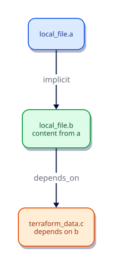

# Dependencies and the Resource Graph

## Overview

Terraform does not apply resources in file order. It builds a **dependency graph**, then creates and destroys along that graph — often in parallel where edges allow. Most edges are **implicit** from attribute references. Explicit `depends_on` covers hidden ordering. Misusing `-target` or ignoring destroy order causes subtle production outages.

This tutorial teaches how to read the graph, when `depends_on` is justified, how `replace_triggered_by` and `terraform_data` force controlled replacements, and why full-graph applies beat targeted ones.

This is **Tutorial 7** in **Module 2: Core Building Blocks** of the REBASH Academy Terraform track.

## Learning Objectives

By the end of this tutorial, you will be able to:

- [ ] Contrast implicit versus explicit dependencies
- [ ] Predict create and destroy ordering from references
- [ ] Use `depends_on` only when a real hidden ordering need exists
- [ ] Explain risks of `terraform apply -target`
- [ ] Trigger replacement with `replace_triggered_by` and `terraform_data`
- [ ] Interpret `terraform graph` output at a glance

## Prerequisites

- Completed [Resources and Data Sources](resources-and-data-sources.md)
- Terraform CLI **1.9+** (1.15.x recommended)
- Ability to create directories and edit files
- No cloud account required for this lab

## Architecture

References create directed edges. Terraform walks the graph for create (dependencies first) and reverses it for destroy. Parallelism applies to independent subgraphs.



| Concept | Role |
|---------|------|
| **Node** | Resource, data source, or module instance |
| **Implicit edge** | Created by an expression reference |
| **Explicit edge** | Added with `depends_on` |
| **Cycle** | Illegal loop — Terraform errors until you break it |

## Theory

### Implicit dependencies

Referencing another object’s attribute creates an edge:

```hcl
resource "local_file" "first" {
  filename = "${path.module}/1.txt"
  content  = "first\n"
}

resource "local_file" "second" {
  filename = "${path.module}/2.txt"
  content  = "depends on ${local_file.first.filename}\n"
}
```

Terraform creates `first` before `second`, and destroys `second` before `first`. Prefer this style: the data flow *is* the documentation.

### Explicit `depends_on`

Use when ordering is required **without** an attribute reference — for example, an API that must exist before a side-effect resource runs, or a provider limitation.

```hcl
resource "terraform_data" "after_second" {
  input      = local_file.second.content_md5
  depends_on = [local_file.second]
}
```

Here `input` already implies a dependency on `second`; the extra `depends_on` is illustrative. In real stacks, reach for `depends_on` only when there is no natural attribute to reference.

**Costs of overusing `depends_on`:**

- Opaque graphs — reviewers cannot see *why* A waits on B
- Reduced parallelism — longer applies
- Hidden coupling that breaks when someone removes the “unused” resource

### Create versus destroy order

| Phase | Order |
|-------|-------|
| Create / update | Dependencies first, then dependents |
| Destroy | Dependents first, then dependencies |

Getting this wrong without the graph (manual scripts) is a common outage class: delete a security group while instances still reference it. Terraform’s graph exists to prevent that class of mistake when edges are correct.

### `-target`

`terraform apply -target=ADDRESS` limits the walk to a subgraph. Legitimate uses: emergency hotfix when a full apply is impossible. Risks:

- Sibling resources never update — drift accumulates
- Destroy side of a replace may not run as expected
- Becomes a habit in CI — half-applied environments

Never make `-target` the normal path. Fix the config and apply the full graph.

### `replace_triggered_by`

Lifecycle meta-argument that forces replacement when another resource changes:

```hcl
lifecycle {
  replace_triggered_by = [
    terraform_data.bump
  ]
}
```

Often paired with `terraform_data` whose `input` you change deliberately (version bump, checksum, timestamp). Prefer this over `null_resource` + provisioners for “rerun when X changes” patterns on Terraform 1.4+.

### `create_before_destroy`

When replacing, create the new object before destroying the old — useful for zero-downtime patterns when names/IPs allow two instances briefly. Combine carefully with unique name constraints.

### Parallelism

`terraform apply -parallelism=N` (default 10) controls how many operations run at once. Lower it when providers rate-limit; raise carefully for large independent graphs. Dependencies still serialise related nodes.

### Trade-offs

| Technique | When | Avoid when |
|-----------|------|------------|
| Implicit refs | Almost always | — |
| `depends_on` | Hidden side effects | You can reference an attribute instead |
| `-target` | Break-glass | Routine CI |
| `replace_triggered_by` | Controlled recreate | Casual churn causing downtime |

## Hands-on Lab

You will create a three-node chain, inspect the graph, apply, then force a replacement with `replace_triggered_by`.

### Step 1 – Create the working directory

**Objective:** Isolate the graph lab.

```bash
mkdir -p ~/rebash-tf-graph && cd ~/rebash-tf-graph
```

**Expected:** Empty lab directory as cwd.

### Step 2 – Write the configuration

**Objective:** Implicit edge from `second` → `first`, plus `terraform_data` and a replace trigger.

Create `versions.tf`:

```hcl
terraform {
  required_version = ">= 1.9.0"

  required_providers {
    local = {
      source  = "hashicorp/local"
      version = "~> 2.9"
    }
  }
}
```

Create `main.tf`:

```hcl
variable "release" {
  description = "Bump this to force replacement of the stamped file"
  type        = string
  default     = "r1"
}

resource "local_file" "first" {
  filename        = "${path.module}/out/1.txt"
  content         = "first\n"
  file_permission = "0644"
}

resource "local_file" "second" {
  filename        = "${path.module}/out/2.txt"
  content         = "second depends on ${local_file.first.filename}\n"
  file_permission = "0644"
}

resource "terraform_data" "release_bump" {
  input = var.release
}

resource "local_file" "stamped" {
  filename        = "${path.module}/out/stamped.txt"
  content         = "release=${var.release}\nsecond_md5=${local_file.second.content_md5}\n"
  file_permission = "0644"

  lifecycle {
    replace_triggered_by = [
      terraform_data.release_bump
    ]
  }
}

output "order_hint" {
  description = "Filenames illustrating dependency chain"
  value = {
    first   = local_file.first.filename
    second  = local_file.second.filename
    stamped = local_file.stamped.filename
  }
}
```

**Expected:** Files saved under `~/rebash-tf-graph`.

### Step 3 – Init and inspect the graph

**Objective:** See DOT edges for implicit dependencies.

```bash
mkdir -p out
terraform init -input=false
terraform graph | head -60
```

**Expected:** DOT output mentioning `local_file.first`, `local_file.second`, and edges between them. Exact formatting varies by Terraform version.

### Step 4 – Plan and apply the full graph

**Objective:** Create all files in dependency order.

```bash
terraform plan -input=false -out=tfplan
terraform apply -input=false tfplan
cat out/1.txt out/2.txt out/stamped.txt
```

**Expected:** Three files created. `2.txt` references the path of `1.txt`. `stamped.txt` includes `release=r1`.

### Step 5 – Force replacement via `replace_triggered_by`

**Objective:** Bump `release` and observe replace of `stamped` (and update of `terraform_data`).

```bash
terraform plan -input=false -var='release=r2'
terraform apply -input=false -auto-approve -var='release=r2'
cat out/stamped.txt
```

**Expected:** Plan shows `terraform_data.release_bump` changing and `local_file.stamped` **replaced** because of `replace_triggered_by`, even though you could also update content in place — the lifecycle forces replace semantics for that resource.

### Step 6 – (Optional) Feel the danger of `-target`

**Objective:** See a partial apply — then fix with a full apply.

```bash
terraform apply -input=false -auto-approve -target=local_file.first -var='release=r2'
```

**Expected:** Only the targeted address is considered; other pending changes may be skipped. Follow with a full apply without `-target` so the workspace matches config:

```bash
terraform apply -input=false -auto-approve -var='release=r2'
```

### Step 7 – Clean up

**Objective:** Destroy in safe order and remove the lab.

```bash
terraform destroy -input=false -auto-approve -var='release=r2'
rm -f tfplan
cd ~
rm -rf ~/rebash-tf-graph
```

**Expected:** `out/*.txt` removed by destroy; directory deleted.

## Code Walkthrough

### Implicit edge

`local_file.second.content` interpolates `local_file.first.filename` → edge `first` → `second`. No `depends_on` required.

### `terraform_data.release_bump`

| Argument | Purpose |
|----------|---------|
| `input` | Stored value; changing `var.release` updates/replaces this node |

Acts as a stable trigger object for lifecycle rules.

### `local_file.stamped` lifecycle

| Meta-argument | Purpose |
|---------------|---------|
| `replace_triggered_by` | List of addresses; when they are replaced/updated per rules, this resource is replaced |

Combined with content that also references `var.release`, the plan makes replacement intent obvious.

### Why not sprinkle `depends_on`?

`stamped` already references `local_file.second.content_md5` — that is enough for ordering. Extra `depends_on = [local_file.first]` would only reduce clarity.

## Validation

```bash
# After recreating the lab files:
terraform fmt -check
terraform init -input=false
terraform validate
terraform graph >/dev/null
terraform apply -input=false -auto-approve
test -f out/1.txt && test -f out/2.txt && test -f out/stamped.txt
terraform apply -input=false -auto-approve -var='release=r2'
grep 'release=r2' out/stamped.txt
terraform destroy -input=false -auto-approve -var='release=r2'
```

| Check | Pass criteria |
|-------|----------------|
| Graph | `terraform graph` exits 0 |
| Apply | Three managed files exist |
| Replace | After `release=r2`, stamped content shows `r2` |
| Cleanup | Destroy removes managed files |

## Best Practices

- Prefer attribute references over `depends_on` whenever possible
- Treat `-target` as break-glass; require a follow-up full apply
- Use `replace_triggered_by` for intentional recreates (AMI bump, cert rotation patterns)
- Keep modules’ dependency surfaces small — deep cross-module `depends_on` is a design smell
- Visualise large graphs when debugging cycles; fix cycles by removing circular references
- Document any unavoidable `depends_on` with a comment explaining the hidden reason
- Tune `-parallelism` only after measuring provider rate limits

## Security Considerations

- Partial applies via `-target` can leave security groups, policies, or encryption settings half-updated — prefer full plans
- Replacement of security-sensitive resources (keys, roles) needs change windows and dual-running strategies
- Graph output and plan files may include sensitive attribute values — protect artefacts
- Do not use provisioners to paper over missing dependencies; fix the graph

## Common Mistakes

!!! warning "Sprinkling depends_on everywhere"
    Opaque, slower graphs. **Fix:** Reference attributes; reserve `depends_on` for true side effects.

!!! warning "Routine -target applies"
    Drift and missing resources. **Fix:** Apply the full graph; fix config instead.

!!! warning "Ignoring cycle errors"
    Random edits until it “works”. **Fix:** Find the circular reference; introduce a clear owner or split modules.

!!! warning "Replacing stateful resources casually"
    Data loss on recreate. **Fix:** Understand replace vs update; use `create_before_destroy` and backups where needed.

## Troubleshooting

| Issue | Symptoms | Cause | Resolution |
|-------|----------|-------|------------|
| Cycle error | Apply refuses to run | A references B references A | Break the loop; use intermediate data or split stacks |
| Resource created too early | API “not found” | Missing dependency edge | Add reference or justified `depends_on` |
| Unexpected replace | `-/+` in plan | `replace_triggered_by` or ForceNew | Confirm trigger; bump only when intended |
| Destroy fails on dependency | Provider rejects delete | Dependent still exists | Fix graph; avoid `-target` destroy leftovers |
| Graph too large to read | Huge DOT | Many modules | Focus with tools or module-level diagrams |

## Interview Questions

1. How does Terraform build the dependency graph?
   *From configuration references (and explicit depends_on), producing a DAG of operations.*

2. When is explicit depends_on necessary?
   *When ordering is required but no attribute reference exists to express it.*

3. What are the risks of unnecessary depends_on?
   *Less parallelism, opaque intent, and brittle coupling.*

4. How does replace_triggered_by work with terraform_data?
   *Changing terraform_data (for example its input) can force another resource to replace via lifecycle.*

5. What is the difference between update in place and replace?
   *Update mutates the same object; replace destroys and creates (order controlled by lifecycle).*

6. How do you read a cycle error?
   *Terraform lists addresses in the loop; remove or redesign one edge.*

7. Why might parallelism settings matter?
   *Providers rate-limit; lowering parallelism reduces throttling at the cost of duration.*

8. How do module boundaries affect the graph?
   *Module outputs/inputs become edges between module instances; internals stay encapsulated.*

9. When do provisioners create hidden dependencies?
   *They run as side effects and may need depends_on; prefer real resources over provisioners.*

10. How does -target affect the graph (and why avoid it)?
    *It applies only a subgraph, risking drift; use only for emergencies.*

11. What is create_before_destroy used for?
    *During replacement, create the new object before destroying the old to reduce downtime.*

12. How would you force replacement of a resource safely?
    *Use replace_triggered_by or taint/replace carefully, review the plan, and ensure backups for stateful objects.*

## Summary

- The resource graph orders create and destroy; references create most edges
- Use `depends_on` sparingly; avoid habitual `-target`
- `replace_triggered_by` plus `terraform_data` gives controlled recreates
- Always review the full plan so ordering and replacements match intent

## Related Tutorials

- Track overview: [Terraform](index.md)
- Previous: [Resources and Data Sources](resources-and-data-sources.md)
- Next: [Terraform State Fundamentals](terraform-state-fundamentals.md)
- Cheat sheet: [Terraform Cheat Sheet](../cheatsheets/terraform.md)
- Interview prep: [Terraform Interview Prep](../interview/terraform.md)
- Learning path: [DevOps Engineer](../learning-paths/devops-engineer.md)

## References

1. [Resource Graph](https://developer.hashicorp.com/terraform/internals/graph)
2. [The depends_on Meta-Argument](https://developer.hashicorp.com/terraform/language/meta-arguments/depends_on)
3. [The lifecycle Meta-Argument](https://developer.hashicorp.com/terraform/language/meta-arguments/lifecycle)
4. [terraform_data](https://developer.hashicorp.com/terraform/language/resources/terraform-data)
5. [terraform graph](https://developer.hashicorp.com/terraform/cli/commands/graph)
6. [hashicorp/local provider](https://registry.terraform.io/providers/hashicorp/local/latest)
7. [Resource Behaviour](https://developer.hashicorp.com/terraform/language/resources/behavior)
