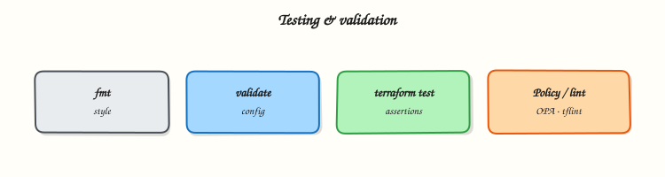

# Format, Validate, and Terraform Test

## Overview

Gate infrastructure changes with `terraform fmt`, `terraform validate`, `terraform test`, and static analysis (`tflint`) before any plan reaches production apply.

Never discover broken modules at apply time. CI should format-check, validate, lint, and run module tests on every pull request. `terraform test` exercises plan/apply-style scenarios with assertions; Terratest covers deeper Go-based integration when you need real cloud smoke checks. Policy validation sits beside these gates so unsafe plans fail before merge.

This is a core tutorial in **Module 14 · Testing & Validation** of the REBASH Academy **Terraform for Cloud & DevOps Engineers** series — written for Cloud, DevOps, Platform, and SRE engineers.

## Prerequisites

- [Terraform Cloud and HCP Terraform](terraform-cloud-and-hcp-terraform.md)

## Learning Objectives

By the end of this tutorial, you will be able to:

- [ ] Use `terraform fmt -check` and `terraform validate` correctly  
- [ ] Author a `*.tftest.hcl` with `run` and `assert`  
- [ ] Outline Terratest vs native `terraform test`  
- [ ] Run `tflint` as static analysis  
- [ ] Place policy validation in the same PR gate

## Architecture

This topic’s control points and relationships are shown below.



## Theory

### What it is

**Testing and validation** for Terraform means proving configuration is consistent and modules behave as contracted *before* privileged apply. Core layers:

| Gate | What it catches |
|------|-----------------|
| `terraform fmt` | Style drift |
| `terraform validate` | Invalid references / types (after `init`) |
| `tflint` | Provider-aware smells, naming, deprecated patterns |
| `terraform test` | Module contract via plan/apply + asserts |
| Terratest | Go tests that often hit real APIs |
| Policy (OPA/Sentinel) | Organisational “must not” rules on plans |

`fmt` rewrites HCL to canonical style; CI uses `-check -recursive` so unformatted files fail the build. `validate` needs providers installed — always `init` first. Native **`terraform test`** uses `*.tftest.hcl` with `run` blocks (`command = plan` or `apply`) and `assert` conditions. **Terratest** is a Go library for richer integration suites. **Policy validation** evaluates planned JSON against rules; it complements unit-style module tests rather than replacing them.

### Why it matters

Template typos and wrong module outputs should fail in CI, not on Friday deploy. A pipeline that formats, validates, lints, and tests turns Terraform PRs into reviewable artefacts. Static analysis catches classes of mistakes `validate` ignores (for example AWS resource naming or unused declarations via plugins). Together these gates reduce mean time to detect packaging defects and protect remote state from merges that would destroy or misconfigure production.

### How it works

Recommended gate order:

1. `terraform fmt -check -recursive` — fail on style drift.  
2. `terraform init -backend=false` (or full init) then `terraform validate`.  
3. `tflint --recursive` (with appropriate plugins) — fail on rule violations.  
4. `terraform test` in module directories — assert outputs and planned behaviour.  
5. Optional: Terratest in a separate job for integration against a sandbox account.  
6. Policy check on `terraform show -json plan.tfplan` before apply approval.

Treat plan JSON and test failure messages as review surfaces: reviewers skim destroys, replaces, and failed asserts the same way they review application test output.

### Key concepts and comparisons

| Layer | Offline / local? | Cloud credentials? |
|-------|------------------|--------------------|
| `fmt` / `validate` | Yes (after provider download) | Usually no |
| `tflint` | Yes | No |
| `terraform test` (local provider) | Yes | No |
| `terraform test` (cloud resources) | No | Often yes |
| Terratest integration | No | Yes (sandbox) |
| Policy on plan | Needs a plan | Depends on backend |

### Common pitfalls

- Relying only on `fmt` — formatting never proved a module correct.  
- Running `validate` before `init` — schema checks need providers.  
- Assuming `terraform test` replaces policy — tests assert *your* contract; policy asserts *org* rules.  
- Flaky Terratest against shared accounts without cleanup or locking.  
- Skipping lint for “tiny” variable renames that break call sites.

## Hands-on Lab

Create a workspace for this tutorial.

```bash
mkdir -p ~/rebash-terraform/module-14/modules/hello && cd ~/rebash-terraform/module-14/modules/hello
```

**Focus:** hands-on practice for Format, Validate, and Terraform Test

### Step 1 – Core exercise

```bash
mkdir -p ~/rebash-terraform/module-14/modules/hello
cd ~/rebash-terraform/module-14

cat > modules/hello/main.tf << 'EOF'
variable "name" {
  type = string
}

resource "local_file" "greeting" {
  filename = "${path.module}/hello.txt"
  content  = "hello, ${var.name}\n"
}

output "path" {
  value = local_file.greeting.filename
}
EOF

cat > modules/hello/hello.tftest.hcl << 'EOF'
run "greets" {
  command = apply

  variables {
    name = "rebash"
  }

  assert {
    condition     = output.path != ""
    error_message = "expected non-empty path output"
  }
}
EOF

cat > versions.tf << 'EOF'
terraform {
  required_version = ">= 1.9.0"
  required_providers {
    local = {
      source  = "hashicorp/local"
      version = "~> 2.5"
    }
  }
}
EOF

terraform fmt -recursive
cd modules/hello && terraform init && terraform test
cd ~/rebash-terraform/module-14
terraform fmt -check -recursive && echo "fmt ok"
# Optional: tflint --init && tflint --recursive
```

### Final step – Cleanup note

```bash
# Keep ~/rebash-terraform/ for later tutorials; destroy disposable cloud resources from this lab
```

## Validation

- [ ] Lab commands run under `~/rebash-terraform/module-14/modules/hello/`
- [ ] You can explain each Theory section in your own words
- [ ] You used modern tooling where it applies to this topic
- [ ] You can describe one production failure mode for this topic

## Code Walkthrough

Production practice for **Format, Validate, and Terraform Test** always combines:

1. Inspect before you change (status, plan, logs, dry-run)
2. Prefer reversible, documented changes (Git, IaC, drop-ins, version pins)
3. Capture evidence (command output, pipeline logs) for handovers
4. Prefer current tools and APIs over legacy shortcuts
5. Least privilege — escalate credentials only when required

Keep runbooks short enough to follow under pressure. Automate checks; keep humans for judgement.

## Security Considerations

- Treat credentials and tokens for terraform as privileged — never commit them
- Prefer short-lived auth (OIDC, roles, SSO) over long-lived keys
- Validate blast radius before apply/deploy/delete operations
- Restrict who can approve production changes
- Collect audit logs; limit who can read sensitive traces

## Common Mistakes

!!! warning "Relying only on `fmt` — formatting never proved a module correct.  "
    Validate assumptions against the Theory section and official docs before changing production.

!!! warning "Running `validate` before `init` — schema checks need providers.  "
    Lab shortcuts (open security groups, admin roles, skip approvals) must not ship unchanged.

!!! warning "Changing production without a rollback path"
    Always know how to revert (previous artefact, prior release, state rollback, DNS failback).

## Best Practices

- Encode Format, Validate, and Terraform Test changes as code and review them in pull requests
- Pin versions (images, modules, actions, provider plugins)
- Separate environments with clear promotion gates
- Alert on symptoms with runbooks attached
- Destroy lab resources; tag everything with owner and expiry where possible

## Troubleshooting

| Symptom | Likely cause | Fix |
|---------|--------------|-----|
| Auth / permission denied | Wrong identity, policy, or scope | Check caller identity, roles, and least-privilege policies |
| Timeout / no route | Network, DNS, security group, or endpoint | Trace path, DNS, and allow-lists before retrying |
| Drift / unexpected plan | Manual change or wrong state/workspace | Reconcile desired vs actual; avoid click-ops on managed resources |
| Pipeline/job red | Flaky step, cache, or missing secret | Read failing step logs; bisect recent workflow/config changes |
| Cost spike | Idle load balancer, NAT, oversized compute | Inventory billable resources; stop/delete labs promptly |

## Summary

**Format, Validate, and Terraform Test** is essential for Cloud and DevOps engineers working with terraform. Practise the lab until the inspection and change path is muscle memory, then continue the track.

## Interview Questions

1. How does **Format, Validate, and Terraform Test** show up when operating Cloud or production platforms?
2. What would you check first if this area misbehaves in production?
3. Which modern tools or APIs replace older equivalents here?
4. What security control should accompany this capability?
5. How would you automate verification of this topic in CI?

!!! tip "Sample answer — question 2"
    Start with blast radius and recent changes, gather evidence (logs, status, plan/diff), then fix forward with a known rollback path — not guesswork.

## Related Tutorials

- [Course overview](index.md)
- - [Terraform Security and Secrets](terraform-security-and-secrets.md)

## References

- [terraform test](https://developer.hashicorp.com/terraform/language/tests) · [tflint](https://github.com/terraform-linters/tflint) · [Terratest](https://terratest.gruntwork.io/)
