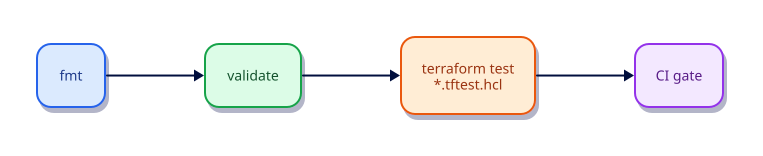

# Format, Validate, and Terraform Test

## Overview

Quality gates keep infrastructure changes safe: canonical formatting, static validation, and `terraform test` for module behavior. Wire them into CI before any apply job.

This is **Tutorial 16** in **Module 5: Quality and Security** of the REBASH Academy Terraform track.

## Learning Objectives

By the end of this tutorial, you will be able to:

- [ ] Use terraform fmt and fmt -check
- [ ] Run terraform validate after init
- [ ] Author *.tftest.hcl tests with assertions
- [ ] Integrate gates into CI
- [ ] Interpret test failures

## Prerequisites

- Completed Import, Moved, and Safe Refactors

- Terraform CLI **1.9+** (1.15.x recommended)
- Ability to create directories and edit files

## Architecture




## Theory

### terraform test

Test files use `run` blocks to execute plans/applies against a module and `assert` conditions on outputs.

```hcl
run "ok" {
  command = apply
  assert {
    condition     = output.path != ""
    error_message = "path should be set"
  }
}
```

### Why this topic matters in production

Teams that skip **fmt, validate, and Terraform test** eventually pay in outages: unreviewable plans, brittle
refactors, or secrets leaking into logs. Treat this tutorial as the minimum bar for merging
Terraform changes on a shared state file.

### Practical mental model

1. Write the smallest config that proves the idea
2. `fmt` / `validate` / `plan` until the diff matches your intent
3. Apply only after you can explain every create/update/replace line
4. Destroy lab resources so the next exercise starts clean

## Hands-on Lab

### Step 1 – Module under test

```bash
mkdir -p ~/rebash-tf-test/modules/hello/tests
cd ~/rebash-tf-test
```

`modules/hello/versions.tf`:

```hcl
terraform {
  required_version = ">= 1.9.0"
  required_providers {
    local = {
      source  = "hashicorp/local"
      version = "~> 2.9"
    }
  }
}
```

`modules/hello/variables.tf`:

```hcl
variable "name" {
  type = string
}
```

`modules/hello/main.tf`:

```hcl
resource "local_file" "hello" {
  filename = "${path.module}/hello-${var.name}.txt"
  content  = "hello ${var.name}\n"
}

output "path" {
  value = local_file.hello.filename
}

output "name" {
  value = var.name
}
```

### Step 2 – Terraform test file

`modules/hello/tests/basic.tftest.hcl`:

```hcl
variables {
  name = "rebash"
}

run "creates_greeting" {
  command = apply

  assert {
    condition     = output.name == "rebash"
    error_message = "name output should echo the variable"
  }

  assert {
    condition     = length(output.path) > 0
    error_message = "path output must be non-empty"
  }
}
```

### Step 3 – Run tests and fmt/validate

```bash
terraform -chdir=modules/hello fmt
terraform -chdir=modules/hello init -input=false
terraform -chdir=modules/hello validate
terraform -chdir=modules/hello test
```

**Expected:** test run passes with apply + assertions.

## Code Walkthrough

Tests should be deterministic: avoid random providers unless you assert on patterns, not exact IDs.


Re-read every argument in the lab through the lens of **fmt, validate, and Terraform test**.
For each resource address, ask: what happens on the next plan if I change this value?
Update in place, replace, or no-op? That habit is how you avoid surprise destroys.

## Validation

Run the lab to completion, then confirm:

```bash
terraform fmt -check
terraform init -input=false
terraform validate
terraform plan -input=false
```

| Check | Pass criteria |
|-------|----------------|
| Formatting | `fmt -check` exits 0 |
| Configuration | `validate` succeeds after init |
| Intent | Plan matches the tutorial’s expected creates/updates only |
| Topic focus | You can explain how this lab demonstrates fmt, validate, and Terraform test |
| Cleanup | Destroy (or documented teardown) left no stray lab files |

## Best Practices

- Keep examples small enough to run without cloud credentials unless the topic requires otherwise
- Document assumptions (CLI version, providers, working directory) at the top of the root module
- Prefer explicitness over cleverness when teaching **fmt, validate, and Terraform test**
- Add CI checks (`fmt`, `validate`, plan) as soon as a root is shared
- Write outputs that help the next human debug, not just the next machine

## Security Considerations

- Assume state and plan output may contain secrets related to **fmt, validate, and Terraform test**
- Use least-privilege credentials whenever a provider needs authentication
- Do not commit tfvars with real secrets; use examples with placeholders
- Review plans for unexpected destroys before apply
- Limit who can unlock state and who can approve production applies

## Common Mistakes

!!! warning "Only formatting in CI"
    Invalid configs merge. **Fix:** fmt + validate + test + plan.

## Troubleshooting

| Issue | Cause | Solution |
|-------|-------|----------|
| validate fails | Missing init or syntax error | Run `terraform init`, read the file:line in the error |
| Plan shows replace unexpectedly | ForceNew argument changed | Confirm intent; use moved/lifecycle if refactoring |
| Provider auth errors | Credentials not available | Export the documented env vars for the provider |
| Topic confusion around fmt, validate, and Terraform test | Skipped theory | Re-read Theory, then re-run the lab from a clean directory |
| Leftover lab files | Destroy skipped | Re-run destroy or delete the lab directory after state cleanup |

## Interview Questions

1. What does terraform test add beyond validate?
2. Where do .tftest.hcl files live?
3. How do you run tests in CI?
4. What assertions are useful for a module?
5. Why is fmt -check valuable in pull requests?
6. What can validate not catch?
7. How do you structure tests for child modules?
8. When do integration-style tests need cloud credentials?
9. How do you keep tests hermetic with local providers?
10. What is the difference between unit and contract tests here?
11. How do you fail a pipeline on test failure?
12. Why test outputs and not only resources?

## Summary

- Master **fmt, validate, and Terraform test** before moving to the next tutorial in the track
- Every shared root needs formatting, validation, and a reviewed plan
- Prefer small, reversible labs that you can destroy confidently
- Carry security and state hygiene forward into every later module

## Related Tutorials

- Track overview: [Terraform](index.md)
- Previous: [Import, Moved, and Safe Refactors](import-moved-and-safe-refactors.md)
- Next: [Secrets and Sensitive Values](secrets-and-sensitive-values.md)

## References

1. [Terraform documentation](https://developer.hashicorp.com/terraform/docs)
2. [Terraform CLI commands](https://developer.hashicorp.com/terraform/cli/commands)
3. [Terraform language](https://developer.hashicorp.com/terraform/language)
4. [Terraform Registry](https://registry.terraform.io/)
5. [Version constraints](https://developer.hashicorp.com/terraform/language/expressions/version-constraints)
