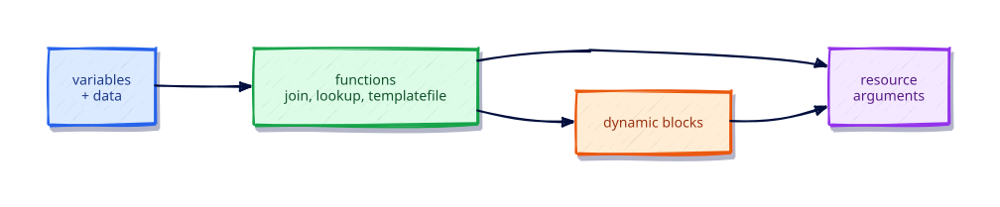

# Functions, Templates, and Dynamic Blocks

## Overview

Terraform expressions include a rich function library. `templatefile` keeps large text maintainable, and `dynamic` blocks generate nested blocks from collections when providers require them.

This is **Tutorial 14** in **Module 4: Language Power Tools** of the REBASH Academy Terraform track.

## Learning Objectives

By the end of this tutorial, you will be able to:

- [ ] Use common functions (join, merge, try, templatefile)
- [ ] Render files with templatefile and template variables
- [ ] Write a dynamic block safely
- [ ] Prefer clarity over clever one-liners
- [ ] Know where to find the function reference

## Prerequisites

- Completed Meta-Arguments — count, for_each, and lifecycle

- Terraform CLI **1.9+** (1.15.x recommended)
- Ability to create directories and edit files

## Architecture




## Theory

### Essential functions

`join`, `split`, `merge`, `lookup`, `try`, `can`, `coalesce`, `length`, `keys`, `values`,
`toset`, `tomap`, `jsonencode`, `yamlencode`, `file`, `templatefile`.

### `templatefile`

```hcl
templatefile("${path.module}/app.tftpl", {
  name = var.name
})
```

### `dynamic`

Use sparingly when a resource expects repeated nested blocks. Overuse harms readability.

## Hands-on Lab

```bash
mkdir -p ~/rebash-tf-fn && cd ~/rebash-tf-fn
cat > app.tftpl <<'EOF'
# App config
name=${name}
owners=${owners}
EOF
```

```hcl
terraform {
  required_version = ">= 1.9.0"
  required_providers {
    local = {
      source  = "hashicorp/local"
      version = "~> 2.9"
    }
  }
}

variable "name" { type = string default = "checkout" }
variable "owners" { type = list(string) default = ["platform", "app"] }

locals {
  rendered = templatefile("${path.module}/app.tftpl", {
    name   = var.name
    owners = join(",", var.owners)
  })
}

resource "local_file" "app" {
  filename = "${path.module}/app.conf"
  content  = local.rendered
}
```

```bash
terraform init -input=false && terraform apply -input=false -auto-approve
cat app.conf
terraform destroy -input=false -auto-approve
```

## Code Walkthrough

Templates keep HCL free of giant heredocs and allow reuse across environments.

Explain every resource argument you introduced in the lab: why it exists, what happens if omitted, and how it appears in state after apply. Keep `required_version` and `required_providers` in every root module you create going forward.

## Validation

```bash
terraform fmt -check
terraform init -input=false
terraform validate
terraform plan -input=false
```

| Check | Pass criteria |
|-------|----------------|
| fmt | Exit code 0 |
| validate | Configuration valid |
| plan/apply | Matches the lab expectations |

## Best Practices

- Keep root modules explicit about `required_version` and `required_providers`
- Prefer readable modules over clever expressions
- Run plans in CI before any production apply
- Document outputs that other stacks consume
- Treat state and plan artifacts as sensitive

## Security Considerations

- Limit who can read remote state
- Do not commit secrets in tfvars or code
- Use least-privilege credentials for providers
- Review plan output for unexpected destroys
- Enable encryption and locking on remote backends when you leave local labs

## Common Mistakes

!!! warning "Calling file() on missing paths"
    Plan fails. **Fix:** Ensure files exist or use template modules.

## Troubleshooting

| Issue | Cause | Solution |
|-------|-------|----------|
| Provider download fails | Network/registry blocked | Check access to registry.terraform.io |
| validate fails before init | Providers not installed | Run `terraform init` |
| Unexpected replace | ForceNew argument change | Read plan carefully; use moved/for_each wisely |
| State locked | Another apply in progress | Wait or follow backend unlock procedures carefully |
| Permission denied writing files | Directory permissions | Ensure workspace is writable |

## Interview Questions

1. What problem does Functions, Templates, and Dynamic Blocks solve in a Terraform workflow?
2. How does this topic change what you put in Git versus what stays local or remote?
3. Which official HashiCorp documentation would you consult before changing production?
4. How would you validate a change related to this topic in CI before apply?
5. What failure mode appears if two engineers ignore this topic on the same state?
6. How does this interact with Terraform state?
7. What is a secure default related to this topic?
8. Describe a common anti-pattern and its fix.
9. How would you explain this topic to a teammate in two minutes?
10. What production checklist item captures this topic?
11. When would you intentionally not use the default approach taught here?
12. How does this topic differ between a root module and a child module?

## Summary

- Terraform expressions include a rich function library. `templatefile` keeps large text maintainable, and `dynamic` blocks generate nested blocks from collections when providers require them.
- Practice the lab until `fmt` / `validate` / `plan` are muscle memory
- Carry forward provider pins, sensitive handling, and plan-before-apply discipline

## Related Tutorials

- Track overview: [Terraform](index.md)
- Previous: [Meta-Arguments — count, for_each, and lifecycle](meta-arguments-count-for-each-and-lifecycle.md)
- Next: [Import, Moved, and Safe Refactors](import-moved-and-safe-refactors.md)

## References

1. [Terraform documentation](https://developer.hashicorp.com/terraform/docs)
2. [Terraform CLI commands](https://developer.hashicorp.com/terraform/cli/commands)
3. [Terraform language](https://developer.hashicorp.com/terraform/language)
4. [Terraform Registry](https://registry.terraform.io/)
5. [Version constraints](https://developer.hashicorp.com/terraform/language/expressions/version-constraints)
