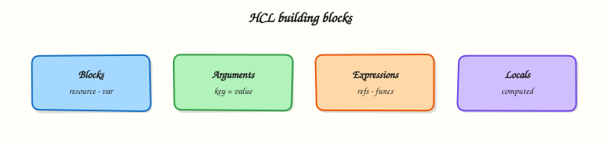

# HCL Fundamentals: Blocks, Arguments, and Expressions

## Overview

**HashiCorp Configuration Language (HCL)** is Terraform’s configuration syntax — human-readable, JSON-compatible when needed, and structured around **blocks**, **arguments**, and **expressions**. Every resource, variable, and output is a block; settings inside are arguments whose values can be literals or computed expressions. Fluency in HCL separates copy-paste configs from engineers who can debug plans and design reusable modules.

This is **Tutorial 4** in **Module 4: HCL Fundamentals** of the REBASH Academy **Terraform for Cloud & DevOps Engineers** series — written for Cloud, DevOps, Platform, and SRE engineers. You will deconstruct HCL structure, use variables, locals, outputs, and functions, and build a multi-file root module that provisions **Docker containers** from computed names and tags — topic-specific practice with real apply proof.

## Prerequisites

- [Terraform Workflow: Init, Plan, and Apply](terraform-workflow-init-plan-apply.md)
- Comfort reading YAML/JSON and basic shell
- Terraform 1.5+ with Module 3 workflow experience
- **Docker Engine running** (`docker info` succeeds)

## Learning Objectives

By the end of this tutorial, you will be able to:

- [ ] Identify block types, labels, and arguments in Terraform configuration
- [ ] Write input variables, locals, and outputs with correct reference syntax
- [ ] Use expressions: interpolation, operators, and common built-in functions
- [ ] Split configuration across multiple `.tf` files in one module
- [ ] Apply and read outputs that prove expression evaluation

## Architecture

HCL files in a module merge into one configuration tree. The CLI parses blocks, evaluates expressions in dependency order, and passes resolved values to providers at apply time.



## Theory

### What it is

HCL syntax building blocks:

| Element | Description | Example |
|---------|-------------|---------|
| **Block** | Structured section with type and optional labels | `resource "local_file" "report" { ... }` |
| **Argument** | Name = value inside a block | `filename = "out.txt"` |
| **Expression** | Computed value | `"prefix-${var.env}"`, `join(",", var.list)` |
| **Identifier** | Reference to named object | `var.region`, `local.tags`, `local_file.report.content` |

Block header pattern:

```hcl
block_type "label1" "label2" {
  argument_name = expression
}
```

Multiple `.tf` files in the same directory compose **one module** — file boundaries are organisational only.

### Why it matters

Clear HCL improves:

- **Pull request reviews** — reviewers spot wrong types and missing defaults quickly
- **Module interfaces** — variables in, outputs out, locals for internal glue
- **DRY configuration** — locals and functions reduce copy-paste CIDR and tag blocks
- **Debugging plans** — understanding references explains unexpected `(known after apply)`

Production repos split by concern: `versions.tf`, `variables.tf`, `locals.tf`, `main.tf`, `outputs.tf`.

### How it works

#### Blocks (common types)

| Block | Labels | Purpose |
|-------|--------|---------|
| `terraform` | none | Backend, required_version, required_providers |
| `provider` | provider name | Provider configuration |
| `variable` | name | Input parameter |
| `locals` | none | Local values (single block, many args) |
| `output` | name | Exported value after apply |
| `resource` | type, name | Managed infrastructure object |
| `data` | type, name | Read-only existing object (Module 11) |

#### Arguments vs attributes

In configuration you write **arguments**. After apply, state stores **attributes** (including read-only ones from the provider). Reference attributes with `<type>.<name>.<attribute>`:

```hcl
local_file.example.content
```

#### Variables

```hcl
variable "environment" {
  type        = string
  description = "Deployment tier"
  default     = "dev"
}
```

Reference: **`var.environment`**

Types: `string`, `number`, `bool`, `list()`, `map()`, `object({ ... })`, `set()`, `tuple()`.

#### Locals

```hcl
locals {
  name_prefix = "rebash-${var.environment}"
  common_tags = {
    env  = var.environment
    repo = "terraform-course"
  }
}
```

Reference: **`local.name_prefix`**, **`local.common_tags`**

Locals cannot be set from CLI; they reduce repetition inside the module.

#### Outputs

```hcl
output "report_path" {
  description = "Path to generated report file"
  value       = local_file.service_report.filename
}
```

Reference elsewhere: **`module.foo.report_path`** (child module) or `terraform output report_path` on CLI.

#### Expressions

| Category | Examples |
|----------|----------|
| Literals | `"prod"`, `42`, `true`, `["a", "b"]` |
| Interpolation | `"${var.env}-app"` embeds variable values in strings (Terraform 0.12+ template syntax) |
| Operators | `+`, `==`, `? :`, `&&` |
| Functions | `join`, `merge`, `lookup`, `format`, `length`, `upper` |

Conditional:

```hcl
var.enable_monitoring ? "enabled" : "disabled"
```

#### Functions (frequently used)

```hcl
join(", ", var.services)
merge(local.common_tags, var.extra_tags)
format("env=%s", var.environment)
upper(var.environment)
length(var.services)
```

Full reference: [Terraform functions](https://developer.hashicorp.com/terraform/language/functions).

#### JSON syntax alternative

Terraform accepts **JSON syntax** (`.tf.json`) for machine-generated config — same semantics, different encoding. Most teams use native HCL for readability.

### Common pitfalls

- Quoting references — use `var.name` not `"var.name"` (string literal).
- Confusing **`locals { }`** (block) with **`local.x`** (reference).
- Outputting secrets without `sensitive = true` — plans and logs leak values.
- Overusing `terraform.tfvars` for secrets — use environment variables or vault (Module 15).
- Complex nested ternaries — extract to `locals` for readability.

## Hands-on Lab

### Objective

Build a multi-file HCL root module that accepts **variables**, computes **locals** with **functions**, provisions **Docker containers** per service name, and exposes **outputs** — then apply and prove containers with `docker ps`.

### Prerequisites

- Module 3 workflow completed
- **Terraform ≥ 1.5**
- **Docker Engine running** (`docker info` succeeds)

### Lab environment

Workspace: `~/rebash-terraform/module-04`

```bash
mkdir -p ~/rebash-terraform/module-04 && cd ~/rebash-terraform/module-04
```

### Real-world scenario

Platform engineering publishes a **service catalog** snippet per environment: team name, service list, and standard tags. Ticket **PLAT-204**: model inputs as variables, derive container naming with locals and `format`/`join`, attach standard labels, and export container names as outputs for a downstream pipeline — no hard-coded strings in five places.

### Step-by-step tasks

#### Task 1 – Define variables and locals

Create `variables.tf`:

```hcl
variable "environment" {
  type        = string
  description = "Environment name (dev, staging, prod)"
  default     = "dev"
}

variable "team" {
  type        = string
  description = "Owning team identifier"
  default     = "platform"
}

variable "services" {
  type        = list(string)
  description = "Service names included in this stack"
  default     = ["api", "worker", "scheduler"]
}

variable "extra_tags" {
  type        = map(string)
  description = "Additional tags merged into common tags"
  default     = {}
}
```

Create `locals.tf`:

```hcl
locals {
  name_prefix = format("%s-%s", var.team, var.environment)
  service_csv = join(",", var.services)
  common_tags = merge(
    {
      env     = var.environment
      team    = var.team
      managed = "terraform"
    },
    var.extra_tags,
  )
}
```

**Expected output:** `variables.tf` and `locals.tf` with four variables and three local computations.

#### Task 2 – Network, image, containers, outputs, and provider pins

Create `versions.tf`:

```hcl
terraform {
  required_version = ">= 1.5.0, < 2.0.0"

  required_providers {
    docker = {
      source  = "kreuzwerker/docker"
      version = "~> 3.0"
    }
  }
}

provider "docker" {}
```

Create `main.tf`:

```hcl
resource "docker_network" "services" {
  name = "${local.name_prefix}-net"
}

resource "docker_image" "alpine" {
  name = "alpine:3.20"
}

resource "docker_container" "service" {
  for_each = toset(var.services)

  name  = format("%s-%s", local.name_prefix, each.key)
  image = docker_image.alpine.image_id

  command = ["sleep", "3600"]

  networks_advanced {
    name = docker_network.services.name
  }

  dynamic "labels" {
    for_each = local.common_tags
    content {
      label = labels.key
      value = labels.value
    }
  }
}
```

Create `outputs.tf`:

```hcl
output "network_name" {
  description = "Docker network hosting all services"
  value       = docker_network.services.name
}

output "name_prefix" {
  description = "Computed resource name prefix"
  value       = local.name_prefix
}

output "service_containers" {
  description = "Map of service name to container name"
  value       = { for k, c in docker_container.service : k => c.name }
}

output "common_tags" {
  description = "Merged tag map applied to containers"
  value       = local.common_tags
}
```

**Expected output:** Four additional files wiring Docker resources to locals and outputs.

#### Task 3 – Apply with tfvars and verify outputs

Create `lab.auto.tfvars`:

```hcl
environment = "staging"
team        = "payments"
services    = ["ledger", "gateway"]
extra_tags = {
  cost_center = "CC-42"
}
```

Run:


```bash
cd ~/rebash-terraform/module-04
terraform fmt -recursive
terraform init | tee init.txt
terraform apply -auto-approve | tee apply.txt
terraform output -json | tee outputs.json
grep -q 'payments-staging' outputs.json
docker ps --filter network=payments-staging-net --format '{{.Names}}' | tee docker-ps.txt
grep -q 'payments-staging-ledger' docker-ps.txt
grep -q 'payments-staging-gateway' docker-ps.txt
docker inspect payments-staging-ledger --format '{{index .Config.Labels "cost_center"}}' | grep -q CC-42
echo "HCL lab OK" | tee hcl-evidence.txt
```


**Expected output:** `outputs.json` contains `payments-staging`; `docker-ps.txt` lists both service containers **Up**; label `cost_center=CC-42` on ledger container; `hcl-evidence.txt` contains `HCL lab OK`.

### Validation steps

- [ ] Variables accept types and defaults; overridden by `lab.auto.tfvars`
- [ ] Locals use `format`, `join`, and `merge`
- [ ] `for_each` created one container per service name
- [ ] Output values match applied container names
- [ ] `docker ps` proves both containers running on the shared network

### Common errors and fixes

| Error | Cause | Fix |
|-------|-------|-----|
| `Reference to undeclared input variable` | Typo in `var.` name | Match `variable` block label |
| `Invalid function argument` | Wrong type to `join`/`merge` | Check variable types; cast if needed |
| `A local value named "x" was already defined` | Duplicate in second `locals` block | Merge into one `locals` block (unique names) |
| Container name conflict | Prior lab left container | `docker rm -f payments-staging-ledger` or change tfvars |
| tfvars not applied | Wrong filename or path | Use `*.auto.tfvars` or `-var-file=` |

### Challenge exercise

Create `hcl-inspect.sh`:


```bash
#!/usr/bin/env bash
set -euo pipefail
cd ~/rebash-terraform/module-04
terraform output -raw name_prefix | tee prefix.txt
test "$(cat prefix.txt)" = "payments-staging"
python3 -c "
import json
o = json.load(open('outputs.json'))
assert o['common_tags']['value']['cost_center'] == 'CC-42'
assert len(o['service_containers']['value']) == 2
print('expression inspect OK')
" | tee challenge-hcl.txt
docker ps --filter name=payments-staging --format '{{.Names}}' | wc -l | grep -q '^2$'
```


Run:

```bash
chmod +x ~/rebash-terraform/module-04/hcl-inspect.sh
~/rebash-terraform/module-04/hcl-inspect.sh
```

**Expected output:** `challenge-hcl.txt` contains `expression inspect OK`; exactly two containers match the prefix.

### Learning outcomes

- You structured a module across variables, locals, main, outputs, and versions files
- You used functions and collection expressions to shape real Docker resource names
- You connected outputs to resource attributes post-apply
- You validated tfvars override behaviour with `docker ps` evidence

### Cleanup

```bash
cd ~/rebash-terraform/module-04
terraform destroy -auto-approve
rm -f init.txt apply.txt outputs.json hcl-evidence.txt prefix.txt challenge-hcl.txt docker-ps.txt
rm -rf .terraform .terraform.lock.hcl terraform.tfstate terraform.tfstate.backup
```

## Validation

- [ ] Completed lab under `~/rebash-terraform/module-04` with `docker ps` evidence
- [ ] Can label blocks, arguments, and expressions in sample HCL
- [ ] Used variables, locals, outputs, and at least three functions
- [ ] Can describe one production failure mode (e.g. sensitive output leakage)

## Code Walkthrough

1. **Split files by intent** — reviewers find variables faster in `variables.tf`.
2. **Describe every variable** — `description` fields generate docs and IDE hints.
3. **Locals for repetition** — if it appears twice, consider `local` or a module.
4. **Outputs as contracts** — downstream stacks consume outputs, not parsed files.
5. **Type constraints early** — catch bad tfvars at plan, not at 2 a.m. apply.

## Security Considerations

- Mark outputs and variables **`sensitive = true`** when values include tokens or private URLs.
- Do not commit secrets in `.tfvars` — use CI secret stores and `TF_VAR_*` environment variables.
- `local_file` resources write disk content — restrict paths and permissions in shared CI runners.
- Review `for` expressions copying sensitive maps — they may duplicate secrets into new structures logged by plan.
- JSON output from `terraform output -json` may land in CI logs — scrub artefacts.

## Common Mistakes

!!! warning "String quoting resource references"
    `filename = "local_file.x.filename"` creates a literal string, not a reference.  
    **Fix:** Drop quotes: `filename = local_file.x.filename` or interpolation without mistaken nesting.

!!! warning "God single main.tf"
    Five hundred lines in one file slows reviews and encourages duplication.  
    **Fix:** Split variables, locals, outputs; keep resources grouped by service.

!!! warning "Outputs for everything"
    Exporting fifty outputs couples modules tightly.  
    **Fix:** Publish minimal stable interface; keep internal locals private.

!!! warning "Ignoring type constraints"
    Untyped variables accept anything until plan fails deep in a module.  
    **Fix:** Add `type`, `validation` blocks (Module 7), and sensible `default` only when safe.

## Best Practices

- Run `terraform fmt -recursive` before commit — canonical HCL formatting.
- Use **`object()`** and **`map()`** types for structured inputs instead of flattening into many variables.
- Prefer **`merge()`** for tags with consistent baseline keys.
- Document expected tfvars in `example.tfvars` (no secrets) committed to Git.
- Use **`description`** on outputs explaining stability guarantees for consumers.

## Troubleshooting

| Symptom | Likely cause | Fix |
|---------|--------------|-----|
| `Invalid reference` | Wrong prefix (`var` vs `local` vs resource name) | Check block labels |
| Plan shows `(known after apply)` | Value computed only after resource exists | Normal for some attributes; reorder if dependency wrong |
| Function error on empty list | `join` on empty | Provide default `[]` or conditional |
| tfvars ignored | Not auto-loaded name | Rename to `*.auto.tfvars` or pass `-var-file` |
| Cyclic dependency | Local references resource that references local | Break cycle with clearer dependency chain |

## Summary

HCL organises infrastructure intent into **blocks** with **arguments** valued by **expressions**. Variables define inputs, locals deduplicate internal logic, outputs expose contracts, and functions transform data — all merged across `.tf` files in one module. You built a tagged service report with multi-file layout and verified outputs. Next: **Providers and the Terraform Plugin Model**.

## Interview Questions

**1. What is the difference between a block and an argument in HCL?**

??? success "Reveal answer"
    A **block** is a structured section introduced by a **block type** and optional **labels** (e.g. `resource "local_file" "x"`). **Arguments** are key-value pairs **inside** a block (`filename = "..."`). Blocks nest structure; arguments configure that block instance.

**2. When do you use locals versus variables?**

??? success "Reveal answer"
    **Variables** are module **inputs** — settable via CLI, tfvars, or calling modules. **Locals** are **internal** computed values not settable from outside — used to avoid repeating expressions and to name complex logic. If another module needs the value, prefer **output** + their variable, not exporting locals.

**3. Explain var, local, and module reference prefixes.**

??? success "Reveal answer"
    **`var.<name>`** — input variable. **`local.<name>`** — local value inside current module. **`<type>.<name>.<attr>`** — resource or data source attribute (e.g. `aws_instance.web.id`). **`module.<name>.<output>`** — output from child module. Wrong prefix is a common plan error.

**4. Name three HCL functions you use regularly and why.**

??? success "Reveal answer"
    Examples: **`merge()`** combines tag maps without dropping keys; **`join()`** builds CSV or delimiter-separated strings from lists; **`format()`** builds consistent name patterns; **`lookup()`** safely reads map keys with defaults; **`length()`** validates list sizes in validation rules. Choice depends on data shaping needs in plans.

**5. How do multiple .tf files interact in one directory?**

??? success "Reveal answer"
    All `.tf` and `.tf.json` files in a directory merge into **one module** — Terraform loads them as a single configuration. File names are convention only (`main.tf`, `variables.tf`). Duplicate block definitions (two `resource` with same type/name) error.

**6. What does (known after apply) mean in plan output?**

??? success "Reveal answer"
    The value cannot be computed until the resource exists — often because another resource’s attribute is referenced or provider computes ID at create time. It is normal for some attributes. If unexpected, check dependency order or incorrect references causing premature reads.

**7. How do you mark sensitive values in HCL?**

??? success "Reveal answer"
    Set **`sensitive = true`** on **variables** and **outputs** containing secrets. Terraform redacts them in default plan/apply output. They still exist in state — protect state backends. Prefer secret managers over HCL for actual credentials.

**8. Why might teams use JSON syntax for Terraform?**

??? success "Reveal answer"
    **`.tf.json`** suits machine-generated config from higher-level tools or pipelines that emit JSON more easily than HCL. Semantics match HCL blocks. Human-authored modules usually stay `.tf` for readability and fmt support.

## Related Tutorials

- [Terraform course index](index.md)
- **Previous:** [Terraform Workflow](terraform-workflow-init-plan-apply.md)
- **Next:** [Providers and the Terraform Plugin Model](providers-and-the-terraform-plugin-model.md)
- [Variables, Locals, and Outputs](variables-locals-and-outputs.md)

## References

- [Terraform language documentation](https://developer.hashicorp.com/terraform/language)
- [Syntax overview](https://developer.hashicorp.com/terraform/language/syntax)
- [Expressions](https://developer.hashicorp.com/terraform/language/expressions)
- [Functions](https://developer.hashicorp.com/terraform/language/functions)
- [Variables](https://developer.hashicorp.com/terraform/language/values/variables)
- [Outputs](https://developer.hashicorp.com/terraform/language/values/outputs)
- [REBASH Terraform course index](index.md)
