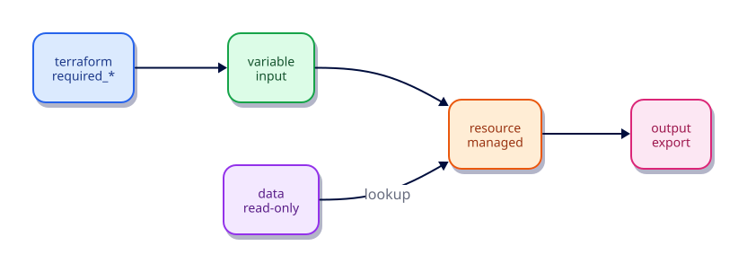

# HCL Fundamentals — Blocks, Arguments, and Expressions

## Overview

HashiCorp Configuration Language (HCL) is how you declare infrastructure. Unlike general-purpose
languages, HCL is optimised for **blocks of configuration** with arguments, nested blocks, and
expressions that reference other objects.

This tutorial builds fluency: block types, labels, types, strings, collections, references, and
a clean multi-file layout you will reuse for the rest of the track.

This is **Tutorial 3** in **Module 1: Foundations** of the REBASH Academy Terraform track.

## Learning Objectives

By the end of this tutorial, you will be able to:

- [ ] Identify terraform, variable, resource, data, output, and locals blocks
- [ ] Differentiate arguments (you set) from attributes (provider exports)
- [ ] Write typed expressions for strings, numbers, bools, lists, maps, and objects
- [ ] Reference resources with address syntax like local_file.demo.content
- [ ] Organise a root module across versions.tf, variables.tf, main.tf, outputs.tf

## Prerequisites

- Completed Installing Terraform and the CLI Workflow
- Terraform 1.9+ installed

- Terraform CLI **1.9+** (1.15.x recommended)
- Ability to create directories and edit files

## Architecture




## Theory

### Anatomy of a block

```hcl
resource "local_file" "demo" {
  filename = "${path.module}/hello.txt"
  content  = "hello"
}
```

- **Block type** — `resource`
- **Labels** — provider type `local_file`, name `demo`
- **Body** — arguments inside `{ }`

### Arguments vs attributes

| Kind | Who sets it | Example |
|------|-------------|---------|
| Argument | You in config | `filename`, `content` |
| Attribute | Provider after apply | `content_md5`, `id` |

### Types

- Primitives: `string`, `number`, `bool`
- Collections: `list(T)`, `set(T)`, `map(T)`
- Structural: `object({...})`, `tuple([...])`
- Special: `any` (avoid in modules — prefer precise types)

### Expressions and references

- Interpolation: `"prefix-${var.name}"` (often unnecessary for pure references)
- References: `var.x`, `local.y`, `local_file.demo.content`, `module.vpc.vpc_id`
- Paths: `path.module`, `path.root`, `path.cwd`

### File layout convention

| File | Contents |
|------|----------|
| `versions.tf` | `terraform` + `required_providers` |
| `variables.tf` | input variables |
| `main.tf` / `*.tf` | resources and modules |
| `outputs.tf` | outputs |
| `locals.tf` | local values (optional) |
| `terraform.tfvars` | values (often gitignored if sensitive) |

### String and heredoc patterns

Prefer direct references over unnecessary interpolation:

```hcl
# Prefer
content = var.message

# Only interpolate when building a larger string
content = "env=${var.environment} message=${var.message}"
```

Heredocs (`<<-EOT` … `EOT`) keep multi-line templates readable. Strip leading indentation with `<<-`.

### Sensitive and nullable types

Variables can be `sensitive = true` (Tutorial 17) and `nullable = false` to reject explicit `null`.
Learn the type system now so module APIs stay strict later.

### Comments and formatting

HCL supports `#` and `//` line comments plus `/* */` blocks. `terraform fmt` owns whitespace —
do not hand-align equals signs against the formatter.

## Hands-on Lab

```bash
mkdir -p ~/rebash-tf-hcl && cd ~/rebash-tf-hcl
```

`versions.tf`:

```hcl
terraform {
  required_version = ">= 1.9.0"
  required_providers {
    local = {
      source  = "hashicorp/local"
      version = "~> 2.9"
    }
    random = {
      source  = "hashicorp/random"
      version = "~> 3.9"
    }
  }
}
```

`variables.tf`:

```hcl
variable "project" {
  type        = string
  description = "Project key used in filenames"
  default     = "rebash"
}

variable "owners" {
  type        = list(string)
  description = "Team owners recorded in the artifact"
  default     = ["platform", "sre"]
}
```

`main.tf`:

```hcl
locals {
  owner_line = join(", ", var.owners)
  filename   = "${path.module}/generated/${var.project}-notes.txt"
}

resource "random_id" "suffix" {
  byte_length = 2
}

resource "local_file" "notes" {
  filename = local.filename
  content  = <<-EOT
    project = ${var.project}
    owners  = ${local.owner_line}
    suffix  = ${random_id.suffix.hex}
  EOT
  file_permission = "0644"
}
```

`outputs.tf`:

```hcl
output "notes_path" {
  value = local_file.notes.filename
}

output "suffix" {
  value = random_id.suffix.hex
}
```

```bash
terraform init -input=false
terraform apply -input=false -auto-approve
cat generated/rebash-notes.txt
terraform destroy -input=false -auto-approve
```

## Code Walkthrough

### `locals`

Locals derive values once and reuse them — clearer than repeating `join(...)` everywhere.

### `random_id`

Demonstrates a managed resource that exports attributes (`hex`) consumed by another resource —
the core of Terraform composition.


### Locals vs variables

| Construct | Input from caller? | Typical use |
|-----------|--------------------|-------------|
| `variable` | Yes | Tunables and environment differences |
| `locals` | No | Derived names, joins, maps you do not want callers to override |

`random_id.suffix` forces a unique attribute into the file so you can see resource references
(`random_id.suffix.hex`) flow into `local_file` content through the dependency graph.

## Validation

```bash
terraform fmt -check
terraform init -input=false
terraform validate
terraform apply -input=false -auto-approve
terraform output
cat generated/rebash-notes.txt
terraform destroy -input=false -auto-approve
```

| Check | Pass criteria |
|-------|----------------|
| Layout | Separate `versions.tf`, `variables.tf`, `main.tf`, `outputs.tf` |
| Types | `owners` is `list(string)`; validate fails if you pass a string |
| Outputs | `notes_path` and `suffix` print after apply |
| Content | Notes file includes project, owners, and hex suffix |

## Best Practices

- One concern per file (`variables.tf`, `outputs.tf`) so diffs stay reviewable
- Give every variable a `type` and `description`
- Prefer precise types over `any`
- Use `locals` for derived values; do not make callers pass the same join repeatedly
- Let `terraform fmt` own formatting in CI

## Security Considerations

- Do not put secrets in default variable values or committed `.tfvars`
- Mark secret variables `sensitive = true` as soon as you introduce them
- Avoid writing credentials into `local_file` content even in labs — bad habits transfer
- Review expressions that concatenate user input into filenames for path traversal risks

## Common Mistakes

!!! warning "Treating attributes as arguments before apply"
    Unknown values until plan/apply. **Fix:** Reference attributes; let Terraform propagate dependencies.

!!! warning "Using `any` everywhere"
    Hides mistakes. **Fix:** Type variables and outputs precisely.

!!! warning "One giant `main.tf`"
    Hard reviews. **Fix:** Split by concern early.

## Troubleshooting

| Issue | Cause | Solution |
|-------|-------|----------|
| Unexpected type error | List vs string mismatch | Match `type` constraints; read the error address |
| Reference unknown | Typo in resource name | Use `terraform console` or address autocomplete in your editor |
| Heredoc markers in output | Wrong delimiter indent | Use `<<-` and aligned closing marker |
| fmt churn in PRs | Mixed editor settings | Run `terraform fmt` before every commit |

## Interview Questions

1. What is the difference between an argument and an attribute in HCL?
2. When should you use a local value instead of a variable?
3. Why avoid `any` in module input variables?
4. How does resource address syntax work (`local_file.notes.content`)?
5. What do `path.module`, `path.root`, and `path.cwd` mean?
6. How would you express a map of tags with a type constraint?
7. Why split root modules across multiple `.tf` files?
8. What happens if you omit `type` on a variable?
9. How do heredocs help with multi-line templates?
10. What is the difference between `list` and `set`?
11. How does `terraform fmt` affect code review quality?
12. Give an example of unnecessary string interpolation and the cleaner form.

## Summary

- HCL is block-oriented: type, labels, and a body of arguments
- Distinguishing arguments from attributes prevents “where did that value come from?” confusion
- Typed variables and locals keep modules readable and safe
- A conventional multi-file layout scales from labs to production roots

## Related Tutorials

- Track overview: [Terraform](index.md)
- Previous: [Installing Terraform and the CLI Workflow](installing-terraform-and-the-cli-workflow.md)
- Next: [Providers and the Terraform Plugin Model](providers-and-the-terraform-plugin-model.md)
- Cheat sheet: [Terraform Cheat Sheet](../cheatsheets/terraform.md)
- Interview prep: [Terraform Interview Prep](../interview/terraform.md)
- Learning path: [DevOps Engineer](../learning-paths/devops-engineer.md)

## References

1. [Terraform documentation](https://developer.hashicorp.com/terraform/docs)
2. [Terraform CLI commands](https://developer.hashicorp.com/terraform/cli/commands)
3. [Terraform language](https://developer.hashicorp.com/terraform/language)
4. [Terraform Registry](https://registry.terraform.io/)
5. [Version constraints](https://developer.hashicorp.com/terraform/language/expressions/version-constraints)
