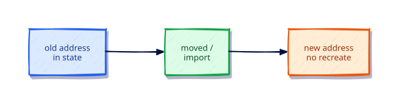

# Import, Moved, and Safe Refactors

## Overview

Refactoring should not mean recreate-the-world. Modern Terraform supports `import` blocks and `moved` blocks so you can adopt existing objects and rename addresses without destroy/create.

This is **Tutorial 15** in **Module 4: Language Power Tools** of the REBASH Academy Terraform track.

## Learning Objectives

By the end of this tutorial, you will be able to:

- [ ] Import existing objects into state
- [ ] Rename addresses with moved blocks
- [ ] Read plans to confirm no destructive changes
- [ ] Describe removed blocks at a high level
- [ ] Refactor modules without downtime where possible

## Prerequisites

- Completed Functions, Templates, and Dynamic Blocks

- Terraform CLI **1.9+** (1.15.x recommended)
- Ability to create directories and edit files

## Architecture




## Theory

### `import` block

```hcl
import {
  to = local_file.adopted
  id = "/absolute/or/provider-specific/id"
}
```

### `moved` block

```hcl
moved {
  from = local_file.old
  to   = local_file.new
}
```

Plan should show **move** / no-op rather than destroy+create.

### Why this topic matters in production

Teams that skip **import, moved blocks, and safe refactors** eventually pay in outages: unreviewable plans, brittle
refactors, or secrets leaking into logs. Treat this tutorial as the minimum bar for merging
Terraform changes on a shared state file.

### Practical mental model

1. Write the smallest config that proves the idea
2. `fmt` / `validate` / `plan` until the diff matches your intent
3. Apply only after you can explain every create/update/replace line
4. Destroy lab resources so the next exercise starts clean

## Hands-on Lab

```bash
mkdir -p ~/rebash-tf-move && cd ~/rebash-tf-move
```

First apply as `local_file.old`, then add a `moved` block to `local_file.new` and change the resource name accordingly. Confirm:

```bash
terraform plan
# expect: move / update in-place, not destroy
```

Full starter:

```hcl
terraform {
  required_version = ">= 1.9.0"
  required_providers {
    local = {
      source  = "hashicorp/local"
      version = "~> 2.9"
    }
  }
}

resource "local_file" "new" {
  filename = "${path.module}/moved.txt"
  content  = "safe-refactor\n"
}

moved {
  from = local_file.old
  to   = local_file.new
}
```

(Create `old` first without the moved block, apply, then rename.)

## Code Walkthrough

moved updates state addresses; the real file is untouched when filename arguments stay equal.


Re-read every argument in the lab through the lens of **import, moved blocks, and safe refactors**.
For each resource address, ask: what happens on the next plan if I change this value?
Update in place, replace, or no-op? That habit is how you avoid surprise destroys.

## Validation

Run the lab to completion, then confirm:

```bash
terraform fmt -check
terraform init -input=false
terraform validate
terraform plan -input=false
```

| Check | Pass criteria |
|-------|----------------|
| Formatting | `fmt -check` exits 0 |
| Configuration | `validate` succeeds after init |
| Intent | Plan matches the tutorial’s expected creates/updates only |
| Topic focus | You can explain how this lab demonstrates import, moved blocks, and safe refactors |
| Cleanup | Destroy (or documented teardown) left no stray lab files |

## Best Practices

- Keep examples small enough to run without cloud credentials unless the topic requires otherwise
- Document assumptions (CLI version, providers, working directory) at the top of the root module
- Prefer explicitness over cleverness when teaching **import, moved blocks, and safe refactors**
- Add CI checks (`fmt`, `validate`, plan) as soon as a root is shared
- Write outputs that help the next human debug, not just the next machine

## Security Considerations

- Assume state and plan output may contain secrets related to **import, moved blocks, and safe refactors**
- Use least-privilege credentials whenever a provider needs authentication
- Do not commit tfvars with real secrets; use examples with placeholders
- Review plans for unexpected destroys before apply
- Limit who can unlock state and who can approve production applies

## Common Mistakes

!!! warning "Renaming without moved"
    Destroy+create. **Fix:** Always add moved when changing addresses.

## Troubleshooting

| Issue | Cause | Solution |
|-------|-------|----------|
| validate fails | Missing init or syntax error | Run `terraform init`, read the file:line in the error |
| Plan shows replace unexpectedly | ForceNew argument changed | Confirm intent; use moved/lifecycle if refactoring |
| Provider auth errors | Credentials not available | Export the documented env vars for the provider |
| Topic confusion around import, moved blocks, and safe refactors | Skipped theory | Re-read Theory, then re-run the lab from a clean directory |
| Leftover lab files | Destroy skipped | Re-run destroy or delete the lab directory after state cleanup |

## Interview Questions

1. What does terraform import do to state?
2. How do import blocks differ from the CLI import command?
3. When do you use a moved block?
4. What happens if you rename a resource without moved?
5. How do you plan a zero-downtime refactor?
6. What is state mv, and when prefer moved blocks?
7. How do you verify a refactor before apply?
8. What risks remain after a successful import?
9. How do for_each address changes complicate moves?
10. When should you destroy and recreate instead?
11. How do you document a refactor for reviewers?
12. What CI checks catch accidental destroys?

## Summary

- Master **import, moved blocks, and safe refactors** before moving to the next tutorial in the track
- Every shared root needs formatting, validation, and a reviewed plan
- Prefer small, reversible labs that you can destroy confidently
- Carry security and state hygiene forward into every later module

## Related Tutorials

- Track overview: [Terraform](index.md)
- Previous: [Functions, Templates, and Dynamic Blocks](functions-templates-and-dynamic-blocks.md)
- Next: [Format, Validate, and Terraform Test](format-validate-and-terraform-test.md)

## References

1. [Terraform documentation](https://developer.hashicorp.com/terraform/docs)
2. [Terraform CLI commands](https://developer.hashicorp.com/terraform/cli/commands)
3. [Terraform language](https://developer.hashicorp.com/terraform/language)
4. [Terraform Registry](https://registry.terraform.io/)
5. [Version constraints](https://developer.hashicorp.com/terraform/language/expressions/version-constraints)
