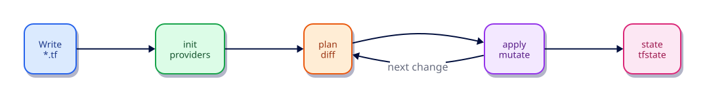

# Installing Terraform and the CLI Workflow

## Overview

Terraform is a single static binary. Getting it onto your PATH correctly — and learning the
exact order of CLI commands — prevents hours of “works on my machine” confusion later.

This tutorial covers install options on Linux/macOS/Windows (WSL), version managers, and the
daily workflow: `fmt` → `init` → `validate` → `plan` → `apply` → `destroy`. You will also learn
what belongs in Git (`.terraform.lock.hcl`) versus what never should (`.terraform/` provider
plugins and local state with secrets).

This is **Tutorial 2** in **Module 1: Foundations** of the REBASH Academy Terraform track.

## Learning Objectives

By the end of this tutorial, you will be able to:

- [ ] Install Terraform 1.9+ and verify with `terraform version`
- [ ] Explain when to use package installs vs tfenv/asdf vs direct binaries
- [ ] Run the standard CLI loop with non-interactive flags suitable for CI
- [ ] Distinguish `.terraform/`, `.terraform.lock.hcl`, and `terraform.tfstate`
- [ ] Use `terraform plan -out` and `terraform apply <planfile>` safely

## Prerequisites

- Completed Introduction to Terraform and Infrastructure as Code
- Terminal access with permission to install software (or use a package manager)
- Network access to download Terraform and providers

- Terraform CLI **1.9+** (1.15.x recommended)
- Ability to create directories and edit files

## Architecture




## Theory

### Installation options

| Method | Best for | Notes |
|--------|----------|-------|
| HashiCorp apt/yum packages | Persistent Linux workstations/servers | Signed packages; easy upgrades |
| Official zip binary | Air-gapped or minimal images | Verify checksums/GPG |
| Homebrew (`brew install terraform`) | macOS / Linuxbrew | Convenient; pin version in team docs |
| **tfenv** / **asdf** | Teams juggling many versions | Per-directory `.terraform-version` |
| Container image | CI only | Mount credentials carefully |

Prefer a **version manager** when you contribute to multiple repos that pin different
`required_version` constraints.

### The CLI loop

1. **`terraform fmt`** — canonical formatting (diff-friendly)
2. **`terraform init`** — download providers/modules; configure backend
3. **`terraform validate`** — syntax/consistency checks (needs init)
4. **`terraform plan`** — show actions; optionally `-out=tfplan`
5. **`terraform apply`** — execute; prefer applying a saved plan in CI
6. **`terraform destroy`** — remove managed objects (labs / ephemeral envs)

### Important flags

- `-input=false` — never prompt (CI mandatory)
- `-chdir=DIR` — run as if DIR were the working directory
- `-auto-approve` — skip apply confirmation (use only when plan was reviewed)
- `TF_IN_AUTOMATION=1` — friendlier automation messaging
- `TF_LOG=INFO` / `TF_LOG_PATH` — debug provider/CLI issues

### What to commit

| Path | Commit? |
|------|---------|
| `*.tf`, `*.tfvars.example` | Yes |
| `.terraform.lock.hcl` | Yes (root modules) |
| `.terraform/` | **No** |
| `*.tfstate*` | **No** (use remote state + secrets handling) |
| `crash.log` | **No** |

### Why version managers matter

Production teams often pin different `required_version` floors per repository. Installing a single
global binary works for personal labs, but **tfenv** or **asdf** lets you switch with a
`.terraform-version` file checked into each repo — the same discipline as `.python-version` or `.nvmrc`.

### Automation environment variables

| Variable | Effect |
|----------|--------|
| `TF_IN_AUTOMATION=1` | Reduces chatter meant for humans; clearer for CI logs |
| `TF_INPUT=0` | Equivalent to `-input=false` for many commands |
| `TF_LOG` / `TF_LOG_PATH` | Provider and CLI debug traces (never commit logs with secrets) |

### Plan files vs re-planning

A saved plan is a **snapshot of intent**. Between plan and apply, another process can change state.
Applying the plan file still applies that snapshot; if state moved, apply fails safely rather than
silently computing a different plan. That is the point of `plan -out` in pull-request workflows.

## Hands-on Lab

### Step 1 – Verify installation

```bash
terraform version
which terraform
```

**Expected:** Terraform v1.9+ (1.15.x ideal). If missing, install from
[HashiCorp Install](https://developer.hashicorp.com/terraform/install) or:

```bash
# Example: tfenv
tfenv install 1.15.8
tfenv use 1.15.8
```

### Step 2 – Project skeleton

```bash
mkdir -p ~/rebash-tf-cli && cd ~/rebash-tf-cli
```

Create `versions.tf`:

```hcl
terraform {
  required_version = ">= 1.9.0"

  required_providers {
    local = {
      source  = "hashicorp/local"
      version = "~> 2.9"
    }
  }
}
```

Create `main.tf`:

```hcl
variable "stage" {
  type    = string
  default = "cli-lab"
}

resource "local_file" "marker" {
  filename        = "${path.module}/out/${var.stage}.txt"
  content         = "Terraform CLI workflow OK\n"
  file_permission = "0644"
}

output "path" {
  value = local_file.marker.filename
}
```

### Step 3 – Non-interactive workflow

```bash
terraform fmt
terraform init -input=false
terraform validate
terraform plan -input=false -out=tfplan
terraform apply -input=false tfplan
cat out/cli-lab.txt
terraform output
```

### Step 4 – Inspect artifacts

```bash
ls -la .terraform/providers | head
test -f .terraform.lock.hcl && echo "lockfile present"
terraform providers
```

### Step 5 – Clean up

```bash
terraform destroy -input=false -auto-approve
```

## Code Walkthrough

### `terraform init`

Reads `required_providers`, contacts the Registry, writes the dependency lock file, and
caches plugins under `.terraform/providers/...`.

### Saved plans

`plan -out=tfplan` produces a binary plan. Applying that file ensures CI applies **exactly**
what was reviewed — not a newly computed plan that might differ if state changed.


### `local_file.marker` arguments

| Argument | Purpose |
|----------|---------|
| `filename` | Absolute or module-relative path of the file Terraform manages |
| `content` | Desired file body; changing it updates in place |
| `file_permission` | POSIX mode string; omit and the provider uses its default |

After apply, state stores the path and content checksum so the next plan can detect drift if you edit the file by hand.

## Validation

Confirm the CLI workflow end-to-end:

```bash
terraform version | head -1
terraform fmt -check
terraform init -input=false
terraform validate
terraform plan -input=false -out=tfplan
terraform show -no-color tfplan | head -40
terraform apply -input=false tfplan
test -f out/cli-lab.txt
terraform destroy -input=false -auto-approve
```

| Check | Pass criteria |
|-------|----------------|
| Version | Terraform 1.9+ reported |
| Lockfile | `.terraform.lock.hcl` created after init |
| Plan file | `tfplan` exists and `show` prints a create for `local_file.marker` |
| Apply | `out/cli-lab.txt` contains the expected marker string |
| Cleanup | Destroy removes the managed file |

## Best Practices

- Pin CLI versions per repository with tfenv/asdf and document the floor in `required_version`
- Always run `fmt` before commit; enable `fmt -check` in CI
- Prefer `plan -out` + apply of that artifact over `apply -auto-approve` on a live re-plan
- Commit `.terraform.lock.hcl` for root modules so every engineer and CI get the same providers
- Set `TF_IN_AUTOMATION=1` in pipeline jobs

## Security Considerations

- Download Terraform only from HashiCorp releases or signed distribution packages; verify checksums in air-gapped installs
- Never commit `crash.log`, plan files from production, or local state that may contain secrets
- Restrict who can run apply against shared state — CLI access equals change authority
- Treat `TF_LOG_PATH` output as sensitive; scrub before sharing support bundles

## Common Mistakes

!!! warning "Installing random Terraform forks without checksums"
    Supply-chain risk. **Fix:** Use official HashiCorp distributions or verified package repos.

!!! warning "Committing `.terraform/`"
    Huge binaries; OS-specific. **Fix:** Gitignore `.terraform/`; commit only the lock file.

!!! warning "Using `-auto-approve` without a reviewed plan"
    Accidental destroys. **Fix:** In CI: plan artifact → human review → apply that artifact.

## Troubleshooting

| Issue | Cause | Solution |
|-------|-------|----------|
| `terraform: command not found` | Binary not on PATH | Re-open shell after install; check `which terraform` |
| Wrong version in CI | Image/binary drift | Pin version explicitly; mirror tfenv file in the job |
| `init` hangs or fails TLS | Proxy / firewall | Configure HTTPS proxy; allow registry.terraform.io |
| Apply differs from reviewed plan | Re-planned instead of using `-out` | Apply the saved plan file only |
| Permission denied under `out/` | Directory missing or not writable | Create parent dirs or adjust permissions |

## Interview Questions

1. Why commit `.terraform.lock.hcl` but gitignore `.terraform/`?
2. What does `terraform plan -out=tfplan` protect you from in CI?
3. When is `-auto-approve` acceptable, and when is it dangerous?
4. How do `required_version` and a version manager work together?
5. What is the difference between `validate` and `plan`?
6. Why should production applies use a saved plan artifact?
7. How would you install Terraform on an air-gapped bastion?
8. What environment variables make Terraform safer in automation?
9. Why is `fmt -check` useful in pull requests?
10. What belongs in Git for a root module on day one?
11. How does `terraform providers` help debug version skew?
12. Describe a secure download and verification flow for the Terraform binary.

## Summary

- Install an official Terraform binary and prefer a version manager for multi-repo work
- Memorise the loop: fmt → init → validate → plan (-out) → apply → destroy
- Commit the lockfile; never commit provider caches or local state
- Use non-interactive flags and saved plans for CI-grade discipline

## Related Tutorials

- Track overview: [Terraform](index.md)
- Previous: [Introduction to Terraform and Infrastructure as Code](introduction-to-terraform-and-iac.md)
- Next: [HCL Fundamentals — Blocks, Arguments, and Expressions](hcl-fundamentals-blocks-arguments-and-expressions.md)

## References

1. [Terraform documentation](https://developer.hashicorp.com/terraform/docs)
2. [Terraform CLI commands](https://developer.hashicorp.com/terraform/cli/commands)
3. [Terraform language](https://developer.hashicorp.com/terraform/language)
4. [Terraform Registry](https://registry.terraform.io/)
5. [Version constraints](https://developer.hashicorp.com/terraform/language/expressions/version-constraints)
