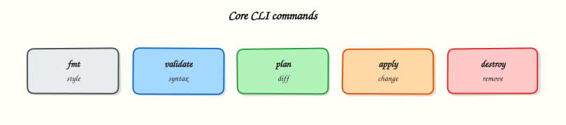

# Installing Terraform and the CLI Workflow

## Overview

Install Terraform 1.x, pin a version with tfenv or asdf, verify the binary, and understand how providers arrive from the Terraform Registry on `init`.

Install via package manager, HashiCorp packages, or a version manager. Pin the CLI version for every root module with `required_version`. Providers download from the **Terraform Registry** on first `terraform init` — not at install time.

This is a core tutorial in **Module 2 · Installing Terraform** of the REBASH Academy **Terraform for Cloud & DevOps Engineers** series — written for Cloud, DevOps, Platform, and SRE engineers.

## Prerequisites

- [Introduction to Terraform and IaC](introduction-to-terraform-and-iac.md)
- Network access to download the CLI and (later) providers

## Learning Objectives

By the end of this tutorial, you will be able to:

- [ ] Install and verify `terraform version`  
- [ ] Pin versions with tfenv or asdf  
- [ ] Explain when providers download (init + Registry)  
- [ ] List core CLI verbs you will use daily

## Architecture

This topic’s control points and relationships are shown below.



## Theory

### What it is

Installing Terraform means putting the **Terraform CLI** on your workstation or CI image. The binary alone does not ship cloud plugins; **providers** are separate plugins resolved from the [Terraform Registry](https://registry.terraform.io/) (or a private mirror) when you run `terraform init` in a configuration that declares `required_providers`.

**Version managers** such as **tfenv** or **asdf** (with a Terraform plugin) let you switch CLI versions per project — essential when repos pin different `required_version` constraints.

| Action | Purpose |
|--------|---------|
| `terraform version` | Confirm CLI (and later, provider versions after init) |
| `terraform init` | Download providers/modules; prepare backend |
| `terraform fmt` / `validate` | Format and syntax-check |
| `terraform plan` / `apply` | Preview and execute changes |

### Why it matters

Production teams pin Terraform and provider versions so plans are reproducible across laptops and pipelines. A floating “latest” binary on one engineer’s machine and an older image in CI is a classic source of “works locally” plan diffs. Enterprises often mirror the Registry or use HCP Terraform / private registries so CI does not pull unapproved plugins.

### How it works

1. Install Terraform 1.x via Homebrew, Linux packages from HashiCorp, a direct zip, or `tfenv` / `asdf`.
2. Verify with `terraform version` (expect 1.x).
3. Optionally set a `.terraform-version` (tfenv) or `.tool-versions` (asdf) in the repo.
4. Declare `required_version` and `required_providers` in a `terraform` block.
5. On `terraform init`, the CLI reads those constraints, downloads matching provider plugins into `.terraform/`, and writes a lock file (`.terraform.lock.hcl`).

You do not install AWS or Azure providers with a separate package manager for day-to-day use — `init` does that from the Registry.

### Key concepts and comparisons

| Method | Fit |
|--------|-----|
| Package manager (`brew`, apt repo) | Quick local install |
| tfenv / asdf | Multi-version teams and CI parity |
| Official zip / container image | Locked CI images and air-gapped builds |
| Registry on `init` | Provider and module distribution |

### Common pitfalls

- Installing Terraform once and never pinning — plans diverge across machines.
- Expecting providers to appear after CLI install without a configuration and `init`.
- Mixing Terraform 0.11/0.12 habits with modern 1.x workflows.
- Committing `.terraform/` (plugins cache) — commit `.terraform.lock.hcl`, not the plugin directory.
- Using a personal laptop binary for production applies — prefer CI with a pinned image.

## Hands-on Lab

Create a workspace for this tutorial.

```bash
mkdir -p ~/rebash-terraform/module-02 && cd ~/rebash-terraform/module-02
```

**Focus:** hands-on practice for Installing Terraform and the CLI Workflow

### Step 1 – Core exercise

```bash
mkdir -p ~/rebash-terraform/module-02 && cd ~/rebash-terraform/module-02

# macOS (example): brew install terraform
# Or tfenv: tfenv install 1.9.8 && tfenv use 1.9.8
# Or asdf: asdf install terraform 1.9.8 && asdf local terraform 1.9.8

terraform version

cat > versions.tf << 'EOF'
terraform {
  required_version = ">= 1.5.0"

  required_providers {
    local = {
      source  = "hashicorp/local"
      version = "~> 2.5"
    }
  }
}
EOF

terraform init
terraform version
ls -la .terraform/providers 2>/dev/null | head
```

### Final step – Cleanup note

```bash
# Keep ~/rebash-terraform/ for later tutorials; destroy disposable cloud resources from this lab
```

## Validation

- [ ] Lab commands run under `~/rebash-terraform/module-02/`
- [ ] You can explain each Theory section in your own words
- [ ] You used modern tooling where it applies to this topic
- [ ] You can describe one production failure mode for this topic

## Code Walkthrough

Production practice for **Installing Terraform and the CLI Workflow** always combines:

1. Inspect before you change (status, plan, logs, dry-run)
2. Prefer reversible, documented changes (Git, IaC, drop-ins, version pins)
3. Capture evidence (command output, pipeline logs) for handovers
4. Prefer current tools and APIs over legacy shortcuts
5. Least privilege — escalate credentials only when required

Keep runbooks short enough to follow under pressure. Automate checks; keep humans for judgement.

## Security Considerations

- Treat credentials and tokens for terraform as privileged — never commit them
- Prefer short-lived auth (OIDC, roles, SSO) over long-lived keys
- Validate blast radius before apply/deploy/delete operations
- Restrict who can approve production changes
- Collect audit logs; limit who can read sensitive traces

## Common Mistakes

!!! warning "Installing Terraform once and never pinning — plans diverge across machines."
    Validate assumptions against the Theory section and official docs before changing production.

!!! warning "Expecting providers to appear after CLI install without a configuration and `init`."
    Lab shortcuts (open security groups, admin roles, skip approvals) must not ship unchanged.

!!! warning "Changing production without a rollback path"
    Always know how to revert (previous artefact, prior release, state rollback, DNS failback).

## Best Practices

- Encode Installing Terraform and the CLI Workflow changes as code and review them in pull requests
- Pin versions (images, modules, actions, provider plugins)
- Separate environments with clear promotion gates
- Alert on symptoms with runbooks attached
- Destroy lab resources; tag everything with owner and expiry where possible

## Troubleshooting

| Symptom | Likely cause | Fix |
|---------|--------------|-----|
| Auth / permission denied | Wrong identity, policy, or scope | Check caller identity, roles, and least-privilege policies |
| Timeout / no route | Network, DNS, security group, or endpoint | Trace path, DNS, and allow-lists before retrying |
| Drift / unexpected plan | Manual change or wrong state/workspace | Reconcile desired vs actual; avoid click-ops on managed resources |
| Pipeline/job red | Flaky step, cache, or missing secret | Read failing step logs; bisect recent workflow/config changes |
| Cost spike | Idle load balancer, NAT, oversized compute | Inventory billable resources; stop/delete labs promptly |

## Summary

**Installing Terraform and the CLI Workflow** is essential for Cloud and DevOps engineers working with terraform. Practise the lab until the inspection and change path is muscle memory, then continue the track.

## Interview Questions

1. How does **Installing Terraform and the CLI Workflow** show up when operating Cloud or production platforms?
2. What would you check first if this area misbehaves in production?
3. Which modern tools or APIs replace older equivalents here?
4. What security control should accompany this capability?
5. How would you automate verification of this topic in CI?

!!! tip "Sample answer — question 2"
    Start with blast radius and recent changes, gather evidence (logs, status, plan/diff), then fix forward with a known rollback path — not guesswork.

## Related Tutorials

- [Course overview](index.md)
- - [Terraform Workflow: Init, Plan, Apply](terraform-workflow-init-plan-apply.md)

## References

- [Install Terraform](https://developer.hashicorp.com/terraform/install)  
- [Terraform Registry](https://registry.terraform.io/)
