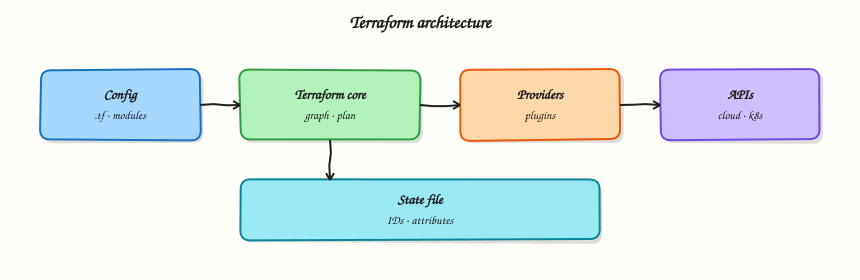

# Introduction to Terraform and Infrastructure as Code

## Overview

Clicking through a cloud console works once. It fails at scale: nobody remembers who opened port 22, which environment owns a subnet, or whether staging matches production. **Infrastructure as Code (IaC)** treats networks, servers, databases, and permissions as **version-controlled configuration** you review, test, and apply repeatably — the same discipline as application code.

**Terraform** is HashiCorp’s declarative IaC tool. You describe the **desired end state** in **HashiCorp Configuration Language (HCL)**; Terraform builds a dependency graph, compares desired state to **state** (a record of what already exists), and calls **provider** plugins to create, update, or destroy real infrastructure. The daily loop is **write → plan → apply**, with `plan` showing changes before anything mutates production.

This is **Tutorial 1** in **Module 1: IaC Fundamentals** of the REBASH Academy **Terraform for Cloud & DevOps Engineers** series — written for Cloud engineers, DevOps engineers, Platform engineers, and Site Reliability Engineering (SRE) teams. You will explain why IaC beats ad-hoc scripts, contrast imperative and declarative models, sketch Terraform’s architecture, and apply a small declarative Docker stack you can prove with `docker ps` — no paid cloud account required.

## Prerequisites

- [Linux](../linux/index.md) — comfortable terminal, files, and basic shell
- [Git](../git/index.md) — commits and pull requests (IaC lives in repos)
- [Docker](../docker/introduction-to-containers-and-docker.md) — Docker Engine running locally (`docker info`)

## Learning Objectives

By the end of this tutorial, you will be able to:

- [ ] Define Infrastructure as Code and explain why teams adopt it over manual console work
- [ ] Contrast imperative scripts with declarative desired-state configuration
- [ ] Describe Terraform’s write → plan → apply workflow and name its core components
- [ ] Sketch how configuration, state, providers, and the CLI interact
- [ ] Create a minimal declarative manifest and interpret a `terraform plan` as evidence of desired state

## Architecture

Terraform separates **what you want** (HCL configuration) from **what exists** (state) and **how to reach APIs** (provider plugins). The CLI orchestrates planning and applying; it does not talk to AWS, Azure, or Google Cloud directly — providers do.



## Theory

### What it is

**Infrastructure as Code** means infrastructure definitions live in text files under version control. Teams open pull requests for VPC changes the same way they review application code. A pipeline or engineer runs automation that converges the real world toward the declared configuration.

**Terraform** implements IaC with a **declarative** model:

| Piece | Role |
|-------|------|
| **Configuration** (`.tf` files) | Declares providers, resources, variables, outputs |
| **CLI** (`terraform`) | Parses config, builds graph, plans and applies changes |
| **State** (`terraform.tfstate`) | Maps Terraform addresses to real resource IDs |
| **Providers** (plugins) | Translate resources into API calls (AWS, Azure, Kubernetes, `local`, `null`, …) |
| **Registry** | Publishes vetted provider and module packages |

You do not write “create subnet, then route table, then associate” as ordered steps in Terraform. You declare all three resources; Terraform orders operations from **implicit dependencies** (references between resources) and explicit `depends_on` when needed.

### Why it matters

Manual infrastructure creates predictable failures:

- **Drift** — production diverges from documentation after emergency fixes
- **No audit trail** — console changes lack peer review
- **Slow recovery** — rebuilding a region from memory is error-prone
- **Environment skew** — staging “mostly like prod” until an incident proves otherwise

Teams choose Terraform because:

- **Multi-cloud and multi-service** — one workflow for AWS, Azure, GCP, Kubernetes, SaaS APIs, and local lab providers
- **Plan before change** — `terraform plan` is a contract review step; CI can fail builds on unexpected diffs
- **Large ecosystem** — thousands of providers and reusable modules on the [Terraform Registry](https://registry.terraform.io/)
- **Mature operations story** — remote state, locking, workspaces, HCP Terraform, policy-as-code integrations
- **Portable skill** — HCL patterns transfer across employers and cloud vendors

Terraform complements configuration management (Ansible, cloud-init) and container platforms (Kubernetes): Terraform provisions the platform; other tools configure workloads on top.

### How it works

Mental model: **configuration + state → plan → apply → updated state**.

1. **Write** — Engineers edit `.tf` files describing resources (`aws_instance`, `azurerm_resource_group`, `local_file`, …).
2. **Init** — `terraform init` downloads provider plugins and configures backends (covered in Module 2–3).
3. **Plan** — Terraform refreshes state (reads current remote attributes), compares to config, and outputs a **execution plan**: create, update, destroy, no-op.
4. **Apply** — After approval, Terraform calls provider APIs in dependency order and writes new state.
5. **Destroy** — `terraform destroy` removes managed resources in safe order (when you intentionally tear down).

``` {.bash .ra-terminal title="Terminal"}
# Conceptual daily loop (Module 3 goes deep on each command)
terraform fmt -recursive
terraform validate
terraform init
terraform plan -out=tfplan
terraform apply tfplan
```

**State** is not optional magic — without it Terraform cannot know whether `aws_instance.web` refers to `i-0abc123` or must be created fresh. State is sensitive (often contains secrets and resource IDs); Module 8 covers remote backends and locking.

### Key concepts and comparisons

#### Imperative vs declarative

| Style | You specify | Example mindset | Risk |
|-------|-------------|-----------------|------|
| **Imperative** | Steps to execute | “Run these 20 CLI commands in order” | Scripts fail mid-way; re-run may duplicate resources |
| **Declarative** | Desired end state | “This subnet exists with these CIDR and tags” | Terraform computes steps; must trust plan output |

Imperative tools (some SDK scripts, early cloud CLI wrappers) fit one-off migrations. Declarative IaC fits long-lived environments where drift detection and peer review matter.

#### Why Terraform (vs alternatives)

| Tool / pattern | Strength | When Terraform is often preferred |
|----------------|----------|-----------------------------------|
| Cloud vendor templates (ARM, CloudFormation) | Native integration | Multi-cloud, same workflow everywhere |
| Pulumi (general-purpose languages) | Developers want TypeScript/Python | Teams standardising on HCL + Registry modules |
| Crossplane / Kubernetes CRDs | GitOps-native control planes | Broader infra + app platform already on K8s |
| Click-ops | Fast for learning | Never for production baselines |

No single tool wins every scenario. Terraform’s advantage is **breadth**, **plan/apply discipline**, and **industry adoption** for platform teams.

#### Terraform workflow (high level)

| Phase | Command / artefact | Purpose |
|-------|-------------------|---------|
| Author | `.tf` files in Git | Declare desired infrastructure |
| Format | `terraform fmt` | Consistent style for reviews |
| Validate | `terraform validate` | Syntax and internal consistency |
| Initialise | `terraform init` | Providers, modules, backend |
| Plan | `terraform plan` | Preview changes |
| Apply | `terraform apply` | Execute changes |
| Record | State file / remote backend | Map config to reality |

#### Terraform architecture components

| Component | Location | Notes |
|-----------|----------|-------|
| Core CLI | `terraform` binary | Graph, plan, apply engine |
| Provider plugins | `.terraform/providers/` after init | Version pinned in `required_providers` |
| Configuration | `*.tf`, `*.tfvars` | Root module; may call child modules |
| State | Local file or remote backend | Never edit by hand in production |
| Registry | registry.terraform.io | Providers and modules |

### Common pitfalls

- Treating Terraform like a shell script runner — use resources and data sources, not `local-exec` for everything.
- Committing **state** or **secrets** to Git — state belongs in a secured backend; secrets in vaults or CI secret stores.
- Skipping **plan** in CI — merges that apply blind cause outages and untraceable drift.
- Ignoring **provider version pins** — upgrades can change behaviour silently; pin and test upgrades.
- Assuming declarative means “no ordering issues” — cycles and missing dependencies still break applies; Module 6 covers the graph.

## Hands-on Lab

### Objective

Declare a **declarative Docker stack** (network + container) with the `kreuzwerker/docker` provider, run `init`, `plan`, and `apply`, and prove the running container with `docker ps` — demonstrating desired-state IaC without a cloud account.

### Prerequisites

- **Terraform ≥ 1.5** installed (`terraform version`)
- **Docker Engine running** (`docker info` succeeds)
- Ubuntu 22.04/24.04 VM, macOS, or Linux with network access to download providers and pull `nginx:1.27-alpine`
- Write access under your home directory

### Lab environment

Workspace: `~/rebash-terraform/module-01`

``` {.bash .ra-terminal title="Terminal"}
mkdir -p ~/rebash-terraform/module-01 && cd ~/rebash-terraform/module-01
```

Uses **kreuzwerker/docker** against your local Docker Engine — no AWS, Azure, or GCP credentials.

### Real-world scenario

You join a platform team replacing manual `docker network create` and `docker run` commands with IaC. Your lead assigns ticket **PLAT-101**: ship a Terraform root module that declares an isolated bridge network and a pinned nginx container — the same declarative pattern later used for VPCs and compute, but safe on a laptop. Success means `terraform apply` creates real Docker objects and `docker ps` shows the container **Up**.

### Step-by-step tasks

#### Task 1 – Pin the Docker provider and declare desired state

Create `main.tf`:

```hcl title="main.tf"
terraform {
  required_version = ">= 1.5.0, < 2.0.0"

  required_providers {
    docker = {
      source  = "kreuzwerker/docker"
      version = "~> 3.0"
    }
  }
}

provider "docker" {}

resource "docker_network" "lab" {
  name = "rebash-module-01-net"
}

resource "docker_image" "nginx" {
  name = "nginx:1.27-alpine"
}

resource "docker_container" "web" {
  name  = "rebash-module-01-web"
  image = docker_image.nginx.image_id

  networks_advanced {
    name = docker_network.lab.name
  }

  labels {
    label = "managed_by"
    value = "terraform"
  }
}
```

!!! example "Expected output"
    `main.tf` exists with one network, one image, and one container resource.


#### Task 2 – Init, plan, and apply the stack

Run:

``` {.bash .ra-terminal title="Terminal"}
cd ~/rebash-terraform/module-01
terraform init | tee init-log.txt
terraform plan -no-color | tee plan-log.txt
grep -q 'docker_network.lab' plan-log.txt
grep -q 'docker_container.web' plan-log.txt
terraform apply -auto-approve | tee apply-log.txt
```

!!! example "Expected output"
    `init-log.txt` shows `kreuzwerker/docker` installed; `plan-log.txt` lists three resources to create; `apply-log.txt` ends with `Apply complete!`.


#### Task 3 – Prove infrastructure with Docker CLI

Run:


``` {.bash .ra-terminal title="Terminal"}
cd ~/rebash-terraform/module-01
docker ps --filter name=rebash-module-01-web --format '{{.Names}} {{.Status}}' | tee docker-ps.txt
grep -q 'rebash-module-01-web' docker-ps.txt
grep -q 'Up' docker-ps.txt
docker network ls --filter name=rebash-module-01-net --format '{{.Name}}' | tee docker-net.txt
grep -q 'rebash-module-01-net' docker-net.txt
echo "iac docker proof OK" | tee iac-evidence.txt
```


!!! example "Expected output"
    `docker-ps.txt` shows `rebash-module-01-web Up ...`; `docker-net.txt` contains `rebash-module-01-net`; `iac-evidence.txt` contains `iac docker proof OK`.


### Validation steps

- [ ] `main.tf` pins `required_version` and `kreuzwerker/docker`
- [ ] `terraform init` downloads the Docker provider
- [ ] `terraform apply` creates network and container without errors
- [ ] `docker ps` shows `rebash-module-01-web` running
- [ ] `docker network ls` shows `rebash-module-01-net`
- [ ] You can explain imperative (`docker run`) vs declarative (HCL desired state)

### Common errors and fixes

| Error | Cause | Fix |
|-------|-------|-----|
| `Cannot connect to the Docker daemon` | Docker Engine not running | Start Docker Desktop or `sudo systemctl start docker`; verify `docker info` |
| `terraform: command not found` | CLI not installed or not on `PATH` | Install Terraform (Module 2); verify with `which terraform` |
| `Invalid provider registry host` | No network or proxy blocking registry | Check HTTPS to `registry.terraform.io`; configure corporate proxy if required |
| `Unsupported Terraform Core version` | CLI older than `required_version` | Upgrade Terraform to ≥ 1.5 |
| Plan shows no changes after failed apply | Partial apply left resources | Run `terraform destroy -auto-approve` then re-apply |

### Challenge exercise

Create `declarative-proof.sh`:


``` {.bash .ra-terminal title="Terminal"}
#!/usr/bin/env bash
set -euo pipefail
cd ~/rebash-terraform/module-01
terraform plan -detailed-exitcode -no-color >/dev/null 2>&1 || ec=$?
test "${ec:-0}" -eq 0
docker inspect rebash-module-01-web --format '{{index .Config.Labels "managed_by"}}' | grep -q terraform
echo "declarative workflow proof complete"
```


Run:

``` {.bash .ra-terminal title="Terminal"}
chmod +x ~/rebash-terraform/module-01/declarative-proof.sh
~/rebash-terraform/module-01/declarative-proof.sh | tee challenge-result.txt
```

!!! example "Expected output"
    Plan exit code 0 (no pending changes); `challenge-result.txt` ends with `declarative workflow proof complete`.


### Learning outcomes

- You wrote declarative HCL describing Docker desired state, not shell steps to create it
- You ran `init`, `plan`, and `apply` against a real provider plugin
- You proved managed infrastructure with operational CLI (`docker ps`, `docker network ls`)
- You understand why state and providers appear in later modules

### Cleanup


``` {.bash .ra-terminal title="Terminal"}
cd ~/rebash-terraform/module-01
terraform destroy -auto-approve
docker ps -a --filter name=rebash-module-01-web --format '{{.Names}}' | grep -q . && docker rm -f rebash-module-01-web || true
docker network ls --filter name=rebash-module-01-net --format '{{.Name}}' | grep -q . && docker network rm rebash-module-01-net || true
rm -f init-log.txt plan-log.txt apply-log.txt docker-ps.txt docker-net.txt iac-evidence.txt challenge-result.txt
rm -rf .terraform .terraform.lock.hcl terraform.tfstate terraform.tfstate.backup
```


## Validation

- [ ] Completed lab under `~/rebash-terraform/module-01` with `docker ps` evidence
- [ ] Can explain IaC, declarative model, and Terraform components in own words
- [ ] Used `terraform init`, `plan`, and `apply` with the Docker provider
- [ ] Can describe one production failure mode (e.g. applying without plan review)

## Code Walkthrough

1. **Inspect before mutate** — `plan` is your diff; treat unexpected destroys as stop signals.
2. **Pin versions early** — `required_version` and `required_providers` belong in every root module from day one.
3. **Evidence in Git** — principles YAML and `.tf` files are review artefacts; console clicks are not.
4. **Start with Docker locally** — `kreuzwerker/docker` proves real apply without cloud spend.
5. **Least scope** — one network and one container in Module 1; expand complexity only when the concept requires it.

## Security Considerations

- Never commit cloud access keys, API tokens, or `terraform.tfstate` to Git — state often contains sensitive attributes.
- Restrict who can run `terraform apply` in production; plan in CI, apply with approval gates.
- Treat IaC repos as production documentation — hostnames, CIDRs, and module names reveal architecture.
- Use remote state with encryption and locking before team-wide production use (Module 8).
- Scan pull requests for secrets (`git-secrets`, `trufflehog`, native platform secret scanning).

## Common Mistakes

!!! warning "Click-ops with extra steps"
    Running Terraform from a laptop against production without review mirrors console chaos — only the tool changed.  
    **Fix:** Git-backed config, mandatory `plan` in CI, separate workspaces or accounts per environment.

!!! warning "Confusing IaC with configuration management"
    Terraform provisions infrastructure; it does not replace Ansible for OS hardening or app deploy inside VMs.  
    **Fix:** Terraform for cloud resources; CM or cloud-init for guest configuration — clear handoff documented in runbooks.

!!! warning "Skipping the plan habit"
    `apply -auto-approve` in CI without stored plan artefacts loses traceability.  
    **Fix:** `plan -out=tfplan`, store artefact, apply the saved plan in a gated job.

!!! warning "Treating state as disposable in production"
    Deleting state orphanates real billable resources.  
    **Fix:** Remote backend, backups, and documented recovery — never “delete state to fix Terraform.”

## Best Practices

- Store all `.tf` files in Git; tag releases that match applied infrastructure versions.
- Run `terraform fmt -recursive` before every commit — consistent style speeds reviews.
- Document **why** a resource exists in module READMEs, not only in ticket comments.
- Standardise on one IaC tool per layer where possible — avoid duplicate AWS definitions in Terraform and CloudFormation.
- Teach new engineers the workflow diagram before granting cloud apply access.

## Troubleshooting

| Symptom | Likely cause | Fix |
|---------|--------------|-----|
| Plan empty but config changed | Wrong directory or wrong workspace | `pwd`; `terraform workspace show` (Module 12) |
| Provider download fails | Network, air-gapped environment | Mirror registry or vendor provider bundle |
| “Configuration invalid” on validate | Syntax error in HCL | `terraform validate`; check brackets and quotes |
| Team members see different plans | Different provider versions | Commit `.terraform.lock.hcl`; pin versions |
| Drift between environments | Different `.tfvars` not documented | Check in example tfvars; use consistent naming |

## Summary

Infrastructure as Code makes infrastructure reviewable, repeatable, and auditable. Terraform’s declarative model compares desired configuration to state and executes a plan through provider plugins — write, init, plan, apply. You captured IaC principles, declared a local manifest resource, and previewed change with `plan`. Next, install and pin the CLI properly: **Installing Terraform and the CLI Workflow**.

## Interview Questions

**1. What is Infrastructure as Code, and what problem does it solve?**

??? success "Reveal answer"
    **Infrastructure as Code** stores infrastructure definitions in version-controlled files instead of manual console changes or tribal knowledge. It solves **drift**, slow/disaster-prone rebuilds, missing audit trails, and inconsistent environments. Teams get peer review, repeatable applies, and history that answers “who changed this security group and when?”

**2. Explain imperative vs declarative infrastructure automation.**

??? success "Reveal answer"
    **Imperative** automation lists steps to execute (“create VPC, then subnet, then instance”). Re-runs can duplicate or skip steps if scripts are not idempotent. **Declarative** automation specifies desired end state (“this subnet exists with this CIDR”); Terraform computes the minimal create/update/delete actions. Declarative tools still execute steps internally — the difference is you review **plan output** against intent, not script ordering.

**3. Walk through the Terraform write → plan → apply workflow.**

??? success "Reveal answer"
    Engineers **write** HCL in Git. **`terraform init`** installs providers and configures backends. **`terraform plan`** refreshes state, compares to config, and prints proposed changes. After approval, **`terraform apply`** executes the plan and updates **state** with new resource IDs and attributes. **`terraform destroy`** removes managed resources when retiring stacks. **`fmt`** and **`validate`** run before plan in mature pipelines.

**4. What are the main components of Terraform architecture?**

??? success "Reveal answer"
    **Configuration** (`.tf`) declares desired resources. The **CLI** builds the dependency graph and orchestrates plan/apply. **State** maps Terraform resource addresses to real world IDs. **Provider plugins** implement resource types and call APIs. The **Terraform Registry** distributes providers and modules. Optional **HCP Terraform** adds remote runs, locking, and policy.

**5. Why do teams choose Terraform over cloud-native templates alone?**

??? success "Reveal answer"
    Cloud-native tools (CloudFormation, ARM, Deployment Manager) excel on their own platform. **Terraform** offers one workflow and language across AWS, Azure, GCP, Kubernetes, SaaS, and lab providers — valuable for platform teams, acquisitions, and multi-cloud strategies. The **plan** step, module ecosystem, and hiring market are additional practical reasons — not that native tools are bad on their home cloud.

**6. What is Terraform state and why is it necessary?**

??? success "Reveal answer"
    **State** records which real infrastructure object corresponds to each resource block in configuration (e.g. `aws_instance.web` → `i-0abc123`). APIs do not always let Terraform list “everything I manage” globally; state closes that gap. Without state, Terraform cannot know whether to create or update. State is **sensitive** and must be stored securely with locking for teams (Module 8).

**7. How does Terraform relate to Ansible or Kubernetes?**

??? success "Reveal answer"
    **Terraform** provisions platform infrastructure — VPCs, clusters, IAM, databases. **Ansible** (or cloud-init) configures OS and application state on hosts. **Kubernetes** schedules containers; Terraform often creates the cluster and node pools. Use each tool for its strength; integrate via outputs (Terraform) feeding inventory or Helm values rather than duplicating the same resource in two systems.

**8. A colleague wants to `apply -auto-approve` from their laptop to production to save time. What do you say?**

??? success "Reveal answer"
    Production applies need **reviewed plans**, **least-privilege credentials**, and **auditability** — not convenience. Laptop applies bypass CI, hide diffs from the team, and often use overly broad credentials. Prefer: PR → CI `plan` → approved merge → gated `apply` with saved plan artefacts, separate accounts per environment, and break-glass procedures documented for true emergencies.

## Related Tutorials

- [Terraform course index](index.md)
- **Next:** [Installing Terraform and the CLI Workflow](installing-terraform-and-the-cli-workflow.md)
- [Introduction to Configuration Management and Ansible](../ansible/introduction-to-configuration-management-and-ansible.md)
- [GitOps fundamentals](../git/gitops-fundamentals.md)
- [Linux fundamentals](../linux/linux-fundamentals-distributions-and-architecture.md)

## References

- [Terraform Documentation](https://developer.hashicorp.com/terraform/docs)
- [Introduction to Terraform](https://developer.hashicorp.com/terraform/intro)
- [Terraform CLI overview](https://developer.hashicorp.com/terraform/cli)
- [Terraform Registry](https://registry.terraform.io/)
- [REBASH Terraform course index](index.md)
