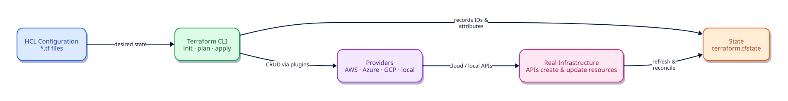

# Introduction to Terraform and Infrastructure as Code

## Overview

Cloud infrastructure used to be built by clicking through consoles and documenting the result in a wiki. That approach does not scale: environments drift, recreating a VPC takes days, and “what is in production?” becomes a guessing game after every incident.

**Infrastructure as Code (IaC)** treats infrastructure the same way we treat application code — versioned files, peer review, repeatable applies, and automated pipelines. **Terraform** (by HashiCorp) is the most widely adopted multi-cloud IaC tool. You describe the *desired* end state in **HCL** (HashiCorp Configuration Language); Terraform computes a plan and calls provider APIs to create, update, or destroy real resources.

This is **Tutorial 1** in **Module 1: Foundations** of the REBASH Academy Terraform track. You will learn the mental model first, then run a complete local configuration that uses `required_version`, `required_providers`, variables, a managed resource, and outputs — the same skeleton every production root module starts from.

## Learning Objectives

By the end of this tutorial, you will be able to:

- [ ] Explain Infrastructure as Code and why declarative tools beat imperative click-ops
- [ ] Describe Terraform’s core loop: write → init → plan → apply → state
- [ ] Distinguish configuration, providers, state, and the resource graph
- [ ] Write a minimal root module with `required_version`, `required_providers`, variables, resources, and outputs
- [ ] Run `terraform init`, `plan`, and `apply` safely on a local lab
- [ ] Prefer current built-ins (such as `terraform_data`) over deprecated patterns

## Prerequisites

- Terminal access (Linux, macOS, or Windows with WSL2)
- Ability to create a directory and edit text files
- Network access to download providers from the [Terraform Registry](https://registry.terraform.io/) on first `init`
- **Terraform CLI 1.9+** recommended (lab tested against Terraform 1.15.x). Install in the next tutorial if needed; skim this one conceptually first if the binary is not installed yet
- No cloud account required for this lab

## Architecture

Terraform sits between your versioned configuration and the APIs that own real infrastructure. Providers are plugins that translate Terraform’s resource model into AWS, Azure, Google Cloud, Kubernetes, or local filesystem calls.



| Component | Role |
|-----------|------|
| **HCL configuration** | Desired state in `.tf` files |
| **Terraform CLI** | Parses config, builds a plan, applies changes |
| **State** | Maps configuration addresses to real object IDs and attributes |
| **Providers** | Authenticated plugins that call cloud or local APIs |
| **Infrastructure** | VMs, networks, DNS records, files — whatever the providers manage |


## Theory

### Why Infrastructure as Code?

Manual infrastructure fails in predictable ways:

| Problem | Without IaC | With Terraform |
|---------|-------------|----------------|
| Environment parity | “Works in staging” surprises | Same modules, different variable values |
| Change review | Screenshots and tribal knowledge | `terraform plan` in a pull request |
| Disaster recovery | Rebuild from memory | Re-apply from Git |
| Drift | Console edits nobody tracked | Plan shows unexpected diffs |
| Onboarding | Shadow a senior for weeks | Read the repo and apply |

IaC does not remove the need for architecture skill — it makes architecture **reviewable** and **repeatable**.

### Declarative vs imperative

- **Imperative** tools list steps: create VPC, then subnet, then route table (shell scripts, many older CM tools used this way).
- **Declarative** tools describe the end state: “I want three private subnets and an IGW.” Terraform owns the *how* through providers and its dependency graph.

Terraform is declarative. You should rarely encode “step 1, step 2” in provisioners; prefer real resources and data sources.

### What Terraform is (and is not)

**Terraform is:**

- A CLI and language for provisioning infrastructure across many providers
- A planner that shows create/update/destroy before you change production
- A state manager that remembers what it created

**Terraform is not:**

- A configuration management agent for long-running OS package drift (use Ansible, Puppet, or cloud-init for that layer)
- A replacement for application CI/CD (it pairs with pipelines; it does not build container images by itself)
- Magic without credentials — providers still need IAM, service principals, or API tokens

### The Terraform workflow

1. **Write** — author `.tf` files (and optionally `.tfvars`)
2. **`terraform init`** — download providers/modules; initialize backends
3. **`terraform plan`** — compare desired config to state (+ refresh) and print the proposed actions
4. **`terraform apply`** — execute the plan and update state
5. **`terraform destroy`** — remove managed resources when the lab or stack is finished

Always read the plan. In production, store the plan file and apply that exact binary plan in CI.

### Providers and the Registry

Providers live on the [Terraform Registry](https://registry.terraform.io/). You declare them in a `terraform` block:

```hcl
terraform {
  required_version = ">= 1.9.0"

  required_providers {
    local = {
      source  = "hashicorp/local"
      version = "~> 2.9"
    }
  }
}
```

- **`required_version`** — which Terraform CLI versions may run this root module
- **`required_providers`** — provider **source** address and **version** constraint
- **`~>`** (pessimistic constraint) — allow patch/minor updates within the stated major.minor band for providers, per HashiCorp guidance for root modules

As of this writing, `hashicorp/local` latest is **2.9.0** and `hashicorp/aws` latest is **6.56.0** (verify with the Registry before pinning production).

### State in one paragraph

After apply, Terraform writes **state** (commonly `terraform.tfstate` for local backends). State stores resource IDs and attributes so the next plan knows what already exists. **Never commit secrets in state to a public repo** — later tutorials cover remote encrypted backends. For this lab, local state is fine.

### Prefer `terraform_data` over `null_resource`

Older tutorials use `null_resource` from `hashicorp/null`. On Terraform **1.4+**, Hashicorp recommends the built-in [`terraform_data`](https://developer.hashicorp.com/terraform/language/resources/terraform-data) resource instead — no provider required. Use `null_resource` only when maintaining legacy modules.

## Hands-on Lab

You will create a tiny root module that writes a greeting file using the `local` provider. No cloud credentials are required.

### Step 1 – Create a working directory

```bash
mkdir -p ~/rebash-terraform-intro && cd ~/rebash-terraform-intro
terraform version
```

**Expected:** Terraform 1.9 or newer printed (1.15.x is ideal).

### Step 2 – Write the root module files

Create `versions.tf`:

```hcl
terraform {
  required_version = ">= 1.9.0"

  required_providers {
    local = {
      source  = "hashicorp/local"
      version = "~> 2.9"
    }
  }
}
```

Create `variables.tf`:

```hcl
variable "project_name" {
  description = "Short name used in the generated greeting file"
  type        = string
  default     = "rebash-academy"
}

variable "greeting" {
  description = "Message written into the local file"
  type        = string
  default     = "Infrastructure as Code starts here."
}
```

Create `main.tf`:

```hcl
resource "local_file" "intro" {
  filename        = "${path.module}/generated/hello-terraform.txt"
  content         = <<-EOT
    Project : ${var.project_name}
    Message : ${var.greeting}
    Managed : Terraform local_file
  EOT
  file_permission = "0644"
}

resource "terraform_data" "lab_marker" {
  input = {
    project = var.project_name
    lesson  = "introduction-to-terraform-and-iac"
  }
}
```

Create `outputs.tf`:

```hcl
output "greeting_file" {
  description = "Path to the file Terraform manages on disk"
  value       = local_file.intro.filename
}

output "file_md5" {
  description = "MD5 checksum of the managed file content"
  value       = local_file.intro.content_md5
}

output "lab_marker" {
  description = "Value stored in the built-in terraform_data resource"
  value       = terraform_data.lab_marker.output
}
```

### Step 3 – Initialize providers

```bash
terraform init
```

**Expected:** Terraform downloads `hashicorp/local` into `.terraform/` and writes a lock file `.terraform.lock.hcl`. Commit the lock file in real projects.

### Step 4 – Format and validate

```bash
terraform fmt
terraform validate
```

**Expected:** `Success! The configuration is valid.`

### Step 5 – Plan

```bash
terraform plan -out=tfplan
```

**Expected:** Plan to **create** `local_file.intro` and `terraform_data.lab_marker`. No destroys.

### Step 6 – Apply

```bash
terraform apply tfplan
cat generated/hello-terraform.txt
terraform output
```

**Expected:** File contents match your variables; outputs show path, MD5, and the lab marker object.

### Step 7 – Change and re-plan

Edit `terraform.tfvars` (new file):

```hcl
project_name = "rebash-iac-lab"
greeting     = "Plan before you apply."
```

```bash
terraform plan
```

**Expected:** Update in-place (or replace content) for `local_file.intro`, and an update to `terraform_data.lab_marker` input/output. Apply when ready:

```bash
terraform apply -auto-approve
```

### Step 8 – Clean up

```bash
terraform destroy -auto-approve
```

**Expected:** Managed file removed; state emptied of those resources.

## Code Walkthrough

### `terraform` block

| Argument | Purpose |
|----------|---------|
| `required_version` | Fail fast if someone runs an unsupported CLI |
| `required_providers.local.source` | Registry address `hashicorp/local` |
| `required_providers.local.version` | Allow 2.9.x upgrades without jumping to 3.x unexpectedly |

### `variable` blocks

Variables are the **input API** of a module. Always set `type` and `description`. Defaults are fine for labs; production root modules often omit defaults for required values so misconfiguration fails loudly.

### `local_file` resource

| Argument | Purpose |
|----------|---------|
| `filename` | Destination path (parent dirs are created) |
| `content` | UTF-8 body (mutually exclusive with `content_base64` / `source`) |
| `file_permission` | Mode before umask (`0644` is a sensible lab default) |

Read-only attributes such as `content_md5` appear in state and outputs after apply. See the [local_file documentation](https://registry.terraform.io/providers/hashicorp/local/latest/docs/resources/file).

!!! note "Local files and multiple machines"
    `local_file` is perfect for learning. In shared automation, Terraform may recreate the file whenever it is missing on a new runner — expect noisy plans. Prefer cloud resources or remote content stores for team workflows.

### `terraform_data` resource

| Argument | Purpose |
|----------|---------|
| `input` | Value stored in state and exposed as `output` |
| `triggers_replace` | (Unused here) force replace when listed values change |

No provider configuration is required — it comes from Terraform’s built-in provider.

### `output` blocks

Outputs are how root modules publish values to humans, CI, and other tools. They also appear in `terraform output` after apply.

## Validation

Run this checklist in the lab directory:

```bash
terraform fmt -check
terraform validate
terraform plan -detailed-exitcode
test -f generated/hello-terraform.txt && echo "file ok" || echo "apply first"
terraform output -json | head
```

| Check | Pass criteria |
|-------|----------------|
| `fmt -check` | Exit 0 |
| `validate` | Configuration valid |
| After apply | `generated/hello-terraform.txt` exists |
| Outputs | `greeting_file`, `file_md5`, `lab_marker` present |

## Best Practices

- **Always plan before apply** — especially in shared accounts
- **Pin providers** with `required_providers` and commit `.terraform.lock.hcl`
- **One concern per root module** early on; introduce modules when patterns repeat
- **Name resources by role** (`local_file.intro`), not by ticket numbers
- **Keep secrets out of Git** — use variables marked `sensitive`, env vars, or a secret manager (covered later)
- **Prefer resources over `local-exec` provisioners** for anything you must recreate reliably

## Security Considerations

- Local state files can contain sensitive attribute values once you manage cloud resources — treat `*.tfstate*` as secret
- Do not put passwords or API tokens in `.tf` defaults or in `terraform.tfvars` committed to Git
- Review provider permissions: least privilege IAM/service principals from day one
- Lock files and code review reduce supply-chain surprises when providers update

## Common Mistakes

!!! warning "Skipping plan and using apply blindly"
    `terraform apply` without reading the plan can destroy production resources. Habit: `plan -out=tfplan` then `apply tfplan`.

!!! warning "Editing cloud resources in the console"
    Console changes cause **state drift**. Next plan proposes unexpected updates or destroys. Change infrastructure through Terraform (or import intentionally).

!!! warning "Copying tutorials that still use `null_resource`"
    Prefer `terraform_data` on modern Terraform. Reserve `hashicorp/null` for legacy modules you are migrating.

!!! warning "Committing `.terraform/` directories"
    Provider binaries belong on each machine/CI cache — not in Git. Commit `.terraform.lock.hcl` only.

## Troubleshooting

| Issue | Cause | Solution |
|-------|-------|----------|
| `terraform: command not found` | CLI not installed or not on `PATH` | Install from [HashiCorp Install](https://developer.hashicorp.com/terraform/install); reopen the shell |
| Provider download fails | Network / proxy / registry blocked | Check HTTPS to `registry.terraform.io`; configure proxy env vars if required |
| `Inconsistent dependency lock file` | Providers changed without `init` | Run `terraform init -upgrade` deliberately, then review lockfile diff |
| Plan wants to create the file every time on CI | Different runners; file not in state or missing on disk | Expected for `local_file` across machines — use cloud resources for shared stacks |
| `Error: Invalid value for input variable` | Wrong type in `.tfvars` | Match `type` in `variable` blocks; re-check maps/lists syntax |

## Interview Questions

1. What is Infrastructure as Code, and what problems does it solve compared to console-driven provisioning?
2. How does Terraform’s declarative model differ from an imperative shell script that calls cloud CLIs?
3. Walk through `init`, `plan`, and `apply`. What does each step do to providers and state?
4. What is a Terraform **provider**, and where do you declare its source and version?
5. Why should root modules set both `required_version` and `required_providers`?
6. What is Terraform **state**, and why must it be protected in production?
7. What does the `~>` version constraint mean for providers?
8. When would you use `terraform_data` instead of `null_resource`?
9. What is the difference between a **variable** and an **output**?
10. Why is `terraform plan -out=tfplan` followed by `terraform apply tfplan` safer than interactive apply in CI?
11. What belongs in Git versus what should stay local (`.terraform/`, state, lock file)?
12. How does Terraform detect that infrastructure has drifted from configuration?

## Summary

- Infrastructure as Code makes environments repeatable, reviewable, and recoverable
- Terraform declares desired state in HCL, then plans and applies changes through providers
- State maps configuration to real objects — protect it as soon as you leave local labs
- Every serious root module starts with `required_version`, `required_providers`, typed variables, resources, and outputs
- Prefer current built-ins and Registry docs over outdated blog snippets

## Related Tutorials

- Track overview: [Terraform](index.md)
- Prior skills: [Introduction to Linux](../linux/linux-fundamentals-distributions-and-architecture.md), [Introduction to Git and Version Control](../git/introduction-to-git-and-version-control.md)

- Next: [Installing Terraform and the CLI Workflow](installing-terraform-and-the-cli-workflow.md)
- Cheat sheet: [Terraform Cheat Sheet](../cheatsheets/terraform.md)
- Interview prep: [Terraform Interview Prep](../interview/terraform.md)
- Learning path: [DevOps Engineer](../learning-paths/devops-engineer.md)

## References

1. [Terraform documentation (HashiCorp)](https://developer.hashicorp.com/terraform/docs)
2. [Terraform language — Terraform block](https://developer.hashicorp.com/terraform/language/block/terraform)
3. [Version constraints](https://developer.hashicorp.com/terraform/language/expressions/version-constraints)
4. [terraform_data resource](https://developer.hashicorp.com/terraform/language/resources/terraform-data)
5. [hashicorp/local provider — local_file](https://registry.terraform.io/providers/hashicorp/local/latest/docs/resources/file)
6. [Terraform Registry](https://registry.terraform.io/)
7. [Install Terraform](https://developer.hashicorp.com/terraform/install)
