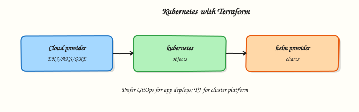

# Kubernetes Infrastructure with Terraform

## Overview

Terraform excels at **cluster infrastructure**: control planes, node pools, cloud networking, and identity for the Kubernetes API. In-cluster application workloads usually belong to **GitOps** (Argo CD, Flux) with Helm charts — not hundreds of `kubernetes_*` resources in the same root that created the cluster.

This is **Tutorial 18** in **Module 18: Kubernetes Infrastructure** of the REBASH Academy **Terraform for Cloud & DevOps Engineers** series — written for platform engineers building managed clusters on Amazon Elastic Kubernetes Service (EKS), Azure Kubernetes Service (AKS), or Google Kubernetes Engine (GKE).

Beginners learn the split between cloud underlay and in-cluster desired state. Practitioners configure kubernetes and helm providers with kubeconfig or exec authentication. Production judgement covers bootstrap-only Helm releases and avoiding Terraform fighting GitOps controllers.

## Prerequisites

- [Multi-Cloud Terraform](multi-cloud-terraform.md)
- Terraform CLI 1.9+
- **kind** installed and working (`kind version`)
- **kubectl** installed

## Learning Objectives

By the end of this tutorial, you will be able to:

- [ ] Outline managed cluster and node pool resources (EKS/AKS/GKE class)
- [ ] Configure the kubernetes provider with kubeconfig from kind
- [ ] Describe helm provider use for bootstrap-only platform charts
- [ ] Draw the GitOps boundary after cluster creation
- [ ] Apply namespace, ConfigMap, and Deployment with the kubernetes provider
- [ ] Prove resources with kubectl and destroy the kind cluster in cleanup

## Architecture

Terraform owns the cloud underlay and cluster; GitOps owns ongoing in-cluster application state.



## Theory

### What it is

**Kubernetes infrastructure with Terraform** declares clusters and cloud dependencies as code, then optionally talks to the Kubernetes API via **kubernetes** and **helm** providers.

| Layer | Typical owner | Examples |
|-------|---------------|----------|
| Cloud underlay | Terraform | VPC, subnets, NAT, IAM / RBAC |
| Managed control plane | Terraform | EKS / AKS / GKE cluster |
| Node pools / node groups | Terraform | Instance size, labels, taints |
| Bootstrap add-ons | Terraform (thin) or GitOps | ingress controller, cert-manager once |
| Application workloads | GitOps + Helm | Deployments, ongoing Helm releases |

Managed offerings differ in resource names but share the shape: cluster → node pool → kubeconfig / OIDC trust → optional provider blocks targeting the API server.

### Why it matters

Cluster click-ops does not survive audit or disaster recovery. Terraform gives reviewable plans for slow-changing, expensive objects. Mixing day-2 application deploys into the same Terraform state creates long plans, state contention, and fights with GitOps reconcilers. Platform teams succeed when Terraform builds the landing pad and GitOps flies the planes.

### How it works

1. **Underlay:** network, security groups / firewall rules, private API endpoint choices.
2. **Cluster:** create managed control plane with version pin and logging/audit settings.
3. **Node pools:** separate pools for system vs workloads; taints and labels for placement.
4. **Access:** output kubeconfig fragments or configure OIDC; CI/GitOps identities receive Kubernetes RBAC — not permanent cluster-admin keys.
5. **Providers:** after the cluster exists, `kubernetes` / `helm` providers authenticate via kubeconfig path, exec plugin, or cloud-specific token helpers. Use explicit `depends_on` so providers do not configure against an incomplete API.
6. **Hand-off:** install only what GitOps needs to start (for example the GitOps controller), then stop managing application Helm releases in Terraform.

### Managed cluster patterns (sketch)

| Cloud | Cluster resource | Node pool resource |
|-------|------------------|--------------------|
| AWS | `aws_eks_cluster` | `aws_eks_node_group` |
| Azure | `azurerm_kubernetes_cluster` | `azurerm_kubernetes_cluster_node_pool` |
| GCP | `google_container_cluster` | `google_container_node_pool` |

### Kubernetes provider authentication

Common patterns:

| Method | Use when |
|--------|----------|
| `config_path = "~/.kube/config"` | Local dev, kind/minikube |
| Exec plugin (cloud CLI) | EKS `aws eks get-token`, GKE gcloud |
| Static token (avoid) | Legacy; prefer short-lived tokens |

### Helm provider bootstrap

Use `helm_release` for one-time platform seeds (GitOps controller, metrics server). Pin chart versions; set `create_namespace = true` when needed. Ongoing chart upgrades belong in GitOps, not Terraform state.

### Key concepts and comparisons

| Concern | Terraform | GitOps |
|---------|-----------|--------|
| Cluster create/upgrade | Yes | Rarely |
| Node pool resize | Often yes | Sometimes cluster autoscaler |
| App Helm release | Bootstrap only | Yes |
| Deployment drift | Avoid fighting controller | Controller reconciles |

### Common pitfalls

- Managing every microservice as `helm_release` in the cluster root — plans become unusable.
- Configuring kubernetes provider before the cluster endpoint exists.
- Storing long-lived cluster-admin kubeconfigs in state without backend ACL discipline.
- Terraform and Argo CD both owning the same Deployment.
- Untested control-plane version bumps in production without staging.

## Hands-on Lab

### Objective

Create a **kind** cluster, configure the **kubernetes** provider, apply **namespace**, **ConfigMap**, and **Deployment** resources, and prove with `kubectl` under `~/rebash-terraform/module-18`.

### Prerequisites

- Terraform CLI ≥ 1.9
- **kind** installed (`kind version`)
- **kubectl** installed
- Docker Engine running (kind requirement)

### Lab environment

Workspace: `~/rebash-terraform/module-18`

```bash title="Terminal"
mkdir -p ~/rebash-terraform/module-18/{manifests,artefacts} && cd ~/rebash-terraform/module-18
```

### Real-world scenario

You are bootstrapping a platform cluster repo. Terraform applies bootstrap namespace, ConfigMap, and a minimal Deployment on a local kind cluster — mirroring how platform teams wire the kubernetes provider after EKS/AKS/GKE creation. Application teams deploy via GitOps afterward; your root must not manage their Helm releases.

### Step-by-step tasks

#### Task 1 – Create kind cluster and capture kubeconfig

Create `kind-config.yaml`:

```yaml title="kind-config.yaml"
kind: Cluster
apiVersion: kind.x-k8s.io/v1alpha4
name: rebash-module-18
nodes:
  - role: control-plane
```

Run:

```bash title="Terminal"
cd ~/rebash-terraform/module-18
kind create cluster --config kind-config.yaml | tee artefacts/kind-create.log
kind export kubeconfig --name rebash-module-18 --kubeconfig artefacts/kubeconfig
kubectl --kubeconfig artefacts/kubeconfig get nodes | tee artefacts/nodes.txt
grep -q 'Ready' artefacts/nodes.txt
echo "kind cluster OK" | tee artefacts/kind-ok.txt
```

!!! example "Expected output"
    kind cluster `rebash-module-18` running; at least one node `Ready`.


#### Task 2 – Configure Terraform kubernetes provider

Create `versions.tf`:

```hcl title="versions.tf"
terraform {
  required_version = ">= 1.9.0"

  required_providers {
    kubernetes = {
      source  = "hashicorp/kubernetes"
      version = "~> 2.35"
    }
  }
}
```

Create `variables.tf`:

```hcl title="variables.tf"
variable "kubeconfig_path" {
  type        = string
  description = "Path to kubeconfig for the kind cluster."
  default     = "artefacts/kubeconfig"
}

variable "cluster_name" {
  type        = string
  description = "Logical cluster name for labels."
  default     = "rebash-platform"
}
```

Create `providers.tf`:

```hcl title="providers.tf"
provider "kubernetes" {
  config_path = "${path.module}/${var.kubeconfig_path}"
}
```

Create `manifests/platform-namespace.yaml`:

```yaml title="platform-namespace.yaml"
apiVersion: v1
kind: Namespace
metadata:
  name: platform
  labels:
    app.kubernetes.io/managed-by: terraform-bootstrap
    environment: lab
```

Create `manifests/platform-configmap.yaml`:

```yaml title="platform-configmap.yaml"
apiVersion: v1
kind: ConfigMap
metadata:
  name: platform-info
  namespace: platform
data:
  owner: platform-team
  gitops: "applications-not-managed-by-terraform"
  cluster: rebash-module-18
```

Create `manifests/platform-deployment.yaml`:

```yaml title="platform-deployment.yaml"
apiVersion: apps/v1
kind: Deployment
metadata:
  name: platform-hello
  namespace: platform
  labels:
    app: platform-hello
spec:
  replicas: 1
  selector:
    matchLabels:
      app: platform-hello
  template:
    metadata:
      labels:
        app: platform-hello
    spec:
      containers:
        - name: hello
          image: nginx:1.27-alpine
          ports:
            - containerPort: 80
```

Create `kubernetes.tf`:

```hcl title="kubernetes.tf"
resource "kubernetes_manifest" "platform_namespace" {
  manifest = yamldecode(file("${path.module}/manifests/platform-namespace.yaml"))
}

resource "kubernetes_manifest" "platform_configmap" {
  manifest = yamldecode(file("${path.module}/manifests/platform-configmap.yaml"))

  depends_on = [kubernetes_manifest.platform_namespace]
}

resource "kubernetes_manifest" "platform_deployment" {
  manifest = yamldecode(file("${path.module}/manifests/platform-deployment.yaml"))

  depends_on = [kubernetes_manifest.platform_namespace]
}
```

Create `outputs.tf`:

```hcl title="outputs.tf"
output "namespace" {
  value = "platform"
}

output "deployment_name" {
  value = "platform-hello"
}
```

Run:

```bash title="Terminal"
cd ~/rebash-terraform/module-18
terraform init | tee artefacts/init.log
terraform validate | tee artefacts/validate.log
grep -q 'Success' artefacts/validate.log
echo "provider config OK" | tee artefacts/provider-ok.txt
```

!!! example "Expected output"
    Validate succeeds with kubernetes provider configured.


#### Task 3 – Apply in-cluster resources and prove with kubectl

Run:

```bash title="Terminal"
cd ~/rebash-terraform/module-18
terraform apply -auto-approve -input=false | tee artefacts/apply.log
kubectl --kubeconfig artefacts/kubeconfig get ns platform | tee artefacts/ns-platform.txt
kubectl --kubeconfig artefacts/kubeconfig get cm -n platform platform-info | tee artefacts/cm-platform.txt
kubectl --kubeconfig artefacts/kubeconfig get deploy -n platform platform-hello | tee artefacts/deploy-platform.txt
kubectl --kubeconfig artefacts/kubeconfig wait --for=condition=available \
  deployment/platform-hello -n platform --timeout=120s | tee artefacts/deploy-ready.txt
kubectl --kubeconfig artefacts/kubeconfig get pods -n platform -l app=platform-hello \
  -o jsonpath='{.items[0].status.phase}' | tee artefacts/pod-phase.txt
grep -q 'Running' artefacts/pod-phase.txt
echo "k8s apply OK" | tee artefacts/k8s-apply-ok.txt
```

!!! example "Expected output"
    Namespace, ConfigMap, and Deployment exist; pod phase `Running`.


#### Task 4 – Document GitOps boundary and Helm bootstrap stub

Create `docs/gitops-boundary.md`:

```markdown title="gitops-boundary.md"
# GitOps boundary

| Managed by Terraform | Managed by GitOps |
|----------------------|-------------------|
| VPC, cluster, node pools | Application Deployments (ongoing) |
| Bootstrap namespace (once) | Helm upgrades for apps |
| Cloud IAM for cluster | In-cluster RBAC for teams |
| Optional GitOps controller install | Ongoing manifest sync |
```

Create `helm.tf.example`:

```hcl title="helm.tf.example"
# Bootstrap-only Helm — enable after cluster exists; pin chart versions.
# resource "helm_release" "argocd" { ... }
```

Verify and capture evidence:

```bash title="Terminal"
cd ~/rebash-terraform/module-18
grep -q 'Managed by GitOps' docs/gitops-boundary.md
terraform state list | tee artefacts/state-list.txt
grep -q 'kubernetes_manifest.platform_deployment' artefacts/state-list.txt
echo "gitops boundary OK" | tee artefacts/gitops-ok.txt
```

!!! example "Expected output"
    GitOps doc exists; state lists all three kubernetes_manifest resources.


### Validation steps

- [ ] kind cluster created and nodes Ready
- [ ] `terraform apply` created namespace, ConfigMap, Deployment
- [ ] `kubectl wait` confirms Deployment available
- [ ] Pod reaches Running phase
- [ ] GitOps boundary documented

### Common errors and fixes

| Error | Cause | Fix |
|-------|-------|-----|
| Kubernetes provider auth error | Wrong kubeconfig path | Export with `kind export kubeconfig`; check `artefacts/kubeconfig` |
| Deployment not Ready | Image pull slow | Increase wait timeout; check `kubectl describe pod` |
| `yamldecode` path error | Wrong manifest path | Run from module root; check `manifests/` filenames |
| kind create fails | Docker not running | Start Docker Engine; retry |
| Terraform vs GitOps drift | Same Deployment in both | Move app manifests to GitOps repo only |

### Challenge exercise

Scale the Deployment to 2 replicas via Terraform (`replicas: 2` in manifest), apply, and prove with `kubectl get deploy -n platform platform-hello -o jsonpath='{.status.readyReplicas}'`.

### Learning outcomes

- Created kind cluster and wired kubernetes provider
- Applied bootstrap namespace, ConfigMap, and Deployment
- Proved resources with kubectl operational checks
- Documented GitOps boundary for application workloads

### Cleanup

```bash title="Terminal"
cd ~/rebash-terraform/module-18
terraform destroy -auto-approve
kind delete cluster --name rebash-module-18
rm -rf .terraform artefacts
rm -f terraform.tfstate terraform.tfstate.backup kind-config.yaml
```

## Validation

- [ ] Lab completed under `~/rebash-terraform/module-18`
- [ ] kind cluster created; kubectl proves nodes Ready
- [ ] Terraform apply created namespace, ConfigMap, Deployment
- [ ] You can explain Terraform vs GitOps ownership split
- [ ] Cleanup destroyed Terraform resources and deleted kind cluster

## Code Walkthrough

Production Kubernetes + Terraform habits:

1. **Inspect cluster version skew** — control plane and node pools upgrade on different cadences.
2. **Pin provider and module versions** — EKS/AKS/GKE modules move fast.
3. **Capture evidence** — save `kubectl get nodes`, API endpoint, and OIDC issuer outputs in change tickets.
4. **Bootstrap minimally** — one GitOps controller install, then stop Terraform Helm churn.
5. **Least privilege RBAC** — CI and Terraform service accounts are not cluster-admin forever.

## Security Considerations

- Prefer private API endpoints and authorised networks where cloud supports them.
- Rotate kubeconfig credentials; use exec-based short-lived tokens in CI.
- Encrypt etcd and state backends; state may contain cluster CA and tokens.
- Restrict who can apply cluster infrastructure roots — high blast radius.
- Audit Helm bootstrap releases — pin chart versions; verify chart provenance.

## Common Mistakes

!!! warning "Managing all Helm releases in Terraform"
    **Fix:** Bootstrap platform charts only; hand applications to GitOps.

!!! warning "Applying kubernetes provider before cluster endpoint exists"
    **Fix:** Split roots or gate in-cluster resources with explicit dependencies and flags.

!!! warning "Permanent cluster-admin kubeconfig in CI"
    **Fix:** OIDC + RBAC scoped to namespaces; break-glass admin is ticketed and time-bound.

## Best Practices

- Separate state: cloud cluster root vs bootstrap vs GitOps repo.
- Output OIDC issuer URL and cluster name for GitOps configuration.
- Use taints on system node pools; keep user workloads off system nodes.
- Version-pin managed cluster and node pool Kubernetes versions.
- Document GitOps repository URL in cluster metadata for service teams.

## Troubleshooting

| Symptom | Likely cause | Fix |
|---------|--------------|-----|
| Provider cannot reach API | Wrong kubeconfig / network | Verify endpoint, VPN, private DNS |
| Helm release pending | CRD not installed | Apply CRDs first or use chart hooks correctly |
| Node pool not ready | Insufficient quota / subnet | Check cloud events; IAM for nodes |
| GitOps drift loops | Terraform also manages same objects | Remove app resources from Terraform state |
| EKS auth exec fails | AWS CLI/profile missing in CI | Configure OIDC role for pipeline |

## Summary

Terraform builds Kubernetes **platform infrastructure**; GitOps owns in-cluster application desired state. The lab created a kind cluster, applied bootstrap namespace/ConfigMap/Deployment via the kubernetes provider, and proved resources with kubectl. Next, scale to **production Terraform patterns** for repository layout and operations.

## Interview Questions

**1. How can Terraform manage Kubernetes objects?**

??? success "Reveal answer"
    Via the kubernetes and helm providers after cluster creation — applying manifests or Helm releases. Use this for bootstrap and platform plumbing, not routine application deploys.

**2. What is the trade-off between the Kubernetes provider and GitOps-rendered manifests?**

??? success "Reveal answer"
    Terraform gives plan/apply review for bootstrap resources but creates state contention and drift battles if it also manages apps GitOps reconciles. GitOps gives continuous reconciliation better suited to microservices.

**3. Why split cluster bootstrap from workload delivery?**

??? success "Reveal answer"
    Cluster changes are infrequent, high-privilege, and cloud-coupled; application deploys are frequent and team-owned. Splitting layers reduces plan size, speeds app delivery, and clarifies ownership.

**4. What credential risks exist when Terraform talks to the API server?**

??? success "Reveal answer"
    Kubeconfig tokens and client certificates in state or CI are powerful. Scope RBAC, prefer short-lived exec tokens, encrypt state, and avoid permanent cluster-admin bindings.

**5. How do you avoid Terraform fighting a GitOps controller?**

??? success "Reveal answer"
    Pick one controller per resource. Terraform owns cluster + bootstrap; GitOps owns Deployments/Services/Helm app releases. Never manage the same Deployment in both.

**6. When is a helm_release in Terraform acceptable?**

??? success "Reveal answer"
    For one-time platform bootstrap (GitOps controller, metrics, ingress controller) with pinned chart versions — not for application charts that change weekly.

**7. What belongs in Terraform for EKS/AKS/GKE versus in GitOps?**

??? success "Reveal answer"
    Terraform: VPC, cluster, node pools, IAM/OIDC, maybe bootstrap namespace/controller. GitOps: application manifests, config, and ongoing Helm upgrades.

## Related Tutorials

- [Course overview](index.md)
- [Multi-Cloud Terraform](multi-cloud-terraform.md)
- [Production Terraform Patterns](production-terraform-patterns.md)
- [Kubernetes course](../kubernetes/index.md)

## References

- [Kubernetes provider](https://registry.terraform.io/providers/hashicorp/kubernetes/latest/docs)
- [Helm provider](https://registry.terraform.io/providers/hashicorp/helm/latest/docs)
- [Amazon EKS](https://docs.aws.amazon.com/eks/)
- [Azure AKS](https://learn.microsoft.com/azure/aks/)
- [Google GKE](https://cloud.google.com/kubernetes-engine/docs)
- [kind — local Kubernetes](https://kind.sigs.k8s.io/)
