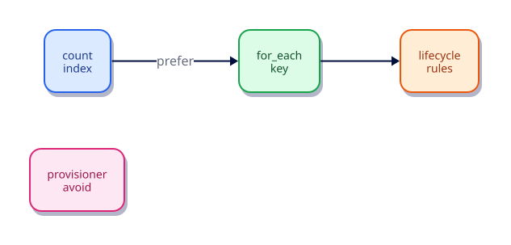

# Meta-Arguments — count, for_each, and lifecycle

## Overview

Most Terraform resources are declared once. Production stacks need **many similar instances** and careful control over **create, replace, and destroy**. Meta-arguments — especially `count`, `for_each`, and `lifecycle` — change how Terraform expands a single block into multiple addresses and how those addresses are updated.

Prefer `for_each` over `count` for sets of named objects: map and set keys produce stable addresses (`local_file.set["alpha"]`) instead of shifting indices (`local_file.set[0]`). Use `lifecycle` sparingly to encode real operational constraints — zero-downtime replace patterns, externally managed attributes, or hard stops on accidental destroy.

This is **Tutorial 13** in **Module 4: Language Power Tools** of the REBASH Academy Terraform track. You will expand a map of files with `for_each`, contrast a fragile `count` pattern, apply a targeted `ignore_changes` rule, and use `terraform_data` as a replace trigger companion.

## Learning Objectives

By the end of this tutorial, you will be able to:

- [ ] Choose `for_each` versus `count` with a clear production rationale
- [ ] Reference `each.key`, `each.value`, and `count.index` correctly
- [ ] Apply `create_before_destroy`, `ignore_changes`, and `prevent_destroy` judiciously
- [ ] Explain how `replace_triggered_by` and conditions interact with replacements
- [ ] Avoid index churn when lists reorder or shrink

## Prerequisites

- Completed [Registry Modules and Composition](registry-modules-and-composition.md)
- Terraform CLI **1.9+** (1.15.x recommended)
- Ability to create directories and edit files
- No cloud account required — labs use `hashicorp/local`, `hashicorp/random`, and built-in `terraform_data`

## Architecture

Meta-arguments sit on resource (and module) blocks. Terraform expands `for_each` / `count` into multiple instances in the resource graph; `lifecycle` rules then constrain how each instance may be created, replaced, or destroyed.



| Meta-argument | Effect |
|---------------|--------|
| `count` | Create N instances addressed by integer index |
| `for_each` | Create one instance per map key or set element |
| `lifecycle` | Control replace order, ignored attributes, and destroy guards |
| `depends_on` | Explicit edges when implicit references are not enough |
| `provider` | Bind an instance to a non-default provider alias |

## Theory

### Why meta-arguments matter

Without them you either duplicate blocks by hand or accept unsafe renames. Teams that misuse `count` see **mass replacement** when a list item is inserted at the front. Teams that overuse `ignore_changes` go blind to drift. Treat every meta-argument as a production decision reviewers must understand.

### `for_each` (preferred for named objects)

```hcl
resource "local_file" "set" {
  for_each = var.files # map(string) or set(string)

  filename = "${path.module}/out/${each.key}.txt"
  content  = "${each.value}\n"
}
```

| Collection | `each.key` | `each.value` |
|------------|------------|--------------|
| `map(string)` | Map key | Map value |
| `toset([...])` | Same as value | Element string |

Addresses look like `local_file.set["alpha"]`. Removing key `beta` destroys only that instance — neighbours keep their state.

### `count` (use when order and cardinality are the only concern)

```hcl
resource "local_file" "numbered" {
  count    = length(var.names)
  filename = "${path.module}/out/${count.index}.txt"
  content  = "${var.names[count.index]}\n"
}
```

Addresses are `local_file.numbered[0]`, `[1]`, … If `var.names` is `["a","b","c"]` and you delete `"a"`, index `0` now means `"b"` — Terraform may destroy and recreate the wrong objects. Prefer maps keyed by stable names.

Use `count = var.enabled ? 1 : 0` for a simple on/off toggle when a module has no natural map key.

### Referencing expanded resources

| Pattern | `for_each` | `count` |
|---------|------------|---------|
| Single instance | `local_file.set["alpha"].filename` | `local_file.numbered[0].filename` |
| All values | `values(local_file.set)[*].filename` | `local_file.numbered[*].filename` |
| Wrong | `local_file.set[*]` (invalid) | Treating indices as stable IDs |

Splat (`[*]`) works on lists from `count`, not on maps from `for_each`. Use `values(...)` or `for` expressions for maps.

### `lifecycle` block

| Argument | Purpose | Risk if misused |
|----------|---------|-----------------|
| `create_before_destroy` | Create replacement before destroying old | Temporary capacity / name conflicts |
| `prevent_destroy` | Fail apply if plan would destroy | Blocks intentional teardown; remove carefully |
| `ignore_changes` | Skip listed attributes in diffs | Hides drift forever if overused |
| `replace_triggered_by` | Force replace when listed objects change | Unexpected replaces if triggers are noisy |
| `precondition` / `postcondition` | Assert before/after apply | Over-strict checks block valid ops |

Example — ignore only an externally mutated attribute:

```hcl
lifecycle {
  ignore_changes = [file_permission]
}
```

Example — force replace of a marker when a file set changes:

```hcl
resource "terraform_data" "revision" {
  input = sha1(jsonencode(var.files))
}

resource "local_file" "manifest" {
  filename = "${path.module}/out/manifest.txt"
  content  = "revision=${terraform_data.revision.output}\n"

  lifecycle {
    replace_triggered_by = [terraform_data.revision]
  }
}
```

### Migrating `count` → `for_each`

Changing addressing without a `moved` block destroys and recreates. Prefer introducing `for_each` on **new** resources, or use `moved` blocks (next tutorial) to remap `resource[0]` → `resource["name"]` deliberately after a reviewed plan that shows **move**, not destroy.

### Practical mental model

1. Prefer maps/sets with business keys over positional lists
2. Plan after every meta-argument change and explain every replace line
3. Keep `ignore_changes` and `prevent_destroy` rare and documented
4. Destroy labs cleanly so the next exercise starts fresh

## Hands-on Lab

You will manage a map of files with `for_each`, demonstrate why `count` churns, add a lifecycle ignore, and use `terraform_data` plus `random_id` for a revision marker.

### Step 1 – Create the working directory

```bash
mkdir -p ~/rebash-tf-meta/out && cd ~/rebash-tf-meta
terraform version
```

**Expected:** Terraform 1.9+ (1.15.x ideal).

### Step 2 – Write `versions.tf`

```hcl
terraform {
  required_version = ">= 1.9.0"

  required_providers {
    local = {
      source  = "hashicorp/local"
      version = "~> 2.9"
    }
    random = {
      source  = "hashicorp/random"
      version = "~> 3.7"
    }
  }
}
```

**Expected:** `hashicorp/local` **2.9.x** and `hashicorp/random` **3.7+** (latest random is **3.9.0** as of this writing).

### Step 3 – Write `variables.tf`

```hcl
variable "files" {
  description = "Map of logical name to file body for for_each instances"
  type        = map(string)
  default = {
    alpha = "content-a"
    beta  = "content-b"
  }
}

variable "ordered_names" {
  description = "Ordered list used only to demonstrate fragile count indexing"
  type        = list(string)
  default     = ["one", "two"]
}
```

### Step 4 – Write `main.tf`

```hcl
resource "random_id" "lab" {
  byte_length = 2
}

resource "local_file" "set" {
  for_each = var.files

  filename        = "${path.module}/out/${each.key}.txt"
  content         = "${each.value}\nlab=${random_id.lab.hex}\n"
  file_permission = "0644"

  lifecycle {
    ignore_changes = [file_permission]
  }
}

resource "local_file" "numbered" {
  count = length(var.ordered_names)

  filename = "${path.module}/out/count-${count.index}.txt"
  content  = "${var.ordered_names[count.index]}\n"
}

resource "terraform_data" "file_set_hash" {
  input = sha1(jsonencode({
    files = var.files
    lab   = random_id.lab.hex
  }))
}

output "for_each_addresses" {
  description = "Stable for_each instance keys"
  value       = keys(local_file.set)
}

output "count_paths" {
  description = "Count-based paths (index-coupled)"
  value       = local_file.numbered[*].filename
}

output "revision" {
  description = "Hash stored in terraform_data"
  value       = terraform_data.file_set_hash.output
}
```

**Expected:** Two `for_each` files (`alpha`, `beta`), two `count` files (`count-0`, `count-1`), plus a `terraform_data` revision hash.

### Step 5 – Initialise, plan, and apply

```bash
terraform fmt
terraform init -input=false
terraform validate
terraform plan -input=false -out=tfplan
terraform apply -input=false tfplan
terraform state list
ls -la out/
terraform output
```

**Expected:** State lists `local_file.set["alpha"]`, `local_file.set["beta"]`, `local_file.numbered[0]`, `local_file.numbered[1]`, `random_id.lab`, and `terraform_data.file_set_hash`. Outputs show keys `alpha`/`beta` and the revision hash.

### Step 6 – Prove `for_each` isolation

Create `terraform.tfvars`:

```hcl
files = {
  alpha = "content-a"
  gamma = "content-c"
}
```

```bash
terraform plan -input=false
```

**Expected:** Destroy `local_file.set["beta"]`, create `local_file.set["gamma"]`, update `terraform_data.file_set_hash`. **No** destroy of `alpha` solely because of neighbour changes.

Apply when ready:

```bash
terraform apply -input=false -auto-approve
```

### Step 7 – Observe `count` churn (read-only plan)

Temporarily set in `terraform.tfvars`:

```hcl
ordered_names = ["zero", "one", "two"]
```

```bash
terraform plan -input=false
```

**Expected:** Create `local_file.numbered[2]` and **update** `[0]`/`[1]` content because indices now map to different strings — or worse churn if you reorder. Revert `ordered_names` to `["one", "two"]` afterward so the lesson sticks without leaving a messy state.

### Step 8 – Confirm `ignore_changes`

```bash
chmod 0600 out/alpha.txt
terraform plan -input=false
```

**Expected:** No update proposed for `file_permission` on `local_file.set["alpha"]` because of `ignore_changes`. (Content/hash changes still plan normally.)

### Step 9 – Clean up

```bash
terraform destroy -input=false -auto-approve
```

**Expected:** `out/` managed files removed; state cleared of lab resources.

## Code Walkthrough

### `for_each = var.files`

| Piece | Role |
|-------|------|
| Map keys | Become instance keys in state |
| `each.key` | Filename stem (`alpha.txt`) |
| `each.value` | File body prefix |
| `random_id.lab.hex` | Shared suffix proving all instances share one dependency |

### `lifecycle.ignore_changes`

Only `file_permission` is ignored — a realistic stand-in for attributes mutated by operators or OS tools. Ignoring `content` would hide real configuration drift; do not copy that mistake.

### `count` resources

`count.index` couples identity to position. The lab keeps them small so you can *see* the hazard without needing cloud resources.

### `terraform_data.file_set_hash`

| Argument | Purpose |
|----------|---------|
| `input` | Value stored in state and exposed as `output` |
| Hash of files + lab id | Forces a visible revision when the set changes |

Prefer `terraform_data` over legacy `null_resource` on Terraform 1.4+.

### Outputs

`keys(local_file.set)` lists stable addresses; `local_file.numbered[*].filename` is the count-era splat pattern — fine for lists, wrong instinct for maps.

## Validation

```bash
terraform fmt -check
terraform init -input=false
terraform validate
terraform apply -input=false -auto-approve
terraform state list | grep 'local_file.set\['
test -f out/alpha.txt && test -f out/beta.txt
terraform output -json for_each_addresses
chmod 0600 out/alpha.txt && terraform plan -input=false -detailed-exitcode; echo "exit=$?"
terraform destroy -input=false -auto-approve
```

| Check | Pass criteria |
|-------|----------------|
| Formatting | `fmt -check` exits 0 |
| Addresses | State shows `local_file.set["alpha"]` style keys |
| Isolation | Removing a map key only destroys that instance |
| Ignore | Permission-only chmod does not appear in plan |
| Cleanup | Destroy leaves no managed lab files |

## Best Practices

- Default to `for_each` with stable business keys (`name`, `az`, `shard_id`)
- Reserve `count` for toggles (`0`/`1`) or truly positional, disposable objects
- Document every `ignore_changes` and `prevent_destroy` in the PR description
- After changing meta-arguments, demand a plan with **zero unexplained replaces**
- Prefer module inputs as maps when callers will grow the set over time
- Use `moved` blocks (next tutorial) when renaming addresses in existing state

## Security Considerations

- More instances mean more attributes in state — treat state as sensitive even for `local_file`
- Do not encode secrets into `each.value` strings that land in plans and state
- `prevent_destroy` is not an access control; IAM and pipeline gates still matter
- Review plans that add dozens of `for_each` instances for cost and blast radius
- Limit who can unlock state when a bad `count` refactor holds a lock mid-failure

## Common Mistakes

!!! warning "Using count with unordered or reordered lists"
    Mass replacement and wrong object updates. **Fix:** Use `for_each` with maps or sets keyed by stable names.

!!! warning "ignore_changes on everything"
    Drift blindness and “Terraform did nothing” incidents. **Fix:** Ignore only externally mutated attributes, with a comment and an owner.

!!! warning "Splat on for_each resources"
    Invalid expressions like `local_file.set[*]`. **Fix:** Use `values(local_file.set)[*].attr` or a `for` expression.

!!! warning "Toggling prevent_destroy without a teardown path"
    Blocks destroy in emergencies. **Fix:** Remove the rule in a dedicated PR before intentional teardown.

## Troubleshooting

| Issue | Cause | Solution |
|-------|-------|----------|
| `Invalid for_each argument` | Unknown value at plan (depends on apply-time attr) | Derive keys from variables/locals known at plan; avoid unknown map keys |
| Mass replace after list edit | `count` index shift | Convert to `for_each` with `moved` blocks |
| Plan still wants permission change | Attribute not listed in `ignore_changes` | Add the exact attribute name; re-plan |
| `Error: Instance cannot be destroyed` | `prevent_destroy` set | Remove lifecycle rule in config, apply that change, then destroy |
| Confusion reading state addresses | Mixed count and for_each | Prefer one expansion style per resource type in a module |

## Interview Questions

1. When is `for_each` preferable to `count`?
   *When instances have stable identities (names, AZs, keys) so removing one does not renumber the others.*

2. Why are count index addresses fragile when lists shrink?
   *Indices reuse positions; Terraform may update or replace the wrong physical object.*

3. How do you migrate from `count` to `for_each` safely?
   *Add `moved` blocks (or careful state operations) so plans show moves, not destroy/create, then apply after review.*

4. What does `ignore_changes` do, and when is it a smell?
   *It suppresses diffs for listed attributes; smell when used to hide unmanaged drift instead of fixing ownership.*

5. How does `create_before_destroy` help zero downtime?
   *Terraform creates the replacement first so dependents can shift before the old object is destroyed.*

6. What is `prevent_destroy` used for?
   *To fail applies that would destroy critical resources, forcing an explicit config change first.*

7. How do lifecycle blocks interact with replacements?
   *They can reorder create/destroy, ignore attributes that would otherwise force updates, or trigger replaces via `replace_triggered_by`.*

8. How do you set `for_each` over a set of strings?
   *`for_each = toset(["a","b"])` — then `each.key` and `each.value` are the same string.*

9. What is `each.key` versus `each.value`?
   *For maps, key is the map key and value is the map value; for sets, both are the element.*

10. How does `count = 0` disable a resource?
    *Terraform plans destruction (or never creates) all instances; useful as a feature flag with care.*

11. Why avoid splat expressions on resources that use `for_each`?
    *Splat expects a list; `for_each` resources are maps — use `values(...)` or `for` expressions.*

12. How would you add a lifecycle rule safely in production?
    *Add it in a PR, show a plan with no unexpected replaces, document why, and monitor the next few applies for hidden drift.*

## Summary

- Prefer `for_each` with stable keys; treat `count` indices as fragile identities
- Use `lifecycle` for real operational constraints, not as a blunt hammer
- Plans must explain every create, update, replace, and destroy after meta-argument edits
- `terraform_data` is the modern companion for triggers and markers without `null_resource`
- Master these patterns before refactors and CI gates later in the track

## Related Tutorials

- Track overview: [Terraform](index.md)
- Previous: [Registry Modules and Composition](registry-modules-and-composition.md)
- Next: [Functions, Templates, and Dynamic Blocks](functions-templates-and-dynamic-blocks.md)
- Cheat sheet: [Terraform Cheat Sheet](../cheatsheets/terraform.md)
- Interview prep: [Terraform Interview Prep](../interview/terraform.md)
- Learning path: [DevOps Engineer](../learning-paths/devops-engineer.md)

## References

1. [Meta-arguments](https://developer.hashicorp.com/terraform/language/meta-arguments/depends_on)
2. [The for_each Meta-Argument](https://developer.hashicorp.com/terraform/language/meta-arguments/for_each)
3. [The count Meta-Argument](https://developer.hashicorp.com/terraform/language/meta-arguments/count)
4. [The lifecycle Meta-Argument](https://developer.hashicorp.com/terraform/language/meta-arguments/lifecycle)
5. [terraform_data resource](https://developer.hashicorp.com/terraform/language/resources/terraform-data)
6. [hashicorp/local provider](https://registry.terraform.io/providers/hashicorp/local/latest)
7. [hashicorp/random provider](https://registry.terraform.io/providers/hashicorp/random/latest)
