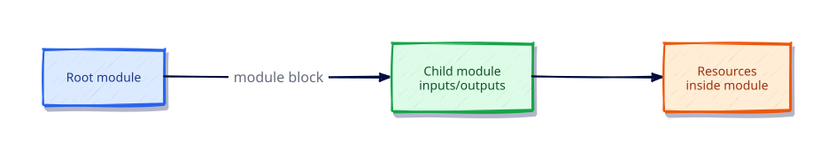

# Modules — Creating Reusable Infrastructure

## Overview

Modules package reusable infrastructure patterns behind a typed input/output API. This tutorial builds a child module and calls it from a root — the fundamental composition skill for platform teams.

This is **Tutorial 11** in **Module 3: Collaboration and Scale** of the REBASH Academy Terraform track.

## Learning Objectives

By the end of this tutorial, you will be able to:

- [ ] Create a child module with variables and outputs
- [ ] Call modules with the module block
- [ ] Use path.module inside child modules
- [ ] Design small, composable modules
- [ ] Avoid leaking unnecessary implementation outputs

## Prerequisites

- Completed Workspaces and Environment Strategies

- Terraform CLI **1.9+** (1.15.x recommended)
- Ability to create directories and edit files

## Architecture




## Theory

### Module block

```hcl
module "greeting" {
  source     = "./modules/greeting"
  project    = "rebash"
  message    = "hello"
}
```

### Design tips

- One responsibility per module
- Typed variables with descriptions
- Stable outputs only
- Pin external module versions (next tutorial)

### Why this topic matters in production

Teams that skip **authoring and calling child modules** eventually pay in outages: unreviewable plans, brittle
refactors, or secrets leaking into logs. Treat this tutorial as the minimum bar for merging
Terraform changes on a shared state file.

### Practical mental model

1. Write the smallest config that proves the idea
2. `fmt` / `validate` / `plan` until the diff matches your intent
3. Apply only after you can explain every create/update/replace line
4. Destroy lab resources so the next exercise starts clean

## Hands-on Lab

```bash
mkdir -p ~/rebash-tf-mod/modules/greeting
cd ~/rebash-tf-mod
```

`modules/greeting/variables.tf`, `main.tf`, `outputs.tf`, and root `main.tf`:

```hcl
# modules/greeting/variables.tf
variable "project" { type = string }
variable "message" { type = string }

# modules/greeting/main.tf
resource "local_file" "this" {
  filename = "${path.module}/../../generated/${var.project}.txt"
  content  = "${var.message}\n"
}

# modules/greeting/outputs.tf
output "path" { value = local_file.this.filename }

# versions.tf (root)
terraform {
  required_version = ">= 1.9.0"
  required_providers {
    local = {
      source  = "hashicorp/local"
      version = "~> 2.9"
    }
  }
}

# main.tf (root)
module "greeting" {
  source  = "./modules/greeting"
  project = "rebash"
  message = "module-lab"
}

output "greeting_path" {
  value = module.greeting.path
}
```

```bash
mkdir -p generated
terraform init -input=false && terraform apply -input=false -auto-approve
terraform destroy -input=false -auto-approve
```

## Code Walkthrough

The root only depends on the module’s outputs — encapsulation that lets you change module internals safely.


Re-read every argument in the lab through the lens of **authoring and calling child modules**.
For each resource address, ask: what happens on the next plan if I change this value?
Update in place, replace, or no-op? That habit is how you avoid surprise destroys.

## Validation

Run the lab to completion, then confirm:

```bash
terraform fmt -check
terraform init -input=false
terraform validate
terraform plan -input=false
```

| Check | Pass criteria |
|-------|----------------|
| Formatting | `fmt -check` exits 0 |
| Configuration | `validate` succeeds after init |
| Intent | Plan matches the tutorial’s expected creates/updates only |
| Topic focus | You can explain how this lab demonstrates authoring and calling child modules |
| Cleanup | Destroy (or documented teardown) left no stray lab files |

## Best Practices

- Keep examples small enough to run without cloud credentials unless the topic requires otherwise
- Document assumptions (CLI version, providers, working directory) at the top of the root module
- Prefer explicitness over cleverness when teaching **authoring and calling child modules**
- Add CI checks (`fmt`, `validate`, plan) as soon as a root is shared
- Write outputs that help the next human debug, not just the next machine

## Security Considerations

- Assume state and plan output may contain secrets related to **authoring and calling child modules**
- Use least-privilege credentials whenever a provider needs authentication
- Do not commit tfvars with real secrets; use examples with placeholders
- Review plans for unexpected destroys before apply
- Limit who can unlock state and who can approve production applies

## Common Mistakes

!!! warning "Mega-modules that create an entire company"
    Unreviewable. **Fix:** Compose small modules.

!!! warning "Using relative `../` outputs as API"
    Brittle. **Fix:** Export stable IDs/names only.

## Troubleshooting

| Issue | Cause | Solution |
|-------|-------|----------|
| validate fails | Missing init or syntax error | Run `terraform init`, read the file:line in the error |
| Plan shows replace unexpectedly | ForceNew argument changed | Confirm intent; use moved/lifecycle if refactoring |
| Provider auth errors | Credentials not available | Export the documented env vars for the provider |
| Topic confusion around authoring and calling child modules | Skipped theory | Re-read Theory, then re-run the lab from a clean directory |
| Leftover lab files | Destroy skipped | Re-run destroy or delete the lab directory after state cleanup |

## Interview Questions

1. What makes a good module boundary?
2. How do you version modules for consumers?
3. Why avoid leaking too many outputs?
4. What is path.module inside a child module?
5. How do providers pass into modules?
6. When should a module use count or for_each?
7. How do you test a module locally with a source path?
8. What belongs in the module README?
9. How do input validations protect callers?
10. Why pin module sources in production?
11. What is compositional nesting versus a megamodule?
12. How do you refactor a root into modules safely?

## Summary

- Master **authoring and calling child modules** before moving to the next tutorial in the track
- Every shared root needs formatting, validation, and a reviewed plan
- Prefer small, reversible labs that you can destroy confidently
- Carry security and state hygiene forward into every later module

## Related Tutorials

- Track overview: [Terraform](index.md)
- Previous: [Workspaces and Environment Strategies](workspaces-and-environment-strategies.md)
- Next: [Registry Modules and Composition](registry-modules-and-composition.md)

## References

1. [Terraform documentation](https://developer.hashicorp.com/terraform/docs)
2. [Terraform CLI commands](https://developer.hashicorp.com/terraform/cli/commands)
3. [Terraform language](https://developer.hashicorp.com/terraform/language)
4. [Terraform Registry](https://registry.terraform.io/)
5. [Version constraints](https://developer.hashicorp.com/terraform/language/expressions/version-constraints)
