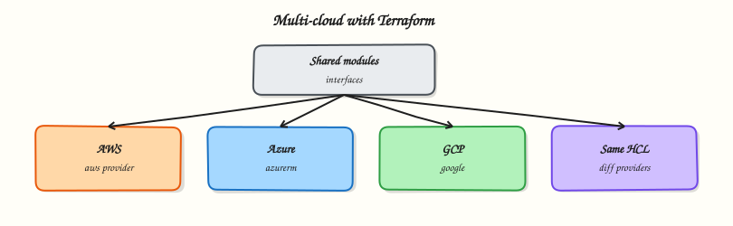

# Multi-Cloud Terraform

## Overview

Describe the same landing-zone shape on AWS, Azure, and Google Cloud Platform (GCP) behind one module interface — network, compute, identity, and object storage — with illustrative HCL skeletons (not a live multi-cloud deploy).

Multi-cloud Terraform is rarely “one resource block for every cloud”. You define a **stable interface** (inputs/outputs) and implement provider-specific modules underneath. AWS Virtual Private Cloud (VPC) / Elastic Compute Cloud (EC2) / Identity and Access Management (IAM) / Simple Storage Service (S3), Azure resource groups / Virtual Networks (VNets) / virtual machines, and GCP VPC / Compute Engine / Cloud Storage map to the same platform vocabulary with different APIs.

This is a core tutorial in **Module 17 · Multi-Cloud Infrastructure** of the REBASH Academy **Terraform for Cloud & DevOps Engineers** series — written for Cloud, DevOps, Platform, and SRE engineers.

## Prerequisites

- [Terraform in CI/CD Pipelines](terraform-in-ci-cd-pipelines.md)

## Learning Objectives

By the end of this tutorial, you will be able to:

- [ ] Sketch AWS VPC, EC2, IAM, and S3 patterns in HCL  
- [ ] Sketch Azure resource group, VNet, and VM patterns  
- [ ] Sketch GCP VPC, Compute Engine, and Cloud Storage patterns  
- [ ] Design a shared module interface across clouds  
- [ ] Explain why “identical” multi-cloud is usually a facade

## Architecture

This topic’s control points and relationships are shown below.



## Theory

### What it is

**Multi-cloud Terraform** means using one IaC toolchain and (ideally) one team vocabulary across providers, not pretending every cloud primitive is identical. Practically you compose:

| Capability | AWS | Azure | GCP |
|------------|-----|-------|-----|
| Network | VPC, subnets, routes | VNet, subnets, NSGs | VPC, subnets, firewall |
| Compute | EC2 / ASG | Virtual Machine / scale set | Compute Engine / MIG |
| Identity | IAM roles/policies | RBAC, managed identities | IAM bindings, SA keys (avoid) |
| Object storage | S3 | Blob (Storage Account) | Cloud Storage (GCS) |
| Scope container | Account + region | Subscription + resource group | Project + region |

Providers (`hashicorp/aws`, `hashicorp/azurerm`, `hashicorp/google`) are configured per root or via aliases. Child modules hide cloud details; roots pass `cloud = "aws"|"azure"|"gcp"` or call `module.aws_network` / `module.azure_network` explicitly.

### Why it matters

Enterprises often run primary workloads on one cloud and DR, SaaS adjacency, or acquisitions on another. Without a shared interface, every squad invents incompatible VPC and IAM patterns. Platform teams publish thin facades so product roots stay boring: `cidr`, `environment`, `tags` in — `subnet_ids`, `instance_id`, `bucket_arn` out — while specialists own the cloud-specific modules and upgrades.

### How it works

1. Define a **contract** (variables/outputs) that is cloud-agnostic enough for consumers.  
2. Implement `modules/network/<cloud>`, `modules/compute/<cloud>`, `modules/storage/<cloud>` (or Registry modules pinned per cloud).  
3. Wire providers in the root; never hardcode credentials in modules.  
4. Keep state **separate per cloud/account/subscription/project** — do not stuff three clouds into one state file.  
5. Accept intentional differences: Azure resource groups, GCP projects, and AWS accounts are not 1:1; document mapping in the facade README.

Illustrative skeletons (conceptual — attribute names simplify real APIs):

```hcl
# modules/network/aws/main.tf (sketch)
resource "aws_vpc" "this" {
  cidr_block = var.cidr
  tags       = var.tags
}

# modules/network/azure/main.tf (sketch)
resource "azurerm_resource_group" "this" {
  name     = var.name
  location = var.location
}
resource "azurerm_virtual_network" "this" {
  name                = var.name
  address_space       = [var.cidr]
  location            = azurerm_resource_group.this.location
  resource_group_name = azurerm_resource_group.this.name
}

# modules/network/gcp/main.tf (sketch)
resource "google_compute_network" "this" {
  name                    = var.name
  auto_create_subnetworks = false
}
```

Same idea for compute (EC2 / `azurerm_linux_virtual_machine` / `google_compute_instance`) and storage (`aws_s3_bucket` / `azurerm_storage_account` / `google_storage_bucket`) behind matching outputs such as `network_id` and `bucket_name`.

### Key concepts and comparisons

| Approach | When it works |
|----------|----------------|
| Facade modules + cloud impl | Platform standardisation |
| Separate roots per cloud | Clearest blast radius |
| Single “multi-cloud” mega-module | Rarely maintainable |
| Cloud-agnostic tools only | Insufficient for real IAM/network |

### Common pitfalls

- Expecting one HCL file to create identical security postures on every cloud.  
- One shared state for AWS + Azure + GCP — locking and blast radius suffer.  
- Copy-pasting AWS resource names into Azure modules.  
- Forcing lowest-common-denominator features and then bolting exceptions everywhere.  
- Leaving provider credentials inside child modules instead of the root/CI.

## Hands-on Lab

Create a workspace for this tutorial.

```bash
mkdir -p ~/rebash-terraform/module-17/modules/network/{aws,azure,gcp} && cd ~/rebash-terraform/module-17/modules/network/{aws,azure,gcp}
```

**Focus:** hands-on practice for Multi-Cloud Terraform

### Step 1 – Skeleton

```bash
cat > lab.sh << 'EOF'
#!/usr/bin/env bash
set -euo pipefail
echo "lab: Multi-Cloud Terraform"
EOF
chmod +x lab.sh
./lab.sh
```

### Step 2 – Core exercise

```bash
mkdir -p ~/rebash-terraform/module-17/modules/network/{aws,azure,gcp}
cd ~/rebash-terraform/module-17

cat > modules/network/interface.md << 'EOF'

### Final step – Cleanup note

```bash
# Keep ~/rebash-terraform/ for later labs; destroy cloud resources you created
./lab.sh || true
```

## Validation

- [ ] Lab commands run under `~/rebash-terraform/module-17/modules/network/{aws,azure,gcp}/`
- [ ] You can explain each Theory section in your own words
- [ ] You used modern tooling where it applies to this topic
- [ ] You can describe one production failure mode for this topic

## Code Walkthrough

Production practice for **Multi-Cloud Terraform** always combines:

1. Inspect before you change (status, plan, logs, dry-run)
2. Prefer reversible, documented changes (Git, IaC, drop-ins, version pins)
3. Capture evidence (command output, pipeline logs) for handovers
4. Prefer current tools and APIs over legacy shortcuts
5. Least privilege — escalate credentials only when required

Keep runbooks short enough to follow under pressure. Automate checks; keep humans for judgement.

## Security Considerations

- Treat credentials and tokens for terraform as privileged — never commit them
- Prefer short-lived auth (OIDC, roles, SSO) over long-lived keys
- Validate blast radius before apply/deploy/delete operations
- Restrict who can approve production changes
- Collect audit logs; limit who can read sensitive traces

## Common Mistakes

!!! warning "Expecting one HCL file to create identical security postures on every cloud.  "
    Validate assumptions against the Theory section and official docs before changing production.

!!! warning "One shared state for AWS + Azure + GCP — locking and blast radius suffer.  "
    Lab shortcuts (open security groups, admin roles, skip approvals) must not ship unchanged.

!!! warning "Changing production without a rollback path"
    Always know how to revert (previous artefact, prior release, state rollback, DNS failback).

## Best Practices

- Encode Multi-Cloud Terraform changes as code and review them in pull requests
- Pin versions (images, modules, actions, provider plugins)
- Separate environments with clear promotion gates
- Alert on symptoms with runbooks attached
- Destroy lab resources; tag everything with owner and expiry where possible

## Troubleshooting

| Symptom | Likely cause | Fix |
|---------|--------------|-----|
| Auth / permission denied | Wrong identity, policy, or scope | Check caller identity, roles, and least-privilege policies |
| Timeout / no route | Network, DNS, security group, or endpoint | Trace path, DNS, and allow-lists before retrying |
| Drift / unexpected plan | Manual change or wrong state/workspace | Reconcile desired vs actual; avoid click-ops on managed resources |
| Pipeline/job red | Flaky step, cache, or missing secret | Read failing step logs; bisect recent workflow/config changes |
| Cost spike | Idle load balancer, NAT, oversized compute | Inventory billable resources; stop/delete labs promptly |

## Summary

**Multi-Cloud Terraform** is essential for Cloud and DevOps engineers working with terraform. Practise the lab until the inspection and change path is muscle memory, then continue the track.

## Interview Questions

1. How does **Multi-Cloud Terraform** show up when operating Cloud or production platforms?
2. What would you check first if this area misbehaves in production?
3. Which modern tools or APIs replace older equivalents here?
4. What security control should accompany this capability?
5. How would you automate verification of this topic in CI?

!!! tip "Sample answer — question 2"
    Start with blast radius and recent changes, gather evidence (logs, status, plan/diff), then fix forward with a known rollback path — not guesswork.

## Related Tutorials

- [Course overview](index.md)
- - [Kubernetes Infrastructure with Terraform](kubernetes-infrastructure-with-terraform.md)

## References

- [AWS provider](https://registry.terraform.io/providers/hashicorp/aws/latest/docs) · [AzureRM](https://registry.terraform.io/providers/hashicorp/azurerm/latest/docs) · [Google](https://registry.terraform.io/providers/hashicorp/google/latest/docs)
