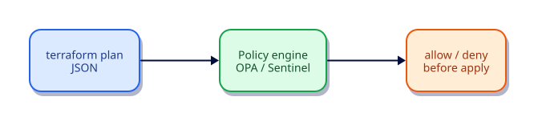

# Policy as Code Overview

## Overview

Policy as code blocks unsafe plans before apply. Compare OPA/Conftest with HashiCorp Sentinel, and practice evaluating a Terraform plan JSON against a simple Rego rule.

This is **Tutorial 18** in **Module 5: Quality and Security** of the REBASH Academy Terraform track.

## Learning Objectives

By the end of this tutorial, you will be able to:

- [ ] Explain policy-as-code in the Terraform workflow
- [ ] Contrast OPA and Sentinel
- [ ] Generate terraform show -json plans
- [ ] Write a basic Rego denial rule
- [ ] Place policy checks in CI before apply

## Prerequisites

- Completed Secrets and Sensitive Values

- Terraform CLI **1.9+** (1.15.x recommended)
- Ability to create directories and edit files

## Architecture




## Theory

### Placement

`fmt → validate → plan → **policy** → apply`

### Engines

| Engine | Typical home |
|--------|----------------|
| OPA / Conftest | Any CI |
| Sentinel | HCP Terraform / TFE |

### Plan JSON

```bash
terraform plan -out=tfplan
terraform show -json tfplan > plan.json
```

### Why this topic matters in production

Teams that skip **policy as code for Terraform plans** eventually pay in outages: unreviewable plans, brittle
refactors, or secrets leaking into logs. Treat this tutorial as the minimum bar for merging
Terraform changes on a shared state file.

### Practical mental model

1. Write the smallest config that proves the idea
2. `fmt` / `validate` / `plan` until the diff matches your intent
3. Apply only after you can explain every create/update/replace line
4. Destroy lab resources so the next exercise starts clean

## Hands-on Lab

### Step 1 – Configuration + plan JSON

```bash
mkdir -p ~/rebash-tf-policy/policy
cd ~/rebash-tf-policy
```

```hcl
terraform {
  required_version = ">= 1.9.0"
  required_providers {
    local = {
      source  = "hashicorp/local"
      version = "~> 2.9"
    }
  }
}

resource "local_file" "allow" {
  filename = "${path.module}/allow.txt"
  content  = "ok\n"
}
```

```bash
terraform init -input=false
terraform plan -input=false -out=tfplan
terraform show -json tfplan > plan.json
head -c 200 plan.json; echo
```

### Step 2 – Example Rego policy

`policy/deny_deletes.rego`:

```rego
package terraform.policy

import future.keywords.if
import future.keywords.in

deny[msg] if {
  some rc in input.resource_changes
  rc.type == "local_file"
  "delete" in rc.change.actions
  msg := sprintf("deleting local_file %s is blocked by lab policy", [rc.address])
}
```

### Step 3 – Evaluate (if OPA installed)

```bash
# Install from https://www.openpolicyagent.org/docs/latest/#running-opa
opa eval --format pretty -i plan.json -d policy/ 'data.terraform.policy.deny'
```

Empty deny set means the plan is allowed. Re-run after a destroy plan to see denials.

### Sentinel note

On HCP Terraform, Sentinel policies run against the same plan data using HashiCorp’s policy language. The **placement** in the pipeline is identical: after plan, before apply.

## Code Walkthrough

Start with deny-by-default for high-risk actions (public SG rules, unencrypted state buckets) and expand gradually.


Re-read every argument in the lab through the lens of **policy as code for Terraform plans**.
For each resource address, ask: what happens on the next plan if I change this value?
Update in place, replace, or no-op? That habit is how you avoid surprise destroys.

## Validation

Run the lab to completion, then confirm:

```bash
terraform fmt -check
terraform init -input=false
terraform validate
terraform plan -input=false
```

| Check | Pass criteria |
|-------|----------------|
| Formatting | `fmt -check` exits 0 |
| Configuration | `validate` succeeds after init |
| Intent | Plan matches the tutorial’s expected creates/updates only |
| Topic focus | You can explain how this lab demonstrates policy as code for Terraform plans |
| Cleanup | Destroy (or documented teardown) left no stray lab files |

## Best Practices

- Keep examples small enough to run without cloud credentials unless the topic requires otherwise
- Document assumptions (CLI version, providers, working directory) at the top of the root module
- Prefer explicitness over cleverness when teaching **policy as code for Terraform plans**
- Add CI checks (`fmt`, `validate`, plan) as soon as a root is shared
- Write outputs that help the next human debug, not just the next machine

## Security Considerations

- Assume state and plan output may contain secrets related to **policy as code for Terraform plans**
- Use least-privilege credentials whenever a provider needs authentication
- Do not commit tfvars with real secrets; use examples with placeholders
- Review plans for unexpected destroys before apply
- Limit who can unlock state and who can approve production applies

## Common Mistakes

!!! warning "Policies only in wiki"
    Unenforced. **Fix:** Execute in CI on every plan.

## Troubleshooting

| Issue | Cause | Solution |
|-------|-------|----------|
| validate fails | Missing init or syntax error | Run `terraform init`, read the file:line in the error |
| Plan shows replace unexpectedly | ForceNew argument changed | Confirm intent; use moved/lifecycle if refactoring |
| Provider auth errors | Credentials not available | Export the documented env vars for the provider |
| Topic confusion around policy as code for Terraform plans | Skipped theory | Re-read Theory, then re-run the lab from a clean directory |
| Leftover lab files | Destroy skipped | Re-run destroy or delete the lab directory after state cleanup |

## Interview Questions

1. What problem does policy as code solve?
2. Where should policies run in a pipeline?
3. What is the difference between advisory and hard-mandatory policy?
4. Give examples of policies worth enforcing first.
5. How do policies relate to module defaults?
6. Why evaluate plans rather than only applied state?
7. How do you test policies themselves?
8. What organisational ownership model works for policies?
9. How do exceptions get managed safely?
10. What is the relationship to CIS / Well-Architected ideas?
11. How do you avoid policy sprawl?
12. When is a policy the wrong tool versus a module default?

## Summary

- Master **policy as code for Terraform plans** before moving to the next tutorial in the track
- Every shared root needs formatting, validation, and a reviewed plan
- Prefer small, reversible labs that you can destroy confidently
- Carry security and state hygiene forward into every later module

## Related Tutorials

- Track overview: [Terraform](index.md)
- Previous: [Secrets and Sensitive Values](secrets-and-sensitive-values.md)
- Next: [Terraform in CI/CD Pipelines](terraform-in-ci-cd-pipelines.md)

## References

1. [Terraform documentation](https://developer.hashicorp.com/terraform/docs)
2. [Terraform CLI commands](https://developer.hashicorp.com/terraform/cli/commands)
3. [Terraform language](https://developer.hashicorp.com/terraform/language)
4. [Terraform Registry](https://registry.terraform.io/)
5. [Version constraints](https://developer.hashicorp.com/terraform/language/expressions/version-constraints)
