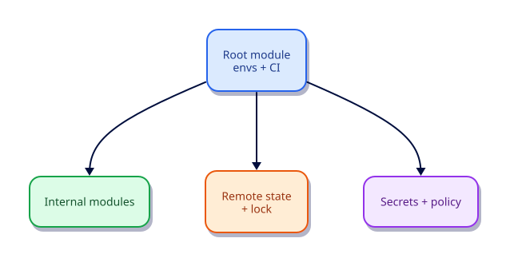

# Production Patterns and Capstone

## Overview

This capstone assembles the track into a **production-shaped** repository: shared modules, an environment root, tagging standards, quality gates, secrets hygiene notes, and a checklist you can carry to real cloud stacks. The lab still uses `local_file`, `random`, and `terraform_data` so you can apply end-to-end without a cloud account — swap module bodies for AWS/Azure/GCP resources later without redesigning the layout.

Leave with muscle memory: `envs/` for roots, `modules/` for reuse, CI for apply, remote state before the second engineer joins.

This is **Tutorial 20** in **Module 6: Production** of the REBASH Academy Terraform track — the final tutorial in the series.

## Learning Objectives

By the end of this tutorial, you will be able to:

- [ ] Structure `envs/` and `modules/` cleanly
- [ ] Compose multiple modules with shared locals/tags
- [ ] Apply production checklists (state, secrets, CI, policy)
- [ ] Document outputs and an upgrade strategy
- [ ] Demonstrate end-to-end validate/plan/apply locally

## Prerequisites

- Completed [Terraform in CI/CD Pipelines](terraform-in-ci-cd-pipelines.md)
- All prior Terraform tutorials recommended
- Terraform CLI **1.9+** (1.15.x recommended)
- Ability to create directories and edit files
- No cloud account required for the capstone lab

## Architecture

Environment roots own state and provider configuration. Modules encapsulate reusable building blocks. CI plans and applies roots; policy and tests guard shared modules.



| Path | Responsibility |
|------|----------------|
| `modules/network` | Shared “network” stand-in |
| `modules/app` | Shared “app” stand-in depending on network outputs |
| `envs/dev` | Dev root: providers, composition, outputs |
| `.github/workflows/` | Plan/apply automation (from previous tutorial) |

## Theory

### Suggested layout

```text
modules/
  network/
  app/
envs/
  dev/
  prod/
generated/                 # lab artefacts (gitignored in real repos if local)
.github/workflows/terraform.yml
```

Each env root pins providers, configures its backend, and calls modules with env-specific variables. **Do not** share one state file across prod and dev.

### When to split state

| Keep together | Split |
|---------------|-------|
| Tightly coupled resources always applied together | Different blast radius, teams, or cadences |
| Single app environment | Network foundation vs app layer when ownership differs |

Smaller states mean faster plans and smaller blast radius — at the cost of more wiring (remote state data sources or explicit contracts).

### Production checklist

- [ ] `required_version` + `required_providers` + committed lockfile  
- [ ] Remote state + locking + encryption  
- [ ] No secrets in Git; sensitive marks; secret manager where needed  
- [ ] CI plan on PR / apply on main with OIDC  
- [ ] Policy checks on plan JSON  
- [ ] Module tests for shared modules  
- [ ] Tagging/label standards in locals  
- [ ] Drift review cadence and on-call ownership  
- [ ] Documented upgrade strategy for Terraform CLI and providers  

### Upgrade strategy

1. Pin CLI in CI; bump in a dedicated PR  
2. `terraform init -upgrade` deliberately; review lockfile  
3. Plan in non-production first  
4. Apply production during a change window with rollback notes  

### Observability around Terraform

- Store plan/apply logs centrally  
- Alert on failed applies and state unlock events  
- Tag resources for cost and ownership (`Project`, `Env`, `Managed`)  
- Track lead time from merge to successful apply  

### Practical mental model

1. Modules encode reuse and safe defaults  
2. Env roots encode instantiation and secrets wiring  
3. CI encodes who may change reality  
4. Checklists catch what memory forgets  

## Hands-on Lab

### Step 1 – Repository layout

```bash
mkdir -p ~/rebash-tf-capstone/{modules/network,modules/app,envs/dev,generated}
cd ~/rebash-tf-capstone
terraform version
```

**Expected:** Directory tree ready; Terraform 1.9+.

### Step 2 – Network module

`modules/network/versions.tf`:

```hcl
terraform {
  required_version = ">= 1.9.0"

  required_providers {
    local = {
      source  = "hashicorp/local"
      version = "~> 2.9"
    }
    random = {
      source  = "hashicorp/random"
      version = "~> 3.7"
    }
  }
}
```

`modules/network/variables.tf`:

```hcl
variable "name" {
  description = "Logical network name"
  type        = string
}

variable "tags" {
  description = "Tags embedded in the network artefact"
  type        = map(string)
}
```

`modules/network/main.tf`:

```hcl
resource "random_id" "net" {
  byte_length = 2
}

resource "local_file" "vpc" {
  filename = "${path.module}/../../generated/${var.name}-vpc.txt"
  content  = <<-EOT
    name=${var.name}
    net_id=${random_id.net.hex}
    tags=${jsonencode(var.tags)}
  EOT
}

resource "terraform_data" "network_marker" {
  input = {
    name = var.name
    id   = random_id.net.hex
  }
}

output "vpc_file" {
  description = "Path to the network stand-in file"
  value       = local_file.vpc.filename
}

output "network_id" {
  description = "Synthetic network id"
  value       = random_id.net.hex
}
```

### Step 3 – App module

`modules/app/versions.tf`:

```hcl
terraform {
  required_version = ">= 1.9.0"

  required_providers {
    local = {
      source  = "hashicorp/local"
      version = "~> 2.9"
    }
  }
}
```

`modules/app/variables.tf`:

```hcl
variable "name" {
  description = "Application name"
  type        = string
}

variable "vpc_file" {
  description = "Dependency contract from the network module"
  type        = string
}

variable "network_id" {
  description = "Synthetic network id for the app artefact"
  type        = string
}

variable "tags" {
  description = "Tags embedded in the app artefact"
  type        = map(string)
}
```

`modules/app/main.tf`:

```hcl
resource "local_file" "app" {
  filename = "${path.module}/../../generated/${var.name}-app.txt"
  content  = <<-EOT
    app=${var.name}
    vpc_file=${var.vpc_file}
    network_id=${var.network_id}
    tags=${jsonencode(var.tags)}
  EOT
}

resource "terraform_data" "app_marker" {
  input = {
    app        = var.name
    network_id = var.network_id
  }
}

output "app_file" {
  description = "Path to the app stand-in file"
  value       = local_file.app.filename
}
```

### Step 4 – Dev environment root

`envs/dev/versions.tf`:

```hcl
terraform {
  required_version = ">= 1.9.0"

  required_providers {
    local = {
      source  = "hashicorp/local"
      version = "~> 2.9"
    }
    random = {
      source  = "hashicorp/random"
      version = "~> 3.7"
    }
  }

  # Production: configure an encrypted remote backend here before a second engineer joins.
  # backend "s3" {}
}
```

`envs/dev/main.tf`:

```hcl
locals {
  tags = {
    Project = "rebash-academy"
    Env     = "dev"
    Managed = "terraform"
  }
}

module "network" {
  source = "../../modules/network"
  name   = "capstone"
  tags   = local.tags
}

module "app" {
  source     = "../../modules/app"
  name       = "capstone-api"
  vpc_file   = module.network.vpc_file
  network_id = module.network.network_id
  tags       = local.tags
}

output "stack" {
  description = "Capstone stack paths and tags"
  value = {
    vpc        = module.network.vpc_file
    app        = module.app.app_file
    network_id = module.network.network_id
    tags       = local.tags
  }
}
```

### Step 5 – Apply the stack

```bash
cd ~/rebash-tf-capstone/envs/dev
terraform fmt -recursive ../..
terraform init -input=false
terraform validate
terraform plan -input=false -out=tfplan
terraform apply -input=false tfplan
cat ../../generated/*.txt
terraform output -json stack
```

**Expected:** `generated/capstone-vpc.txt` and `generated/capstone-api-app.txt` exist; app file references the vpc path and shared `network_id`; output `stack` shows tags `Env=dev`.

### Step 6 – Optional module test sketch

Add `modules/network/tests/basic.tftest.hcl` in real repos (pattern from Tutorial 16) asserting `output.network_id` length. Capstone focuses on composition; keep tests as a checklist item.

### Step 7 – Production checklist (carry forward)

- [ ] Remote state + locking + encryption  
- [ ] Provider pins + committed lockfile  
- [ ] CI plan on PR / apply on main (Tutorial 19 YAML)  
- [ ] Secrets via CI/OIDC/secret manager (Tutorial 17)  
- [ ] Policy checks on plan JSON (Tutorial 18)  
- [ ] Module tests for shared modules (Tutorial 16)  
- [ ] Tagging standard in locals  
- [ ] `moved`/`import` discipline for refactors (Tutorial 15)  

### Step 8 – Clean up

```bash
cd ~/rebash-tf-capstone/envs/dev
terraform destroy -input=false -auto-approve
```

**Expected:** Generated artefacts removed; state empty for the lab root.

## Code Walkthrough

### Module contracts

| Output / input | Role |
|----------------|------|
| `network.vpc_file` | Path contract consumed by app |
| `network.network_id` | Shared synthetic ID proving dependency edges |
| `app` tags | Same `local.tags` map — consistency across stack |

### Env root responsibilities

- Pin versions once per root  
- Define env tags (`Env = "dev"`)  
- Wire module calls  
- Publish a single `stack` output for humans and CI  

### Why local stand-ins still teach production

The **repository shape** and dependency direction match cloud stacks. Replacing `local_file` with `aws_vpc` / `azurerm_virtual_network` should not require moving directories.

### Backend comment

Leaving a commented `backend` block reminds teams that local state is a lab concession — enable remote state before collaboration.

## Validation

```bash
cd ~/rebash-tf-capstone/envs/dev
terraform fmt -check -recursive ../..
terraform init -input=false
terraform validate
terraform apply -input=false -auto-approve
test -f ../../generated/capstone-vpc.txt
test -f ../../generated/capstone-api-app.txt
grep -q "network_id=" ../../generated/capstone-api-app.txt
terraform output -json stack
terraform destroy -input=false -auto-approve
```

| Check | Pass criteria |
|-------|----------------|
| Layout | `modules/*` and `envs/dev` present |
| Composition | App artefact references network outputs |
| Tags | JSON tags include `Project`, `Env`, `Managed` |
| Outputs | `stack` object prints after apply |
| Cleanup | Destroy removes generated files |

## Best Practices

- One state per environment root; never mix prod/dev  
- Put safe defaults in modules; put env-specific values in roots/tfvars  
- Tag everything with ownership and environment  
- Add remote state before the second contributor  
- Keep blast radius small — prefer more states over god-modules  
- Document upgrade and rollback next to the root README  

## Security Considerations

- Capstone local files are stand-ins; real stacks need encryption, private networks, and IAM  
- Protect remote state as a secret store  
- Separate apply identities per environment  
- Review module sources (Registry, git) like application dependencies  
- Do not copy lab `.secrets` patterns into committed env tfvars  

## Common Mistakes

!!! warning "Skipping remote state until ‘later’"
    Painful migrations and lost updates. **Fix:** Add an encrypted, locked backend before the second engineer joins.

!!! warning "One mega-state for the company"
    Slow plans and huge blast radius. **Fix:** Split by env and bounded domains.

!!! warning "Modules that embed env names"
    Reuse dies. **Fix:** Pass `Env` via variables/tags; keep modules env-agnostic.

!!! warning "Applying prod from a laptop ‘just this once’"
    Undermines audit. **Fix:** CI-only prod applies with approvals.

## Troubleshooting

| Issue | Cause | Solution |
|-------|-------|----------|
| Module not found | Wrong relative `source` | Fix path from `envs/dev` to `../../modules/...` |
| generated path missing | Parent dirs | Ensure `generated/` exists or let `local_file` create parents |
| Provider mismatch | Module vs root constraints | Align `required_providers` versions |
| Output empty | Apply not run / wrong directory | Run from `envs/dev` after apply |
| Destroy leaves files | Outside Terraform management | Delete orphans; keep artefacts only via resources |

## Interview Questions

1. List five production checklist items before first apply.
   *Remote state with lock/encryption, pinned providers + lockfile, CI plan/apply, secrets hygiene, and tagging/ownership.*

2. How do you structure repos for many teams?
   *Shared modules with versioning; per-team or per-domain env roots; clear CODEOWNERS and CI.*

3. When do you split state files?
   *When blast radius, ownership, or apply cadence diverge enough that one plan becomes risky or slow.*

4. How do you handle blast radius in modules?
   *Small focused modules, careful `for_each`, and separate states for independent domains.*

5. What observability surrounds Terraform changes?
   *Plan/apply logs, failed-run alerts, drift reviews, and cost/ownership tags on resources.*

6. How do you roll back a bad apply?
   *Revert Git and apply, or apply a known-good plan; restore data from backups when destructive changes landed — state alone is not a backup of data.*

7. What documentation must every root module include?
   *Purpose, backends, inputs, outputs, ownership, and how to plan/apply via CI.*

8. How do you onboard a new engineer to a Terraform mono-repo?
   *Point at env roots, module docs, required CLI version, and “never apply prod locally” rules.*

9. What is the relationship between GitOps and Terraform?
   *Desired state lives in Git; pipelines reconcile reality — Terraform is a common engine inside that loop.*

10. How do you measure Terraform delivery lead time?
    *Time from merge (or change request) to successful apply in the target environment.*

11. What anti-patterns appear in long-lived state?
    *Orphan resources, ignored drift, unbounded god-modules, and secrets accumulated without rotation.*

12. How would you extend this capstone to a real cloud provider?
    *Keep layout; replace local resources with cloud resources; add remote backend, OIDC CI, policies, and tests.*

## Summary

- Production Terraform is layout + state + CI + policy + secrets — not only HCL syntax  
- Modules reuse; env roots instantiate; CI mutates  
- Capstone local providers prove composition without cloud cost  
- Carry the checklist into every new root before the first apply  
- You are ready to extend these patterns onto real providers with the same discipline

## Related Tutorials

- Track overview: [Terraform](index.md)
- Previous: [Terraform in CI/CD Pipelines](terraform-in-ci-cd-pipelines.md)
- Cheat sheet: [Terraform Cheat Sheet](../cheatsheets/terraform.md)
- Interview prep: [Terraform Interview Prep](../interview/terraform.md)
- Learning path: [DevOps Engineer](../learning-paths/devops-engineer.md)

## References

1. [Terraform style guide / module composition](https://developer.hashicorp.com/terraform/language/modules)
2. [Backend configuration](https://developer.hashicorp.com/terraform/language/backend)
3. [Running Terraform in automation](https://developer.hashicorp.com/terraform/cli/run)
4. [terraform test](https://developer.hashicorp.com/terraform/language/tests)
5. [Refactoring](https://developer.hashicorp.com/terraform/language/modules/develop/refactoring)
6. [hashicorp/local provider](https://registry.terraform.io/providers/hashicorp/local/latest)
7. [hashicorp/random provider](https://registry.terraform.io/providers/hashicorp/random/latest)
