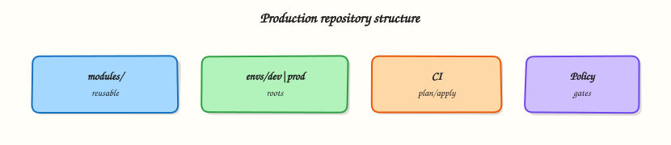

# Production Terraform Patterns

## Overview

Production Terraform is boring in the best way: a predictable repository layout, one state file per environment, version-pinned modules and providers, CI gates on every merge, encrypted remote state, and rehearsed disaster recovery. When every team follows the same `modules/` + `live/` pattern, on-call can plan the right root without guessing paths or provider versions.

This is **Tutorial 19** in **Module 19: Production Terraform** of the REBASH Academy **Terraform for Cloud & DevOps Engineers** series — written for Cloud, DevOps, Platform, and SRE engineers. Reference: [HashiCorp module composition](https://developer.hashicorp.com/terraform/language/modules/develop/composition).

## Prerequisites

- [Kubernetes Infrastructure with Terraform](kubernetes-infrastructure-with-terraform.md)
- [Modules: Creating Reusable Infrastructure](modules-creating-reusable-infrastructure.md)
- [Remote State and Backends](remote-state-and-backends.md)

## Learning Objectives

By the end of this tutorial, you will be able to:

- [ ] Structure a production repo with reusable modules and thin live roots per environment
- [ ] Pin `required_providers` and module sources with version constraints
- [ ] Apply safely using saved plans and separate state per environment
- [ ] Refactor resource addresses with `moved` blocks instead of destroy/create
- [ ] Package plan evidence and a CI-style validation script for review

## Architecture

Git stores versioned modules; thin **live** roots wire modules for each environment; CI runs fmt, validate, and plan; encrypted remote backends hold state with locking.



## Theory

### What it is

**Production Terraform patterns** combine:

| Practice | Outcome |
|----------|---------|
| `modules/` + `live/` (or `envs/`) | Reusable code separated from instantiation |
| State per env/account | Blast radius contained |
| Pinned `required_providers` / module `version` | Reproducible plans |
| CI fmt / validate / test / plan | Broken config never merges |
| Encrypted remote state + lock | Safe collaboration |
| DR runbooks | Rebuild from Git + state backup |
| `import` / `moved` | Adopt or rename without destroy |

A common layout keeps child modules in `modules/` (or a module registry) and **live** roots in `live/dev`, `live/staging`, `live/prod` that only call modules with environment-specific tfvars.

### Why it matters

Clever one-off roots that only one author understands become outage multipliers. Enterprises need reviewable provider upgrades, predictable costs, and a documented path to recreate networking and platforms after account loss. Treating Terraform releases like application releases — changelog, version bump, plan review, apply window — aligns infrastructure with how you already ship software.

### How it works

A practical production loop:

1. Change modules or live roots in a pull request; CI runs `fmt`, `validate`, tests, and `plan` against the target backend (or a PR sandbox).
2. Pin providers with `~>` constraints and Registry modules with `version = "x.y.z"`; read changelogs before major bumps.
3. Promote: merge → apply via pipeline with environment protections and saved plan artefacts.
4. **Cost:** tag resources in modules, prefer right-sizing and lifecycle rules, review plans for expensive replaces (NAT gateways, databases, clusters).
5. **DR:** versioned state backends, cross-region replication where required, documented restore (`state pull` backups, recreate from Git). Use separate DR roots when the secondary region differs.
6. **Refactors:** `import` brings existing objects under management; `moved` blocks rename addresses without destroy/create. Both require careful plan review.

Upgrade strategy: bump in non-production first, watch for forced replacements, keep Terraform CLI versions aligned across laptops, CI, and HCP Terraform.

### Key concepts and comparisons

| Env strategy | Pros | Cons |
|--------------|------|------|
| Dirs + separate state | Clear blast radius | More boilerplate |
| Workspaces | Less duplication | Easy to mis-select; weaker isolation |
| One mega-root | Fast start | Dangerous applies; huge plans |

| Tool | Role |
|------|------|
| `terraform import` | Adopt existing object into state |
| `moved` block | Rename address safely in modern Terraform |
| `state rm` | Stop managing without destroying (use with care) |

### Common pitfalls

- One state file for all environments “for simplicity” — **Fix:** separate backends per environment.
- Unpinned `main` module sources in production — **Fix:** Registry versions or tagged Git refs.
- Upgrading providers only in production — **Fix:** promote through dev/staging first.
- Ignoring replace cost until the invoice arrives — **Fix:** review `-/+` lines in every plan.
- Using `import` without documenting object lifecycle — **Fix:** add runbook entry and owner tags.
- Treating DR as “we have S3 versioning” without a restore rehearsal — **Fix:** quarterly restore drill.

## Hands-on Lab

### Objective

Build a production-style `modules/` + `live/dev` + `live/prod` layout with pinned providers, apply dev with a saved plan using **Docker containers**, refactor an internal resource address using `moved`, and produce a CI validation script with evidence files.

### Prerequisites

- Terraform CLI ≥ 1.5
- Docker Engine running (`docker info` succeeds)

### Lab environment

Workspace: `~/rebash-terraform/module-19`

```bash
mkdir -p ~/rebash-terraform/module-19/{modules/greeting,live/dev,live/prod,scripts}
```

Local Terraform with **Docker** provider. No AWS/GCP/Azure credentials required.

### Real-world scenario

Platform engineering requires every new service repo to boot-strap with separated dev/prod live roots, a versioned **Docker greeting** module, pinned providers, and a CI script that runs `fmt`, `validate`, and `plan` before any human apply. You prove the layout with running containers and evidence files before the repo is imported into the central pipeline.

### Step-by-step tasks

#### Task 1 – Create the reusable Docker greeting module

Create `modules/greeting/versions.tf`:

```hcl
terraform {
  required_version = ">= 1.5.0"
  required_providers {
    docker = {
      source  = "kreuzwerker/docker"
      version = "~> 3.0"
    }
  }
}
```

Create `modules/greeting/variables.tf`:

```hcl
variable "greeting" {
  type        = string
  description = "Label value for the greeting container"

  validation {
    condition     = length(trimspace(var.greeting)) > 0
    error_message = "greeting must not be empty."
  }
}

variable "environment" {
  type        = string
  description = "Environment label for tagging evidence"
}
```

Create `modules/greeting/main.tf`:

```hcl
resource "docker_image" "greeting" {
  name         = "nginx:1.27-alpine"
  keep_locally = true
}

resource "docker_container" "greeting" {
  name  = "greeting-${var.environment}"
  image = docker_image.greeting.image_id

  labels = {
    greeting    = var.greeting
    environment = var.environment
  }
}
```

Create `modules/greeting/outputs.tf`:

```hcl
output "container_name" {
  value = docker_container.greeting.name
}

output "label" {
  value = "${var.environment}=${var.greeting}"
}
```

Run module validation:

```bash
cd ~/rebash-terraform/module-19/modules/greeting
terraform init
terraform validate
echo "module validate OK" | tee ../../evidence/module-validate-ok.txt
```

**Expected output:** `Success! The configuration is valid.`

#### Task 2 – Wire live/dev and live/prod roots with separate state

Create `live/dev/versions.tf`:

```hcl
terraform {
  required_version = ">= 1.5.0"
  required_providers {
    docker = {
      source  = "kreuzwerker/docker"
      version = "~> 3.0"
    }
  }
}
```

Create `live/dev/providers.tf`:

```hcl
provider "docker" {}
```

Create `live/dev/main.tf`:

```hcl
module "greeting" {
  source      = "../../modules/greeting"
  greeting    = var.greeting
  environment = "dev"
}

output "label" {
  value = module.greeting.label
}

output "container_name" {
  value = module.greeting.container_name
}
```

Create `live/dev/variables.tf`:

```hcl
variable "greeting" {
  type    = string
  default = "hello-dev"
}
```

Create `live/dev/terraform.tfvars`:

```hcl
greeting = "hello-dev"
```

Create `live/prod/versions.tf` (same content as dev `versions.tf`).

Create `live/prod/providers.tf`:

```hcl
provider "docker" {}
```

Create `live/prod/main.tf`:

```hcl
module "greeting" {
  source      = "../../modules/greeting"
  greeting    = var.greeting
  environment = "prod"
}

output "label" {
  value = module.greeting.label
}
```

Create `live/prod/variables.tf`:

```hcl
variable "greeting" {
  type    = string
  default = "hello-prod"
}
```

Create `live/prod/terraform.tfvars`:

```hcl
greeting = "hello-prod"
```

Initialise and plan dev with a saved plan file:

```bash
cd ~/rebash-terraform/module-19/live/dev
terraform init
terraform plan -out=tfplan
terraform show -no-color tfplan | tee ../../evidence/plan-dev.txt
grep -q 'module.greeting.docker_container.greeting' ../../evidence/plan-dev.txt
```

**Expected output:** Plan shows one create for `docker_container.greeting`.

#### Task 3 – Apply dev with saved plan and prove container


```bash
cd ~/rebash-terraform/module-19/live/dev
terraform apply tfplan
terraform output -raw label | tee ../../evidence/output-dev.txt
docker ps --filter "name=greeting-dev" --format '{{.Names}} {{.Status}}' \
  | tee ../../evidence/dev-container-ps.txt
grep -q 'greeting-dev' ../../evidence/dev-container-ps.txt
docker inspect greeting-dev --format '{{index .Config.Labels "greeting"}}' \
  | tee ../../evidence/dev-label.txt
grep -q 'hello-dev' ../../evidence/dev-label.txt
```


**Expected output:** `greeting-dev` container running with label `hello-dev`.

Initialise prod separately:

```bash
cd ~/rebash-terraform/module-19/live/prod
terraform init
terraform plan -no-color | tee ../../evidence/plan-prod.txt
grep -q 'module.greeting.docker_container.greeting' ../../evidence/plan-prod.txt
! grep -q 'hello-dev' ../../evidence/plan-prod.txt
```

**Expected output:** Prod plan is independent; no dev greeting string in prod plan.

#### Task 4 – Refactor with `moved` and add CI validation script

Rename the module resource in `modules/greeting/main.tf` — change `docker_container.greeting` to `docker_container.message`:

```hcl
resource "docker_container" "message" {
  name  = "greeting-${var.environment}"
  image = docker_image.greeting.image_id

  labels = {
    greeting    = var.greeting
    environment = var.environment
  }
}
```

Update `modules/greeting/outputs.tf`:

```hcl
output "container_name" {
  value = docker_container.message.name
}
```

Add `modules/greeting/moved.tf`:

```hcl
moved {
  from = docker_container.greeting
  to   = docker_container.message
}
```

Re-plan dev:


```bash
cd ~/rebash-terraform/module-19/live/dev
terraform plan -no-color | tee ../../evidence/plan-after-moved.txt
grep -q 'has moved to' ../../evidence/plan-after-moved.txt || grep -q 'moved' ../../evidence/plan-after-moved.txt
! grep -q 'destroy' ../../evidence/plan-after-moved.txt
terraform apply -auto-approve
docker ps --filter "name=greeting-dev" --format '{{.Names}}' | grep -q 'greeting-dev'
```


**Expected output:** Plan reports address move; container still running after apply.

Create `scripts/ci-validate.sh`:


```bash
#!/usr/bin/env bash
set -euo pipefail
ROOT="$(cd "$(dirname "$0")/.." && pwd)"
mkdir -p "$ROOT/evidence"
cd "$ROOT/live/dev"
terraform fmt -check -recursive "$ROOT"
terraform init -input=false
terraform validate
terraform plan -input=false -detailed-exitcode -out=tfplan
terraform show -no-color tfplan > "$ROOT/evidence/plan-ci.txt"
terraform apply -input=false tfplan
docker ps --filter "name=greeting-dev" --format '{{.Names}}' | grep -q 'greeting-dev'
echo "CI validation complete — see evidence/plan-ci.txt"
```


Run:

```bash
mkdir -p ~/rebash-terraform/module-19/evidence
chmod +x ~/rebash-terraform/module-19/scripts/ci-validate.sh
~/rebash-terraform/module-19/scripts/ci-validate.sh
test -s ~/rebash-terraform/module-19/evidence/plan-ci.txt
```

**Expected output:** Script exits 0; container running; `evidence/plan-ci.txt` non-empty.

### Validation steps

- [ ] Module and both live roots pass `terraform validate`
- [ ] Dev apply used a saved plan file (`terraform apply tfplan`)
- [ ] `docker ps` proves dev container running
- [ ] Prod plan is independent from dev state
- [ ] `moved` refactor produced no destroy in dev plan
- [ ] `scripts/ci-validate.sh` produced `evidence/plan-ci.txt`

### Common errors and fixes

| Error | Cause | Fix |
|-------|-------|-----|
| Module not found | Wrong relative `source` path | Use `../../modules/greeting` from live roots |
| Container name conflict | Prior lab container left | `docker rm -f greeting-dev greeting-prod` |
| Plan wants destroy after rename | Missing `moved` block | Add `moved { from = … to = … }` in module |
| `fmt -check` fails | Unformatted HCL | Run `terraform fmt -recursive` then commit |
| Docker daemon not running | Engine stopped | Start Docker before apply |

### Challenge exercise

Add a `live/staging` root with its own tfvars and extend `scripts/ci-validate.sh` to loop over `dev`, `staging`, and `prod`, writing `evidence/plan-<env>.txt` for each.

### Learning outcomes

- Built a production-style modules + live roots layout with Docker
- Pinned providers and validated module inputs
- Applied dev with a saved plan and separate prod state
- Refactored resource addresses safely with `moved`
- Produced CI validation evidence with operational container proof

### Cleanup

```bash
cd ~/rebash-terraform/module-19/live/dev && terraform destroy -auto-approve
cd ~/rebash-terraform/module-19/live/prod && terraform destroy -auto-approve 2>/dev/null || true
docker rm -f greeting-dev greeting-prod greeting-staging 2>/dev/null || true
rm -rf ~/rebash-terraform/module-19/live/*/.terraform ~/rebash-terraform/module-19/live/*/tfplan
rm -rf ~/rebash-terraform/module-19/modules/greeting/.terraform
```

## Validation

- [ ] Lab completed under `~/rebash-terraform/module-19/`
- [ ] You can explain modules vs live roots and why state is separated
- [ ] You used saved plans before apply in dev
- [ ] You can describe one production failure mode (for example unpinned module source)

## Code Walkthrough

Production Terraform for repository layout always combines:

1. **Inspect before change** — read plan output line-by-line; never apply blind from laptop in prod
2. **Pin everything** — Terraform CLI, providers, and module versions in Git
3. **Separate concerns** — modules encode capability; live roots encode environment wiring
4. **Evidence for reviewers** — attach plan artefacts to pull requests
5. **Least privilege** — CI plan roles differ from production apply roles

Keep live roots thin; push complexity into tested modules with clear variable contracts.

## Security Considerations

- Restrict production apply to pipeline roles with OIDC — not long-lived access keys on laptops
- Encrypt remote state at rest; restrict backend IAM to break-glass and CI roles only
- Never commit secrets in tfvars; use HCP Terraform variables or a secret manager
- Require two-person review for production plans that touch IAM, networking, or data stores
- Audit `terraform state pull` downloads — state contains sensitive attribute values

## Common Mistakes

!!! warning "One state file for all environments"
    A mistaken `terraform workspace select` or wrong `-var-file` can destroy production from a dev experiment. **Fix:** separate directories, backends, and CI jobs per environment.

!!! warning "Unpinned module sources in production"
    Tracking `source = "git::…?ref=main"` lets upstream break your plan without notice. **Fix:** pin semver tags or Registry versions; renovate deliberately.

!!! warning "Applying without reading replace lines"
    Provider upgrades can force database or cluster recreation. **Fix:** treat every `-/+` as a change ticket; test in non-prod first.

## Best Practices

- Treat root modules as release units with changelogs and semver tags
- Run `terraform fmt -check` and `validate` on every pull request
- Store plan artefacts (`terraform plan -out=`) and apply the same file in CI
- Tag all resources with `environment`, `owner`, and `cost-centre` in modules
- Rehearse DR quarterly: restore state backup and re-apply from Git in a sandbox account

## Troubleshooting

| Symptom | Likely cause | Fix |
|---------|--------------|-----|
| Plan differs between laptop and CI | Different provider or Terraform version | Pin versions in `required_version` and lock files |
| Module change breaks all envs | Shared module without contract tests | Add `terraform test` and semver for modules |
| Unexpected destroy after refactor | Renamed resource without `moved` | Add `moved` block; re-plan before apply |
| Prod apply blocked by lock | Overlapping CI and human apply | Coordinate; never `force-unlock` while apply runs |
| Cost spike after module bump | New defaults create billable resources | Review module CHANGELOG; add `lifecycle` guards |

## Summary

Production Terraform succeeds when repository layout, version pins, and CI gates are boring and repeatable. You built a modules + live roots repo, applied with saved plans, and refactored with `moved`. Next, learn structured troubleshooting in [Troubleshooting Terraform](troubleshooting-terraform.md).

## Interview Questions

**1. How do you structure Terraform repositories for many environments?**

??? success "Reveal answer"
    Separate **live** roots per environment (for example `live/dev`, `live/prod`), each with its own backend and state. Reusable logic lives in versioned **modules**. Workspaces can supplement but rarely replace directory separation for production blast-radius control.

**2. Which version pinning practices belong in production roots?**

??? success "Reveal answer"
    Pin Terraform CLI in CI, constrain providers with `~>` in `required_providers`, and pin Registry modules with explicit `version` or tagged Git refs. Commit lock files (`.terraform.lock.hcl`) and upgrade deliberately with changelog review.

**3. What review checklist items matter on every production plan?**

??? success "Reveal answer"
    Check destroys, forced replacements (`-/+`), security group and IAM changes, public exposure, and data-store modifications. Confirm the plan matches the approved change ticket and that the saved plan file is the one being applied.

**4. How do you limit blast radius of a mistaken apply?**

??? success "Reveal answer"
    Separate state per environment, restrict prod apply to CI with approval gates, use `prevent_destroy` on critical data resources where supported, and maintain canary/staging environments that run the same modules with production-like constraints.

**5. When should you use `import` versus `moved`?**

??? success "Reveal answer"
    **`import`** adopts an existing cloud object into Terraform state when configuration already describes it. **`moved`** renames an address in state during refactors when the underlying object is unchanged. Both require a clean plan review; neither replaces thoughtful design.

**6. How do cost and DR fit into production Terraform design?**

??? success "Reveal answer"
    Tag resources in modules for cost allocation, review plans for expensive replacements, and document DR with versioned state backups plus Git as source of truth. Rehearse restore — a backup you have never tested is a wish, not a plan.

## Related Tutorials

- [Course overview](index.md)
- [Workspaces and Environment Strategies](workspaces-and-environment-strategies.md)
- [Terraform in CI/CD Pipelines](terraform-in-ci-cd-pipelines.md)
- [Troubleshooting Terraform](troubleshooting-terraform.md)

## References

- [Module composition](https://developer.hashicorp.com/terraform/language/modules/develop/composition)
- [Refactoring](https://developer.hashicorp.com/terraform/language/modules/develop/refactoring)
- [State backends](https://developer.hashicorp.com/terraform/language/backend)
- [Terraform documentation](https://developer.hashicorp.com/terraform/docs)
