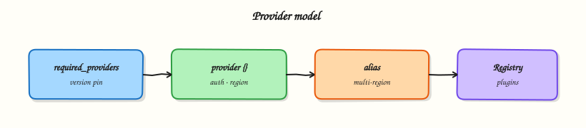

# Providers and the Terraform Plugin Model

## Overview

A **provider** is a plugin that teaches Terraform how to talk to an API — AWS, Azure, Kubernetes, GitHub, or lab providers like **`hashicorp/local`** and **`hashicorp/null`**. The Terraform CLI does not embed cloud SDKs; it downloads provider binaries at **`init`**, loads schemas, and delegates create/read/update/delete to each plugin during apply. Misconfigured providers cause authentication failures, wrong regions, or silent version skew across the team.

This is **Tutorial 5** in **Module 5: Providers** of the REBASH Academy **Terraform for Cloud & DevOps Engineers** series — written for Cloud, DevOps, Platform, and SRE engineers. You will configure default and aliased Docker providers, pin versions in `required_providers`, simulate multi-cell patterns with real networks and containers, and document authentication practices that keep secrets out of Git.

## Prerequisites

- [HCL Fundamentals](hcl-fundamentals-blocks-arguments-and-expressions.md)
- Module 2–3 init and apply experience
- **Terraform ≥ 1.5** and **Docker Engine running**

## Learning Objectives

By the end of this tutorial, you will be able to:

- [ ] Explain the Terraform plugin model and provider responsibilities
- [ ] Declare `required_providers` with source and version constraints
- [ ] Configure multiple provider instances using **aliases**
- [ ] Route resources to specific provider configurations
- [ ] Describe authentication patterns without committing secrets

## Architecture

Terraform Core orchestrates graphs; provider plugins implement resource types and call external APIs. One configuration can load multiple instances of the same provider (different regions, accounts, or mock endpoints).



## Theory

### What it is

| Concept | Meaning |
|---------|---------|
| **Provider** | Plugin binary implementing a set of resource and data source types |
| **Provider configuration** | `provider "aws" { region = "eu-west-1" }` block — shared settings |
| **Resource binding** | `provider = aws.primary` on a resource selects which configuration |
| **Registry address** | `hashicorp/aws`, `azurerm`, `integrations/github` |
| **Schema** | Provider defines argument names, types, and computed attributes |

Terraform 0.13+ requires explicit **`source`** for providers:

```hcl
terraform {
  required_providers {
    aws = {
      source  = "hashicorp/aws"
      version = "~> 5.0"
    }
  }
}
```

### Why it matters

Every API call flows through a provider:

- **Wrong region/account** — resources land in unintended scope
- **Unpinned versions** — CI and laptops plan differently after a provider release
- **Hard-coded keys in HCL** — secrets in Git history forever
- **Missing alias** — second VPC in another region fails or uses default creds incorrectly

Platform teams standardise provider blocks in `_providers.tf`, use **assume role** chains on AWS, **OIDC** in CI, and **Workload Identity** on GCP — never long-lived keys in repos.

### How it works

#### Provider installation (recap)

1. HCL declares `required_providers`
2. **`terraform init`** downloads matching release for OS/arch
3. **`.terraform.lock.hcl`** records checksums
4. Plan/apply load plugin; Core passes resource changes via gRPC plugin protocol

#### Provider configuration block

```hcl
provider "aws" {
  region = var.aws_region

  default_tags {
    tags = local.common_tags
  }
}
```

Implicit **default** provider: first configuration without `alias`, or only one instance.

#### Multiple providers and aliases

When you need two regions, accounts, or Kubernetes clusters:

```hcl
provider "aws" {
  alias  = "replica"
  region = "us-west-2"
}

resource "aws_s3_bucket" "replica_logs" {
  provider = aws.replica
  bucket   = "logs-replica-example"
}
```

Reference syntax: **`provider = <type>.<alias>`** (omit alias for default).

Lab pattern with **`null`** provider (no cloud):

```hcl
provider "null" {
  alias = "east"
}

provider "null" {
  alias = "west"
}
```

Each **`null_resource`** can bind to a different alias to prove routing — triggers differ per “region” label.

#### Provider versioning

| Constraint | Meaning |
|------------|---------|
| `= 5.40.0` | Exact version |
| `>= 5.0` | Minimum (avoid alone in prod) |
| `~> 5.40` | Allow 5.40.x patch upgrades |
| `>= 5.0, < 6.0` | Common major pin |

Upgrade workflow: bump constraint → `terraform init -upgrade` → plan in non-prod → commit lock file.

#### Authentication (patterns, not secrets)

Providers read credentials from **environment variables**, **shared config files**, or **HCL arguments** (discouraged for secrets).

| Provider | Common auth sources |
|----------|---------------------|
| AWS | `AWS_ACCESS_KEY_ID` / `AWS_SECRET_ACCESS_KEY`, shared `~/.aws/credentials`, IAM role on EC2/EKS, SSO |
| Azure | `ARM_*` env vars, Azure CLI session, OIDC in GitHub Actions |
| GCP | `GOOGLE_APPLICATION_CREDENTIALS`, ADC on GCE/GKE |
| Kubernetes | `~/.kube/config`, in-cluster config |
| GitHub | `GITHUB_TOKEN` env var |

**Never** commit `.tf` with static `access_key` / `password`. Use:

- CI OIDC → cloud IAM role
- Vault/SSM Parameter Store data sources (Module 15)
- Environment variables injected at runtime

For local labs, **`kreuzwerker/docker`** talks to your Docker Engine socket — no cloud credentials required.

#### Provider meta-arguments on resources

```hcl
resource "aws_instance" "web" {
  provider = aws.eu
  # ...
}
```

Only configuration available at plan time — not dynamic per count iteration special cases beyond HCL rules.

### Common pitfalls

- Forgetting **`alias`** on second provider block of same type — Terraform errors on duplicate default provider.
- Omitting **`provider =`** on resources when multiple instances exist — uses default unintentionally.
- Pinning provider but not committing lock file — CI resolves different builds.
- Using `-target` across provider aliases without understanding state addresses.
- Assuming `provider` blocks run code — they configure plugin; secrets still end up in state if passed as arguments.

## Hands-on Lab

### Objective

Configure **default and aliased** `kreuzwerker/docker` providers, pin versions, create networks and containers bound to each alias, and prove provider routing with `docker network ls` and distinct container labels.

### Prerequisites

- Modules 2–4 completed
- **Terraform ≥ 1.5**
- **Docker Engine running** (`docker info` succeeds)

### Lab environment

Workspace: `~/rebash-terraform/module-05`

```bash title="Terminal"
mkdir -p ~/rebash-terraform/module-05 && cd ~/rebash-terraform/module-05
```

### Real-world scenario

Your team runs **primary and replica** automation cells (two AWS accounts or regions in production). Ticket **PLAT-205**: onboarding lab mirrors the pattern — two Docker provider aliases, resources explicitly bound, and containers on separate bridge networks proving which cell created which artefact — before engineers touch real cloud credentials.

### Step-by-step tasks

#### Task 1 – Pin provider and declare aliases

Create `versions.tf`:

```hcl title="versions.tf"
terraform {
  required_version = ">= 1.5.0, < 2.0.0"

  required_providers {
    docker = {
      source  = "kreuzwerker/docker"
      version = "~> 3.0"
    }
  }
}
```

Create `providers.tf`:

```hcl title="providers.tf"
provider "docker" {
  # default — represents "primary" cell
}

provider "docker" {
  alias = "replica"
}
```

!!! example "Expected output"
    `versions.tf` and `providers.tf` with default and `replica` alias for Docker.


#### Task 2 – Bind resources to provider configurations

Create `variables.tf`:

```hcl title="variables.tf"
variable "primary_cell" {
  type    = string
  default = "primary"
}

variable "replica_cell" {
  type    = string
  default = "replica"
}
```

Create `main.tf`:

```hcl title="main.tf"
resource "docker_image" "alpine" {
  name = "alpine:3.20"
}

resource "docker_network" "primary" {
  name = "rebash-module-05-primary-net"
}

resource "docker_network" "replica" {
  provider = docker.replica

  name = "rebash-module-05-replica-net"
}

resource "docker_container" "primary_marker" {
  name  = "rebash-module-05-primary"
  image = docker_image.alpine.image_id

  command = ["sleep", "3600"]

  networks_advanced {
    name = docker_network.primary.name
  }

  labels {
    label = "cell"
    value = var.primary_cell
  }

  labels {
    label = "provider"
    value = "default"
  }
}

resource "docker_container" "replica_marker" {
  provider = docker.replica

  name  = "rebash-module-05-replica"
  image = docker_image.alpine.image_id

  command = ["sleep", "3600"]

  networks_advanced {
    name = docker_network.replica.name
  }

  labels {
    label = "cell"
    value = var.replica_cell
  }

  labels {
    label = "provider"
    value = "docker.replica"
  }
}
```

Create `outputs.tf`:

```hcl title="outputs.tf"
output "primary_network" {
  value = docker_network.primary.name
}

output "replica_network" {
  value = docker_network.replica.name
}

output "primary_container" {
  value = docker_container.primary_marker.name
}

output "replica_container" {
  value = docker_container.replica_marker.name
}
```

!!! example "Expected output"
    Resources explicitly use default or `docker.replica` provider.


#### Task 3 – Init, apply, and verify routing evidence

Run:


```bash title="Terminal"
cd ~/rebash-terraform/module-05
terraform fmt -recursive
terraform init | tee init.txt
terraform apply -auto-approve | tee apply.txt
terraform providers | tee providers-mirror.txt
grep -q 'docker.replica' providers-mirror.txt
docker network ls --filter name=rebash-module-05 --format '{{.Name}}' | tee docker-nets.txt
grep -q 'rebash-module-05-primary-net' docker-nets.txt
grep -q 'rebash-module-05-replica-net' docker-nets.txt
docker inspect rebash-module-05-primary --format '{{index .Config.Labels "provider"}}' | grep -q default
docker inspect rebash-module-05-replica --format '{{index .Config.Labels "provider"}}' | grep -q docker.replica
echo "provider routing OK" | tee provider-evidence.txt
```


!!! example "Expected output"
    Both networks and containers exist; labels distinguish cells; `provider-evidence.txt` contains `provider routing OK`.


#### Task 4 – Diagnose missing provider binding (fix exercise)

Simulate a common mistake: temporarily remove `provider = docker.replica` from `docker_network.replica` in `main.tf` (comment the line or delete it), then run plan:

```bash title="Terminal"
cd ~/rebash-terraform/module-05
terraform plan -no-color | tee plan-alias-bug.txt
```

Restore the line:

```hcl
  provider = docker.replica
```

Re-plan and confirm only the intended replica resources use the alias:

```bash title="Terminal"
cd ~/rebash-terraform/module-05
terraform plan -detailed-exitcode -no-color | tee plan-alias-fixed.txt || ec=$?
test "${ec:-0}" -eq 0
echo "alias fix OK" | tee alias-fix.txt
```

!!! example "Expected output"
    With binding removed, plan may try to recreate replica resources on the default provider; after restore, plan shows no changes (`alias fix OK`).


### Validation steps

- [ ] `required_providers` pins `kreuzwerker/docker`
- [ ] Aliased provider block includes `alias = "replica"`
- [ ] Replica network and container set `provider = docker.replica`
- [ ] `terraform providers` reflects multiple configurations
- [ ] `docker network ls` shows both primary and replica networks
- [ ] You fixed a mis-bound provider and returned to a clean plan

### Common errors and fixes

| Error | Cause | Fix |
|-------|-------|-----|
| `Duplicate provider configuration` | Two defaults without alias | Add `alias` to all but one |
| `Provider configuration not present` | Typo in `provider = docker.replica` | Match alias name exactly |
| `Invalid provider registry host` | Wrong `source` address | Use `kreuzwerker/docker` format |
| Resources all on default | Missing `provider` meta-argument | Set on each resource needing alias |
| Container name already in use | Prior lab left container | `docker rm -f rebash-module-05-primary` |

### Challenge exercise

Create `verify-alias.sh`:


```bash title="Terminal"
#!/usr/bin/env bash
set -euo pipefail
cd ~/rebash-terraform/module-05
terraform state list | tee state-list.txt
grep -q 'docker_container.replica_marker' state-list.txt
grep -q 'docker_container.primary_marker' state-list.txt
docker ps --filter name=rebash-module-05 --format '{{.Names}}' | wc -l | grep -q '^2$'
echo "alias state evidence OK"
```


Run:

```bash title="Terminal"
chmod +x ~/rebash-terraform/module-05/verify-alias.sh
~/rebash-terraform/module-05/verify-alias.sh | tee challenge-provider.txt
```

!!! example "Expected output"
    `challenge-provider.txt` contains `alias state evidence OK`.


### Learning outcomes

- You configured default and aliased providers in one module
- You bound resources to specific provider instances
- You diagnosed a missing `provider =` binding and restored a clean plan
- You captured state addresses and Docker proof for separate cells

### Cleanup

```bash title="Terminal"
cd ~/rebash-terraform/module-05
terraform destroy -auto-approve
rm -f init.txt apply.txt providers-mirror.txt provider-evidence.txt plan-alias-bug.txt \
  plan-alias-fixed.txt alias-fix.txt challenge-provider.txt state-list.txt docker-nets.txt
rm -rf .terraform .terraform.lock.hcl terraform.tfstate terraform.tfstate.backup
```

## Validation

- [ ] Completed lab under `~/rebash-terraform/module-05` with Docker network and container evidence
- [ ] Can explain plugin model and Registry `source` addresses
- [ ] Configured aliases and resource-level `provider` binding
- [ ] Can describe one production failure mode (e.g. wrong account via default provider)

## Code Walkthrough

1. **One default, rest aliased** — explicit pattern prevents ambiguous provider selection.
2. **Pin major versions** — provider upgrades are code changes deserving PR review.
3. **Auth outside HCL** — environment and OIDC keep secrets out of state where possible.
4. **providers mirror** — `terraform providers` debugs wrong plugin version quickly.
5. **Align aliases to org structure** — name aliases `prod`, `dr`, not `p1`, `p2`.

## Security Considerations

- Never commit cloud access keys, `kubeconfig` with prod certs, or API tokens in provider blocks.
- Use short-lived credentials (OIDC, STS assume-role) in CI pipelines.
- Provider configuration can appear in state — treat state as confidential.
- Restrict IAM policies per workspace — CI role for plan-only vs apply separation.
- Audit which provider versions are allowed — supply-chain compromise targets popular plugins.

## Common Mistakes

!!! warning "Implicit default provider for everything"
    Second region silently uses first region’s credentials.  
    **Fix:** Alias per scope; set `provider` on every resource outside default.

!!! warning "Secrets in provider blocks"
    `access_key = "AKIA..."` in Git is a incident waiting for scanners.  
    **Fix:** Environment variables, IAM roles, Vault, or CI secret injection.

!!! warning "Skipping lock file review on provider upgrade"
    Patch release changes default behaviour — plan shows mass replacement.  
    **Fix:** Dedicated upgrade PR; read provider CHANGELOG; test in sandbox.

!!! warning "Same alias name across modules without passing providers"
    Child modules need `configuration_aliases` (Module 9) — advanced pitfall early.  
    **Fix:** Pass providers explicitly into modules when using aliases.

## Best Practices

- Centralise `required_providers` in `versions.tf`; keep `providers.tf` for configurations.
- Document required environment variables in README per provider.
- Use **default_tags** (AWS) or equivalent consistent labelling via provider features.
- Run `terraform init -upgrade` only intentionally; commit resulting lock diff.
- For multi-account, map aliases to account IDs in comments and runbooks.

## Troubleshooting

| Symptom | Likely cause | Fix |
|---------|--------------|-----|
| `No valid credential sources` | Missing env/config for cloud provider | Export vars; `aws sts get-caller-identity` |
| `Provider produced inconsistent result` | Provider bug or API race | Upgrade provider; retry; check issue tracker |
| Wrong account in plan | Default provider credentials | Explicit alias + `provider` attribute |
| Init downloads wrong arch | Mixed ARM/x86 CI | Ensure lock has hashes for all platforms |
| `Invalid provider configuration alias` | Module without `configuration_aliases` | Update module block (Module 9) |

## Summary

Providers are plugins that implement resource types and authenticate to APIs. Pin **`source`** and **version**, configure defaults and **aliases**, bind resources with **`provider =`**, and keep credentials out of Git. You simulated primary/replica cells with `null` and `local` aliases and verified distinct artefacts. Next: **Resources, Dependencies, and Meta-Arguments**.

## Interview Questions

**1. What is a Terraform provider?**

??? success "Reveal answer"
    A **provider** is a plugin that implements resource and data source types for one platform or API (AWS, Azure, Kubernetes, etc.). Terraform Core downloads providers at **init**, reads their schemas, and calls them during plan/apply to create, read, update, and delete remote objects. The CLI itself does not contain cloud SDK logic for every platform.

**2. How do provider aliases work?**

??? success "Reveal answer"
    When you need multiple configurations of the same provider type (regions, accounts), add **`alias = "name"`** to all but one block (the default). Resources select configuration with **`provider = aws.name`**. Without explicit binding, resources use the default provider — a common source of cross-account mistakes.

**3. Where should cloud credentials live?**

??? success "Reveal answer"
    **Not** in committed HCL. Use **environment variables**, shared credential files outside Git, **IAM roles** on instances, **OIDC** federation from CI, or secret stores integrated via data sources. Credentials passed as provider arguments may persist in **state** — still sensitive.

**4. Explain required_providers source and version.**

??? success "Reveal answer"
    **`source`** is the Registry address (`hashicorp/aws`, `integrations/github`). **`version`** is a constraint resolved at init. Together they ensure reproducible plugin selection. **`.terraform.lock.hcl`** locks exact builds with checksums. Upgrades require intentional `-upgrade` and review.

**5. When does Terraform download providers?**

??? success "Reveal answer"
    During **`terraform init`** (and init with **`-upgrade`**). Not when installing the Terraform CLI. Plugins cache under **`.terraform/providers/`** per project directory unless using global plugin cache.

**6. How do you debug which provider configuration a resource uses?**

??? success "Reveal answer"
    Check the resource’s **`provider`** meta-argument in HCL. Run **`terraform providers`** to see provider configurations in the module tree. Inspect plan output resource header lines showing `provider[...]`. State addresses include resource type/name but provider binding comes from config.

**7. What risks come with unpinned provider versions?**

??? success "Reveal answer"
    **`init`** on a new laptop may fetch a newer minor/patch release with bug fixes or breaking schema changes — plans differ from teammates, CI may destroy/recreate unexpectedly. Always pin (`~>`, upper bound) and commit lock file; upgrade via controlled PRs.

**8. Compare authentication for AWS in CI vs on a developer laptop.**

??? success "Reveal answer"
    **CI** should use **OIDC** to assume an IAM role — no long-lived keys in secrets. **Developers** often use AWS SSO or named profiles locally — still no keys in Terraform files. Both must respect least privilege: plan roles read-only where possible; apply roles scoped to environment.

## Related Tutorials

- [Terraform course index](index.md)
- **Previous:** [HCL Fundamentals](hcl-fundamentals-blocks-arguments-and-expressions.md)
- **Next:** [Resources, Dependencies, and Meta-Arguments](resources-dependencies-and-meta-arguments.md)
- [Multi-Cloud Terraform](multi-cloud-terraform.md)

## References

- [Providers overview](https://developer.hashicorp.com/terraform/language/providers)
- [Provider requirements](https://developer.hashicorp.com/terraform/language/providers/requirements)
- [Provider configuration](https://developer.hashicorp.com/terraform/language/providers/configuration)
- [Terraform Registry](https://registry.terraform.io/)
- [Plugin framework](https://developer.hashicorp.com/terraform/plugin)
- [REBASH Terraform course index](index.md)
