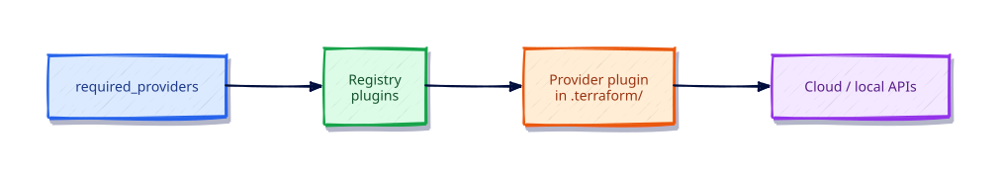

# Providers and the Terraform Plugin Model

## Overview

Providers are plugins that implement resources and data sources for a platform (AWS, Azure,
Kubernetes, local files, and hundreds more). Terraform core does not know how to call cloud
APIs — providers do.

This tutorial explains `required_providers`, version constraints, the lock file, provider
configuration, aliases, and how `terraform init` fetches plugins from the Registry.

This is **Tutorial 4** in **Module 1: Foundations** of the REBASH Academy Terraform track.

## Learning Objectives

By the end of this tutorial, you will be able to:

- [ ] Declare providers with source addresses and version constraints
- [ ] Explain the role of `.terraform.lock.hcl`
- [ ] Configure provider blocks and describe alias use-cases
- [ ] Run `terraform providers` and interpret the dependency tree
- [ ] Pin providers safely using pessimistic constraints (`~>`)

## Prerequisites

- Completed HCL Fundamentals
- Network access to registry.terraform.io

- Terraform CLI **1.9+** (1.15.x recommended)
- Ability to create directories and edit files

## Architecture




## Theory

### Provider addresses

Format: `<namespace>/<name>` on the Registry, e.g. `hashicorp/local`, `hashicorp/aws`.

### Version constraints

| Constraint | Meaning |
|------------|---------|
| `~> 2.9` | >= 2.9.0 and < 3.0.0 |
| `>= 6.0.0, < 7.0.0` | Explicit range |
| `= 2.9.0` | Exact pin |

Root modules should pin with `~>`. As of this writing: `hashicorp/local` **2.9.0**,
`hashicorp/aws` **6.56.0**, `hashicorp/random` **3.9.0** — always re-check the Registry.

### Provider configuration

```hcl
provider "aws" {
  region = "eu-west-1"
}

provider "aws" {
  alias  = "dr"
  region = "eu-central-1"
}
```

Pass aliases into modules with a `providers` map when a child must talk to a non-default
provider instance.

### Built-in provider

`terraform_data` and `terraform_remote_state` use Terraform’s built-in provider — no
`required_providers` entry required for those resources alone.

### Provider installation selection

`terraform init` chooses provider packages using the dependency lock file and your platform
(OS/CPU). The Registry serves multiple builds; the lockfile records checksums so installs are
reproducible and tamper-evident.

### Configuration vs requirement

| Block | Role |
|-------|------|
| `required_providers` inside `terraform {}` | Which plugins and version constraints |
| `provider "name" { }` | How to authenticate and which region/account |

You can have requirements without an explicit `provider` block when the provider uses
environment credentials and defaults — but production roots should still be explicit.

### Aliases

```hcl
provider "local" {
  alias = "alt"
}
```

Resources select an alias with `provider = local.alt`. Cloud teams use aliases for pairs like
`aws.us_east_1` and `aws.us_west_2`, or separate accounts.

## Hands-on Lab

```bash
mkdir -p ~/rebash-tf-providers && cd ~/rebash-tf-providers
```

```hcl
# versions.tf
terraform {
  required_version = ">= 1.9.0"
  required_providers {
    local = {
      source  = "hashicorp/local"
      version = "~> 2.9"
    }
    random = {
      source  = "hashicorp/random"
      version = "~> 3.9"
    }
  }
}

# main.tf
resource "random_pet" "server" {
  length = 2
}

resource "local_file" "inventory" {
  filename        = "${path.module}/inventory.txt"
  content         = "hostname = ${random_pet.server.id}\n"
  file_permission = "0644"
}

output "hostname" {
  value = random_pet.server.id
}
```

```bash
terraform init -input=false
terraform providers
terraform apply -input=false -auto-approve
cat inventory.txt
# Deliberate upgrade path awareness (do not blindly upgrade prod):
# terraform init -upgrade
terraform destroy -input=false -auto-approve
```

## Code Walkthrough

### Lock file

After init, `.terraform.lock.hcl` records selected versions and checksums. Commit it so every
engineer and CI runner resolves the same plugins.

### `init -upgrade`

Asks Terraform to reconsider versions within constraints. Review the lockfile diff like any
dependency bump.


Walk the lockfile after init: each provider source address maps to a version and hashes.
Changing `required_providers` without running `terraform init -upgrade` (intentionally) keeps
you on the locked version — that stability is desirable until you deliberately upgrade.

## Validation

```bash
terraform init -input=false
terraform providers
terraform providers schema -json | head -c 200; echo
terraform validate
terraform apply -input=false -auto-approve
terraform destroy -input=false -auto-approve
```

| Check | Pass criteria |
|-------|----------------|
| Providers | `hashicorp/local` listed at ~> 2.9 |
| Lockfile | `.terraform.lock.hcl` contains `provider "registry.terraform.io/hashicorp/local"` |
| Schema | Schema command returns JSON (pipe responsibly) |

## Best Practices

- Always declare `required_providers` with `source` and a pessimistic version constraint
- Upgrade providers deliberately with `init -upgrade` and review the plan
- Prefer explicit `provider` blocks for anything beyond local labs
- Document required environment variables for credentials in the module README
- Use aliases sparingly; prefer separate roots when blast radius differs

## Security Considerations

- Providers inherit your credentials — least-privilege IAM/service principals only
- Do not hard-code access keys in provider blocks; use env vars, OIDC, or native chains
- Review lockfile checksums in PRs when upgrading; unexpected hash changes deserve scrutiny
- Limit who can modify `required_providers` in organisation modules

## Common Mistakes

!!! warning "Omitting `required_providers`"
    Old implicit behavior is gone. **Fix:** Always declare source + version.

!!! warning "Floating on latest with no constraint"
    Surprise breaking upgrades. **Fix:** Use `~>` in root modules.

!!! warning "Hard-coding credentials in provider blocks"
    Secret leakage. **Fix:** Use env vars, OIDC, or shared config files.

## Troubleshooting

| Issue | Cause | Solution |
|-------|-------|----------|
| Failed to query available provider packages | Network/registry | Check DNS/TLS to registry.terraform.io |
| Incompatible provider version | Constraint vs lockfile | Adjust constraint and `init -upgrade`, or stay locked |
| Missing credentials | Provider config incomplete | Export documented env vars; run `terraform plan` to see auth errors |
| Wrong region resources | Default provider vs alias mix-up | Set `provider =` on the resource explicitly |

## Interview Questions

1. What is a Terraform provider in the plugin model?
2. Why pin provider versions in root modules?
3. What is the difference between `required_providers` and a `provider` block?
4. How does the dependency lock file improve supply-chain safety?
5. When would you use a provider alias?
6. How do you upgrade a provider safely in a team repo?
7. Where should AWS credentials live for Terraform?
8. What does `terraform providers` show you?
9. Why might two engineers see different provider versions without a lockfile?
10. How do child modules inherit provider configurations?
11. What is a pessimistic constraint (`~>`)?
12. How would you debug a provider authentication failure?

## Summary

- Providers are versioned plugins that translate resources into API calls
- Declare and lock versions; configure authentication separately
- Aliases support multi-region patterns; do not overuse them
- Treat lockfile reviews as part of secure upgrades

## Related Tutorials

- Track overview: [Terraform](index.md)
- Previous: [HCL Fundamentals — Blocks, Arguments, and Expressions](hcl-fundamentals-blocks-arguments-and-expressions.md)
- Next: [Variables, Locals, and Outputs](variables-locals-and-outputs.md)

## References

1. [Terraform documentation](https://developer.hashicorp.com/terraform/docs)
2. [Terraform CLI commands](https://developer.hashicorp.com/terraform/cli/commands)
3. [Terraform language](https://developer.hashicorp.com/terraform/language)
4. [Terraform Registry](https://registry.terraform.io/)
5. [Version constraints](https://developer.hashicorp.com/terraform/language/expressions/version-constraints)
