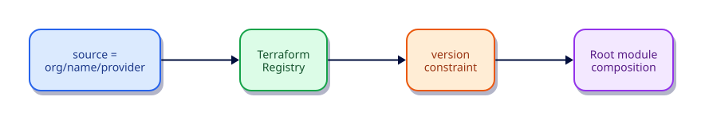

# Registry Modules and Composition

## Overview

The Terraform Registry distributes versioned modules. Learn source addresses, version pins, and composition patterns. Labs stay local while showing how a Registry module such as terraform-aws-modules/vpc/aws (v6.6.1) would be consumed.

This is **Tutorial 12** in **Module 3: Collaboration and Scale** of the REBASH Academy Terraform track.

## Learning Objectives

By the end of this tutorial, you will be able to:

- [ ] Address Registry modules with version constraints
- [ ] Compare local, git, and registry sources
- [ ] Compose multiple modules in one root
- [ ] Read module documentation before adoption
- [ ] Avoid unpinned module sources in production

## Prerequisites

- Completed Modules — Creating Reusable Infrastructure

- Terraform CLI **1.9+** (1.15.x recommended)
- Ability to create directories and edit files

## Architecture




## Theory

### Sources

| Source | Example |
|--------|---------|
| Local | `./modules/vpc` |
| Registry | `terraform-aws-modules/vpc/aws` |
| Git | `git::https://example.com/vpc.git?ref=v1.2.0` |

### Registry example (do not apply without AWS creds)

```hcl
module "vpc" {
  source  = "terraform-aws-modules/vpc/aws"
  version = "6.6.1"

  name = "example"
  cidr = "10.0.0.0/16"
  # ... see module docs for required inputs
}
```

## Hands-on Lab

### Step 1 – Scaffold registry-style local modules

```bash
mkdir -p ~/rebash-tf-reg/{modules/network,modules/app,generated}
cd ~/rebash-tf-reg
```

`modules/network/variables.tf`:

```hcl
variable "name" {
  type = string
}

variable "cidr" {
  type = string
}
```

`modules/network/main.tf`:

```hcl
resource "local_file" "vpc" {
  filename        = "${path.module}/../../generated/${var.name}-vpc.txt"
  content         = "vpc_name=${var.name}\ncidr=${var.cidr}\n"
  file_permission = "0644"
}
```

`modules/network/outputs.tf`:

```hcl
output "vpc_id" {
  value = local_file.vpc.id
}

output "vpc_file" {
  value = local_file.vpc.filename
}
```

`modules/app/variables.tf`:

```hcl
variable "name" {
  type = string
}

variable "vpc_file" {
  type = string
}
```

`modules/app/main.tf`:

```hcl
resource "local_file" "app" {
  filename = "${path.module}/../../generated/${var.name}-app.txt"
  content  = <<-EOT
    app=${var.name}
    depends_on_vpc_file=${var.vpc_file}
  EOT
}
```

`modules/app/outputs.tf`:

```hcl
output "app_file" {
  value = local_file.app.filename
}
```

### Step 2 – Root composition (mirrors Registry usage)

`versions.tf`:

```hcl
terraform {
  required_version = ">= 1.9.0"
  required_providers {
    local = {
      source  = "hashicorp/local"
      version = "~> 2.9"
    }
  }
}
```

`main.tf`:

```hcl
module "network" {
  source = "./modules/network"
  name   = "payments"
  cidr   = "10.20.0.0/16"
}

module "app" {
  source   = "./modules/app"
  name     = "payments-api"
  vpc_file = module.network.vpc_file
}

output "artifacts" {
  value = {
    vpc = module.network.vpc_file
    app = module.app.app_file
  }
}
```

### Step 3 – Apply

```bash
terraform init -input=false
terraform apply -input=false -auto-approve
cat generated/payments-vpc.txt generated/payments-api-app.txt
terraform destroy -input=false -auto-approve
```

Compare this pin-and-compose pattern to a Registry call:

```hcl
module "vpc" {
  source  = "terraform-aws-modules/vpc/aws"
  version = "6.6.1"
  # inputs from module docs...
}
```

## Code Walkthrough

Treat every external module like a dependency: pin versions, read changelogs, and wrap behind your own thin module if you need a stable internal API.

Explain every resource argument you introduced in the lab: why it exists, what happens if omitted, and how it appears in state after apply. Keep `required_version` and `required_providers` in every root module you create going forward.

## Validation

```bash
terraform fmt -check
terraform init -input=false
terraform validate
terraform plan -input=false
```

| Check | Pass criteria |
|-------|----------------|
| fmt | Exit code 0 |
| validate | Configuration valid |
| plan/apply | Matches the lab expectations |

## Best Practices

- Keep root modules explicit about `required_version` and `required_providers`
- Prefer readable modules over clever expressions
- Run plans in CI before any production apply
- Document outputs that other stacks consume
- Treat state and plan artifacts as sensitive

## Security Considerations

- Limit who can read remote state
- Do not commit secrets in tfvars or code
- Use least-privilege credentials for providers
- Review plan output for unexpected destroys
- Enable encryption and locking on remote backends when you leave local labs

## Common Mistakes

!!! warning "`source` without `version` for Registry modules"
    Unexpected upgrades. **Fix:** Always pin.

## Troubleshooting

| Issue | Cause | Solution |
|-------|-------|----------|
| Provider download fails | Network/registry blocked | Check access to registry.terraform.io |
| validate fails before init | Providers not installed | Run `terraform init` |
| Unexpected replace | ForceNew argument change | Read plan carefully; use moved/for_each wisely |
| State locked | Another apply in progress | Wait or follow backend unlock procedures carefully |
| Permission denied writing files | Directory permissions | Ensure workspace is writable |

## Interview Questions

1. What problem does Registry Modules and Composition solve in a Terraform workflow?
2. How does this topic change what you put in Git versus what stays local or remote?
3. Which official HashiCorp documentation would you consult before changing production?
4. How would you validate a change related to this topic in CI before apply?
5. What failure mode appears if two engineers ignore this topic on the same state?
6. How does this interact with Terraform state?
7. What is a secure default related to this topic?
8. Describe a common anti-pattern and its fix.
9. How would you explain this topic to a teammate in two minutes?
10. What production checklist item captures this topic?
11. When would you intentionally not use the default approach taught here?
12. How does this topic differ between a root module and a child module?

## Summary

- The Terraform Registry distributes versioned modules. Learn source addresses, version pins, and composition patterns. Labs stay local while showing how a Registry module such as terraform-aws-modules/vpc/aws (v6.6.1) would be consumed.
- Practice the lab until `fmt` / `validate` / `plan` are muscle memory
- Carry forward provider pins, sensitive handling, and plan-before-apply discipline

## Related Tutorials

- Track overview: [Terraform](index.md)
- Previous: [Modules — Creating Reusable Infrastructure](modules-creating-reusable-infrastructure.md)
- Next: [Meta-Arguments — count, for_each, and lifecycle](meta-arguments-count-for-each-and-lifecycle.md)

## References

1. [Terraform documentation](https://developer.hashicorp.com/terraform/docs)
2. [Terraform CLI commands](https://developer.hashicorp.com/terraform/cli/commands)
3. [Terraform language](https://developer.hashicorp.com/terraform/language)
4. [Terraform Registry](https://registry.terraform.io/)
5. [Version constraints](https://developer.hashicorp.com/terraform/language/expressions/version-constraints)
