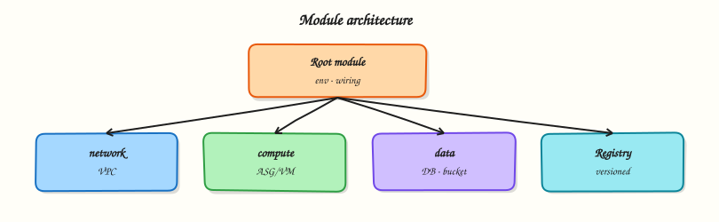

# Registry Modules and Composition

## Overview

Writing every resource from scratch does not scale. The **Terraform Registry** hosts thousands of verified modules — and your organisation can publish **private** modules too. **Composition** wires Registry modules with your own local modules into one root stack, pinning **versions** so today's plan matches tomorrow's pipeline.

This tutorial covers **Registry consumption**, **version constraints**, **module composition patterns**, and **testing** expectations. The lab under `~/rebash-terraform/module-09-registry` composes the public **`cloudposse/label/null`** Registry module with a local **Docker service** wrapper — real `terraform apply` against Docker Engine, no cloud account.

This is **Tutorial 11** in **Module 9: Modules** of the REBASH Academy **Terraform for Cloud & DevOps Engineers** series.

## Prerequisites

- [Modules — Creating Reusable Infrastructure](modules-creating-reusable-infrastructure.md)
- Terraform CLI ≥ 1.5
- Network access to `registry.terraform.io` on first init

## Learning Objectives

By the end of this tutorial, you will be able to:

- [ ] Reference a public Registry module with `source` and `version`
- [ ] Compose Registry and local modules in one root stack
- [ ] Pin module versions with pessimistic constraints
- [ ] Explain module testing and validation before promotion
- [ ] Describe private registry options for enterprise teams

## Architecture

A root module composes a Registry labeling module with a local service module; outputs flow upward for tagging standards.



## Theory

### What it is

**Registry module source** format:

```hcl
module "label" {
  source  = "cloudposse/label/null"
  version = "~> 0.25"

  namespace = "rebash"
  stage     = var.environment
  name      = "api"
}
```

Terraform downloads the module to `.terraform/modules/` during **`terraform init`**.

**Composition** stacks modules vertically:

```text
root/
├── main.tf          # wires registry + local modules
├── modules/
│   └── service/     # your org standard
```

**Version pinning:**

| Constraint | Meaning |
|------------|---------|
| `version = "1.2.3"` | Exact |
| `version = "~> 1.2"` | >= 1.2, < 2.0 |
| `version = ">= 1.0, < 2.0"` | Explicit range |

### Why it matters

Registry modules encode community best practices — but **unpinned** modules can change behaviour on the next init. Composition lets platform teams wrap Registry modules with org-specific defaults (tags, logging, security). **Module testing** (`terraform validate`, `terraform test`, Terratest) catches breaking upgrades before production.

### How it works

1. **`terraform init`** — downloads Registry modules and providers.
2. Root evaluates all `module` blocks — Registry and local.
3. Outputs from Registry modules feed inputs to local modules via attributes.
4. **Private Registry** (Terraform Cloud/Enterprise) hosts internal modules with same source syntax.

**Module testing layers:**

| Layer | Tool |
|-------|------|
| Syntax | `terraform fmt`, `terraform validate` |
| Native tests | `terraform test` (`.tftest.hcl`) |
| Integration | Terratest (Go), kitchen-terraform |
| Policy | Sentinel, OPA, tfsec |

### Key concepts and comparisons

| Source | Trust model |
|--------|-------------|
| Verified Registry publisher | HashiCorp/partner review badge |
| Community module | Read source; pin version; test yourself |
| Private registry | Your org's supply chain controls |
| Git source | Tag commits; submodule path syntax |

| Pattern | Use when |
|---------|----------|
| Thin wrapper module | Org defaults around Registry VPC module |
| Direct Registry call | Quick prototype; accept upgrade risk |
| Monorepo local modules | Tight coupling; same PR for all changes |

### Common pitfalls

- **No version constraint** — `init -upgrade` pulls breaking major versions.
- **Registry module without reading inputs** — required variables surprise you at plan.
- **Deep nesting** — modules calling modules calling modules — hard to debug plans.
- **Different provider versions** in nested modules — init conflicts.
- **Trusting verified badge blindly** — still review for your compliance needs.

## Hands-on Lab

### Objective

Compose **`cloudposse/label/null`** from the public Registry with a local **Docker service** module under `~/rebash-terraform/module-09-registry`, pin versions, apply a real container, and prove labels with `docker inspect`.

### Prerequisites

- Terraform CLI ≥ 1.5
- Docker Engine running (`docker info` succeeds)
- Completed [Modules — Creating Reusable Infrastructure](modules-creating-reusable-infrastructure.md) lab

### Lab environment

```bash title="Terminal"
mkdir -p ~/rebash-terraform/module-09-registry/modules/service && cd ~/rebash-terraform/module-09-registry
```

Runtime: local Docker Engine. Registry download requires network on first `terraform init`.

### Real-world scenario

Your platform team mandates **Cloud Posse label** standards for resource names while service teams deploy containerised workloads. The root stack composes the Registry label module with an internal Docker service module — the same pattern used before wrapping **`terraform-aws-modules/ecs/aws`** or **`terraform-aws-modules/eks/aws`** in production AWS accounts.

### Step-by-step tasks

#### Task 1 – Local Docker service module (wrapper target)

Create `modules/service/versions.tf`:

```hcl title="versions.tf"
terraform {
  required_version = ">= 1.5.0"

  required_providers {
    docker = {
      source  = "kreuzwerker/docker"
      version = "~> 3.0"
    }
  }
}
```

Create `modules/service/variables.tf`:

```hcl title="variables.tf"
variable "id" {
  type        = string
  description = "Label id from upstream labeling module"
}

variable "tags" {
  type        = map(string)
  description = "Standard tags map from Registry label module"
}

variable "image" {
  type        = string
  description = "Container image to run"
  default     = "nginx:1.27-alpine"
}
```

Create `modules/service/main.tf`:

```hcl title="main.tf"
resource "docker_image" "service" {
  name         = var.image
  keep_locally = true
}

resource "docker_container" "service" {
  name  = replace(var.id, "/", "-")
  image = docker_image.service.image_id

  labels = var.tags

  ports {
    internal = 80
    external = 0
  }
}
```

Create `modules/service/outputs.tf`:

```hcl title="outputs.tf"
output "container_id" {
  value = docker_container.service.id
}

output "container_name" {
  value = docker_container.service.name
}

output "label_id" {
  value = var.id
}
```

Run:

```bash title="Terminal"
cd ~/rebash-terraform/module-09-registry/modules/service
terraform init
terraform validate
echo "service module validate OK" | tee ../../service-validate-ok.txt
```

!!! example "Expected output"
    Validate succeeds in the module directory.


#### Task 2 – Root composition with Registry label module

Create `versions.tf`:

```hcl title="versions.tf"
terraform {
  required_version = ">= 1.5.0"

  required_providers {
    null = {
      source  = "hashicorp/null"
      version = "~> 3.2"
    }
    docker = {
      source  = "kreuzwerker/docker"
      version = "~> 3.0"
    }
  }
}
```

Create `providers.tf`:

```hcl title="providers.tf"
provider "docker" {}
```

Create `variables.tf`:

```hcl title="variables.tf"
variable "environment" {
  type    = string
  default = "dev"
}
```

Create `main.tf`:

```hcl title="main.tf"
module "label" {
  source  = "cloudposse/label/null"
  version = "~> 0.25"

  namespace  = "rebash"
  stage      = var.environment
  name       = "billing"
  attributes = ["service"]
}

module "billing_service" {
  source = "./modules/service"

  id   = module.label.id
  tags = module.label.tags
}
```

Create `outputs.tf`:

```hcl title="outputs.tf"
output "standard_id" {
  value = module.label.id
}

output "container_name" {
  value = module.billing_service.container_name
}

output "container_id" {
  value = module.billing_service.container_id
}
```

Run:

```bash title="Terminal"
cd ~/rebash-terraform/module-09-registry
terraform init
terraform plan | tee registry-plan.txt
grep -q 'module.label' registry-plan.txt
grep -q 'module.billing_service' registry-plan.txt
grep -q 'docker_container' registry-plan.txt
echo "registry plan OK" | tee registry-plan-ok.txt
```

!!! example "Expected output"
    Init downloads `cloudposse/label/null`; plan shows Registry module and `docker_container.service`.


#### Task 3 – Apply and prove container labels operationally

Run:


```bash title="Terminal"
cd ~/rebash-terraform/module-09-registry
terraform apply -auto-approve
terraform output -raw standard_id | tee standard-id.txt
grep -q 'rebash' standard-id.txt
docker inspect "$(terraform output -raw container_name)" \
  --format '{{json .Config.Labels}}' | tee container-labels.json
grep -q 'rebash' container-labels.json
grep -q 'dev' container-labels.json
docker ps --filter "name=$(terraform output -raw container_name)" --format '{{.Names}} {{.Status}}' \
  | tee container-ps.txt
echo "registry apply OK" | tee registry-apply-ok.txt
```


!!! example "Expected output"
    Container is running; `container-labels.json` contains Registry label keys (`rebash`, `dev`, `billing`).


#### Task 4 – Registry composition evidence script

Create `registry-evidence.sh`:


```bash title="Terminal"
#!/usr/bin/env bash
set -euo pipefail
cd ~/rebash-terraform/module-09-registry
terraform validate
test -d .terraform/modules/label
CNAME="$(terraform output -raw container_name)"
docker inspect "$CNAME" --format '{{.State.Running}}' | grep -q true
terraform output -raw standard_id | grep -q 'rebash'
echo "registry-evidence PASS" | tee registry-evidence-pass.txt
```


Run:

```bash title="Terminal"
chmod +x ~/rebash-terraform/module-09-registry/registry-evidence.sh
~/rebash-terraform/module-09-registry/registry-evidence.sh
```

!!! example "Expected output"
    Container is running; evidence script passes.


### Validation steps

- [ ] Registry module downloaded on init with version constraint
- [ ] Local Docker module consumes Registry module outputs
- [ ] `terraform apply` created a running container
- [ ] `docker inspect` shows Registry label tags on the container
- [ ] Evidence script passes

### Common errors and fixes

| Error | Cause | Fix |
|-------|-------|-----|
| Module version not found | Constraint too strict | Relax patch constraint; check Registry page |
| Init network failure | Registry blocked | Retry; mirror in private registry |
| Docker daemon not running | Engine stopped | Start Docker Desktop or `systemctl start docker` |
| Container name invalid | Label id contains `/` | Module uses `replace()` — check wrapper logic |
| Provider version conflict | Nested module constraints | Align `required_providers` upper bounds |

### Challenge exercise

Pin an exact patch version (`version = "0.25.0"`), add a second `module "catalog_service"` with `name = "catalog"`, apply, and prove two distinct containers:


```bash title="Terminal"
cd ~/rebash-terraform/module-09-registry
terraform init -upgrade
terraform apply -auto-approve
docker ps --filter "label=Stage=dev" --format '{{.Names}}' | tee two-services.txt
wc -l two-services.txt | grep -q '^2'
echo "two-service challenge OK"
```


!!! example "Expected output"
    Two running containers tagged with `Stage=dev`.


### Learning outcomes

- Registry source and version syntax
- Wiring Registry outputs into local Docker modules
- Module cache layout under `.terraform/modules`
- Operational proof with `docker inspect` after apply

### Cleanup

```bash title="Terminal"
cd ~/rebash-terraform/module-09-registry
terraform destroy -auto-approve
rm -f registry-plan.txt registry-plan-ok.txt standard-id.txt container-labels.json \
  container-ps.txt registry-apply-ok.txt registry-evidence-pass.txt service-validate-ok.txt
rm -rf .terraform .terraform.lock.hcl terraform.tfstate terraform.tfstate.backup
rm -rf modules/service/.terraform modules/service/.terraform.lock.hcl
```

## Validation

- [ ] Completed module-09-registry composition lab
- [ ] Can explain why version pinning matters
- [ ] Know where init stores downloaded modules
- [ ] Can describe module testing layers

## Code Walkthrough

1. **Label module first** — standardise naming before service resources.
2. **Pass id and tags downstream** — local module stays cloud-agnostic in lab.
3. **Pessimistic constraint `~> 0.25`** — allow patches, block 1.x surprises.
4. **Lock file in Git** — reproducible CI init.
5. **Read Registry README** — input names differ across community modules.

## Security Considerations

- Treat Registry modules as **supply chain** dependencies — review source, pin versions.
- Private modules in Terraform Cloud with RBAC — not everyone publishes.
- Scan third-party modules with tfsec/checkov in CI.
- Do not pass secrets into module inputs logged by debug tooling.
- Mirror critical Registry modules internally if outbound registry access is restricted.

## Common Mistakes

!!! warning "Floating version omitted"
    Next init upgrades module silently.  
    **Fix:** Always set `version =` for Registry and Git sources.

!!! warning "Composition without contract tests"
    Registry upgrade breaks downstream wrapper.  
    **Fix:** `terraform test` or example stack in CI on module bump PRs.

!!! warning "Wrapping without understanding module"
    Black box — cannot troubleshoot plan diffs.  
    **Fix:** Read module source; start with minimal inputs in dev.

## Best Practices

- Pin versions; bump intentionally in dedicated PRs.
- Wrap Registry modules with org defaults in thin local modules.
- Keep example `examples/complete` in internal modules (Registry convention).
- Document which Registry modules are approved in platform catalog.
- Run `terraform init -upgrade` only in controlled upgrade pipelines.

## Troubleshooting

| Symptom | Likely cause | Fix |
|---------|--------------|-----|
| Init downloads wrong module | Typo in namespace/name | Verify Registry URL slug |
| Plan differs CI vs laptop | Different lock/module cache | Commit lock file; clean `.terraform` |
| Module upgrade breaks apply | Major version behaviour change | Read changelog; pin previous version |
| Private module 401 | Missing token | `terraform login` or CI `TF_TOKEN` |
| Circular module dependency | Wrapper calls itself via local path | Flatten composition at root |

## Summary

Registry modules accelerate delivery when you **pin versions** and **compose** them with org-specific wrappers. You integrated **`cloudposse/label/null`** with a local Docker service module and proved labels with `docker inspect`. Next, [Functions, Templates, and Dynamic Blocks](functions-templates-and-dynamic-blocks.md) deepens HCL expressions.

## Interview Questions

**1. How do you reference a module from the public Terraform Registry?**

??? success "Reveal answer"
    `source = "NAMESPACE/NAME/PROVIDER"` with **`version =`** constraint — for example `source = "terraform-aws-modules/vpc/aws"` and `version = "~> 5.0"`. Run **`terraform init`** to download into `.terraform/modules/`.

**2. Why must you pin module versions?**

??? success "Reveal answer"
    Without pinning, **`terraform init -upgrade`** or a fresh clone may fetch a **new major version** with breaking input or resource changes — producing different plans in CI and production. Pinning makes infrastructure builds **reproducible**.

**3. What is module composition?**

??? success "Reveal answer"
    Wiring **multiple modules** (Registry and local) in a root module where **outputs** from one become **inputs** to another — for example label module → service module → app resources. Root orchestrates; child modules stay focused.

**4. How do teams test modules before release?**

??? success "Reveal answer"
    **`terraform validate`** and **`terraform fmt`** in CI; **`terraform test`** with mock providers; **Terratest** for integration; **policy scans** (Sentinel, OPA). Promotion gates run example stacks in a sandbox account before tagging a release.

**5. Public Registry vs private registry — when use each?**

??? success "Reveal answer"
    **Public** — community modules (VPC, EKS) with review and wide reuse. **Private** (Terraform Cloud/Enterprise, Artifactory) — internal modules with company naming, compliance, and RBAC. Production org modules should not rely on unmirrored public pulls if policy forbids.

**6. What does the verified badge mean on Registry modules?**

??? success "Reveal answer"
    HashiCorp/partner **verification** of namespace ownership and publishing process — **not** a full security audit of all releases. Still read module source, pin versions, and run your own policy checks.

**7. How do Registry module updates propagate to your stacks?**

??? success "Reveal answer"
    Bump **`version`** constraint in root module, run **`terraform init -upgrade`**, review **plan diff**, run tests, merge PR, apply per environment promotion. Automated Dependabot-style bumps still need human plan review.

**8. When would you prefer Git source over Registry?**

??? success "Reveal answer"
    Internal modules not published to Registry, air-gapped environments, or when you need **`git::` URL with `?ref=`** to a monorepo path (`//modules/vpc`). Same pinning rules apply — use tags/commits, not floating branches.

## Related Tutorials

- [Terraform course index](index.md)
- **Previous:** [Modules — Creating Reusable Infrastructure](modules-creating-reusable-infrastructure.md)
- **Next:** [Functions, Templates, and Dynamic Blocks](functions-templates-and-dynamic-blocks.md)
- [Format, Validate, and terraform test](format-validate-and-terraform-test.md)

## References

- [Terraform Registry](https://registry.terraform.io/)
- [Module sources](https://developer.hashicorp.com/terraform/language/modules/sources)
- [Publishing modules](https://developer.hashicorp.com/terraform/registry/modules/publish)
- [Module testing](https://developer.hashicorp.com/terraform/language/tests)
- [cloudposse/label/null](https://registry.terraform.io/modules/cloudposse/label/null)
