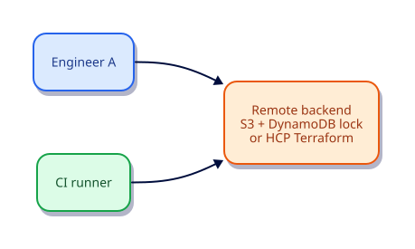

# Remote State and Backends

## Overview

Local state cannot support teams. Remote backends provide shared storage, locking, and often encryption. This tutorial covers backend concepts, S3+DynamoDB and HCP Terraform patterns, and safe migration ideas — with a local lab plus production-shaped examples.

This is **Tutorial 9** in **Module 3: Collaboration and Scale** of the REBASH Academy Terraform track.

## Learning Objectives

By the end of this tutorial, you will be able to:

- [ ] Explain why remote state and locking matter
- [ ] Compare local, S3, and HCP Terraform/cloud backends
- [ ] Read a production S3 backend configuration
- [ ] Describe init -migrate-state at a high level
- [ ] Use terraform_remote_state cautiously

## Prerequisites

- Completed Terraform State Fundamentals

- Terraform CLI **1.9+** (1.15.x recommended)
- Ability to create directories and edit files

## Architecture




## Theory

### Requirements for teams

- Shared durable storage
- Mutual exclusion (locking)
- Encryption at rest / in transit
- Access control and audit

### S3 backend (AWS example)

```hcl
terraform {
  backend "s3" {
    bucket         = "acme-tf-state"
    key            = "payments/terraform.tfstate"
    region         = "eu-west-1"
    dynamodb_table = "acme-tf-locks"
    encrypt        = true
  }
}
```

### HCP Terraform / `cloud` block

HashiCorp-hosted runs, state, and policy integration. Mutually exclusive with `backend`.

### `terraform_remote_state`

Reads outputs from another state. Prefer lightweight outputs or a real data plane (SSM Parameter Store, etc.) over tight stack coupling.

### Why this topic matters in production

Teams that skip **remote backends, locking, and team state** eventually pay in outages: unreviewable plans, brittle
refactors, or secrets leaking into logs. Treat this tutorial as the minimum bar for merging
Terraform changes on a shared state file.

### Practical mental model

1. Write the smallest config that proves the idea
2. `fmt` / `validate` / `plan` until the diff matches your intent
3. Apply only after you can explain every create/update/replace line
4. Destroy lab resources so the next exercise starts clean

## Hands-on Lab

Demonstrate an explicit local backend and document remote config (no AWS required):

```hcl
terraform {
  required_version = ">= 1.9.0"
  backend "local" {
    path = "state/terraform.tfstate"
  }
  required_providers {
    local = {
      source  = "hashicorp/local"
      version = "~> 2.9"
    }
  }
}

resource "local_file" "x" {
  filename = "${path.module}/x.txt"
  content  = "remote-state-lab\n"
}
```

```bash
mkdir -p state
terraform init -input=false
terraform apply -input=false -auto-approve
ls -la state/
terraform destroy -input=false -auto-approve
```

## Code Walkthrough

The local backend path shows that ‘backend’ is just the state storage strategy — remote backends swap the storage engine.


Re-read every argument in the lab through the lens of **remote backends, locking, and team state**.
For each resource address, ask: what happens on the next plan if I change this value?
Update in place, replace, or no-op? That habit is how you avoid surprise destroys.

## Validation

Run the lab to completion, then confirm:

```bash
terraform fmt -check
terraform init -input=false
terraform validate
terraform plan -input=false
```

| Check | Pass criteria |
|-------|----------------|
| Formatting | `fmt -check` exits 0 |
| Configuration | `validate` succeeds after init |
| Intent | Plan matches the tutorial’s expected creates/updates only |
| Topic focus | You can explain how this lab demonstrates remote backends, locking, and team state |
| Cleanup | Destroy (or documented teardown) left no stray lab files |

## Best Practices

- Keep examples small enough to run without cloud credentials unless the topic requires otherwise
- Document assumptions (CLI version, providers, working directory) at the top of the root module
- Prefer explicitness over cleverness when teaching **remote backends, locking, and team state**
- Add CI checks (`fmt`, `validate`, plan) as soon as a root is shared
- Write outputs that help the next human debug, not just the next machine

## Security Considerations

- Assume state and plan output may contain secrets related to **remote backends, locking, and team state**
- Use least-privilege credentials whenever a provider needs authentication
- Do not commit tfvars with real secrets; use examples with placeholders
- Review plans for unexpected destroys before apply
- Limit who can unlock state and who can approve production applies

## Common Mistakes

!!! warning "Remote state without locking"
    Concurrent apply corruption. **Fix:** Always enable a lock table/mechanism.

!!! warning "Open S3 ACLs on state buckets"
    Data breach. **Fix:** Block public access; encrypt; least-privilege IAM.

## Troubleshooting

| Issue | Cause | Solution |
|-------|-------|----------|
| validate fails | Missing init or syntax error | Run `terraform init`, read the file:line in the error |
| Plan shows replace unexpectedly | ForceNew argument changed | Confirm intent; use moved/lifecycle if refactoring |
| Provider auth errors | Credentials not available | Export the documented env vars for the provider |
| Topic confusion around remote backends, locking, and team state | Skipped theory | Re-read Theory, then re-run the lab from a clean directory |
| Leftover lab files | Destroy skipped | Re-run destroy or delete the lab directory after state cleanup |

## Interview Questions

1. What problems do remote backends solve?
2. Why is state locking mandatory for teams?
3. How does partial backend configuration work with CI?
4. What is terraform_remote_state used for?
5. How do you migrate local state to remote safely?
6. What encryption expectations should you set for state storage?
7. Who should have read access to state?
8. What happens if two applies race without locking?
9. How do workspaces relate to backends?
10. When is the local backend still acceptable?
11. How do you break a stuck lock safely?
12. What belongs in backend config versus provider config?

## Summary

- Master **remote backends, locking, and team state** before moving to the next tutorial in the track
- Every shared root needs formatting, validation, and a reviewed plan
- Prefer small, reversible labs that you can destroy confidently
- Carry security and state hygiene forward into every later module

## Related Tutorials

- Track overview: [Terraform](index.md)
- Previous: [Terraform State Fundamentals](terraform-state-fundamentals.md)
- Next: [Workspaces and Environment Strategies](workspaces-and-environment-strategies.md)

## References

1. [Terraform documentation](https://developer.hashicorp.com/terraform/docs)
2. [Terraform CLI commands](https://developer.hashicorp.com/terraform/cli/commands)
3. [Terraform language](https://developer.hashicorp.com/terraform/language)
4. [Terraform Registry](https://registry.terraform.io/)
5. [Version constraints](https://developer.hashicorp.com/terraform/language/expressions/version-constraints)
