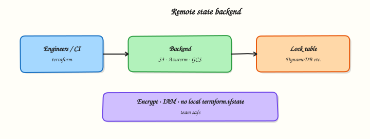

# Remote State and Backends

## Overview

Explain why remote state and locking matter, compare S3 / Azure / GCS and HCP Terraform patterns, and practise an explicit local backend path as a safe stepping stone.

Local state cannot support teams. Concurrent applies corrupt files; laptops get wiped; pull requests lack a single source of truth. **Remote backends** provide shared durable storage, **locking**, encryption, and access control. Providers still talk to cloud APIs; the backend stores state.

This is a core tutorial in **Module 8 · State Management** of the REBASH Academy **Terraform for Cloud & DevOps Engineers** series — written for Cloud, DevOps, Platform, and SRE engineers.

## Prerequisites

- [Terraform State Fundamentals](terraform-state-fundamentals.md)
- Terraform CLI 1.9+ (no cloud account required for the lab)

## Learning Objectives

By the end of this tutorial, you will be able to:

- [ ] Explain shared storage, locking, and encryption for team state  
- [ ] Compare local, S3, Azure, GCS, and HCP Terraform / `cloud` backends  
- [ ] Describe `terraform init -migrate-state` and partial `-backend-config`  
- [ ] Use `terraform_remote_state` cautiously

## Architecture

This topic’s control points and relationships are shown below.



## Theory

### What it is

A **backend** is the storage and locking engine for state. The default is `local` (a file on disk). Remote backends move that file into object storage or a managed service so every engineer and CI runner sees the same bindings. Team requirements: shared durable storage, mutual exclusion (locking), encryption at rest and in transit, access control and audit, and versioning / backups for recovery.

### Why it matters

Two engineers applying without locks can corrupt state or apply conflicting plans. An open state bucket is a credential disclosure waiting to happen — state often holds passwords, keys, and connection strings. Platform teams standardise one backend pattern (bucket + lock table, or HCP Terraform) so product roots inherit security defaults instead of inventing them per project.

### How it works

1. Declare a `backend` block inside `terraform { }` (or a `cloud` block for HCP Terraform — mutually exclusive with `backend`).
2. `terraform init` configures the backend; changing type or key often needs `-migrate-state` or `-reconfigure`.
3. Plans and applies read/write remote state under a lock for the duration of the operation.
4. CI commonly uses **partial backend config**: commit a skeleton; pass region, role, or table via `-backend-config`.
5. `data "terraform_remote_state"` reads **outputs** from another state’s key — convenient but coupling; prefer few stable outputs or a real data plane (Parameter Store, service discovery).

Cloud patterns (study shape — wire credentials only with a real account): **S3** (versioned bucket + lock table / native locks, `encrypt = true`), **AzureRM** (storage container + blob lease), **GCS** (bucket + prefix), **HCP Terraform** (managed state and locks).

### Key concepts and comparisons

| Concern | Local | Remote |
|---------|-------|--------|
| Storage | Disk file | Object store / HCP |
| Locking | None (file races) | Native / DynamoDB / platform |
| Sharing | Copy files (bad) | IAM / team permissions |
| Fit | Solo labs | Teams and CI |

Migrate deliberately: add backend → `init -migrate-state` → verify `state list` → delete local copies only after remote is authoritative.

### Common pitfalls

- Remote state without locking — concurrent apply corruption.
- World-readable state buckets or loose ACLs.
- One giant state for all environments — blast radius and lock contention.
- Deep `terraform_remote_state` webs instead of stable contracts.
- Embedding long-lived access keys in backend config — use roles / OIDC.

## Hands-on Lab

Create a workspace for this tutorial.

```bash
mkdir -p ~/rebash-terraform/module-08/remote-backends/{state,state-b,out} && cd ~/rebash-terraform/module-08/remote-backends/{state,state-b,out}
```

**Focus:** hands-on practice for Remote State and Backends

### Step 1 – Core exercise

```bash
mkdir -p ~/rebash-terraform/module-08/remote-backends/{state,state-b,out}
cd ~/rebash-terraform/module-08/remote-backends

cat > versions.tf << 'EOF'
terraform {
  required_version = ">= 1.9.0"

  backend "local" {
    path = "state/terraform.tfstate"
  }

  required_providers {
    local = {
      source  = "hashicorp/local"
      version = "~> 2.9"
    }
  }
}
EOF

cat > main.tf << 'EOF'
resource "local_file" "marker" {
  filename        = "${path.module}/out/backend-lab.txt"
  content         = "remote-state-lab\n"
  file_permission = "0644"
}

output "marker_path" {
  value = local_file.marker.filename
}
EOF

cat > backend-s3.tf.example << 'EOF'
# Example only — enable when you have a real bucket.
# terraform {
#   backend "s3" {
#     bucket         = "acme-tf-state"
#     key            = "labs/backend/terraform.tfstate"
#     region         = "eu-west-1"
#     dynamodb_table = "acme-tf-locks"
#     encrypt        = true
#   }
# }
EOF

terraform init -input=false
terraform apply -input=false -auto-approve
ls -la state/
# Edit versions.tf path to state-b/terraform.tfstate, then:
# terraform init -input=false -migrate-state -force-copy
terraform destroy -input=false -auto-approve
```

### Final step – Cleanup note

```bash
# Keep ~/rebash-terraform/ for later tutorials; destroy disposable cloud resources from this lab
```

## Validation

- [ ] Lab commands run under `~/rebash-terraform/module-08/remote-backends/{state,state-b,out}/`
- [ ] You can explain each Theory section in your own words
- [ ] You used modern tooling where it applies to this topic
- [ ] You can describe one production failure mode for this topic

## Code Walkthrough

Production practice for **Remote State and Backends** always combines:

1. Inspect before you change (status, plan, logs, dry-run)
2. Prefer reversible, documented changes (Git, IaC, drop-ins, version pins)
3. Capture evidence (command output, pipeline logs) for handovers
4. Prefer current tools and APIs over legacy shortcuts
5. Least privilege — escalate credentials only when required

Keep runbooks short enough to follow under pressure. Automate checks; keep humans for judgement.

## Security Considerations

- Treat credentials and tokens for terraform as privileged — never commit them
- Prefer short-lived auth (OIDC, roles, SSO) over long-lived keys
- Validate blast radius before apply/deploy/delete operations
- Restrict who can approve production changes
- Collect audit logs; limit who can read sensitive traces

## Common Mistakes

!!! warning "Remote state without locking — concurrent apply corruption."
    Validate assumptions against the Theory section and official docs before changing production.

!!! warning "World-readable state buckets or loose ACLs."
    Lab shortcuts (open security groups, admin roles, skip approvals) must not ship unchanged.

!!! warning "Changing production without a rollback path"
    Always know how to revert (previous artefact, prior release, state rollback, DNS failback).

## Best Practices

- Encode Remote State and Backends changes as code and review them in pull requests
- Pin versions (images, modules, actions, provider plugins)
- Separate environments with clear promotion gates
- Alert on symptoms with runbooks attached
- Destroy lab resources; tag everything with owner and expiry where possible

## Troubleshooting

| Symptom | Likely cause | Fix |
|---------|--------------|-----|
| Auth / permission denied | Wrong identity, policy, or scope | Check caller identity, roles, and least-privilege policies |
| Timeout / no route | Network, DNS, security group, or endpoint | Trace path, DNS, and allow-lists before retrying |
| Drift / unexpected plan | Manual change or wrong state/workspace | Reconcile desired vs actual; avoid click-ops on managed resources |
| Pipeline/job red | Flaky step, cache, or missing secret | Read failing step logs; bisect recent workflow/config changes |
| Cost spike | Idle load balancer, NAT, oversized compute | Inventory billable resources; stop/delete labs promptly |

## Summary

**Remote State and Backends** is essential for Cloud and DevOps engineers working with terraform. Practise the lab until the inspection and change path is muscle memory, then continue the track.

## Interview Questions

1. How does **Remote State and Backends** show up when operating Cloud or production platforms?
2. What would you check first if this area misbehaves in production?
3. Which modern tools or APIs replace older equivalents here?
4. What security control should accompany this capability?
5. How would you automate verification of this topic in CI?

!!! tip "Sample answer — question 2"
    Start with blast radius and recent changes, gather evidence (logs, status, plan/diff), then fix forward with a known rollback path — not guesswork.

## Related Tutorials

- [Course overview](index.md)
- - [Modules — Creating Reusable Infrastructure](modules-creating-reusable-infrastructure.md)

## References

- [Backends](https://developer.hashicorp.com/terraform/language/settings/backends/configuration)  
- [Backend: s3](https://developer.hashicorp.com/terraform/language/settings/backends/s3)  
- [State locking](https://developer.hashicorp.com/terraform/language/state/locking)
