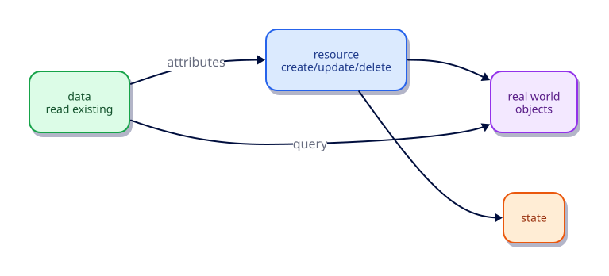

# Resources and Data Sources

## Overview

Resources are objects Terraform manages. Data sources read existing objects without owning their lifecycle. Mastering both is the difference between ‘I can create things’ and ‘I can integrate with what already exists’.

This is **Tutorial 6** in **Module 2: Core Building Blocks** of the REBASH Academy Terraform track.

## Learning Objectives

By the end of this tutorial, you will be able to:

- [ ] Explain manage vs read-only objects
- [ ] Use resource addresses in expressions
- [ ] Read files/metadata with data sources
- [ ] Predict create/update/replace/destroy behaviours
- [ ] Avoid using data sources for objects you should manage

## Prerequisites

- Completed Variables, Locals, and Outputs

- Terraform CLI **1.9+** (1.15.x recommended)
- Ability to create directories and edit files

## Architecture




## Theory

### Resources

Terraform creates/updates/deletes them and records IDs in state.

### Data sources

```hcl
data "local_file" "existing" {
  filename = "${path.module}/seed.txt"
}
```

Data sources run during plan/refresh and export attributes. They do **not** create the object.

### Replace vs update

Some argument changes force **replacement** (destroy+create). Read provider docs for ForceNew behaviours. Prefer `for_each` friendly designs and `moved` blocks when renaming.

### Why this topic matters in production

Teams that skip **managed resources versus data sources** eventually pay in outages: unreviewable plans, brittle
refactors, or secrets leaking into logs. Treat this tutorial as the minimum bar for merging
Terraform changes on a shared state file.

### Practical mental model

1. Write the smallest config that proves the idea
2. `fmt` / `validate` / `plan` until the diff matches your intent
3. Apply only after you can explain every create/update/replace line
4. Destroy lab resources so the next exercise starts clean

## Hands-on Lab

```bash
mkdir -p ~/rebash-tf-res && cd ~/rebash-tf-res
echo "seed-data" > seed.txt
```

```hcl
terraform {
  required_version = ">= 1.9.0"
  required_providers {
    local = {
      source  = "hashicorp/local"
      version = "~> 2.9"
    }
  }
}

data "local_file" "seed" {
  filename = "${path.module}/seed.txt"
}

resource "local_file" "derived" {
  filename = "${path.module}/derived.txt"
  content  = "derived-from: ${trimspace(data.local_file.seed.content)}\n"
}

output "derived_md5" {
  value = local_file.derived.content_md5
}
```

```bash
terraform init -input=false && terraform apply -input=false -auto-approve
cat derived.txt
terraform destroy -input=false -auto-approve
```

## Code Walkthrough

The data source reads `seed.txt` that you created outside Terraform; the resource writes a managed derivative.


Re-read every argument in the lab through the lens of **managed resources versus data sources**.
For each resource address, ask: what happens on the next plan if I change this value?
Update in place, replace, or no-op? That habit is how you avoid surprise destroys.

## Validation

Run the lab to completion, then confirm:

```bash
terraform fmt -check
terraform init -input=false
terraform validate
terraform plan -input=false
```

| Check | Pass criteria |
|-------|----------------|
| Formatting | `fmt -check` exits 0 |
| Configuration | `validate` succeeds after init |
| Intent | Plan matches the tutorial’s expected creates/updates only |
| Topic focus | You can explain how this lab demonstrates managed resources versus data sources |
| Cleanup | Destroy (or documented teardown) left no stray lab files |

## Best Practices

- Keep examples small enough to run without cloud credentials unless the topic requires otherwise
- Document assumptions (CLI version, providers, working directory) at the top of the root module
- Prefer explicitness over cleverness when teaching **managed resources versus data sources**
- Add CI checks (`fmt`, `validate`, plan) as soon as a root is shared
- Write outputs that help the next human debug, not just the next machine

## Security Considerations

- Assume state and plan output may contain secrets related to **managed resources versus data sources**
- Use least-privilege credentials whenever a provider needs authentication
- Do not commit tfvars with real secrets; use examples with placeholders
- Review plans for unexpected destroys before apply
- Limit who can unlock state and who can approve production applies

## Common Mistakes

!!! warning "Managing the same object as both data and resource"
    Fighting ownership. **Fix:** Pick one model.

!!! warning "Assuming data sources are free"
    They call APIs every plan. **Fix:** Cache thoughtfully; watch rate limits on cloud APIs.

## Troubleshooting

| Issue | Cause | Solution |
|-------|-------|----------|
| validate fails | Missing init or syntax error | Run `terraform init`, read the file:line in the error |
| Plan shows replace unexpectedly | ForceNew argument changed | Confirm intent; use moved/lifecycle if refactoring |
| Provider auth errors | Credentials not available | Export the documented env vars for the provider |
| Topic confusion around managed resources versus data sources | Skipped theory | Re-read Theory, then re-run the lab from a clean directory |
| Leftover lab files | Destroy skipped | Re-run destroy or delete the lab directory after state cleanup |

## Interview Questions

1. What is the difference between a resource and a data source?
2. When is a data source preferable to duplicating configuration?
3. How does Terraform decide to create, update, or replace a resource?
4. What is ForceNew behaviour at a high level?
5. How do you reference a data source attribute in a resource?
6. Why can data sources cause plans to change without config edits?
7. When should you avoid data sources at plan time?
8. How does count/for_each change resource addressing?
9. What appears in state for a data source?
10. How would you import an existing object later in the track?
11. Why pin provider versions when using data sources?
12. Describe a safe pattern for reading remote state outputs.

## Summary

- Master **managed resources versus data sources** before moving to the next tutorial in the track
- Every shared root needs formatting, validation, and a reviewed plan
- Prefer small, reversible labs that you can destroy confidently
- Carry security and state hygiene forward into every later module

## Related Tutorials

- Track overview: [Terraform](index.md)
- Previous: [Variables, Locals, and Outputs](variables-locals-and-outputs.md)
- Next: [Dependencies and the Resource Graph](dependencies-and-the-resource-graph.md)
- Cheat sheet: [Terraform Cheat Sheet](../cheatsheets/terraform.md)
- Interview prep: [Terraform Interview Prep](../interview/terraform.md)
- Learning path: [DevOps Engineer](../learning-paths/devops-engineer.md)

## References

1. [Terraform documentation](https://developer.hashicorp.com/terraform/docs)
2. [Terraform CLI commands](https://developer.hashicorp.com/terraform/cli/commands)
3. [Terraform language](https://developer.hashicorp.com/terraform/language)
4. [Terraform Registry](https://registry.terraform.io/)
5. [Version constraints](https://developer.hashicorp.com/terraform/language/expressions/version-constraints)
