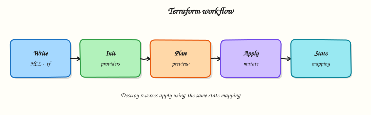

# Terraform — Learning Roadmap

Follow the course in order for the smoothest path from first HCL file to production operations.

1. **Course overview** — scope, prerequisites, outcomes
2. **Modules 1–20** — tutorials in sequence
3. **Labs / quizzes / projects** — extra practice
4. **Capstone** — production infrastructure platform
5. **Interview & certifications** — Terraform Associate



## Phases

| Phase | Modules | Outcome |
|-------|---------|---------|
| Foundations | 1–4 | Write, init, plan, apply; read HCL blocks |
| Core HCL & state | 5–8 | Providers, resources, variables, remote state |
| Reuse & data | 9–11 | Modules, expressions, data sources |
| Platform & quality | 12–14 | Workspaces, HCP Terraform, testing |
| Security & delivery | 15–16 | Secrets, policy, CI/CD pipelines |
| Scale & ops | 17–20 | Multi-cloud, Kubernetes, production, troubleshooting |

## Modules

| # | Focus | Tutorials | Level |
|---|-------|-----------|-------|
| 1 | IaC fundamentals | [Introduction](introduction-to-terraform-and-iac.md) | Beginner |
| 2 | Installing Terraform | [Install & CLI](installing-terraform-and-the-cli-workflow.md) | Beginner |
| 3 | Terraform basics | [Init · plan · apply](terraform-workflow-init-plan-apply.md) | Beginner |
| 4 | HCL fundamentals | [Blocks & expressions](hcl-fundamentals-blocks-arguments-and-expressions.md) | Beginner |
| 5 | Providers | [Providers & plugins](providers-and-the-terraform-plugin-model.md) | Intermediate |
| 6 | Resources | [Resources & meta-arguments](resources-dependencies-and-meta-arguments.md) | Intermediate |
| 7 | Variables & outputs | [Variables · locals · outputs](variables-locals-and-outputs.md) | Intermediate |
| 8 | State management | [State](terraform-state-fundamentals.md) · [Remote backends](remote-state-and-backends.md) | Intermediate |
| 9 | Modules | [Create modules](modules-creating-reusable-infrastructure.md) · [Registry](registry-modules-and-composition.md) | Intermediate |
| 10 | Expressions & functions | [Functions & dynamic blocks](functions-templates-and-dynamic-blocks.md) | Intermediate |
| 11 | Data sources | [Data sources](data-sources-and-existing-infrastructure.md) | Intermediate |
| 12 | Workspaces | [Workspaces & envs](workspaces-and-environment-strategies.md) | Advanced |
| 13 | Cloud & Enterprise | [HCP Terraform](terraform-cloud-and-hcp-terraform.md) | Advanced |
| 14 | Testing | [Format · validate · test](format-validate-and-terraform-test.md) | Advanced |
| 15 | Security | [Secrets & policy](terraform-security-and-secrets.md) | Advanced |
| 16 | CI/CD | [Pipelines](terraform-in-ci-cd-pipelines.md) | Advanced |
| 17 | Multi-cloud | [AWS · Azure · GCP](multi-cloud-terraform.md) | Advanced |
| 18 | Kubernetes | [Clusters & providers](kubernetes-infrastructure-with-terraform.md) | Advanced |
| 19 | Production | [Production patterns](production-terraform-patterns.md) | Advanced |
| 20 | Troubleshooting | [Troubleshooting](troubleshooting-terraform.md) | Advanced |

## Diagrams

Regenerate Excalidraw SVGs after editing the generator:

```bash title="Terminal"
python3 scripts/generate-excalidraw-svg.py
```

Assets live under `docs/assets/excalidraw/`.
