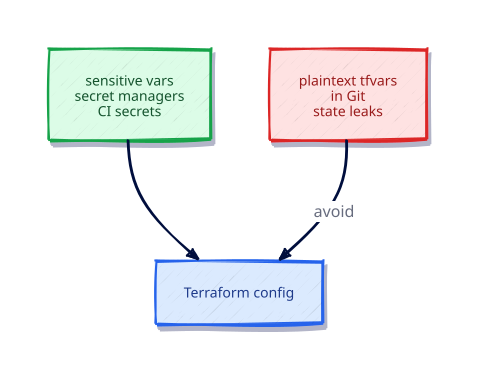

# Secrets and Sensitive Values

## Overview

Terraform state and plans can contain secrets. Learn sensitive flags, redaction, local_sensitive_file, CI injection patterns, and why secret managers beat plaintext tfvars.

This is **Tutorial 17** in **Module 5: Quality and Security** of the REBASH Academy Terraform track.

## Learning Objectives

By the end of this tutorial, you will be able to:

- [ ] Mark variables and outputs sensitive
- [ ] Prefer local_sensitive_file for secret material on disk
- [ ] Keep secrets out of Git
- [ ] Understand state exposure risks
- [ ] Inject secrets via env / CI secret stores

## Prerequisites

- Completed Format, Validate, and Terraform Test

- Terraform CLI **1.9+** (1.15.x recommended)
- Ability to create directories and edit files

## Architecture




## Theory

### Rules

1. Never commit real `*.tfvars` containing secrets  
2. Mark sensitive variables/outputs  
3. Encrypt remote state; restrict IAM  
4. Prefer cloud secret stores (ASM, Vault) and data sources  
5. Assume plan JSON may contain values — protect artifacts

### Why this topic matters in production

Teams that skip **sensitive values and secrets handling** eventually pay in outages: unreviewable plans, brittle
refactors, or secrets leaking into logs. Treat this tutorial as the minimum bar for merging
Terraform changes on a shared state file.

### Practical mental model

1. Write the smallest config that proves the idea
2. `fmt` / `validate` / `plan` until the diff matches your intent
3. Apply only after you can explain every create/update/replace line
4. Destroy lab resources so the next exercise starts clean

## Hands-on Lab

```hcl
terraform {
  required_version = ">= 1.9.0"
  required_providers {
    local = {
      source  = "hashicorp/local"
      version = "~> 2.9"
    }
  }
}

variable "api_token" {
  type      = string
  sensitive = true
}

resource "local_sensitive_file" "token" {
  filename        = "${path.module}/.secrets/token"
  content         = var.api_token
  file_permission = "0600"
}

output "token_path" {
  value = local_sensitive_file.token.filename
}
```

```bash
export TF_VAR_api_token='lab-only-token'
mkdir -p .secrets
terraform init -input=false && terraform apply -input=false -auto-approve
terraform output
terraform destroy -input=false -auto-approve
unset TF_VAR_api_token
```

## Code Walkthrough

`local_sensitive_file` reduces accidental echo in logs compared to ordinary files; state may still store content — protect state.


Re-read every argument in the lab through the lens of **sensitive values and secrets handling**.
For each resource address, ask: what happens on the next plan if I change this value?
Update in place, replace, or no-op? That habit is how you avoid surprise destroys.

## Validation

Run the lab to completion, then confirm:

```bash
terraform fmt -check
terraform init -input=false
terraform validate
terraform plan -input=false
```

| Check | Pass criteria |
|-------|----------------|
| Formatting | `fmt -check` exits 0 |
| Configuration | `validate` succeeds after init |
| Intent | Plan matches the tutorial’s expected creates/updates only |
| Topic focus | You can explain how this lab demonstrates sensitive values and secrets handling |
| Cleanup | Destroy (or documented teardown) left no stray lab files |

## Best Practices

- Keep examples small enough to run without cloud credentials unless the topic requires otherwise
- Document assumptions (CLI version, providers, working directory) at the top of the root module
- Prefer explicitness over cleverness when teaching **sensitive values and secrets handling**
- Add CI checks (`fmt`, `validate`, plan) as soon as a root is shared
- Write outputs that help the next human debug, not just the next machine

## Security Considerations

- Assume state and plan output may contain secrets related to **sensitive values and secrets handling**
- Use least-privilege credentials whenever a provider needs authentication
- Do not commit tfvars with real secrets; use examples with placeholders
- Review plans for unexpected destroys before apply
- Limit who can unlock state and who can approve production applies

## Common Mistakes

!!! warning "Printing secrets in provisioners"
    Log leakage. **Fix:** Never echo secrets.

## Troubleshooting

| Issue | Cause | Solution |
|-------|-------|----------|
| validate fails | Missing init or syntax error | Run `terraform init`, read the file:line in the error |
| Plan shows replace unexpectedly | ForceNew argument changed | Confirm intent; use moved/lifecycle if refactoring |
| Provider auth errors | Credentials not available | Export the documented env vars for the provider |
| Topic confusion around sensitive values and secrets handling | Skipped theory | Re-read Theory, then re-run the lab from a clean directory |
| Leftover lab files | Destroy skipped | Re-run destroy or delete the lab directory after state cleanup |

## Interview Questions

1. What does sensitive = true change in CLI output?
2. Why is state still a secret store even with sensitive flags?
3. Where should production secrets live?
4. How do you pass secrets into Terraform safely in CI?
5. What is the risk of echoing secrets in local-exec?
6. How do ephemeral values change secret handling (conceptually)?
7. Why avoid plaintext tfvars in Git?
8. How do you redaction-check plan logs?
9. What IAM controls protect remote state?
10. How should modules declare sensitive outputs?
11. What is a secure pattern for rotating secrets with Terraform?
12. Why is write-only thinking useful for passwords?

## Summary

- Master **sensitive values and secrets handling** before moving to the next tutorial in the track
- Every shared root needs formatting, validation, and a reviewed plan
- Prefer small, reversible labs that you can destroy confidently
- Carry security and state hygiene forward into every later module

## Related Tutorials

- Track overview: [Terraform](index.md)
- Previous: [Format, Validate, and Terraform Test](format-validate-and-terraform-test.md)
- Next: [Policy as Code Overview](policy-as-code-overview.md)
- Cheat sheet: [Terraform Cheat Sheet](../cheatsheets/terraform.md)
- Interview prep: [Terraform Interview Prep](../interview/terraform.md)
- Learning path: [DevOps Engineer](../learning-paths/devops-engineer.md)

## References

1. [Terraform documentation](https://developer.hashicorp.com/terraform/docs)
2. [Terraform CLI commands](https://developer.hashicorp.com/terraform/cli/commands)
3. [Terraform language](https://developer.hashicorp.com/terraform/language)
4. [Terraform Registry](https://registry.terraform.io/)
5. [Version constraints](https://developer.hashicorp.com/terraform/language/expressions/version-constraints)
