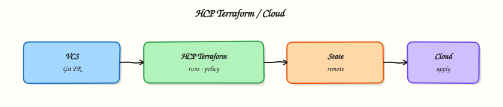

# Terraform Cloud and HCP Terraform

## Overview

Platform teams outgrow laptop applies and self-managed state buckets. **HCP Terraform** (HashiCorp Cloud Platform Terraform; historically **Terraform Cloud**) is HashiCorp’s managed control plane for remote state, remote execution, team permissions, variable sets, and policy gates. You bind a root module with a `cloud` block, queue **runs** (plan and apply) on managed workers, and review history in a UI instead of chasing log files in CI.

This is **Tutorial 13** in **Module 13: Terraform Cloud & Enterprise** of the REBASH Academy **Terraform for Cloud & DevOps Engineers** series — written for Cloud, DevOps, Platform, and SRE engineers who need to explain when to adopt HCP Terraform versus a self-managed backend.

Beginners learn the vocabulary: organisation, workspace, run, variable set, team. Practitioners learn how VCS-driven workflows and remote execution reduce credential sprawl. Production judgement covers blast radius — HCP workspaces are not a substitute for separate cloud accounts — and why `cloud` and `backend` blocks cannot coexist.

## Prerequisites

- [Workspaces and Environment Strategies](workspaces-and-environment-strategies.md)
- [Remote State and Backends](remote-state-and-backends.md)
- Terraform CLI 1.9+
- HashiCorp account optional (the lab runs locally; no paid organisation required)

## Learning Objectives

By the end of this tutorial, you will be able to:

- [ ] Contrast HCP Terraform workspaces with CLI `terraform workspace` commands
- [ ] Describe remote execution runs (plan, apply, policy evaluation)
- [ ] Map teams, variable sets, and policy stages to a review workflow
- [ ] Explain when a `cloud` block replaces a `backend` block
- [ ] Mirror a remote-run artefact workflow locally with saved plan files

## Architecture

HCP Terraform sits between your Git repository, engineers, and cloud APIs — hosting state, queuing runs, and enforcing policy before apply.



## Theory

### What it is

**HCP Terraform** is a SaaS (Software as a Service) platform that manages Terraform state and can execute plans and applies on HashiCorp-hosted runners or self-hosted agents. An **organisation** is the top-level tenant. An HCP **workspace** (not the same as a CLI workspace) is a named environment with its own state, variables, run queue, optional VCS connection, and execution mode.

A **run** is a queued operation: typically `plan`, then (after approval) `apply`. Runs produce immutable logs and can attach **policy** checks (Sentinel on Enterprise tiers; Open Policy Agent integrations vary by setup). **Teams** grant organisation-level permissions (who can read variables, queue plans, approve applies). **Variable sets** attach shared Terraform and environment variables to multiple workspaces — for example a `TF_VAR_region` set reused across staging and production.

Configuration binding uses a `cloud` block in the root module:

```hcl
terraform {
  cloud {
    organization = "acme-platform"
    workspaces {
      name = "networking-prod"
    }
  }
}
```

The `cloud` block is **mutually exclusive** with a `backend` block. After `terraform login`, `terraform init` connects the working directory to the remote workspace.

### Why it matters

Self-managed Amazon Simple Storage Service (S3) plus DynamoDB locking works, but your team owns encryption, versioning, IAM hygiene, runner credentials, and audit exports. HCP Terraform centralises those concerns: credentials can live in the platform, plans appear in a review UI, and platform engineers attach mandatory policies before apply. For regulated industries, run history and team boundaries support audit stories that ad-hoc laptop applies cannot.

### How it works

1. **Create organisation and workspace** — UI, API, or the `tfe` / HCP Terraform provider for automation.
2. **Connect VCS** — optional; pull requests trigger speculative plans; merges trigger applies when configured.
3. **Configure execution mode** — remote (default on HCP) runs on HashiCorp workers; local execution uses your machine’s credentials while state remains remote.
4. **Queue a run** — `terraform plan` / `apply` from CLI or VCS webhook creates a run record with logs.
5. **Policy evaluation** — soft or hard gates on the plan; failing policies block apply.
6. **Apply** — after human or automated approval, the saved plan executes against remote state.

CLI workspaces only switch which local or remote state file a directory uses. HCP workspaces add permissions, history, variables, and run tooling — treat them as different concepts.

### Key concepts and comparisons

| Concern | Self-managed backend | HCP Terraform |
|---------|----------------------|---------------|
| State storage | You operate bucket + locking | Managed |
| Execution | CI runner or laptop | Remote workers / agents |
| Collaboration | DIY (PR comments, artefacts) | Built-in run UI |
| Policy | OPA, Conftest, custom | Integrated policy sets (tier-dependent) |
| Cost | Cloud storage + CI minutes | Per-seat / run pricing |

| HCP feature | Purpose |
|-------------|---------|
| Workspace | State + variables + runs for one stack |
| Run | Remote plan/apply with audit trail |
| Variable set | Shared secrets/inputs across workspaces |
| Team | RBAC for plan vs apply |
| Policy set | Guardrails on planned changes |

### Teams and access patterns

Typical team split:

| Team | Permission | Rationale |
|------|------------|-----------|
| `platform-admins` | Manage workspaces, variable sets | Break-glass platform ownership |
| `networking-maintainers` | Plan + apply on network workspaces | Own landing-zone modules |
| `app-developers` | Plan only on app workspaces | Review without prod apply rights |

Map teams to cloud account isolation — HCP permissions do not replace separate AWS accounts or Google Cloud projects for production blast radius.

### Common pitfalls

- Treating HCP workspaces as the only boundary between production and non-production — still use separate cloud accounts where possible.
- Declaring both `cloud` and `backend` in one root — Terraform rejects the configuration.
- Duplicating secrets in Git **and** HCP variable sets — pick one controlled injection path.
- Assuming remote execution means credentials never touch laptops — local execution mode still uses local credentials.
- Confusing CLI workspace names with HCP workspace names in runbooks and CI scripts.

## Hands-on Lab

### Objective

Author HCP Terraform-ready configuration (commented `cloud` block, workspace variable templates) and practise the remote-run **artefact discipline** locally: saved plan files, human-readable plan review, and apply of the exact plan binary against a real **Docker** stack under `~/rebash-terraform/module-13`.

### Prerequisites

- Terraform CLI ≥ 1.9
- Docker Engine running (`docker info` succeeds)

### Lab environment

Workspace: `~/rebash-terraform/module-13`

Local Terraform with Docker provider. No HCP organisation required — HCP concepts are theory; runs mirror remote-run discipline locally.

``` {.bash .ra-terminal title="Terminal"}
mkdir -p ~/rebash-terraform/module-13/artefacts && cd ~/rebash-terraform/module-13
```

### Real-world scenario

Your platform team is preparing a repository for HCP Terraform adoption. Leadership wants proof that engineers understand saved-plan review before any remote workspace is wired. You create configuration files that mirror an HCP workspace layout, keep the `cloud` block as a documented example (not active), and run the same plan → review → apply → destroy loop against a Docker bootstrap stack that a remote run would execute.

### Step-by-step tasks

#### Task 1 – Author root module and HCP workspace templates

Create `versions.tf`:

```hcl title="versions.tf"
terraform {
  required_version = ">= 1.9.0"

  required_providers {
    docker = {
      source  = "kreuzwerker/docker"
      version = "~> 3.0"
    }
    local = {
      source  = "hashicorp/local"
      version = "~> 2.5"
    }
  }

  # When your organisation adopts HCP Terraform, replace this comment block
  # with an active `cloud` block and remove local backend usage.
  #
  # cloud {
  #   organization = "acme-platform"
  #   workspaces {
  #     name = "platform-bootstrap-dev"
  #   }
  # }
}
```

Create `providers.tf`:

```hcl title="providers.tf"
provider "docker" {}
```

Create `variables.tf`:

```hcl title="variables.tf"
variable "environment" {
  type        = string
  description = "Workspace environment label mirrored in HCP variable sets."
  default     = "dev"

  validation {
    condition     = contains(["dev", "staging", "prod"], var.environment)
    error_message = "environment must be dev, staging, or prod."
  }
}

variable "service_name" {
  type        = string
  description = "Logical service identifier written into run metadata."
  default     = "platform-bootstrap"
}
```

Create `main.tf`:

```hcl title="main.tf"
resource "docker_image" "bootstrap" {
  name         = "nginx:1.27-alpine"
  keep_locally = true
}

resource "docker_container" "bootstrap" {
  name  = "${var.service_name}-${var.environment}"
  image = docker_image.bootstrap.image_id

  labels = {
    environment  = var.environment
    service_name = var.service_name
    managed_by   = "terraform"
    workspace    = "hcp-example-${var.environment}"
  }

  ports {
    internal = 80
    external = 0
  }
}

resource "local_file" "run_summary" {
  filename = "${path.module}/artefacts/run-summary.txt"
  content  = join("\n", [
    "environment=${var.environment}",
    "service=${var.service_name}",
    "workspace=hcp-example-${var.environment}",
    "container=${docker_container.bootstrap.name}",
    "execution=local-simulation",
  ])

  depends_on = [docker_container.bootstrap]
}
```

Create `outputs.tf`:

```hcl title="outputs.tf"
output "run_summary_path" {
  description = "Path to the generated run summary artefact."
  value       = local_file.run_summary.filename
}

output "container_name" {
  description = "Bootstrap container name."
  value       = docker_container.bootstrap.name
}

output "environment" {
  description = "Active environment label."
  value       = var.environment
}
```

Create `workspace.auto.tfvars.example`:

```hcl title="workspace.auto.tfvars.example"
environment  = "dev"
service_name = "platform-bootstrap"
```

Create `cloud.tf.example`:

```hcl title="cloud.tf.example"
# Example HCP Terraform binding — enable only when migrating off local state.
#
# terraform {
#   cloud {
#     organization = "acme-platform"
#     workspaces {
#       tags = ["team:platform", "service:bootstrap"]
#     }
#   }
# }
```

Initialise and validate:

``` {.bash .ra-terminal title="Terminal"}
cd ~/rebash-terraform/module-13
cp workspace.auto.tfvars.example workspace.auto.tfvars
terraform init | tee artefacts/init.log
terraform validate | tee artefacts/validate.log
```

!!! example "Expected output"
    `init.log` ends with `Terraform has been successfully initialized.` and `validate.log` contains `Success! The configuration is valid.`


#### Task 2 – Produce and review a saved plan (remote-run artefact)

Remote runs always produce a reviewable plan before apply. Mirror that locally.

``` {.bash .ra-terminal title="Terminal"}
cd ~/rebash-terraform/module-13
terraform plan -input=false -out=run.tfplan | tee artefacts/plan.log
terraform show -no-color run.tfplan | tee artefacts/plan-review.txt
grep -q 'docker_container.bootstrap' artefacts/plan-review.txt
grep -q 'local_file.run_summary' artefacts/plan-review.txt
```

!!! example "Expected output"
    `plan.log` shows `Plan: 3 to add`; `artefacts/plan-review.txt` lists container and run summary resources.


#### Task 3 – Apply the saved plan and capture run metadata

Applying the exact plan binary is what HCP Terraform does after approval — not a fresh implicit plan.


``` {.bash .ra-terminal title="Terminal"}
cd ~/rebash-terraform/module-13
terraform apply -input=false run.tfplan | tee artefacts/apply.log
terraform output -json | tee artefacts/outputs.json
test -f artefacts/run-summary.txt
cat artefacts/run-summary.txt | tee artefacts/run-summary-copy.txt
docker ps --filter "name=platform-bootstrap-dev" --format '{{.Names}} {{.Status}}' \
  | tee artefacts/container-ps.txt
grep -q 'platform-bootstrap-dev' artefacts/container-ps.txt
```


!!! example "Expected output"
    `apply.log` ends with `Apply complete!`; container running; `artefacts/run-summary.txt` contains `environment=dev`.


#### Task 4 – Document workspace variable mapping

Create `docs/hcp-workspace-mapping.md`:

```markdown title="hcp-workspace-mapping.md"
# HCP workspace mapping (lab)

| HCP workspace | Terraform variable set | Cloud account |
|---------------|------------------------|---------------|
| platform-bootstrap-dev | rebash-dev-vars | dev-account |
| platform-bootstrap-prod | rebash-prod-vars | prod-account |

Runs: PR → speculative plan; merge to main → apply with manual approval on prod.
Policies: require `managed_by = terraform` tag; deny public object storage.
```

Verify the file exists:


``` {.bash .ra-terminal title="Terminal"}
cd ~/rebash-terraform/module-13
test -f docs/hcp-workspace-mapping.md
grep -q 'platform-bootstrap-prod' docs/hcp-workspace-mapping.md
docker inspect platform-bootstrap-dev --format '{{index .Config.Labels "managed_by"}}' \
  | tee artefacts/label-proof.txt
grep -q 'terraform' artefacts/label-proof.txt
```


!!! example "Expected output"
    Mapping file documents prod workspace separation; container carries `managed_by=terraform` label.


### Validation steps

- [ ] `terraform validate` passes under `~/rebash-terraform/module-13`
- [ ] Saved plan `run.tfplan` was reviewed in `artefacts/plan-review.txt` before apply
- [ ] Apply used `run.tfplan`, not an implicit re-plan
- [ ] Docker container running; `artefacts/run-summary.txt` exists with environment metadata
- [ ] `cloud.tf.example` documents HCP binding without being activated

### Common errors and fixes

| Error | Cause | Fix |
|-------|-------|-----|
| `Invalid combination of backend and cloud configuration` | Both blocks active | Keep `cloud` commented until migration |
| Docker daemon not running | Engine stopped | Start Docker; re-run init |
| Plan shows unexpected destroy | Wrong tfvars or stale state | Confirm `workspace.auto.tfvars`; read plan line-by-line |
| Apply of stale plan fails | Config changed after plan | Re-run `terraform plan -out=run.tfplan` |

### Challenge exercise

Add a `policies/tags-required.sentinel.example` comment sketch requiring `managed_by = terraform` on all containers, extend `docs/hcp-workspace-mapping.md` with which policy set attaches to prod, and re-run saved-plan apply after changing `service_name` to prove plan diff detection.

### Learning outcomes

- Authored HCP-ready root module with documented, inactive `cloud` block
- Practised saved-plan review against real Docker infrastructure
- Generated run summary and output JSON artefacts suitable for CI upload
- Documented workspace ↔ variable set ↔ account mapping for platform onboarding

### Cleanup

``` {.bash .ra-terminal title="Terminal"}
cd ~/rebash-terraform/module-13
terraform destroy -auto-approve
rm -rf .terraform run.tfplan terraform.tfstate terraform.tfstate.backup artefacts
rm -f workspace.auto.tfvars
```

## Validation

- [ ] Lab commands completed under `~/rebash-terraform/module-13`
- [ ] You can explain HCP workspace vs CLI workspace without conflating them
- [ ] You produced a saved plan and applied that exact binary
- [ ] You can describe one production failure mode (wrong workspace apply, shared credentials)

## Code Walkthrough

Production HCP Terraform habits:

1. **Inspect before queueing** — read speculative plan output in the PR/VCS UI; treat destroys as incidents-in-waiting.
2. **Pin Terraform CLI and provider versions** — match local, CI, and HCP agent versions via `required_version` and lock files.
3. **Capture evidence** — export run IDs, plan JSON, and apply logs for change tickets.
4. **Prefer remote execution** — keep long-lived cloud keys off laptops; use variable sets for secrets.
5. **Least privilege teams** — separate plan-only and apply-capable memberships per workspace.

## Security Considerations

- Store secrets in HCP variable sets or a vault — never in committed `.tfvars` or Git.
- Restrict who can approve production applies; use separate workspaces and cloud accounts for prod.
- Encrypt remote state at rest (HCP default) and audit who accessed run logs.
- Treat plan JSON as sensitive — it may echo secret attributes marked `sensitive`.
- Disable local execution mode for production workspaces unless break-glass procedures require it.

## Common Mistakes

!!! warning "Using one HCP workspace for dev and prod"
    **Fix:** Create separate workspaces **and** separate cloud accounts; HCP naming alone does not isolate blast radius.

!!! warning "Activating `cloud` while a `backend` block remains"
    **Fix:** Choose one state binding per root; migrate with `terraform init -migrate-state` under change control.

!!! warning "Skipping plan review because runs are remote"
    **Fix:** Policy gates catch some issues, not all; humans still read destroys and replacements before approve.

## Best Practices

- Name workspaces `{service}-{environment}` and tag them for cost and ownership.
- Attach variable sets per environment tier — dev secrets must not leak into prod sets.
- Use VCS-driven speculative plans on every pull request.
- Version modules and providers identically across local, CI, and HCP agents.
- Document run approval rules in the same repository as the Terraform code.

## Troubleshooting

| Symptom | Likely cause | Fix |
|---------|--------------|-----|
| Init asks for HCP token | Active `cloud` block | Run `terraform login` or comment block for local lab |
| Run stuck in pending | Agent pool exhausted / misconfigured | Check agent status; queue depth in UI |
| Policy hard-fail on tag | Missing required tag in plan | Add tag in module; or request reviewed exception |
| Apply differs from reviewed plan | New commit merged before apply | Re-run plan; apply saved artefact from approved run only |
| Wrong workspace targeted | CLI context mismatch | Verify `cloud.workspaces.name` or tags; check org URL |

## Summary

HCP Terraform adds managed state, remote runs, teams, variable sets, and policy gates on top of open-source Terraform. The lab mirrored remote-run discipline locally with saved plans and workspace mapping docs. Next, gate changes with **format, validate, and `terraform test`** before they reach any run queue.

## Interview Questions

**1. What capabilities does HCP Terraform add beyond the open-source CLI alone?**

??? success "Reveal answer"
    Managed remote state, run history, team permissions, variable sets, VCS-driven workflows, and integrated policy evaluation on plans. The CLI alone has none of that collaboration and governance surface — you would build it with S3, CI, and custom tooling.

**2. How is an HCP Terraform workspace different from a CLI workspace?**

??? success "Reveal answer"
    CLI workspaces are a state-namespace switch inside one configuration directory. HCP workspaces are rich objects with their own state, variables, VCS links, run queue, and RBAC. Same word, different scope — conflating them causes wrong-state applies.

**3. What is a remote run versus a local run in HCP Terraform?**

??? success "Reveal answer"
    Remote runs execute plan/apply on HashiCorp workers (or your agents) with credentials stored in the platform. Local runs still use remote state but execute on your machine with local credentials and plugins.

**4. Why cannot `cloud` and `backend` blocks coexist?**

??? success "Reveal answer"
    Both configure where state lives and how the CLI authenticates to the remote service. Terraform allows exactly one remote state binding per root module; you migrate between them with `init -migrate-state`, not simultaneous declaration.

**5. How do policy checks fit into an HCP Terraform run?**

??? success "Reveal answer"
    After plan, policy engines evaluate the planned resource graph. Soft failures warn; hard failures block apply until the configuration or policy exception is resolved. This catches org-wide rules (tags, forbidden resource types) before human approval.

**6. What organisational trade-offs come with centralising runs in HCP Terraform?**

??? success "Reveal answer"
    You gain auditability and consistent credentials, but introduce platform dependency, per-seat cost, and the need for clear workspace permissions so teams cannot apply each other's production stacks. Break-glass local applies should remain documented and rare.

**7. How should VCS-driven workflows map to workspaces?**

??? success "Reveal answer"
    Typically one workspace per environment/stack branch pattern: PR triggers speculative plan on the target workspace; merge to the protected branch triggers apply (often with manual approval on prod). Map directories to workspaces explicitly in `cloud.workspaces` tags or names.

## Related Tutorials

- [Course overview](index.md)
- [Workspaces and Environment Strategies](workspaces-and-environment-strategies.md)
- [Format, Validate, and Terraform Test](format-validate-and-terraform-test.md)

## References

- [HCP Terraform documentation](https://developer.hashicorp.com/terraform/cloud-docs)
- [Cloud block settings](https://developer.hashicorp.com/terraform/cli/cloud/settings)
- [Remote operations and runs](https://developer.hashicorp.com/terraform/cloud-docs/run/remote-operations)
- [Teams and permissions](https://developer.hashicorp.com/terraform/cloud-docs/users-teams-organizations/permissions)
