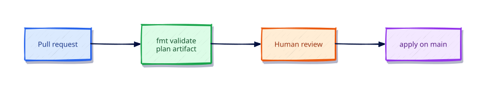

# Terraform in CI/CD Pipelines

## Overview

Production Terraform is applied by **pipelines**, not laptops. Pull requests run formatting, validation, tests, and **plan**; protected branches (or environments) run **apply** of a reviewed plan with short-lived credentials. Automation-friendly flags (`TF_IN_AUTOMATION`, `-input=false`) keep jobs non-interactive and auditable.

This tutorial builds a tiny local root you can exercise on your machine, then provides a complete **GitHub Actions** workflow example. You do not need a live cloud account — treat the YAML as a production pattern to adapt when you attach remote state and OIDC later.

This is **Tutorial 19** in **Module 6: Production** of the REBASH Academy Terraform track.

## Learning Objectives

By the end of this tutorial, you will be able to:

- [ ] Design PR plan and main apply pipelines
- [ ] Use `TF_IN_AUTOMATION` and `-input=false`
- [ ] Store and reason about plan artefacts
- [ ] Outline OIDC to cloud providers
- [ ] Author a complete GitHub Actions workflow example

## Prerequisites

- Completed [Policy as Code Overview](policy-as-code-overview.md)
- Familiarity with GitHub Actions or GitLab CI concepts
- Terraform CLI **1.9+** (1.15.x recommended)
- Ability to create directories and edit files
- No cloud account required for the local simulation

## Architecture

CI separates **untrusted proposal** (PR plan) from **privileged mutation** (apply on main with environment protections). State locking serialises applies; OIDC replaces long-lived cloud keys.



| Job | Trigger | Privilege |
|-----|---------|-----------|
| fmt / validate / test | PR + main | Read repo |
| plan | PR | Read state (often), write plan artefact |
| policy | PR | Read plan JSON |
| apply | main / environment | Write infrastructure + state |

## Theory

### Recommended flow

1. **PR:** `fmt -check` → `init` → `validate` → `test` → `plan -out` → upload artefact → comment summary → policy check  
2. **Reviewers** read the plan (and policy results)  
3. **Main / protected environment:** download the approved plan **or** re-plan with change detection controls → `apply` saved plan  
4. **Never** apply interactive plans from developer laptops to production when CI exists

Applying the **same bytes** reviewed in the PR is the gold standard. Some teams re-plan on main with strict “no drift / no unexpected changes” checks — document which model you use.

### Automation environment

```bash
export TF_IN_AUTOMATION=1
terraform init -input=false
terraform plan -input=false -out=tfplan
terraform apply -input=false tfplan
```

`TF_IN_AUTOMATION` adjusts CLI messaging for machines; `-input=false` fails instead of prompting.

### Authentication: prefer OIDC

| Anti-pattern | Prefer |
|--------------|--------|
| Long-lived `AWS_ACCESS_KEY_ID` in GitHub secrets | GitHub OIDC → cloud IAM role |
| Broad admin roles for plan and apply | Separate plan (read) and apply (write) roles |
| Credentials on laptops for prod | CI-only apply identities |

OIDC issues short-lived tokens per job. Wire `id-token: write` permissions in GitHub Actions and a trust policy on the cloud role.

### Concurrency and locking

Remote state locking (DynamoDB, blob leases, Terraform Cloud) prevents two applies corrupting state. In GitHub Actions, also use `concurrency:` groups per root module so jobs queue instead of racing.

### Plan artefacts and secrets

Treat `tfplan` and `plan.json` as confidential. Limit artefact retention, restrict download permissions, and never echo sensitive outputs into PR comments without redaction.

### Practical mental model

1. PR proves intent with a plan  
2. Humans + policy approve  
3. Apply runs with least privilege  
4. Audit logs record who merged and which commit applied  

## Hands-on Lab

### Step 1 – Tiny root for CI simulation

```bash
mkdir -p ~/rebash-tf-ci && cd ~/rebash-tf-ci
terraform version
```

`versions.tf`:

```hcl
terraform {
  required_version = ">= 1.9.0"

  required_providers {
    local = {
      source  = "hashicorp/local"
      version = "~> 2.9"
    }
    random = {
      source  = "hashicorp/random"
      version = "~> 3.7"
    }
  }
}
```

`main.tf`:

```hcl
resource "random_id" "build" {
  byte_length = 2
}

resource "local_file" "ci" {
  filename = "${path.module}/ci-marker.txt"
  content  = "planned-by-ci\nbuild=${random_id.build.hex}\n"
}

resource "terraform_data" "pipeline" {
  input = {
    stage = "local-simulation"
    build = random_id.build.hex
  }
}

output "marker" {
  value = local_file.ci.filename
}

output "build" {
  value = random_id.build.hex
}
```

**Expected:** Minimal root suitable for fmt/validate/plan/apply without cloud credentials.

### Step 2 – Simulate pipeline stages locally

```bash
export TF_IN_AUTOMATION=1
terraform fmt -check
terraform init -input=false
terraform validate
terraform plan -input=false -out=tfplan
terraform show -no-color tfplan | head -n 40
# On "main" only:
terraform apply -input=false tfplan
terraform output
```

**Expected:** fmt passes (run `terraform fmt` first if needed); validate succeeds; plan creates three objects; apply writes `ci-marker.txt`; outputs show path and build hex.

### Step 3 – Simulate a PR change

```bash
# Edit content string, then:
terraform plan -input=false -out=tfplan-pr
terraform show -no-color tfplan-pr | head -n 40
```

**Expected:** Update in-place (or replace content) for `local_file.ci` / marker — the artefact you would attach to a PR.

Do not apply yet if you are practising review flow; apply when satisfied:

```bash
terraform apply -input=false tfplan-pr
```

### Step 4 – Example GitHub Actions workflow

Save as `.github/workflows/terraform.yml` in a real repo (example working directory `infra/`):

```yaml
name: Terraform

on:
  pull_request:
    paths:
      - "infra/**"
      - ".github/workflows/terraform.yml"
  push:
    branches: [main]
    paths:
      - "infra/**"
      - ".github/workflows/terraform.yml"

permissions:
  contents: read
  pull-requests: write
  id-token: write

concurrency:
  group: terraform-infra-${{ '{{' }} github.ref {{ '}}' }}
  cancel-in-progress: false

jobs:
  quality:
    runs-on: ubuntu-latest
    defaults:
      run:
        working-directory: infra
    steps:
      - uses: actions/checkout@v4
      - uses: hashicorp/setup-terraform@v3
        with:
          terraform_version: "1.15.8"
      - run: terraform fmt -check -recursive
      - run: terraform init -input=false
      - run: terraform validate
      # - run: terraform test   # when modules ship tests/

  plan:
    if: github.event_name == 'pull_request'
    needs: quality
    runs-on: ubuntu-latest
    defaults:
      run:
        working-directory: infra
    env:
      TF_IN_AUTOMATION: "true"
    steps:
      - uses: actions/checkout@v4
      - uses: hashicorp/setup-terraform@v3
        with:
          terraform_version: "1.15.8"
      - run: terraform init -input=false
      - run: terraform plan -input=false -out=tfplan
      - uses: actions/upload-artifact@v4
        with:
          name: tfplan
          path: infra/tfplan
          retention-days: 5
      # Optional: policy job consuming terraform show -json tfplan

  apply:
    if: github.ref == 'refs/heads/main' && github.event_name == 'push'
    needs: quality
    runs-on: ubuntu-latest
    environment: production
    defaults:
      run:
        working-directory: infra
    env:
      TF_IN_AUTOMATION: "true"
    steps:
      - uses: actions/checkout@v4
      - uses: hashicorp/setup-terraform@v3
        with:
          terraform_version: "1.15.8"
      - run: terraform init -input=false
      # Prefer: download reviewed tfplan artefact when your process supports it
      - run: terraform apply -input=false -auto-approve
```

Wire OIDC cloud credentials in `plan`/`apply` for real AWS/Azure/GCP backends — never store long-lived keys in GitHub secrets when OIDC is available. GitHub `environment: production` enables required reviewers before apply.

### Step 5 – Backend config note (production)

CI must authenticate to the same remote backend as humans. Pass backend config via partial configuration / `-backend-config` from secrets or OIDC-assumed roles — do not commit access keys. Local labs keep the default local backend.

### Step 6 – Clean up local simulation

```bash
terraform destroy -input=false -auto-approve
rm -f tfplan tfplan-pr
unset TF_IN_AUTOMATION
```

**Expected:** Marker file removed; plan artefacts deleted.

## Code Walkthrough

### Local root resources

| Resource | CI teaching point |
|----------|-------------------|
| `local_file.ci` | Visible apply effect without cloud |
| `random_id.build` | Stable-in-state value across plans until replace |
| `terraform_data.pipeline` | Marker for stage metadata |

### Workflow jobs

| Job | Role |
|-----|------|
| `quality` | Fast fail on fmt/validate |
| `plan` | PR-only artefact generation |
| `apply` | Main + environment protection |

### Permissions block

`id-token: write` enables OIDC. `pull-requests: write` allows plan comment bots. Least privilege: do not grant `contents: write` unless required.

### Why `concurrency.cancel-in-progress: false`

Cancelling an in-flight apply is dangerous; queue instead.

## Validation

```bash
export TF_IN_AUTOMATION=1
terraform fmt -check
terraform init -input=false
terraform validate
terraform plan -input=false -out=tfplan
terraform apply -input=false tfplan
test -f ci-marker.txt
terraform destroy -input=false -auto-approve
```

| Check | Pass criteria |
|-------|----------------|
| Non-interactive | No prompts with `-input=false` |
| Plan artefact | `tfplan` created and applicable |
| Workflow | YAML reviewed for PR plan / main apply split |
| Auth story | You can explain OIDC vs static keys |
| Cleanup | Destroy completed |

## Best Practices

- Pin `terraform_version` in `setup-terraform` to match `required_version`
- Commit `.terraform.lock.hcl`; cache plugin directories in CI for speed
- One root module per state; matrix builds for many roots with care
- Require status checks: quality + plan (and policy) before merge
- Use environments for production applies with human approval
- Prefer apply-of-saved-plan when organisationally feasible

## Security Considerations

- Separate IAM roles for plan (read) and apply (write) when the cloud allows
- Restrict who can approve GitHub environments
- Treat plan artefacts as secret-bearing
- Disable unused workflow permissions (`permissions:` top-level deny-by-default mindset)
- Never print provider credentials in `terraform` debug logs on shared runners

## Common Mistakes

!!! warning "Apply on every commit to main without review"
    Speed over safety. **Fix:** Require plan review, environment protection, and policy gates.

!!! warning "Long-lived cloud keys in CI secrets"
    Credential theft risk. **Fix:** OIDC federation with short-lived roles.

!!! warning "Interactive apply flags in CI"
    Jobs hang or use wrong defaults. **Fix:** `TF_IN_AUTOMATION` and `-input=false` everywhere.

!!! warning "Racing applies on the same state"
    Lock errors and corruption risk. **Fix:** Backend locking + workflow concurrency groups.

## Troubleshooting

| Issue | Cause | Solution |
|-------|-------|----------|
| Provider auth failures in CI | Missing OIDC/role | Configure cloud trust + `id-token: write` |
| `Error acquiring the state lock` | Concurrent run | Wait; check stuck locks; avoid force-unlock casually |
| Plan artefact missing on apply | Retention / wrong job | Upload/download artefact; align paths |
| fmt fails only in CI | Local format skipped | Run `fmt` pre-commit; match Terraform versions |
| Apply differs from PR plan | Drift between merge and apply | Re-plan with guards or apply exact reviewed bytes |

## Interview Questions

1. What stages belong in a Terraform pipeline?
   *Format, init, validate, test, plan, policy, and gated apply — with reviews between plan and apply.*

2. How do you pass plan artefacts between jobs?
   *CI artefact storage (or Terraform Cloud run objects) with restricted access and short retention.*

3. Why separate plan and apply permissions?
   *Least privilege: many engineers can propose plans; few identities can mutate production.*

4. How does OIDC improve cloud auth from CI?
   *Short-lived, audience-bound tokens replace static keys sitting in secret stores.*

5. What should block a merge?
   *Failed fmt/validate/test/policy and unanswered destructive plan changes.*

6. How do you handle manual approval for production?
   *CI environments with required reviewers before the apply job runs.*

7. Where do you store backend config in CI?
   *Partial backend files or `-backend-config` from secrets/OIDC — not access keys in Git.*

8. How do you prevent concurrent applies?
   *State locking plus pipeline concurrency groups per root.*

9. What logs must you treat as sensitive?
   *Plan JSON, apply logs with attributes, and any debug traces near credentials.*

10. How do matrix builds work for many roots?
    *Matrix over directories with isolated state; fail fast; avoid one shared lock across unrelated stacks.*

11. What is a safe destroy policy in CI?
    *No automatic destroy on main; explicit workflows with approvals and strong policy denials.*

12. How do you promote the same commit across environments?
    *Immutable commit SHA through dev→stage→prod pipelines with per-env tfvars and backends.*

## Summary

- CI owns production applies; laptops own experimentation
- PR plans, protected applies, locking, and OIDC are the default shape
- Use `TF_IN_AUTOMATION` and `-input=false` for non-interactive runs
- Treat plan artefacts as confidential and apply reviewed intent
- Separate quality gates from privileged mutation

## Related Tutorials

- Track overview: [Terraform](index.md)
- Previous: [Policy as Code Overview](policy-as-code-overview.md)
- Next: [Production Patterns and Capstone](production-patterns-and-capstone.md)
- Cheat sheet: [Terraform Cheat Sheet](../cheatsheets/terraform.md)
- Interview prep: [Terraform Interview Prep](../interview/terraform.md)
- Learning path: [DevOps Engineer](../learning-paths/devops-engineer.md)

## References

1. [Running Terraform in automation](https://developer.hashicorp.com/terraform/cli/run)
2. [GitHub Actions — hashicorp/setup-terraform](https://github.com/hashicorp/setup-terraform)
3. [About security hardening with OpenID Connect](https://docs.github.com/en/actions/deployment/security-hardening-your-deployments/about-security-hardening-with-openid-connect)
4. [Terraform CLI plan](https://developer.hashicorp.com/terraform/cli/commands/plan)
5. [Terraform CLI apply](https://developer.hashicorp.com/terraform/cli/commands/apply)
6. [State locking](https://developer.hashicorp.com/terraform/language/state/locking)
7. [hashicorp/local provider](https://registry.terraform.io/providers/hashicorp/local/latest)
